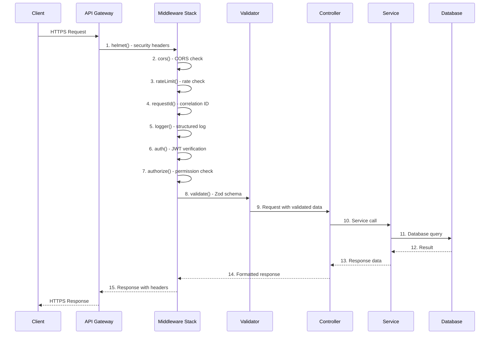
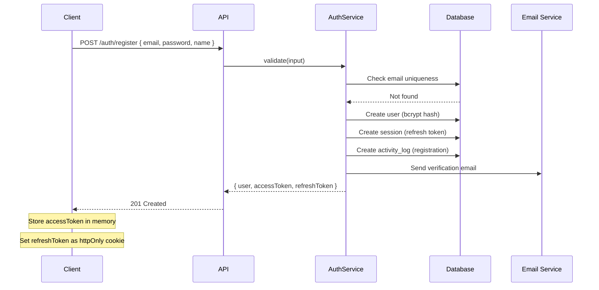
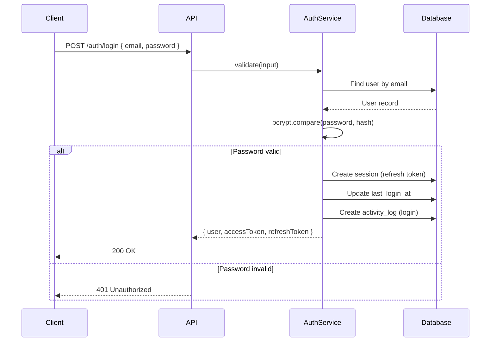
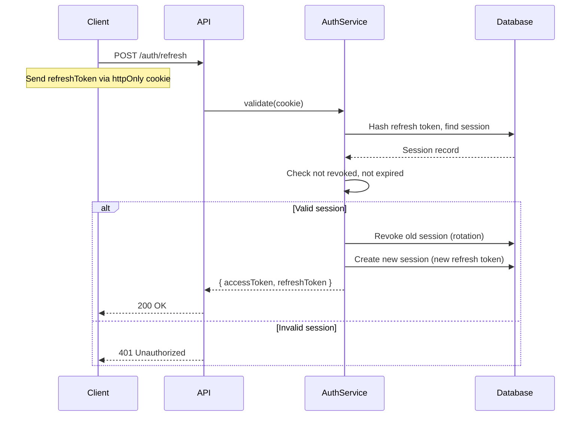
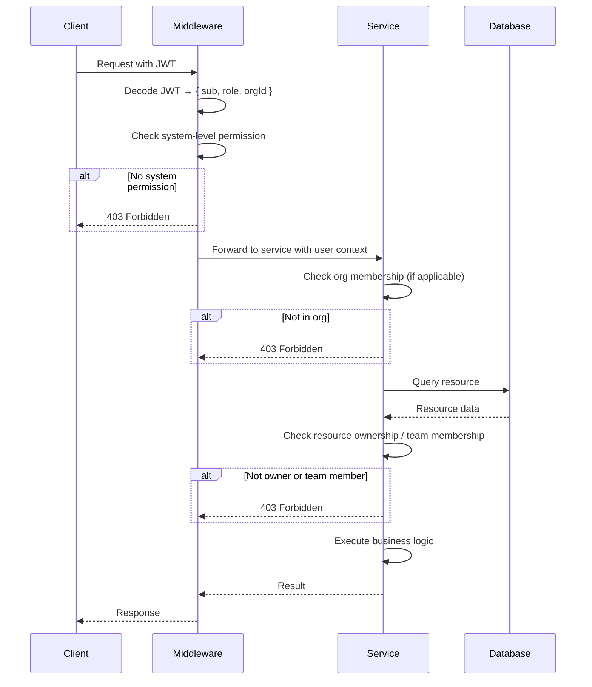
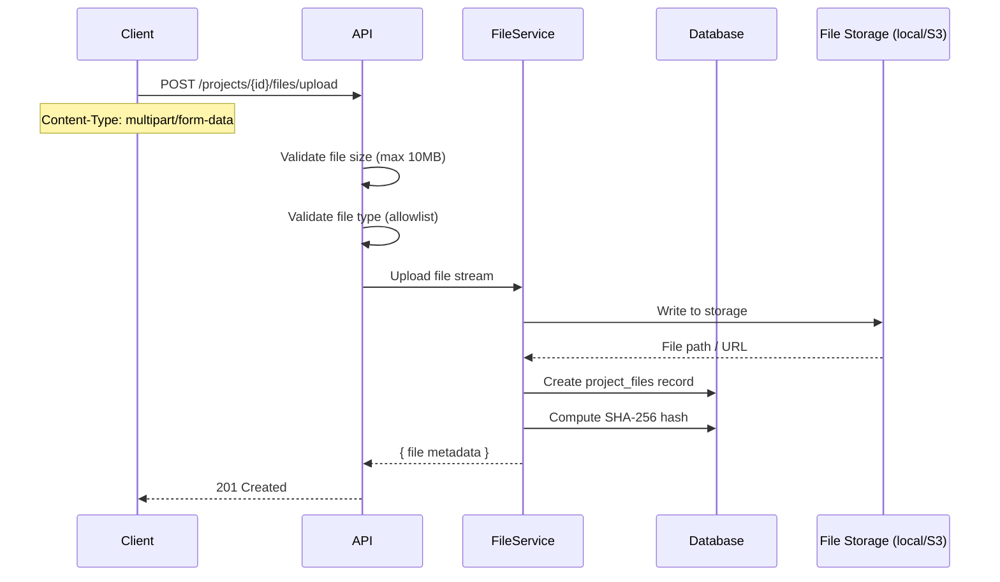
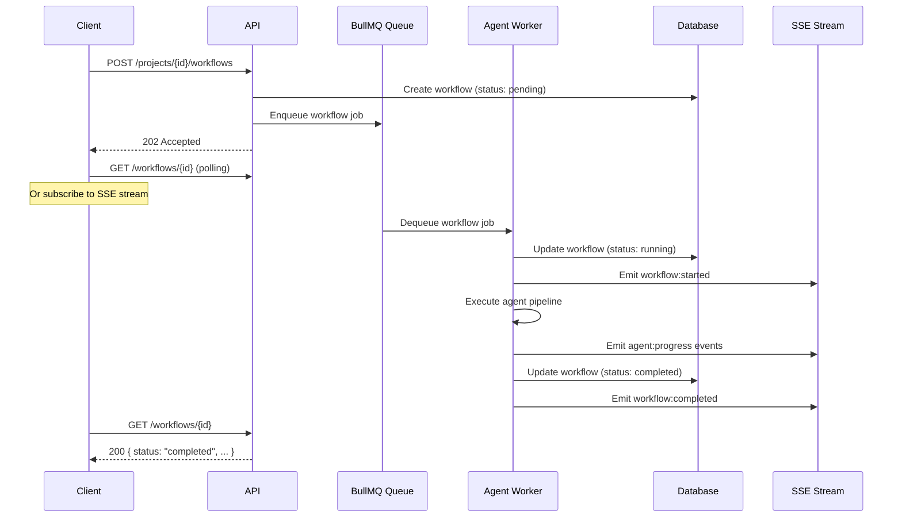

# REST API Architecture

## Design Principles

| Principle | Application |
|-----------|-------------|
| **Resource-Oriented** | Every endpoint maps to a noun (resource), not a verb |
| **Consistent Naming** | Plural nouns, kebab-case, predictable nesting |
| **JSON Everywhere** | `application/json` request/response bodies |
| **Versioned** | URL-prefix versioning (`/api/v1/`) |
| **Stateless Auth** | JWT access tokens (RS256, 15 min) per request |
| **Idempotent Mutations** | `Idempotency-Key` header for POST/PATCH/PUT |
| **Validate All Inputs** | Zod schemas on every endpoint boundary |
| **Defence in Depth** | Security headers, rate limiting, input sanitisation |
| **Consistent Envelope** | Uniform `{ success, data, error, meta }` response shape |
| **Correlation Tracing** | `X-Request-Id` on every request for end-to-end tracing |

---

## 1. API Architecture

### 1.1 Layer Mapping

```
┌──────────────────────────────────────────────────────────────────┐
│                        Client (Frontend)                         │
│              Next.js · TanStack Query · Socket.IO                │
└────────────────────────────┬─────────────────────────────────────┘
                             │ HTTPS / WSS
┌────────────────────────────▼─────────────────────────────────────┐
│                     API Gateway Middleware                         │
│  Helmet → CORS → Rate Limit → Request ID → Logger → Auth → Authz │
└────────────────────────────┬─────────────────────────────────────┘
┌────────────────────────────▼─────────────────────────────────────┐
│                    Validation Middleware                            │
│           Zod schema validation per endpoint (body, query, params) │
└────────────────────────────┬─────────────────────────────────────┘
┌────────────────────────────▼─────────────────────────────────────┐
│                       Controller Layer                             │
│   Auth · User · Project · Workflow · Agent · File · Notification  │
│   Request parsing · Response formatting · Status code selection    │
└────────────────────────────┬─────────────────────────────────────┘
┌────────────────────────────▼─────────────────────────────────────┐
│                        Service Layer                               │
│    Business logic · Orchestration · External integration           │
└────────────────────────────┬─────────────────────────────────────┘
┌────────────────────────────▼─────────────────────────────────────┐
│                     Persistence Layer                               │
│               Drizzle ORM · Neon PostgreSQL · Redis                │
└──────────────────────────────────────────────────────────────────┘
```

### 1.2 Base URL

| Environment | URL |
|-------------|-----|
| Development | `http://localhost:3001/api/v1` |
| Staging | `https://staging.api.aisoftco.com/api/v1` |
| Production | `https://api.aisoftco.com/api/v1` |
| WebSocket | `wss://api.aisoftco.com/ws` |

### 1.3 Standard Headers

| Header | Required | Scope | Description |
|--------|----------|-------|-------------|
| `Content-Type` | Yes | All requests | `application/json` |
| `Accept` | Yes | All requests | `application/json` |
| `Authorization` | All protected routes | Auth | `Bearer <jwt>` |
| `X-Request-Id` | Recommended | All requests | UUID v4 for correlation tracing |
| `Idempotency-Key` | Mutations | POST/PATCH/PUT | UUID v4, prevents duplicate processing (24h TTL) |
| `X-API-Key` | API access | Programmatic | Alternative to JWT for M2M |
| `X-Idempotent-Replay` | Mutations | POST/PATCH/PUT | `true` if retrying an idempotent operation |

### 1.4 Request Lifecycle



---

## 2. API Versioning Strategy

### 2.1 URL Prefix Versioning

```
/api/v1/projects
/api/v2/projects   (future)
```

### 2.2 Versioning Rules

| Rule | Detail |
|------|--------|
| **Active versions** | Only one active version at a time (current = v1) |
| **Deprecation notice** | Return `Sunset` header pointing to new version |
| **Grace period** | 90 days from deprecation notice to removal |
| **Breaking changes** | Always increment version |
| **Non-breaking additions** | Added within current version |
| **Version lifecycle** | `active → deprecated (Sunset header) → removed` |

### 2.3 Sunset Header

```http
Sunset: Sat, 11 Oct 2027 23:59:59 GMT
Deprecation: true
Link: </api/v2/projects>; rel="successor-version"
```

---

## 3. Resource Design

### 3.1 URI Pattern Convention

```
/api/v1/{resource}
/api/v1/{resource}/{resourceId}
/api/v1/{resource}/{resourceId}/{subresource}
/api/v1/{resource}/{resourceId}/{subresource}/{subresourceId}
```

### 3.2 Resource Hierarchy

```
auth               (singular — action-oriented)
users              (plural)
users/me           (singular — authenticated user alias)
projects           (plural)
projects/{id}/workflows
projects/{id}/workflows/{id}/steps
projects/{id}/workflows/{id}/executions
projects/{id}/workflows/{id}/executions/{id}/outputs
projects/{id}/workflows/{id}/executions/{id}/conversations
projects/{id}/workflows/{id}/executions/{id}/conversations/{id}/messages
projects/{id}/files
projects/{id}/requirements
projects/{id}/activity
projects/{id}/tasks
notifications      (plural)
settings           (singular — user's own settings)
health             (singular — system)
system             (singular — admin)
```

### 3.3 Resource Naming Rules

| Rule | Correct | Incorrect |
|------|---------|-----------|
| Plural nouns | `/projects` | `/project` |
| Kebab-case | `/workflow-steps` | `/workflowSteps` |
| Lowercase | `/users` | `/Users` |
| No trailing slash | `/projects` | `/projects/` |
| No file extensions | `/projects/123` | `/projects/123.json` |
| UUIDs for IDs | `/projects/550e8400-e29b-41d4-a716-446655440000` | `/projects/1` |
| Nested for sub-resources | `/projects/123/files` | `/files?projectId=123` |
| Actions are POST | `POST /projects/123/archive` | `GET /projects/123/archive` |

---

## 4. Endpoint Naming Conventions

### 4.1 HTTP Method Map

| Method | CRUD | Semantics | Idempotent | Safe |
|--------|------|-----------|------------|------|
| `GET` | Read | Retrieve resource(s) | Yes | Yes |
| `POST` | Create | Create resource or action | No | No |
| `PATCH` | Update | Partial update | Yes* | No |
| `DELETE` | Delete | Remove resource | Yes | No |
| `HEAD` | — | Headers only (no body) | Yes | Yes |
| `OPTIONS` | — | CORS preflight | Yes | Yes |

*Idempotent with `Idempotency-Key` header.

### 4.2 Action Endpoints

For operations that don't map to CRUD, use a **colon prefix pattern**:

```
POST /projects/{id}/archive        — Archive a project
POST /projects/{id}/restore        — Restore a project
POST /auth/refresh                 — Rotate tokens
POST /auth/forgot-password         — Request reset
POST /auth/reset-password          — Execute reset
POST /workflows/{id}/pause         — Pause execution
POST /workflows/{id}/resume        — Resume execution
POST /workflows/{id}/cancel        — Cancel execution
POST /workflows/{id}/approve       — Approve pending output
POST /workflows/{id}/reject        — Reject with feedback
POST /executions/{id}/retry        — Retry failed execution
POST /notifications/read-all       — Mark all as read
```

### 4.3 Query Parameter Naming

| Parameter | Convention | Example |
|-----------|------------|---------|
| Pagination | `page`, `limit`, `cursor` | `?page=2&limit=20` |
| Cursor | `cursor` | `?cursor=eyJpZCI6IjEyMyJ9` |
| Filtering | `filter[{field}]` | `?filter[status]=completed` |
| Searching | `q` | `?q=authentication` |
| Sorting | `sort` | `?sort=-createdAt` |
| Fields | `fields` | `?fields=id,title,status` |
| Include | `include` | `?include=workflows,files` |
| Time range | `after`, `before` | `?after=2026-01-01T00:00:00Z` |

---

## 5. Request/Response Standards

### 5.1 Response Envelope

**Success (single resource):**
```json
{
  "success": true,
  "data": {
    "id": "550e8400-e29b-41d4-a716-446655440000",
    "title": "My Project",
    "status": "draft",
    "createdAt": "2026-07-13T12:00:00.000Z"
  },
  "meta": {
    "requestId": "7a1e8b3c-f5d2-4a6e-9b8c-1d2e3f4a5b6c",
    "timestamp": "2026-07-13T12:00:00.000Z"
  }
}
```

**Success (list):**
```json
{
  "success": true,
  "data": [
    {
      "id": "550e8400-e29b-41d4-a716-446655440000",
      "title": "My Project"
    }
  ],
  "meta": {
    "requestId": "7a1e8b3c-f5d2-4a6e-9b8c-1d2e3f4a5b6c",
    "timestamp": "2026-07-13T12:00:00.000Z",
    "page": 1,
    "limit": 20,
    "total": 42,
    "totalPages": 3,
    "hasMore": true,
    "cursor": "eyJpZCI6IjQyIn0="
  }
}
```

**Success (created):**
```json
{
  "success": true,
  "data": { ... },
  "meta": {
    "requestId": "...",
    "timestamp": "..."
  }
}
```
**Status:** `201 Created` — includes `Location` header: `Location: /api/v1/projects/550e8400-e29b-41d4-a716-446655440000`

**Success (no content):**
```json
{
  "success": true,
  "data": null,
  "meta": {
    "requestId": "...",
    "timestamp": "..."
  }
}
```
**Status:** `204 No Content` — no response body

### 5.2 Request Body Conventions

- Use camelCase for JSON property names
- Dates in ISO 8601 UTC: `2026-07-13T12:00:00.000Z`
- UUIDs in standard hyphenated format: `550e8400-e29b-41d4-a716-446655440000`
- Enums as snake_case strings: `"awaiting_approval"`
- Empty arrays over null: `[]`
- Omit optional fields instead of sending `null`
- Booleans: `true` / `false` (not `1` / `0`)

### 5.3 Content Negotiation

```http
# Request
Accept: application/json
Content-Type: application/json

# Response
Content-Type: application/json; charset=utf-8
```

---

## 6. Status Code Standards

### 6.1 Complete Status Code Map

| HTTP | Name | When |
|------|------|------|
| `200` | OK | Successful GET, PATCH |
| `201` | Created | Successful POST (resource created) |
| `202` | Accepted | Async operation accepted (returned immediately) |
| `204` | No Content | Successful DELETE, POST action (no body) |
| `301` | Moved Permanently | Resource relocated |
| `304` | Not Modified | Conditional GET with `If-None-Match` / `If-Modified-Since` |
| `400` | Bad Request | Malformed syntax, invalid `Content-Type`, missing required headers |
| `401` | Unauthorized | Missing/invalid/expired JWT |
| `403` | Forbidden | Authenticated but insufficient permissions |
| `404` | Not Found | Resource does not exist |
| `405` | Method Not Allowed | Wrong HTTP method for endpoint |
| `406` | Not Acceptable | Unacceptable `Accept` header |
| `409` | Conflict | Resource state conflict (duplicate email, version conflict) |
| `410` | Gone | Resource permanently deleted |
| `413` | Payload Too Large | Request body exceeds limit (1 MB default) |
| `415` | Unsupported Media Type | Wrong `Content-Type` |
| `422` | Unprocessable Entity | Zod validation failure (semantic, not syntax) |
| `429` | Too Many Requests | Rate limit exceeded |
| `498` | Token Expired | Access token has expired (custom) |
| `500` | Internal Server Error | Unexpected server error |
| `502` | Bad Gateway | Upstream service failure (OpenAI, Stripe) |
| `503` | Service Unavailable | Maintenance / overload |
| `504` | Gateway Timeout | Upstream service timeout |

### 6.2 Status Code Selection Rules

| Scenario | Status |
|----------|--------|
| Synchronous read success | `200` |
| Resource created | `201` |
| Async task accepted | `202` |
| Delete / action complete, no body | `204` |
| Client sent bad data | `400` |
| Not authenticated | `401` |
| Authenticated but no permission | `403` |
| Resource not found | `404` |
| Duplicate / state conflict | `409` |
| Validation failed | `422` |
| Rate limited | `429` |
| Token expired (refreshable) | `498` |

---

## 7. Error Response Format

### 7.1 Error Envelope

```json
{
  "success": false,
  "error": {
    "code": "VALIDATION_ERROR",
    "message": "Request validation failed",
    "details": [
      {
        "field": "email",
        "message": "Invalid email format",
        "code": "invalid_string",
        "path": ["body", "email"],
        "value": "not-an-email"
      }
    ]
  },
  "meta": {
    "requestId": "7a1e8b3c-f5d2-4a6e-9b8c-1d2e3f4a5b6c",
    "timestamp": "2026-07-13T12:00:00.000Z"
  }
}
```

### 7.2 Error Code Catalog

| Code | HTTP | Description | Retryable |
|------|------|-------------|-----------|
| `VALIDATION_ERROR` | 422 | Zod schema validation failed | No |
| `UNAUTHORIZED` | 401 | No JWT or invalid JWT | No |
| `TOKEN_EXPIRED` | 498 | Access token expired, use refresh | Yes (refresh) |
| `FORBIDDEN` | 403 | Insufficient role/permission | No |
| `NOT_FOUND` | 404 | Resource does not exist | No |
| `CONFLICT` | 409 | Duplicate or state conflict | No |
| `RATE_LIMITED` | 429 | Request quota exceeded | Yes (after window) |
| `INTERNAL_ERROR` | 500 | Unexpected server error | Yes |
| `UPSTREAM_ERROR` | 502 | External service returned error | Yes |
| `SERVICE_UNAVAILABLE` | 503 | Maintenance window | Yes (later) |
| `UPSTREAM_TIMEOUT` | 504 | External service timed out | Yes |
| `PAYLOAD_TOO_LARGE` | 413 | Body exceeds size limit | No |
| `INVALID_IDEMPOTENCY_KEY` | 400 | `Idempotency-Key` malformed or expired | No |
| `VERSION_DEPRECATED` | 400 | API version is deprecated, use new version | No |

### 7.3 Zod Error Mapping

```json
{
  "success": false,
  "error": {
    "code": "VALIDATION_ERROR",
    "message": "3 validation error(s)",
    "details": [
      {
        "field": "email",
        "message": "Invalid email",
        "code": "invalid_string",
        "path": ["body", "email"],
        "value": "bad-email"
      },
      {
        "field": "password",
        "message": "String must contain at least 8 character(s)",
        "code": "too_small",
        "path": ["body", "password"],
        "value": null
      }
    ]
  },
  "meta": { "requestId": "...", "timestamp": "..." }
}
```

### 7.4 Error Response Rules

- Every error includes a machine-readable `code` for programmatic handling
- `details` array is omitted when not applicable (e.g., `500 INTERNAL_ERROR`)
- Never expose stack traces in production errors
- Log full error details server-side with correlation to `requestId`
- Sanitise user input in error responses (never echo raw input back)

---

## 8. Pagination Strategy

### 8.1 Dual Pagination Support

Both **cursor-based** (preferred) and **offset-based** (for simple cases) are supported.

### 8.2 Cursor-Based (Primary)

**Request:**
```
GET /api/v1/projects?cursor=eyJpZCI6IjQyIn0=&limit=20
```

**Response:**
```json
{
  "success": true,
  "data": [...],
  "meta": {
    "page": 1,
    "limit": 20,
    "total": 150,
    "hasMore": true,
    "cursor": "eyJpZCI6IjQyIn0=",
    "nextCursor": "eyJpZCI6Ijc4In0="
  }
}
```

**Cursor generation:** Base64-encoded JSON of the last item's identifier and sort value:
```json
// decoded cursor
{ "id": "uuid", "createdAt": "2026-07-13T12:00:00Z" }
```

**Rules:**
- Always use cursor-based for list endpoints with sort order
- Cursor points to the last item in the current page
- Use `WHERE (created_at, id) > (cursor.createdAt, cursor.id)` for forward pagination
- Cursors are opaque to clients (base64-encoded JSON)
- `limit` defaults to 20, max 100
- `hasMore` indicates additional pages exist

### 8.3 Offset-Based (Fallback)

**Request:**
```
GET /api/v1/projects?page=2&limit=20
```

**Response:**
```json
{
  "success": true,
  "data": [...],
  "meta": {
    "page": 2,
    "limit": 20,
    "total": 150,
    "totalPages": 8,
    "hasMore": true
  }
}
```

**Rules:**
- Use only for simple, admin, or static data endpoints
- Offset-based is less performant on large datasets (OFFSET scans all skipped rows)
- Page is 1-indexed; `page=1` returns the first page
- `totalPages` is computed as `Math.ceil(total / limit)`

### 8.3 Pagination Decision Matrix

| Dataset Size | Pagination Type | Rationale |
|-------------|----------------|-----------|
| < 100 rows | Offset-based | Negligible performance difference |
| 100 - 10K rows | Cursor-based | Consistent performance, no offset drift |
| 10K+ rows | Cursor-based (mandatory) | OFFSET becomes expensive |
| Real-time feed | Cursor-based | Handle insertion at head correctly |
| Admin exports | Offset-based + batch | Sequential export with resume |

---

## 9. Filtering Strategy

### 9.1 Filter Syntax

Use bracket notation for structured filtering:

```
GET /api/v1/projects?filter[status]=completed
GET /api/v1/projects?filter[status]=completed,failed
GET /api/v1/projects?filter[createdAt][gte]=2026-01-01T00:00:00Z
GET /api/v1/projects?filter[createdAt][lte]=2026-07-01T00:00:00Z
GET /api/v1/projects?filter[priority]=high&filter[status]=running
```

### 9.2 Filter Operators

| Operator | Meaning | Example |
|----------|---------|---------|
| `eq` (default) | Equals | `filter[status]=completed` |
| `neq` | Not equals | `filter[status][neq]=archived` |
| `in` | In array | `filter[status]=completed,failed` |
| `nin` | Not in array | `filter[priority][nin]=low` |
| `gte` | Greater than or equal | `filter[createdAt][gte]=2026-01-01` |
| `lte` | Less than or equal | `filter[createdAt][lte]=2026-07-01` |
| `gt` | Greater than | `filter[amount][gt]=1000` |
| `lt` | Less than | `filter[amount][lt]=5000` |
| `like` | Pattern match | `filter[title][like]=*auth*` |
| `null` | Is null | `filter[teamId][null]=true` |
| `nnull` | Is not null | `filter[teamId][nnull]=true` |

### 9.3 Filterable Fields Per Endpoint

Each list endpoint documents which fields are filterable:

```
GET /api/v1/projects
  Filterable: status, priority, phase, createdAt, updatedAt, teamId
GET /api/v1/workflows
  Filterable: status, phase, createdAt, projectId
GET /api/v1/notifications
  Filterable: type, isRead, createdAt
```

---

## 10. Searching Strategy

### 10.1 Full-Text Search

```
GET /api/v1/projects?q=authentication%20microservice
```

| Parameter | Type | Default | Description |
|-----------|------|---------|-------------|
| `q` | string | — | Search query (full-text) |
| `searchFields` | string | All searchable | Comma-separated field list |

### 10.2 Search Scope

| Endpoint | Searchable Fields |
|----------|------------------|
| `/projects` | `title`, `description` |
| `/users` | `name`, `email` |
| `/workflows` | `name` |
| `/notifications` | `title`, `body` |
| `/files` | `filePath`, `language` |
| `/requirements` | `title`, `description` |

### 10.3 Search Implementation

- PostgreSQL full-text search (`to_tsvector` / `to_tsquery`) on indexed text columns
- Trgm indexes (`pg_trgm`) for `ILIKE` fuzzy matching
- Minimum query length: 2 characters
- Maximum query length: 200 characters
- SQL injection prevented by parameterised queries (Drizzle)

---

## 11. Sorting Strategy

### 11.1 Sort Syntax

```
GET /api/v1/projects?sort=-createdAt
GET /api/v1/projects?sort=title
GET /api/v1/projects?sort=-priority,createdAt
```

- Prefix `-` means **descending** (e.g., `-createdAt` = newest first)
- No prefix means **ascending** (e.g., `title` = A-Z)
- Multiple sorts: comma-separated, applied in order

### 11.2 Sortable Fields

| Endpoint | Default Sort | Sortable Fields |
|----------|-------------|-----------------|
| `/projects` | `-createdAt` | `createdAt`, `updatedAt`, `title`, `status`, `priority` |
| `/workflows` | `-createdAt` | `createdAt`, `status`, `phase` |
| `/notifications` | `-createdAt` | `createdAt`, `type` |
| `/files` | `createdAt` | `createdAt`, `filePath`, `type`, `sizeBytes` |
| `/messages` | `sortOrder` | `sortOrder`, `createdAt` |

### 11.3 Sort Validation

- Invalid sort fields return `422 VALIDATION_ERROR` with detail
- Sort field must exist in the resource's schema
- Max 3 sort fields per request

---

## 12. Validation Strategy

### 12.1 Validation Layers

```
                    ┌─────────────────────────────┐
                    │     Transport Validation     │
                    │  Content-Type, Accept, Size  │
                    ├─────────────────────────────┤
                    │     Auth Validation          │
                    │  JWT format, expiry, scope   │
                    ├─────────────────────────────┤
                    │     Input Validation         │
                    │  Zod: body, query, params    │
                    ├─────────────────────────────┤
                    │     Business Validation      │
                    │  Service: state, rules, ACL  │
                    ├─────────────────────────────┤
                    │     DB Constraint            │
                    │  Unique, FK, CHECK          │
                    └─────────────────────────────┘
```

### 12.2 Zod Schema Organisation

```
shared/
└── schemas/
    ├── auth.schema.ts          — login, register, refresh, forgotPassword
    ├── project.schema.ts       — create, update, filter, sort
    ├── workflow.schema.ts      — create, pause, resume, approve, reject
    ├── user.schema.ts          — update profile, changePassword
    ├── notification.schema.ts  — markRead, filter
    ├── file.schema.ts          — upload, list filter
    └── common.schema.ts        — pagination, ids, UUID, timestamps
```

### 12.3 Validation Middleware Pattern

Each endpoint gets a typed validation middleware:

```
Request → validate(schema.createProject) → Controller

validate() extracts:
  - req.body  → schema.body.parse()
  - req.query → schema.query.parse()
  - req.params → schema.params.parse()
  - req.headers → schema.headers.parse()
```

### 12.4 Validation Rules

| Rule | Implementation |
|------|---------------|
| All inputs validated | body, query, params, headers |
| Strip unknown fields | `z.object({...}).strip()` |
| Transform types | `z.string().datetime()` parses ISO strings |
| Custom error messages | Descriptive, user-facing messages |
| Shared schemas | Frontend reuses Zod types from `@aisoftco/shared` |
| No raw input in responses | Never echo unsanitised input |

---

## 13. Authentication Flow

### 13.1 Token Architecture

| Token | Type | Lifetime | Storage | Contains |
|-------|------|----------|---------|----------|
| Access Token | JWT (RS256) | 15 minutes | Client memory | `sub`, `email`, `role` |
| Refresh Token | Opaque (SHA-256) | 7 days | DB + httpOnly cookie | Random 256-bit value |
| Email Verification | JWT (HS256) | 24 hours | Email link | `sub`, `purpose:email_verify` |
| Password Reset | JWT (HS256) | 1 hour | Email link | `sub`, `purpose:password_reset` |

### 13.2 Access Token Payload

```json
{
  "sub": "550e8400-e29b-41d4-a716-446655440000",
  "email": "user@example.com",
  "role": "member",
  "orgId": "660e8400-e29b-41d4-a716-446655440001",
  "permissions": ["project:read", "project:write"],
  "iat": 1720800000,
  "exp": 1720800900,
  "jti": "7a1e8b3c-f5d2-4a6e-9b8c-1d2e3f4a5b6c"
}
```

### 13.3 Registration Flow



**Register Request:**
```json
POST /api/v1/auth/register
Content-Type: application/json

{
  "email": "user@example.com",
  "password": "SecurePass123!",
  "name": "Alex Johnson"
}
```

**Register Response (201):**
```json
{
  "success": true,
  "data": {
    "user": {
      "id": "550e8400-e29b-41d4-a716-446655440000",
      "email": "user@example.com",
      "name": "Alex Johnson",
      "role": "member",
      "emailVerified": false,
      "createdAt": "2026-07-13T12:00:00.000Z"
    },
    "accessToken": "eyJhbGciOiJSUzI1NiIs...",
    "expiresIn": 900
  },
  "meta": {
    "requestId": "7a1e8b3c-f5d2-4a6e-9b8c-1d2e3f4a5b6c",
    "timestamp": "2026-07-13T12:00:00.000Z"
  }
}
```

### 13.4 Login Flow



**Login Request:**
```json
POST /api/v1/auth/login
Content-Type: application/json

{
  "email": "user@example.com",
  "password": "SecurePass123!"
}
```

**Login Response (200):**
```json
{
  "success": true,
  "data": {
    "user": { "id": "...", "email": "...", "name": "Alex Johnson" },
    "accessToken": "eyJhbGciOiJSUzI1NiIs...",
    "expiresIn": 900
  },
  "meta": { "requestId": "...", "timestamp": "..." }
}
```

### 13.5 Token Refresh Flow



**Refresh Response (200):**
```json
{
  "success": true,
  "data": {
    "accessToken": "eyJhbGciOiJSUzI1NiIs...",
    "refreshToken": "new-random-opaque-token",
    "expiresIn": 900
  },
  "meta": { "requestId": "...", "timestamp": "..." }
}
```

### 13.6 Logout Flow

```
POST /api/v1/auth/logout
Authorization: Bearer <accessToken>
```

- Revokes the refresh token associated with the session
- Adds access token `jti` to a blacklist until natural expiry
- Returns `204 No Content`

```json
// Response (204)
// No body
```

### 13.7 Token Expiry Handling (498)

When the access token is expired, the client should:

1. Receive `498 Token Expired` response
2. Call `POST /auth/refresh` with the refresh token
3. Receive new access token
4. Retry the original request with the new token

```json
// 498 Response
{
  "success": false,
  "error": {
    "code": "TOKEN_EXPIRED",
    "message": "Access token has expired. Use POST /auth/refresh to obtain a new token.",
    "details": null
  },
  "meta": { "requestId": "...", "timestamp": "..." }
}
```

### 13.8 Forgot Password Flow

```
POST /api/v1/auth/forgot-password
Content-Type: application/json

{ "email": "user@example.com" }
```

```json
// Response (200 — always success to prevent email enumeration)
{
  "success": true,
  "data": {
    "message": "If the email exists, a reset link has been sent."
  },
  "meta": { "requestId": "...", "timestamp": "..." }
}
```

1. Client submits email
2. Server always returns `200` (prevents email enumeration)
3. If email exists: generate password reset JWT (1h), send email with link
4. Link: `https://app.aisoftco.com/reset-password?token=<jwt>`

### 13.9 Reset Password Flow

```
POST /api/v1/auth/reset-password
Content-Type: application/json

{
  "token": "eyJhbGciOiJIUzI1NiIs...",
  "password": "NewSecurePass456!"
}
```

```json
// Response (200)
{
  "success": true,
  "data": { "message": "Password reset successfully" },
  "meta": { "requestId": "...", "timestamp": "..." }
}
```

- Token validation: verify JWT, check `purpose:password_reset`, check expiry
- Update password: bcrypt hash the new password
- Revoke all sessions for the user (force re-login)
- Return success

### 13.10 Verify Email Flow

```
POST /api/v1/auth/verify-email
Content-Type: application/json

{ "token": "eyJhbGciOiJIUzI1NiIs..." }
```

```json
// Response (200)
{
  "success": true,
  "data": { "message": "Email verified successfully" },
  "meta": { "requestId": "...", "timestamp": "..." }
}
```

- Token validation: verify JWT, check `purpose:email_verify`
- Set `email_verified_at = now()` on user record
- Return success

### 13.11 Current User Endpoint

```
GET /api/v1/auth/me
Authorization: Bearer <accessToken>
```

```json
// Response (200)
{
  "success": true,
  "data": {
    "id": "550e8400-e29b-41d4-a716-446655440000",
    "email": "user@example.com",
    "name": "Alex Johnson",
    "role": "member",
    "avatarUrl": "https://api.aisoftco.com/api/v1/users/me/avatar",
    "emailVerified": true,
    "preferences": {
      "theme": "system",
      "locale": "en-US"
    },
    "organization": {
      "id": "...",
      "name": "My Org",
      "tier": "pro"
    },
    "createdAt": "2026-07-13T12:00:00.000Z"
  },
  "meta": { "requestId": "...", "timestamp": "..." }
}
```

---

## 14. Authorization Strategy

### 14.1 Role Hierarchy

```
System Roles:          admin > member
Team Roles:            owner > admin > member > viewer
Organization Roles:    owner > admin > member
```

### 14.2 Permission Model

Permissions are checked at three levels:

| Level | Scope | Check | Example |
|-------|-------|-------|---------|
| **System** | Global | User role | `admin` can access `/system/metrics` |
| **Organization** | Org-wide | Org membership + role | `owner` can manage billing |
| **Resource** | Per-resource | Ownership / team membership | Only creator can delete a project |

### 14.3 Authorization Flow



### 14.4 Permission Matrix

| Action | Admin | Member | Owner (Team) | Admin (Team) | Member (Team) | Viewer (Team) |
|--------|-------|--------|--------------|--------------|---------------|---------------|
| Create project | ✓ | ✓ | ✓ | ✓ | ✓ | ✗ |
| View any project | ✓ | ✗ | ✓ | ✓ | ✓ | ✓ |
| Edit any project | ✓ | ✗ | ✓ | ✓ | ✗ | ✗ |
| Delete project | ✓ | Own only | ✓ | ✗ | ✗ | ✗ |
| Manage team | ✓ | ✗ | ✓ | ✓ | ✗ | ✗ |
| View billing | ✓ | ✗ | ✓ | ✗ | ✗ | ✗ |
| Manage org settings | ✓ | ✗ | ✓ | ✗ | ✗ | ✗ |
| View system metrics | ✓ | ✗ | ✗ | ✗ | ✗ | ✗ |
| Invite members | ✓ | ✗ | ✓ | ✓ | ✗ | ✗ |
| Approve agent output | ✓ | Own only | ✓ | ✓ | ✓ | ✗ |

### 14.5 Authorization Header Checks

```
GET /api/v1/projects/550e8400-e29b-41d4-a716-446655440000
Authorization: Bearer <jwt>
                          │
                          ▼
    ┌─────────────────────────────────────────────┐
    │ 1. Decode JWT → sub: user-123               │
    │ 2. Is user admin? → No                      │
    │ 3. Is user owner of project? → owner_id?... │
    │ 4. Is user in project's team? → membership? │
    │ 5. If none → 403 Forbidden                  │
    └─────────────────────────────────────────────┘
```

---

## 15. Rate Limiting Strategy

### 15.1 Rate Limit Tiers

| Tier | Scope | Limit | Window | Burst | Endpoints |
|------|-------|-------|--------|-------|-----------|
| **Auth** | IP + User | 10 | 15 min | 5 | `/auth/login`, `/auth/register`, `/auth/forgot-password` |
| **Standard** | User | 100 | 1 min | 20 | `/projects`, `/users`, `/notifications` |
| **Agent** | User | 30 | 1 min | 10 | `/workflows/*`, `/executions/*` |
| **AI Streaming** | User | 5 | 1 min | 2 | `/streaming/*` |
| **File Upload** | User | 10 | 15 min | 5 | `/files/upload` |
| **File Download** | User | 50 | 1 min | 10 | `/files/*/download` |
| **Admin** | IP | 200 | 1 min | 50 | `/system/*`, `/admin/*` |
| **Health** | IP | 60 | 1 min | 10 | `/health/*` |
| **WebSocket** | Connection | 1 | N/A | N/A | `/ws/*` |

### 15.2 Rate Limit Headers

```http
X-RateLimit-Limit: 100
X-RateLimit-Remaining: 42
X-RateLimit-Reset: 1720800900
Retry-After: 45
```

### 15.3 Rate Limit Exceeded Response (429)

```json
{
  "success": false,
  "error": {
    "code": "RATE_LIMITED",
    "message": "Rate limit exceeded. Retry after 45 seconds.",
    "details": null
  },
  "meta": {
    "requestId": "...",
    "timestamp": "...",
    "rateLimit": {
      "limit": 100,
      "remaining": 0,
      "reset": 1720800900
    }
  }
}
```

### 15.4 Rate Limit Store

- In-memory (development) or Redis (production)
- Redis key pattern: `ratelimit:{scope}:{key}:{window}`
- BullMQ rate limiter for agent execution queues
- Distributed rate limiting via Redis for multi-instance deployments

---

## 16. Security Headers

### 16.1 Helmet.js Configuration

```http
Content-Security-Policy: default-src 'self'; script-src 'self'; style-src 'self' 'unsafe-inline'; img-src 'self' data:; connect-src 'self' wss://api.aisoftco.com
Cross-Origin-Embedder-Policy: require-corp
Cross-Origin-Opener-Policy: same-origin
Cross-Origin-Resource-Policy: same-origin
Strict-Transport-Security: max-age=63072000; includeSubDomains; preload
X-Content-Type-Options: nosniff
X-DNS-Prefetch-Control: off
X-Download-Options: noopen
X-Frame-Options: DENY
X-Permitted-Cross-Domain-Policies: none
X-XSS-Protection: 0
Referrer-Policy: strict-origin-when-cross-origin
```

### 16.2 CORS Configuration

```json
{
  "allowedOrigins": [
    "https://app.aisoftco.com",
    "https://staging.app.aisoftco.com",
    "http://localhost:3000"
  ],
  "allowedMethods": ["GET", "POST", "PATCH", "DELETE", "HEAD", "OPTIONS"],
  "allowedHeaders": ["Content-Type", "Authorization", "X-Request-Id", "Idempotency-Key", "X-API-Key"],
  "exposedHeaders": ["X-Request-Id", "X-RateLimit-Limit", "X-RateLimit-Remaining", "X-RateLimit-Reset", "Sunset", "Deprecation"],
  "credentials": true,
  "maxAge": 7200
}
```

---

## 17. API Documentation Strategy

### 17.1 Documentation Approach

| Aspect | Decision |
|--------|----------|
| **Format** | OpenAPI 3.1 (JSON Schema) |
| **Generation** | Auto-generated from Zod schemas + JSDoc |
| **Hosting** | `/api/v1/docs` (Swagger UI via Express) |
| **Auth** | "Authorize" button in Swagger UI |
| **Versioning** | One spec per API version |
| **Export** | OpenAPI JSON download at `/api/v1/openapi.json` |

### 17.2 OpenAPI Endpoints

| Endpoint | Purpose |
|----------|---------|
| `GET /api/v1/openapi.json` | Raw OpenAPI 3.1 spec |
| `GET /api/v1/docs` | Swagger UI HTML |
| `GET /api/v1/docs/redoc` | Redoc HTML (alternative) |

### 17.3 Documentation Rules

- Every endpoint includes: summary, description, request example, response example, error examples
- Every schema includes: type, description, example, validation rules
- Auth requirements documented per endpoint via `security` object
- Rate limits documented per endpoint group
- Deprecation notices in endpoint description

---

## 18. File Upload Strategy

### 18.1 Upload Flow



**Request:**
```
POST /api/v1/projects/550e8400-e29b-41d4-a716-446655440000/files/upload
Content-Type: multipart/form-data
Authorization: Bearer <jwt>

--boundary
Content-Disposition: form-data; name="file"; filename="architecture.md"
Content-Type: text/markdown

<file content>
--boundary--
```

**Response (201):**
```json
{
  "success": true,
  "data": {
    "id": "660e8400-e29b-41d4-a716-446655440001",
    "projectId": "550e8400-e29b-41d4-a716-446655440000",
    "fileName": "architecture.md",
    "filePath": "/architecture.md",
    "type": "documentation",
    "sizeBytes": 12345,
    "hash": "sha256-abcdef...",
    "createdAt": "2026-07-13T12:00:00.000Z"
  },
  "meta": { "requestId": "...", "timestamp": "..." }
}
```

### 18.2 File Constraints

| Constraint | Value |
|------------|-------|
| Max file size | 10 MB |
| Max files per upload | 1 |
| Max total per project | 500 MB |
| Allowed types | `text/*`, `application/json`, `image/png`, `image/jpeg`, `image/svg+xml`, `application/pdf`, `application/x-yaml`, `text/x-typescript`, `text/javascript` |
| Storage | Local filesystem (dev) / S3-compatible (prod) |
| Hash | SHA-256 computed server-side for integrity verification |

### 18.3 Download Flow

```
GET /api/v1/projects/{projectId}/files/{fileId}/download
Authorization: Bearer <jwt>
```

```http
Content-Type: text/markdown
Content-Disposition: attachment; filename="architecture.md"
Content-Length: 12345
Content-Hash: sha256=abcdef...

<file content>
```

### 18.4 File Delete

```
DELETE /api/v1/projects/{projectId}/files/{fileId}
Authorization: Bearer <jwt>
```

- Soft-delete: `deleted_at = now()`
- Returns `204 No Content`
- Storage file retained for 90-day recovery window

---

## 19. Streaming Response Strategy

### 19.1 Dual Streaming Architecture

| Technology | Direction | Use Case |
|------------|-----------|----------|
| **SSE** (Server-Sent Events) | Server → Client | Agent progress updates, workflow timeline, notification stream |
| **WebSocket** (Socket.IO) | Bidirectional | Agent conversation, approval interaction, real-time collaboration |

### 19.2 SSE Streams

**Agent Progress Stream:**
```
GET /api/v1/streaming/workflows/{workflowId}/events
Authorization: Bearer <jwt>
Accept: text/event-stream
```

```text
event: agent:started
data: {"agentId":"agent-ceo","name":"CEO","step":"ideation"}
id: evt-1

event: agent:thinking
data: {"agentId":"agent-ceo","status":"analysing requirements"}
id: evt-2

event: agent:tool_use
data: {"agentId":"agent-ceo","tool":"context7","input":"research tech stack"}
id: evt-3

event: agent:output
data: {"agentId":"agent-ceo","section":"project-charter","progress":45}
id: evt-4

event: agent:awaiting_approval
data: {"agentId":"agent-ceo","executionId":"exec-123","outputSummary":"..."}
id: evt-5

event: workflow:completed
data: {"workflowId":"wf-123","status":"completed"}
id: evt-6
```

**SSE Event Specification:**

| Event | Payload | When |
|-------|---------|------|
| `agent:started` | `{ agentId, name, step }` | Agent execution begins |
| `agent:thinking` | `{ agentId, status }` | Agent processing |
| `agent:tool_use` | `{ agentId, tool, input, output }` | MCP tool invocation |
| `agent:output` | `{ agentId, section, progress }` | Partial output available |
| `agent:awaiting_approval` | `{ agentId, executionId, outputSummary }` | Approval gate reached |
| `agent:error` | `{ agentId, errorMessage }` | Agent execution failed |
| `workflow:started` | `{ workflowId, phase }` | Workflow begins |
| `workflow:progress` | `{ workflowId, completedSteps, totalSteps }` | Workflow progression |
| `workflow:completed` | `{ workflowId, status }` | Workflow ends |
| `workflow:paused` | `{ workflowId }` | Workflow paused |
| `workflow:resumed` | `{ workflowId }` | Workflow resumed |
| `workflow:cancelled` | `{ workflowId, reason }` | Workflow cancelled |
| `heartbeat` | `{ timestamp }` | Keep-alive every 30s |

### 19.3 WebSocket (Socket.IO) Channel

```
WebSocket URL: wss://api.aisoftco.com/ws?token=<jwt>
```

**Socket.IO Namespaces:**

| Namespace | Auth | Events |
|-----------|------|--------|
| `/workflows/{workflowId}` | User must have project access | Agent events, approval actions |
| `/projects/{projectId}` | User must be project member | File changes, team activity |
| `/notifications/{userId}` | User must match | Real-time notifications |

**Client → Server Events:**

| Event | Payload | Description |
|-------|---------|-------------|
| `agent:cancel` | `{ executionId }` | Cancel running agent |
| `agent:skip` | `{ executionId }` | Skip awaiting_approval (proceed) |
| `ping` | — | Keep-alive |
| `conversation:send` | `{ executionId, message }` | Send message to agent conversation |

**Server → Client Events:**

| Event | Payload | Description |
|-------|---------|-------------|
| `agent:message` | `{ executionId, role, content }` | New agent message |
| `conversation:update` | `{ executionId, messages[] }` | Full conversation update |
| `notification:new` | `{ notification }` | Real-time notification |
| `pong` | — | Keep-alive response |

### 19.4 Streaming Decision Matrix

| Requirement | Mechanism | Rationale |
|-------------|-----------|-----------|
| Agent progress updates | SSE | Unidirectional, simple, auto-reconnect |
| Agent conversation | WebSocket | Bidirectional, low latency |
| Real-time notifications | WebSocket | Persistent connection, immediate delivery |
| Workflow timeline | SSE | Append-only log stream |
| Approval interaction | WebSocket | User needs to send approve/reject + receive response |
| File generation status | SSE | Server → Client only |
| Heartbeat / keep-alive | Both | 30s interval |

---

## 20. Long-Running Task Strategy

### 20.1 Async Operation Pattern

Long-running operations (workflow execution, agent execution, file generation) follow the **async task pattern**:

```
1. Client submits request → 202 Accepted
2. Server returns task ID + status URL
3. Client polls status or subscribes to SSE stream
4. Server completes task → notifies via SSE / WebSocket
5. Client fetches result from resource URL
```

### 20.2 Async Workflow Execution



### 20.3 Async Task Response (202)

```json
// Response 202 Accepted
{
  "success": true,
  "data": {
    "taskId": "wf-123",
    "status": "pending",
    "statusUrl": "/api/v1/workflows/wf-123",
    "eventStreamUrl": "/api/v1/streaming/workflows/wf-123/events",
    "estimatedDuration": "120s"
  },
  "meta": {
    "requestId": "...",
    "timestamp": "..."
  }
}
```

### 20.4 Status Polling Endpoint

```
GET /api/v1/workflows/{workflowId}
Authorization: Bearer <jwt>
```

```json
{
  "success": true,
  "data": {
    "id": "wf-123",
    "projectId": "proj-456",
    "status": "running",
    "phase": "architecture",
    "currentStep": {
      "id": "step-789",
      "name": "Architecture Design",
      "agentType": "architect",
      "status": "running",
      "progress": 60
    },
    "completedSteps": 2,
    "totalSteps": 10,
    "startedAt": "2026-07-13T12:00:00.000Z",
    "estimatedCompletionAt": "2026-07-13T12:02:00.000Z"
  },
  "meta": { "requestId": "...", "timestamp": "..." }
}
```

### 20.5 Task Status Lifecycle

```
      ┌──────────────────────────────────────────────┐
      │                  Workflow                     │
      │                                              │
      │  pending ──► running ──► awaiting_approval ──► completed
      │    │           │              │                  │
      │    │           ▼              ▼                  │
      │    └──────► cancelled    failed ◄────────────────┘
      │                         │
      │                         ▼
      │                      paused ──► running
      └──────────────────────────────────────────────┘
```

### 20.6 Idempotency Key for Async Operations

```
POST /api/v1/projects/{projectId}/workflows
Idempotency-Key: 7a1e8b3c-f5d2-4a6e-9b8c-1d2e3f4a5b6c
```

- If a request with the same `Idempotency-Key` is received within 24 hours, the previous response is returned
- Prevents duplicate workflow initiation on network retry
- Stored in Redis with 24h TTL

---

## Complete Endpoint Catalogue

### Authentication

| Method | Path | Description | Auth | Rate Limit |
|--------|------|-------------|------|------------|
| `POST` | `/auth/register` | Register new user account | No | Auth |
| `POST` | `/auth/login` | Authenticate with email/password | No | Auth |
| `POST` | `/auth/logout` | Invalidate refresh token, blacklist access | Yes | Standard |
| `POST` | `/auth/refresh` | Rotate refresh token, issue new access | Cookie | Auth |
| `POST` | `/auth/forgot-password` | Request password reset email | No | Auth |
| `POST` | `/auth/reset-password` | Reset password with token | No | Auth |
| `POST` | `/auth/verify-email` | Verify email address with token | No | Auth |
| `GET` | `/auth/me` | Get current authenticated user | Yes | Standard |

**Request/Response Examples:**

**Login:**
```json
POST /api/v1/auth/login
{
  "email": "user@example.com",
  "password": "SecurePass123!"
}
→ 200
{
  "success": true,
  "data": {
    "user": { "id": "...", "email": "...", "name": "Alex" },
    "accessToken": "eyJ...",
    "refreshToken": "rt_abc123...",
    "expiresIn": 900
  },
  "meta": { "requestId": "...", "timestamp": "..." }
}
```

**Logout:**
```json
POST /api/v1/auth/logout
Authorization: Bearer eyJ...
→ 204 No Content
```

**Refresh:**
```json
POST /api/v1/auth/refresh
Cookie: refreshToken=rt_abc123...
→ 200
{
  "success": true,
  "data": {
    "accessToken": "eyJ...",
    "refreshToken": "rt_def456...",
    "expiresIn": 900
  },
  "meta": { "requestId": "...", "timestamp": "..." }
}
```

**Forgot Password:**
```json
POST /api/v1/auth/forgot-password
{
  "email": "user@example.com"
}
→ 200
{
  "success": true,
  "data": { "message": "If the email exists, a reset link has been sent." },
  "meta": { "requestId": "...", "timestamp": "..." }
}
```

**Reset Password:**
```json
POST /api/v1/auth/reset-password
{
  "token": "eyJ...",
  "password": "NewSecurePass456!"
}
→ 200
{
  "success": true,
  "data": { "message": "Password reset successfully" },
  "meta": { "requestId": "...", "timestamp": "..." }
}
```

**Verify Email:**
```json
POST /api/v1/auth/verify-email
{
  "token": "eyJ..."
}
→ 200
{
  "success": true,
  "data": { "message": "Email verified successfully" },
  "meta": { "requestId": "...", "timestamp": "..." }
}
```

---

### Users

| Method | Path | Description | Auth |
|--------|------|-------------|------|
| `GET` | `/users/me` | Get current user profile | Yes |
| `PATCH` | `/users/me` | Update profile (name, preferences) | Yes |
| `POST` | `/users/me/change-password` | Change password (requires current) | Yes |
| `POST` | `/users/me/avatar` | Upload/change avatar image | Yes |
| `DELETE` | `/users/me/avatar` | Remove avatar | Yes |

**Update Profile:**
```json
PATCH /api/v1/users/me
{
  "name": "Alex Johnson",
  "preferences": { "theme": "dark", "locale": "en-US" }
}
→ 200
{
  "success": true,
  "data": {
    "id": "...",
    "email": "user@example.com",
    "name": "Alex Johnson",
    "preferences": { "theme": "dark", "locale": "en-US" }
  },
  "meta": { "requestId": "...", "timestamp": "..." }
}
```

**Change Password:**
```json
POST /api/v1/users/me/change-password
{
  "currentPassword": "SecurePass123!",
  "newPassword": "EvenMoreSecure456!"
}
→ 200
{
  "success": true,
  "data": { "message": "Password changed successfully" },
  "meta": { "requestId": "...", "timestamp": "..." }
}
```

---

### Dashboard

| Method | Path | Description | Auth |
|--------|------|-------------|------|
| `GET` | `/dashboard/summary` | Aggregate project stats | Yes |
| `GET` | `/dashboard/recent-activity` | Recent project activity feed | Yes |
| `GET` | `/dashboard/agent-queue` | Current queue status | Yes |

**Dashboard Summary:**
```json
GET /api/v1/dashboard/summary
→ 200
{
  "success": true,
  "data": {
    "totalProjects": 12,
    "activeProjects": 3,
    "completedProjects": 7,
    "pendingApprovals": 2,
    "recentActivity": [
      { "type": "project:created", "projectId": "...", "timestamp": "..." }
    ]
  },
  "meta": { "requestId": "...", "timestamp": "..." }
}
```

---

### Projects

| Method | Path | Description | Auth |
|--------|------|-------------|------|
| `GET` | `/projects` | List user's projects | Yes |
| `POST` | `/projects` | Create new project | Yes |
| `GET` | `/projects/{projectId}` | Get project details | Yes |
| `PATCH` | `/projects/{projectId}` | Update project | Yes |
| `DELETE` | `/projects/{projectId}` | Soft-delete project | Yes |
| `POST` | `/projects/{projectId}/archive` | Archive project | Yes |
| `POST` | `/projects/{projectId}/restore` | Restore archived project | Yes |
| `GET` | `/projects/{projectId}/activity` | Project activity log | Yes |

**Create Project:**
```json
POST /api/v1/projects
{
  "title": "E-commerce Platform",
  "description": "A full-stack e-commerce platform with payment processing...",
  "techStack": ["Next.js", "Express", "PostgreSQL", "Stripe"],
  "priority": "high"
}
→ 201
{
  "success": true,
  "data": {
    "id": "550e8400-e29b-41d4-a716-446655440000",
    "title": "E-commerce Platform",
    "status": "draft",
    "currentPhase": "ideation",
    "createdAt": "2026-07-13T12:00:00.000Z"
  },
  "meta": { "requestId": "...", "timestamp": "..." },
  "headers": { "Location": "/api/v1/projects/550e8400-e29b-41d4-a716-446655440000" }
}
```

**List Projects:**
```json
GET /api/v1/projects?filter[status]=active&sort=-createdAt&limit=10
→ 200
{
  "success": true,
  "data": [
    {
      "id": "...",
      "title": "E-commerce Platform",
      "status": "running",
      "currentPhase": "implementation",
      "priority": "high",
      "createdAt": "2026-07-13T12:00:00.000Z"
    }
  ],
  "meta": {
    "page": 1,
    "limit": 10,
    "total": 5,
    "hasMore": false,
    "requestId": "...",
    "timestamp": "..."
  }
}
```

**Archive Project:**
```json
POST /api/v1/projects/{projectId}/archive
→ 200
{
  "success": true,
  "data": {
    "id": "...",
    "status": "archived",
    "archivedAt": "2026-07-13T12:00:00.000Z"
  },
  "meta": { "requestId": "...", "timestamp": "..." }
}
```

**Restore Project:**
```json
POST /api/v1/projects/{projectId}/restore
→ 200
{
  "success": true,
  "data": {
    "id": "...",
    "status": "draft",
    "archivedAt": null
  },
  "meta": { "requestId": "...", "timestamp": "..." }
}
```

---

### Workflows

| Method | Path | Description | Auth |
|--------|------|-------------|------|
| `POST` | `/projects/{projectId}/workflows` | Start new workflow | Yes |
| `GET` | `/projects/{projectId}/workflows` | List workflows for project | Yes |
| `GET` | `/projects/{projectId}/workflows/{workflowId}` | Get workflow details | Yes |
| `POST` | `/workflows/{workflowId}/pause` | Pause running workflow | Yes |
| `POST` | `/workflows/{workflowId}/resume` | Resume paused workflow | Yes |
| `POST` | `/workflows/{workflowId}/cancel` | Cancel workflow | Yes |
| `POST` | `/workflows/{workflowId}/approve` | Approve current step output | Yes |
| `POST` | `/workflows/{workflowId}/reject` | Reject with feedback | Yes |
| `GET` | `/workflows/{workflowId}/timeline` | Get full execution timeline | Yes |

**Start Workflow:**
```json
POST /api/v1/projects/{projectId}/workflows
Idempotency-Key: 7a1e8b3c-f5d2-4a6e-9b8c-1d2e3f4a5b6c

{
  "name": "Full Pipeline",
  "pipelineDefinition": {
    "agents": ["ceo", "pm", "architect", "ui-designer", "db-engineer", "backend-engineer", "frontend-engineer", "qa", "devops", "documentation"],
    "parallelGroups": [
      ["ui-designer", "db-engineer", "backend-engineer", "frontend-engineer"]
    ]
  }
}
→ 202
{
  "success": true,
  "data": {
    "id": "wf-123",
    "projectId": "proj-456",
    "status": "pending",
    "statusUrl": "/api/v1/projects/proj-456/workflows/wf-123",
    "eventStreamUrl": "/api/v1/streaming/workflows/wf-123/events",
    "estimatedDuration": "180s"
  },
  "meta": { "requestId": "...", "timestamp": "..." }
}
```

**Approve Workflow Step:**
```json
POST /api/v1/workflows/{workflowId}/approve
{
  "executionId": "exec-789",
  "comment": "Looks good, proceed to implementation"
}
→ 200
{
  "success": true,
  "data": {
    "workflowId": "wf-123",
    "approvedStep": "architecture",
    "nextStep": "implementation",
    "status": "running"
  },
  "meta": { "requestId": "...", "timestamp": "..." }
}
```

**Reject Workflow Step:**
```json
POST /api/v1/workflows/{workflowId}/reject
{
  "executionId": "exec-789",
  "feedback": "The database schema needs normalization. Please redesign the user tables."
}
→ 200
{
  "success": true,
  "data": {
    "workflowId": "wf-123",
    "rejectedStep": "architecture",
    "status": "running",
    "retryCount": 1,
    "maxRetries": 3
  },
  "meta": { "requestId": "...", "timestamp": "..." }
}
```

**Workflow Timeline:**
```json
GET /api/v1/workflows/{workflowId}/timeline
→ 200
{
  "success": true,
  "data": {
    "workflowId": "wf-123",
    "status": "running",
    "events": [
      {
        "type": "workflow:started",
        "timestamp": "2026-07-13T12:00:00.000Z",
        "data": { "phase": "ideation" }
      },
      {
        "type": "agent:started",
        "timestamp": "2026-07-13T12:00:01.000Z",
        "data": { "agentId": "agent-ceo", "name": "CEO" }
      },
      {
        "type": "agent:completed",
        "timestamp": "2026-07-13T12:00:45.000Z",
        "data": { "agentId": "agent-ceo", "executionId": "exec-1", "duration": 44000 }
      }
    ]
  },
  "meta": { "requestId": "...", "timestamp": "..." }
}
```

---

### Agent Executions

| Method | Path | Description | Auth |
|--------|------|-------------|------|
| `GET` | `/projects/{projectId}/executions` | List executions for project | Yes |
| `GET` | `/projects/{projectId}/executions/{executionId}` | Get execution details | Yes |
| `GET` | `/projects/{projectId}/executions/{executionId}/progress` | Live progress (polling) | Yes |
| `GET` | `/projects/{projectId}/executions/{executionId}/output` | Get execution output | Yes |
| `POST` | `/projects/{projectId}/executions/{executionId}/retry` | Retry failed execution | Yes |

**Agent Execution Detail:**
```json
GET /api/v1/projects/{projectId}/executions/{executionId}
→ 200
{
  "success": true,
  "data": {
    "id": "exec-789",
    "workflowId": "wf-123",
    "agentId": "agent-architect",
    "agentName": "Architect",
    "status": "completed",
    "attemptNumber": 1,
    "iterationCount": 2,
    "inputContext": { "projectId": "...", "previousOutputs": [...] },
    "outputSummary": "System architecture designed with 12 ADRs",
    "tokensPrompt": 8500,
    "tokensCompletion": 7200,
    "durationMs": 52000,
    "startedAt": "2026-07-13T12:01:00.000Z",
    "completedAt": "2026-07-13T12:01:52.000Z"
  },
  "meta": { "requestId": "...", "timestamp": "..." }
}
```

---

### Agent Outputs

| Method | Path | Description | Auth |
|--------|------|-------------|------|
| `GET` | `/projects/{projectId}/executions/{executionId}/outputs` | List output sections | Yes |
| `GET` | `/projects/{projectId}/executions/{executionId}/outputs/{outputId}` | Get specific output | Yes |

**Agent Output:**
```json
GET /api/v1/projects/{projectId}/executions/{executionId}/outputs
→ 200
{
  "success": true,
  "data": [
    {
      "id": "out-1",
      "type": "specification",
      "sectionName": "System Architecture",
      "tokensUsed": 3200,
      "isApproved": true,
      "createdAt": "2026-07-13T12:01:30.000Z"
    },
    {
      "id": "out-2",
      "type": "specification",
      "sectionName": "Database Schema",
      "tokensUsed": 2800,
      "isApproved": null,
      "createdAt": "2026-07-13T12:01:45.000Z"
    }
  ],
  "meta": { "requestId": "...", "timestamp": "..." }
}
```

---

### Conversation & Messages

| Method | Path | Description | Auth |
|--------|------|-------------|------|
| `GET` | `/projects/{projectId}/executions/{executionId}/conversation` | Get conversation | Yes |
| `GET` | `/projects/{projectId}/executions/{executionId}/messages` | Get messages (paginated) | Yes |
| `POST` | `/projects/{projectId}/executions/{executionId}/messages` | Send message to agent | Yes |

**Conversation Messages:**
```json
GET /api/v1/projects/{projectId}/executions/{executionId}/messages?sort=sortOrder&limit=50
→ 200
{
  "success": true,
  "data": [
    {
      "id": "msg-1",
      "role": "system",
      "content": "You are the Architect agent...",
      "tokens": 120,
      "sortOrder": 0,
      "createdAt": "2026-07-13T12:01:00.000Z"
    },
    {
      "id": "msg-2",
      "role": "assistant",
      "content": "Based on the PRD, I recommend a microservices architecture...",
      "toolCalls": [{ "name": "context7", "input": {...}, "output": {...} }],
      "tokens": 450,
      "sortOrder": 1,
      "createdAt": "2026-07-13T12:01:05.000Z"
    }
  ],
  "meta": {
    "page": 1,
    "limit": 50,
    "total": 12,
    "hasMore": false,
    "requestId": "...",
    "timestamp": "..."
  }
}
```

---

### AI Agents (Registry)

| Method | Path | Description | Auth |
|--------|------|-------------|------|
| `GET` | `/agents` | List all agent types | Yes |
| `GET` | `/agents/{agentSlug}` | Get agent configuration | Yes |
| `GET` | `/agents/{agentSlug}/executions` | List executions for this agent type | Yes |

Registered agent slugs: `ceo`, `product-manager`, `architect`, `ui-designer`, `database-engineer`, `backend-engineer`, `frontend-engineer`, `qa-engineer`, `devops-engineer`, `documentation-engineer`

```json
GET /api/v1/agents
→ 200
{
  "success": true,
  "data": [
    {
      "slug": "ceo",
      "name": "CEO Agent",
      "category": "strategic",
      "description": "Interprets user description and scopes the project",
      "model": "gpt-4o",
      "maxTokens": 4000
    }
  ],
  "meta": { "requestId": "...", "timestamp": "..." }
}
```

---

### Files

| Method | Path | Description | Auth |
|--------|------|-------------|------|
| `GET` | `/projects/{projectId}/files` | List files in project | Yes |
| `POST` | `/projects/{projectId}/files/upload` | Upload file to project | Yes |
| `GET` | `/projects/{projectId}/files/{fileId}/download` | Download file content | Yes |
| `DELETE` | `/projects/{projectId}/files/{fileId}` | Delete file | Yes |

**List Files:**
```json
GET /api/v1/projects/{projectId}/files?filter[type]=source_code&sort=-createdAt
→ 200
{
  "success": true,
  "data": [
    {
      "id": "file-1",
      "filePath": "/src/server.ts",
      "type": "source_code",
      "language": "typescript",
      "sizeBytes": 2840,
      "hash": "sha256-abc...",
      "createdAt": "2026-07-13T12:02:00.000Z"
    }
  ],
  "meta": { "page": 1, "limit": 20, "total": 15, "hasMore": false, "requestId": "...", "timestamp": "..." }
}
```

---

### Requirements

| Method | Path | Description | Auth |
|--------|------|-------------|------|
| `GET` | `/projects/{projectId}/requirements` | List requirements | Yes |
| `PATCH` | `/projects/{projectId}/requirements/{reqId}` | Update requirement | Yes |
| `POST` | `/projects/{projectId}/requirements/{reqId}/approve` | Approve requirement | Yes |
| `POST` | `/projects/{projectId}/requirements/{reqId}/reject` | Reject requirement | Yes |

---

### Tasks

| Method | Path | Description | Auth |
|--------|------|-------------|------|
| `GET` | `/projects/{projectId}/tasks` | List tasks | Yes |
| `POST` | `/projects/{projectId}/tasks` | Create manual task | Yes |
| `GET` | `/projects/{projectId}/tasks/{taskId}` | Get task detail | Yes |
| `PATCH` | `/projects/{projectId}/tasks/{taskId}` | Update task | Yes |
| `POST` | `/projects/{projectId}/tasks/{taskId}/complete` | Mark task complete | Yes |

---

### Notifications

| Method | Path | Description | Auth |
|--------|------|-------------|------|
| `GET` | `/notifications` | List user notifications | Yes |
| `PATCH` | `/notifications/{notificationId}/read` | Mark single as read | Yes |
| `POST` | `/notifications/read-all` | Mark all as read | Yes |
| `GET` | `/notifications/unread-count` | Unread notification count | Yes |

**List Notifications:**
```json
GET /api/v1/notifications?filter[isRead]=false&sort=-createdAt&limit=20
→ 200
{
  "success": true,
  "data": [
    {
      "id": "notif-1",
      "type": "approval_required",
      "title": "Approval Required",
      "body": "Architect agent output is ready for review",
      "projectId": "proj-456",
      "isRead": false,
      "createdAt": "2026-07-13T12:01:30.000Z"
    }
  ],
  "meta": {
    "page": 1,
    "limit": 20,
    "total": 3,
    "hasMore": false,
    "requestId": "...",
    "timestamp": "..."
  }
}
```

---

### Settings

| Method | Path | Description | Auth |
|--------|------|-------------|------|
| `GET` | `/settings` | Get user settings | Yes |
| `PATCH` | `/settings` | Update user settings | Yes |

```json
PATCH /api/v1/settings
{
  "theme": "dark",
  "locale": "en-US",
  "notifications": {
    "email": true,
    "inApp": true,
    "slack": false
  }
}
→ 200
{
  "success": true,
  "data": {
    "theme": "dark",
    "locale": "en-US",
    "notifications": { "email": true, "inApp": true, "slack": false }
  },
  "meta": { "requestId": "...", "timestamp": "..." }
}
```

---

### Health & System

| Method | Path | Description | Auth | Rate Limit |
|--------|------|-------------|------|------------|
| `GET` | `/health` | Liveness probe | No | Health |
| `GET` | `/health/ready` | Readiness probe (DB, Redis, OpenAI) | No | Health |
| `GET` | `/health/detailed` | Detailed health with component status | Yes | Standard |
| `GET` | `/system/info` | System version, uptime, environment | Admin | Admin |
| `GET` | `/system/metrics` | Application metrics (Prometheus format) | Admin | Admin |

**Health:**
```json
GET /api/v1/health
→ 200
{ "status": "ok", "timestamp": "2026-07-13T12:00:00.000Z" }
```

**Readiness:**
```json
GET /api/v1/health/ready
→ 200
{
  "status": "ok",
  "checks": {
    "database": { "status": "ok", "latencyMs": 3 },
    "redis": { "status": "ok", "latencyMs": 1 },
    "openai": { "status": "ok", "latencyMs": 150 }
  },
  "timestamp": "2026-07-13T12:00:00.000Z"
}
```

---

## API Design Best Practices

| # | Practice | Implementation |
|---|----------|----------------|
| 1 | **Consistent error format** | All errors follow `{ success, error: { code, message, details }, meta }` |
| 2 | **Idempotency keys** | All POST/PATCH/PUT accept `Idempotency-Key` for safe retries |
| 3 | **Correlation IDs** | Every request tagged with `X-Request-Id` for tracing |
| 4 | **Rate limiting headers** | Return `X-RateLimit-*` headers on every response |
| 5 | **Content negotiation** | Require `Accept: application/json` and `Content-Type: application/json` |
| 6 | **Pagination metadata** | Always return `meta.page`, `limit`, `total`, `hasMore` |
| 7 | **Resource links** | Include `Location` header on `201 Created` |
| 8 | **Versioning via URL** | `/api/v1/` prefix; deprecation via `Sunset` header |
| 9 | **Validation at boundary** | Zod validation before controller; never trust client input |
| 10 | **No sensitive data in URLs** | Never expose tokens, passwords, or secrets in URL params |
| 11 | **Use PATCH for partial updates** | Never use PUT for partial; PATCH with merge semantics |
| 12 | **Async for long ops** | Return `202 Accepted` + status URL for operations > 5s |
| 13 | **SSE for server events** | Server-Sent Events for unidirectional progress streams |
| 14 | **WebSocket for bidirectional** | Socket.IO for real-time conversation and collaboration |
| 15 | **Enums as strings** | All enum values are snake_case strings in JSON |
| 16 | **UTC timestamps** | All timestamps in ISO 8601 UTC with `Z` suffix |
| 17 | **UUIDs for identifiers** | All resource IDs are UUID v4, never sequential integers |
| 18 | **Minimal response bodies** | Return only requested fields; support `?fields=` parameter |
| 19 | **Deprecation headers** | `Sunset` + `Deprecation: true` + `Link` to successor |
| 20 | **Observability** | Every endpoint: structured log, latency metric, error tracking |
