# Backend Architecture

## Overview

Production-grade Express.js backend for the AI Software Company — a multi-agent AI orchestration SaaS platform. The architecture follows strict **MVC + Service Layer** separation with an **event-driven pipeline** for AI agent execution, backed by BullMQ, Redis, and Neon PostgreSQL.

### Architecture Tenets

| Tenet | Application |
|-------|-------------|
| **Thin Controllers, Thick Services** | Controllers handle HTTP only; all business logic in services |
| **Dependency Inversion** | All dependencies injected via constructor; no `new` in services |
| **Single Responsibility** | Every module owns exactly one domain; no cross-module concerns |
| **Fail Fast** | Validation at the boundary; never let invalid data reach services |
| **Observability by Default** | Every request traced via correlation ID; every operation logged |
| **Async Resilience** | Long-running tasks dequeued via BullMQ; agents never block HTTP |

---

## 1. Backend Architecture

### 1.1 High-Level Architecture

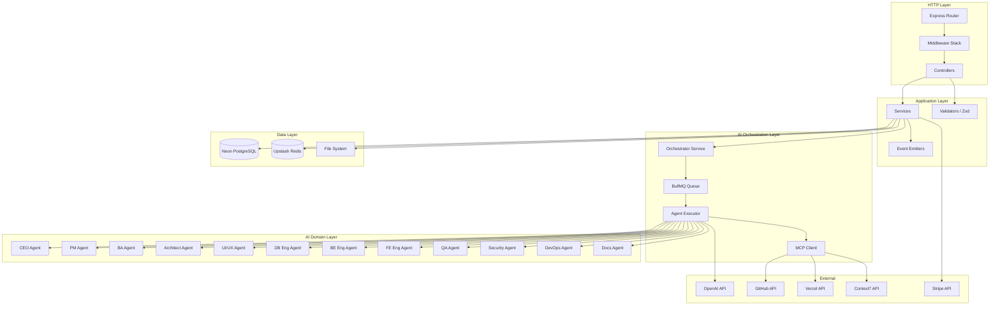

### 1.2 Layer Architecture

```
┌──────────────────────────────────────────────────────────────────────┐
│                         HTTP Layer                                    │
│  Routes · Middleware (auth, validation, rate limit, CORS, security)  │
│  Controllers (thin — HTTP concerns only)                             │
├──────────────────────────────────────────────────────────────────────┤
│                      Application Layer                                │
│  Services (business logic, orchestration, external integrations)     │
│  Validators (Zod schemas per endpoint)                               │
│  Event Emitters (domain events for cross-cutting concerns)           │
├──────────────────────────────────────────────────────────────────────┤
│                    AI Orchestration Layer                              │
│  OrchestratorService · PipelineEngine · BullMQ Queue                 │
│  AgentExecutor · ApprovalGates · FeedbackLoops                       │
│  MCPClient (tool dispatch to MCP servers)                            │
├──────────────────────────────────────────────────────────────────────┤
│                      AI Domain Layer                                  │
│  12 Agents (CEO · PM · BA · Architect · UI/UX · DB Eng · BE Eng     │
│  · FE Eng · QA · Security · DevOps · Documentation)                  │
│  Agent definitions · System prompts · Tool registries                │
├──────────────────────────────────────────────────────────────────────┤
│                       Data Layer                                      │
│  Drizzle ORM · Neon PostgreSQL · Redis (BullMQ + cache)             │
│  File System (project files, uploads)                                │
├──────────────────────────────────────────────────────────────────────┤
│                      External Layer                                   │
│  OpenAI API · Context7 API · GitHub API · Vercel API · Stripe       │
└──────────────────────────────────────────────────────────────────────┘
```

---

## 2. MVC Responsibilities

### 2.1 Layer Contract

| Layer | Responsibility | Allowed | Not Allowed |
|-------|---------------|---------|-------------|
| **Route** | Map URL + method → controller handler | Controller functions | Business logic |
| **Middleware** | Pre/post-process request/response | `req`, `res`, `next` | Business logic |
| **Controller** | Parse request, delegate to service, format response | Service, Validator | DB access, `new` service |
| **Service** | Business logic, orchestration, validation | Other services, DB, External APIs | HTTP objects (`req`, `res`) |
| **Repository** | Data access via Drizzle | DB client only | Business logic, HTTP |
| **Validator** | Zod schema parse | Zod only | Side effects |

### 2.2 Module Boundary Rules

| Rule | Enforcement |
|------|-------------|
| Controllers never import from other modules' services | Only their own domain service |
| Services may call other services | Via constructor injection only |
| No circular dependencies between services | Enforced by TypeScript/ESLint |
| No `new` operator in services | All dependencies injected |
| No `req` or `res` in services | Thrown errors propagate via `next(error)` |

---

## 3. Service Layer Responsibilities

### 3.1 Service Inventory

| Service | Module | Key Responsibilities |
|---------|--------|---------------------|
| `AuthService` | Auth | Password hashing, JWT creation/verification, token rotation, session management |
| `UserService` | Users | Profile CRUD, avatar management, preferences |
| `ProjectService` | Projects | Project CRUD, archive/restore, status transitions |
| `RequirementService` | Projects | Requirement CRUD, acceptance criteria management |
| `WorkflowService` | AI | Workflow CRUD, state transitions, pause/resume/cancel |
| `ExecutionService` | AI | Agent execution lifecycle, retry logic, iteration tracking |
| `OrchestratorService` | AI | Pipeline DAG execution, agent sequencing, parallel fan-out/fan-in |
| `AgentService` | AI | Individual agent execution via OpenAI SDK |
| `ConversationService` | AI | Conversation management, message CRUD |
| `FileService` | Files | File CRUD, upload/download, content hashing |
| `TaskService` | Tasks | Task CRUD, assignment, status transitions |
| `NotificationService` | Notifications | Notification CRUD, push, WebSocket emit |
| `ActivityService` | Activity | Activity log creation, aggregation, query |
| `AuditService` | Audit | Audit log creation, query, retention |
| `SettingsService` | Settings | User/project/team settings CRUD |
| `TokenService` | Auth | JWT sign/verify, RS256 key management |
| `MCPService` | MCP | MCP client connection, tool dispatch, response handling |
| `FileGenerationService` | AI | Write generated code/docs to disk |
| `WebhookService` | System | Outbound webhook dispatch (future) |

### 3.2 Service Dependency Graph

```
AuthService → TokenService, UserService
UserService → FileService (avatar)
ProjectService → WorkflowService, ActivityService, AuditService
WorkflowService → OrchestratorService, ExecutionService
OrchestratorService → AgentService, MCPService, ExecutionService
AgentService → ConversationService, FileGenerationService, MCPService
ExecutionService → WorkflowService
ConversationService → ExecutionService
NotificationService → ActivityService
ActivityService → AuditService
```

---

## 4. Repository Layer Responsibilities

### 4.1 Repository Pattern

Following ADR-012, Drizzle ORM serves as the repository layer directly — no abstract repository wrappers. Services query Drizzle directly for simplicity and type safety.

```typescript
// Direct Drizzle in services (repository pattern via Drizzle itself)
class ProjectService {
  constructor(private db: DrizzleClient) {}

  async findById(id: string, userId: string): Promise<Project | null> {
    return this.db.query.projects.findFirst({
      where: and(eq(projects.id, id), eq(projects.userId, userId), isNull(projects.deletedAt)),
      with: { workflows: { limit: 5 } },
    });
  }

  async findMany(userId: string, filters: ProjectFilters): Promise<Project[]> {
    const conditions = [eq(projects.userId, userId), isNull(projects.deletedAt)];
    if (filters.status) conditions.push(eq(projects.status, filters.status));
    return this.db.query.projects.findMany({ where: and(...conditions) });
  }
}
```

### 4.2 When to Extract a Query Module

| Scenario | Solution |
|----------|----------|
| Complex query used in multiple services | Extract to `db/queries/{entity}.ts` |
| Reporting / aggregation queries | Extract to `db/queries/reports.ts` |
| Raw SQL for performance | Extract to `db/queries/raw.ts` (rare — Drizzle covers 99%) |

---

## 5. Module Boundaries

### 5.1 Module Dependency Map

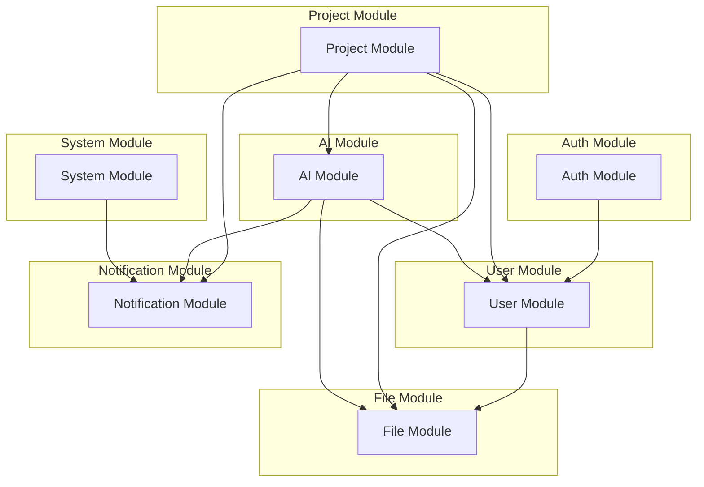

### 5.2 Module Cross-Cutting Concerns

| Concern | Implementation | Shared Via |
|---------|---------------|------------|
| Authentication | `AuthService` | Constructor injection |
| Authorization | Permission checks in services | `UserContext` object |
| Logging | Pino logger | `logger` singleton |
| Validation | Zod schemas | `@aisoftco/shared` package |
| Error handling | `AppError` classes | `utils/errors.ts` |
| Events | Event emitter pattern | `events/` module |
| Audit | `AuditService` | Constructor injection |

---

## 6. Dependency Flow

### 6.1 Dependency Injection Wiring

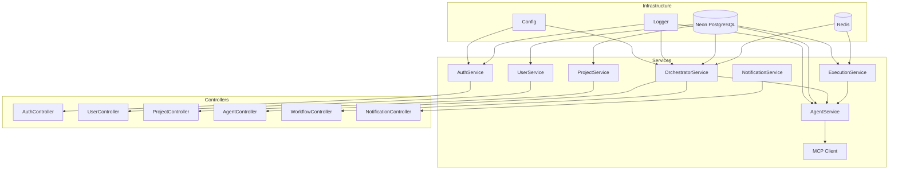

### 6.2 Wiring at Composition Root

All dependency injection happens at a single composition root in `src/app.ts`:

```typescript
// Composition root — all DI wiring
const db = drizzle(neon(CONFIG.DATABASE_URL));
const redis = new Redis(CONFIG.REDIS_URL);

// Auth
const tokenService = new TokenService(CONFIG.JWT_SECRET);
const authService = new AuthService(db, tokenService, CONFIG);
const authController = new AuthController(authService);

// Projects
const projectService = new ProjectService(db, auditService, activityService);
const projectController = new ProjectController(projectService);

// AI
const mcpClient = new MCPClient(CONFIG.MCP_BASE_URL, CONFIG.MCP_API_KEY);
const agentExecutor = new AgentExecutor(mcpClient, db, logger);
const orchestrator = new OrchestratorService(agentExecutor, bullQueue, db);
```

---

## 7. Request Lifecycle

### 7.1 Standard HTTP Request Lifecycle

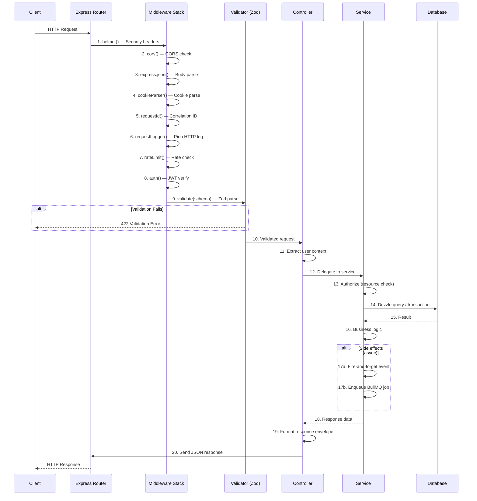

### 7.2 AI Workflow Request Lifecycle

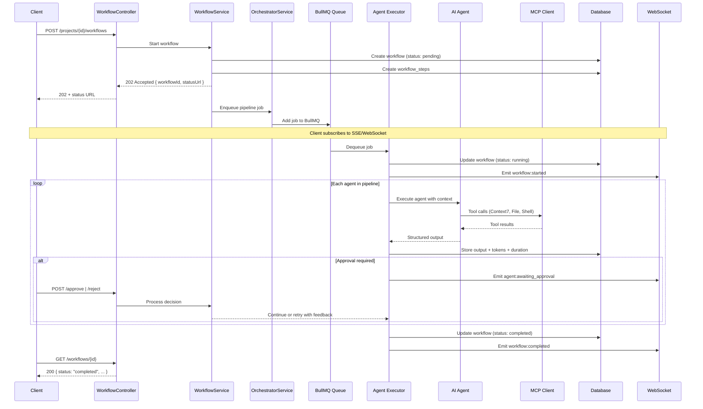

---

## 8. Response Lifecycle

### 8.1 Response Formatting Pipeline

```mermaid
flowchart LR
    A[Service returns data] --> B[Controller formats response]
    B --> C[Success?]
    C -->|Yes| D[Format: { success, data, meta }]
    C -->|No| E{Error type?}

    E -->|AppError| F[Format: { success, error: { code, message, details } }]
    E -->|ZodError| G[Format: { success, error: { code: VALIDATION_ERROR, details } }]
    E -->|Unknown| H[Log full error + return 500]

    D --> I[Send response with status code]
    F --> I
    G --> I
    H --> I
    I --> J[responseLogger captures duration]
```

### 8.2 Response Envelope

```typescript
interface SuccessResponse<T> {
  success: true;
  data: T;
  meta: {
    requestId: string;
    timestamp: string;
    page?: number;
    limit?: number;
    total?: number;
  };
}

interface ErrorResponse {
  success: false;
  error: {
    code: string;
    message: string;
    details?: unknown[];
  };
  meta: {
    requestId: string;
    timestamp: string;
  };
}
```

---

## 9. API Layer

### 9.1 Route Structure

```
src/routes/
  index.ts                       # Root router — mounts all modules
  auth.routes.ts                 # POST /auth/*
  user.routes.ts                 # GET/PATCH /users/*
  project.routes.ts              # CRUD /projects/*
  workflow.routes.ts             # POST/GET /projects/:id/workflows/*
  execution.routes.ts            # GET/POST /executions/*
  conversation.routes.ts         # GET/POST /conversations/*
  agent.routes.ts                # GET /agents/*
  file.routes.ts                 # GET/POST /files/*
  notification.routes.ts         # GET/PATCH /notifications/*
  requirement.routes.ts          # GET/PATCH /requirements/*
  task.routes.ts                 # CRUD /tasks/*
  settings.routes.ts             # GET/PATCH /settings/*
  health.routes.ts               # GET /health
  system.routes.ts               # GET /system/* (admin)
```

### 9.2 Route Registration Pattern

```typescript
// Each route file defines and exports a router
// All routes are mounted under /api/v1 in the index

// src/routes/auth.routes.ts
const router = Router();

router.post('/register', validate(registerSchema), authController.register);
router.post('/login', rateLimit.auth, validate(loginSchema), authController.login);
router.post('/refresh', authController.refresh);
router.post('/logout', authenticate, authController.logout);
router.post('/forgot-password', rateLimit.auth, validate(forgotSchema), authController.forgotPassword);
router.post('/reset-password', rateLimit.auth, validate(resetSchema), authController.resetPassword);
router.post('/verify-email', validate(verifySchema), authController.verifyEmail);
router.get('/me', authenticate, authController.me);

export default router;

// src/routes/index.ts
const api = Router();
api.use('/auth', authRoutes);
api.use('/users', authenticate, userRoutes);
api.use('/projects', authenticate, projectRoutes);
// ...
app.use('/api/v1', api);
```

---

## 10. Business Logic Layer

### 10.1 Service Layer Rules

| Rule | Rationale | Enforcement |
|------|-----------|-------------|
| One service per domain | Clear boundaries, testable units | Code review |
| All dependencies injected | Testable, swappable | Constructor pattern |
| No HTTP imports | Services are framework-agnostic | `import` rule in ESLint |
| Throw `AppError` for business failures | Consistent error handling | Custom error classes |
| Async side effects fire-and-forget | Don't block response | `.catch()` with logger |
| Transactions for multi-table ops | Data consistency | `db.transaction()` |

### 10.2 Service Method Pattern

```typescript
class ProjectService {
  // Every method follows: validate → authorize → execute → audit → return
  async archive(projectId: string, userId: string): Promise<Project> {
    // 1. Validate input (already done by middleware)
    // 2. Authorize
    const project = await this.findById(projectId, userId);
    if (!project) throw new NotFoundError('Project');
    if (project.status === 'archived') throw new ConflictError('Project already archived');

    // 3. Execute
    const [updated] = await this.db.update(projects)
      .set({ status: 'archived', archivedAt: new Date() })
      .where(eq(projects.id, projectId))
      .returning();

    // 4. Side effects (async, non-blocking)
    this.activityService.log(projectId, userId, 'project:archived').catch(this.logger.error);
    this.notificationService.notifyTeam(project.teamId, 'Project archived').catch(this.logger.error);

    // 5. Return
    return updated;
  }
}
```

---

## 11. Data Access Layer

### 11.1 Drizzle Client Configuration

```typescript
// db/client.ts — single Drizzle client instance
import { neon } from '@neondatabase/serverless';
import { drizzle } from 'drizzle-orm/neon-http';
import * as schema from './schema';

const sql = neon(CONFIG.DATABASE_URL);
export const db = drizzle(sql, { schema, logger: CONFIG.NODE_ENV === 'development' });
```

### 11.2 Schema Organization

```
src/db/
  schema/                  # Drizzle schema files
    index.ts               # Re-exports all schemas
    users.ts
    sessions.ts
    api-keys.ts
    organizations.ts
    teams.ts
    memberships.ts
    projects.ts
    project-requirements.ts
    project-files.ts
    workflows.ts
    workflow-steps.ts
    ai-agents.ts
    agent-executions.ts
    agent-outputs.ts
    ai-conversations.ts
    ai-messages.ts
    tasks.ts
    notifications.ts
    activity-logs.ts
    audit-logs.ts
    settings.ts
  migrations/              # Drizzle Kit generated SQL
    0000_initial.sql
    0001_add_indexes.sql
  queries/                 # Complex / shared query modules
    projects.ts
    workflows.ts
    activity.ts
  seeds/                   # Development seed data
    users.ts
    agents.ts
    projects.ts
  client.ts                # Drizzle client instance
  enums.ts                 # Shared enum definitions
```

### 11.3 Transaction Patterns

```typescript
// Multi-table insert with audit logging
async function createProject(input: CreateProjectInput, userId: string): Promise<Project> {
  return db.transaction(async (tx) => {
    const [project] = await tx.insert(projects).values({
      userId,
      title: input.title,
      description: input.description,
      techStack: input.techStack,
      status: 'draft',
    }).returning();

    await tx.insert(activityLogs).values({
      userId,
      projectId: project.id,
      type: 'project',
      action: 'project:created',
    });

    return project;
  });
}
```

---

## 12. AI Layer

### 12.1 AI Layer Architecture

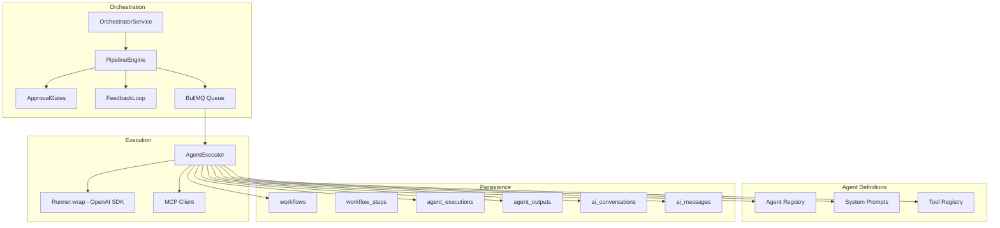

### 12.2 AI Service Responsibilities

| Component | Responsibility | Key Methods |
|-----------|---------------|-------------|
| `OrchestratorService` | Pipeline DAG execution, agent sequencing, parallel fan-out | `startPipeline()`, `advanceStep()`, `handleApproval()`, `handleRejection()` |
| `PipelineEngine` | DAG state machine, next-step determination | `getNextStep()`, `isParallelGroup()`, `allCompleted()` |
| `AgentExecutor` | Run agent via OpenAI SDK, handle retry/fallback | `execute()`, `retry()`, `withFallback()` |
| `ApprovalGates` | Approval state management, iteration limits | `requiresApproval()`, `approve()`, `reject()` |
| `FeedbackLoop` | User feedback routing, iteration counting | `processFeedback()`, `maxIterationsReached()` |

### 12.3 Agent Execution Sequence

```typescript
class AgentExecutor {
  async execute(execution: Execution, context: AgentContext): Promise<AgentOutput> {
    // 1. Build system prompt
    const systemPrompt = this.promptBuilder.build(execution.agentSlug, context);

    // 2. Create OpenAI agent
    const agent = createAgent(execution.agentSlug, systemPrompt);

    // 3. Run with retry + fallback
    const result = await this.runWithRetry(agent, context, execution);

    // 4. Validate structured output
    const validated = this.outputValidator.validate(execution.agentSlug, result);

    // 5. Persist
    await this.storeOutput(execution.id, validated);

    return validated;
  }

  private async runWithRetry(agent: Agent, context: AgentContext, execution: Execution): Promise<unknown> {
    for (let attempt = 1; attempt <= 3; attempt++) {
      try {
        const runner = Runner.run(agent, context, { maxTurns: 20 });
        return await runner;
      } catch (error) {
        if (attempt === 3) throw error;
        if (attempt === 2) agent.model = 'gpt-4o-mini'; // Fallback
        await delay(1000 * Math.pow(2, attempt - 1));
      }
    }
  }
}
```

---

## 13. MCP Integration Layer

### 13.1 MCP Client Architecture

```typescript
// mcp/client.ts — unified MCP client gateway
class MCPClient {
  private connections: Map<string, MCPSession> = new Map();

  async callTool(serverSlug: string, toolName: string, params: unknown): Promise<unknown> {
    const session = await this.getSession(serverSlug);
    return session.invoke(toolName, params);
  }

  private async getSession(serverSlug: string): Promise<MCPSession> {
    let session = this.connections.get(serverSlug);
    if (!session || session.isExpired) {
      session = await MCPSession.connect(serverSlug);
      this.connections.set(serverSlug, session);
    }
    return session;
  }
}
```

### 13.2 Supported MCP Servers

| Server | Slug | Tools | Used By |
|--------|------|-------|---------|
| GitHub | `github` | `create_repository`, `push_files`, `create_pr`, `create_issue` | DevOps, BE Eng |
| Context7 | `context7` | `resolve_library_id`, `query_docs` | CEO, PM, BA, Architect, Eng |
| Filesystem | `filesystem` | `read_file`, `write_file`, `list_directory`, `search_code`, `execute_command` | BE Eng, FE Eng, DevOps, Docs |
| Playwright | `playwright` | `launch_browser`, `screenshot`, `run_accessibility`, `run_e2e_test` | QA |
| PostgreSQL | `postgresql` | `inspect_schema`, `execute_query`, `validate_migration` | DB Eng |
| Vercel | `vercel` | `deploy`, `get_deployment`, `get_logs`, `manage_env_vars` | DevOps |

---

## 14. Configuration Layer

### 14.1 Configuration Schema

```typescript
// config/index.ts — validated environment configuration
const configSchema = z.object({
  NODE_ENV: z.enum(['development', 'staging', 'production']),
  PORT: z.coerce.number().default(3001),

  // Database
  DATABASE_URL: z.string().url(),
  DATABASE_POOL_SIZE: z.coerce.number().default(10),

  // Redis
  REDIS_URL: z.string().url(),

  // Auth
  JWT_ACCESS_SECRET: z.string().min(32),
  JWT_REFRESH_SECRET: z.string().min(32),
  JWT_ACCESS_EXPIRY: z.string().default('15m'),
  JWT_REFRESH_EXPIRY: z.string().default('7d'),

  // AI
  OPENAI_API_KEY: z.string(),
  OPENAI_MODEL: z.string().default('gpt-4o'),

  // MCP
  MCP_API_KEY: z.string(),
  MCP_BASE_URL: z.string().url(),

  // External
  GITHUB_TOKEN: z.string().optional(),
  CONTEXT7_API_KEY: z.string().optional(),
  VERCEL_TOKEN: z.string().optional(),
  STRIPE_SECRET_KEY: z.string().optional(),

  // File Storage
  UPLOAD_DIR: z.string().default('./uploads'),
  MAX_FILE_SIZE: z.coerce.number().default(10 * 1024 * 1024),

  // Logging
  LOG_LEVEL: z.enum(['trace', 'debug', 'info', 'warn', 'error', 'fatal']).default('info'),

  // Rate Limiting
  RATE_LIMIT_WINDOW_MS: z.coerce.number().default(60_000),
  RATE_LIMIT_MAX: z.coerce.number().default(100),
});

export type Config = z.infer<typeof configSchema>;
export const CONFIG = configSchema.parse(process.env);
```

### 14.2 Environment Files

| File | Purpose | Committed |
|------|---------|-----------|
| `.env.example` | Template with all keys, no values | Yes |
| `.env.development` | Local dev defaults | No (local) |
| `.env.staging` | Staging overrides | No (CI) |
| `.env.production` | Production secrets | No (Vercel env vars) |

---

## 15. Logging Layer

### 15.1 Logging Architecture

```typescript
// utils/logger.ts — Pino logger with correlation ID support
import pino from 'pino';

export const logger = pino({
  level: CONFIG.LOG_LEVEL,
  transport: CONFIG.NODE_ENV === 'development'
    ? { target: 'pino-pretty', options: { colorize: true, translateTime: 'HH:MM:ss' } }
    : undefined,
  redact: {
    paths: ['req.headers.authorization', 'req.headers.cookie', 'body.password', 'body.token'],
    censor: '[REDACTED]',
  },
});

// Middleware attaches request-scoped logger
app.use((req, res, next) => {
  req.log = logger.child({ requestId: req.id });
  next();
});
```

### 15.2 Log Events by Layer

| Layer | Event | Level | Data |
|-------|-------|-------|------|
| Middleware | Request received | `info` | method, path, query, requestId |
| Middleware | Response sent | `info` | status, duration, requestId |
| Controller | Handler invoked | `debug` | controller, method |
| Service | Business operation | `info` | operation, entityId, userId |
| Service | Authorization check | `debug` | userId, resource, action |
| Repository | Query executed | `debug` | table, operation, duration |
| AI | Agent started | `info` | agentSlug, executionId, tokenBudget |
| AI | Agent completed | `info` | agentSlug, duration, tokensUsed |
| AI | Tool call | `debug` | toolName, duration, success |
| AI | Approval gate hit | `info` | agentSlug, executionId |
| Error | Error caught | `error` | error, stack, requestId, userId |

### 15.3 Log Redaction Rules

| Field Type | Example | Action |
|------------|---------|--------|
| Passwords | `req.body.password` | `[REDACTED]` |
| Tokens | `req.headers.authorization` | `[REDACTED]` |
| API Keys | `req.body.apiKey` | `[REDACTED]` |
| Email addresses | `user.email` | Truncated: `u***@example.com` |
| IP addresses | `req.ip` | Full (for audit) |
| Error stacks | `error.stack` | Development only |

---

## 16. Validation Layer

### 16.1 Validation Architecture

```mermaid
graph TB
    subgraph "Transport Validation"
        T1[Content-Type: application/json]
        T2[Body size < 1MB]
        T3[Accept: application/json]
    end

    subgraph "Schema Validation (Zod)"
        V1[validate(body, schema)]
        V2[validate(query, schema)]
        V3[validate(params, schema)]
        V4[validate(headers, schema)]
    end

    subgraph "Business Validation"
        B1[Entity existence]
        B2[State machine check]
        B3[Permission check]
        B4[Rate limit check]
    end

    subgraph "Database Constraint"
        D1[UNIQUE violation]
        D2[FK constraint]
        D3[CHECK constraint]
    end

    T1 --> V1
    T2 --> V1
    T3 --> V1
    V1 --> B1
    V2 --> B2
    V3 --> B3
    V4 --> B4
    B1 --> D1
    B2 --> D2
    B3 --> D3
```

### 16.2 Validation Middleware

```typescript
// middleware/validate.ts — Zod validation middleware factory
function validate(schema: ZodSchema, source: 'body' | 'query' | 'params' | 'headers' = 'body') {
  return (req: Request, res: Response, next: NextFunction) => {
    const result = schema.safeParse(req[source]);
    if (!result.success) {
      throw new ValidationError(
        result.error.errors.map(e => ({
          field: e.path.join('.'),
          message: e.message,
          code: e.code,
        }))
      );
    }
    // Replace with parsed (transformed + defaults applied)
    req[source] = result.data;
    next();
  };
}
```

### 16.3 Shared Schema Distribution

All Zod schemas live in `@aisoftco/shared` and are consumed by both frontend and backend:

```
@aisoftco/shared/
  schemas/
    auth.schema.ts         # loginSchema, registerSchema, forgotSchema, resetSchema
    project.schema.ts      # createProjectSchema, updateProjectSchema, projectFilterSchema
    workflow.schema.ts     # startWorkflowSchema, approveSchema, rejectSchema
    user.schema.ts         # updateProfileSchema, changePasswordSchema, avatarSchema
    notification.schema.ts # notificationFilterSchema
    file.schema.ts         # uploadSchema
    common.schema.ts       # paginationSchema, uuidSchema, idSchema
  types/
    index.ts               # Re-exported inferred types
  index.ts                 # Barrel export
```

---

## 17. Error Handling Layer

### 17.1 Error Class Hierarchy

```typescript
// utils/errors.ts — custom error hierarchy
class AppError extends Error {
  constructor(
    public statusCode: number,
    public code: string,
    message: string,
    public details?: unknown[],
    public isOperational: boolean = true
  ) {
    super(message);
    this.name = 'AppError';
  }
}

class ValidationError extends AppError {
  constructor(details: unknown[]) {
    super(422, 'VALIDATION_ERROR', 'Validation failed', details);
  }
}

class UnauthorizedError extends AppError {
  constructor(message = 'Authentication required') {
    super(401, 'UNAUTHORIZED', message);
  }
}

class TokenExpiredError extends AppError {
  constructor() {
    super(498, 'TOKEN_EXPIRED', 'Access token has expired');
  }
}

class ForbiddenError extends AppError {
  constructor(message = 'Insufficient permissions') {
    super(403, 'FORBIDDEN', message);
  }
}

class NotFoundError extends AppError {
  constructor(resource = 'Resource') {
    super(404, 'NOT_FOUND', `${resource} not found`);
  }
}

class ConflictError extends AppError {
  constructor(message = 'Resource already exists') {
    super(409, 'CONFLICT', message);
  }
}

class RateLimitedError extends AppError {
  constructor(retryAfter: number) {
    super(429, 'RATE_LIMITED', `Rate limit exceeded. Retry after ${retryAfter}s`);
  }
}

class UpstreamError extends AppError {
  constructor(service: string, message: string) {
    super(502, 'UPSTREAM_ERROR', `${service}: ${message}`);
  }
}
```

### 17.2 Global Error Handler Middleware

```mermaid
flowchart LR
    A[Error thrown] --> B{Is AppError?}
    B -->|Yes| C{Is operational?}
    C -->|Yes| D[Format known error<br/>{ code, message, details }]
    C -->|No| E[Log full error<br/>Return 500 generic message]

    B -->|No| F{Is ZodError?}
    F -->|Yes| G[Format as ValidationError<br/>422 with field details]

    F -->|No| H{Is OpenAI error?}
    H -->|Yes| I[Format as UpstreamError<br/>502 with retry suggestion]

    H -->|No| J[JSON parse error?]
    J -->|Yes| K[400 Bad Request<br/>Invalid JSON]

    J -->|No| E

    D --> L[Send error response]
    G --> L
    I --> L
    K --> L
    E --> L

    L --> M[responseLogger captures error]
```

### 17.3 Error Handler Implementation

```typescript
// middleware/error-handler.ts
function errorHandler(err: Error, req: Request, res: Response, next: NextFunction): void {
  // Log full error
  req.log.error({ err, requestId: req.id }, 'Request failed');

  // Handle known operational errors
  if (err instanceof AppError) {
    res.status(err.statusCode).json({
      success: false,
      error: {
        code: err.code,
        message: err.message,
        details: err.details || null,
      },
      meta: { requestId: req.id, timestamp: new Date().toISOString() },
    });
    return;
  }

  // Handle Zod validation errors
  if (err instanceof ZodError) {
    res.status(422).json({
      success: false,
      error: {
        code: 'VALIDATION_ERROR',
        message: 'Validation failed',
        details: err.errors.map(e => ({
          field: e.path.join('.'),
          message: e.message,
          code: e.code,
        })),
      },
      meta: { requestId: req.id, timestamp: new Date().toISOString() },
    });
    return;
  }

  // Unknown errors — generic 500
  res.status(500).json({
    success: false,
    error: {
      code: 'INTERNAL_ERROR',
      message: CONFIG.NODE_ENV === 'production' ? 'Internal server error' : err.message,
    },
    meta: { requestId: req.id, timestamp: new Date().toISOString() },
  });
}
```

---

## 18. Security Layer

### 18.1 Defence in Depth

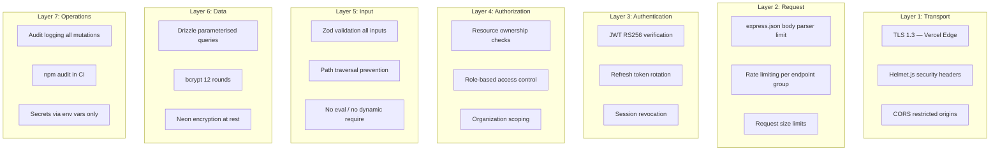

### 18.2 Security Middleware Registration

| Order | Middleware | Purpose |
|-------|-----------|---------|
| 1 | `helmet()` | CSP, HSTS, X-Frame-Options, X-Content-Type-Options |
| 2 | `cors(corsConfig)` | Restrict to known origins |
| 3 | `express.json({ limit: '1mb' })` | Body parser with size limit |
| 4 | `requestId()` | Correlation ID for tracing |
| 5 | `requestLogger()` | Pino HTTP request/response logging |
| 6 | `rateLimit()` | express-rate-limit per IP |
| 7 | `authenticate` | JWT verification (per-route) |
| 8 | `authorize` | Permission check (per-route) |
| 9 | `validate(schema)` | Zod validation (per-route) |

---

## 19. Middleware Pipeline

### 19.1 Global Middleware Stack

```typescript
// app.ts — middleware registration order
app.use(helmet());                              // 1. Security headers
app.use(cors(CONFIG.CORS));                      // 2. CORS
app.use(express.json({ limit: '1mb' }));         // 3. Body parser
app.use(cookieParser());                         // 4. Cookie parser
app.use(compression());                          // 5. Response compression
app.use(requestId());                            // 6. Correlation ID
app.use(requestLogger);                          // 7. HTTP logging
app.use('/api', rateLimiter);                    // 8. Global rate limiter
app.use('/api/v1', apiRouter);                   // 9. API routes
app.use(errorHandler);                           // 10. Global error handler
app.use(notFoundHandler);                        // 11. 404 fallback
```

### 19.2 Per-Route Middleware

```typescript
// Public routes — no auth
router.post('/register', rateLimit.auth, validate(registerSchema), authController.register);
router.post('/login', rateLimit.auth, validate(loginSchema), authController.login);
router.get('/health', healthController.check);

// Protected routes — auth required
router.get('/projects', authenticate, projectController.list);
router.post('/projects', authenticate, validate(createSchema), projectController.create);
router.get('/projects/:id', authenticate, projectController.getById);
router.patch('/projects/:id', authenticate, validate(updateSchema), projectController.update);
router.delete('/projects/:id', authenticate, projectController.delete);

// Admin routes — auth + admin role
router.get('/system/metrics', authenticate, authorize('admin'), systemController.metrics);
```

### 19.3 Middleware Pipeline Diagram

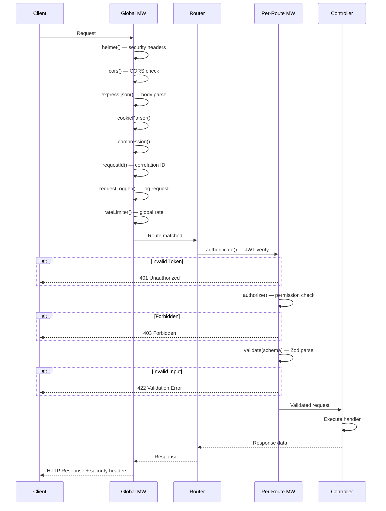

---

## 20. Environment Configuration

### 20.1 Environment Matrix

| Variable | Dev | Staging | Prod | Secret |
|----------|-----|---------|------|--------|
| `NODE_ENV` | development | staging | production | No |
| `PORT` | 3001 | — | — | No |
| `DATABASE_URL` | Neon dev | Neon staging | Neon prod | Yes |
| `REDIS_URL` | Upstash dev | Upstash staging | Upstash prod | Yes |
| `JWT_ACCESS_SECRET` | Local | Generated | Generated | Yes |
| `JWT_REFRESH_SECRET` | Local | Generated | Generated | Yes |
| `OPENAI_API_KEY` | Dev key | Staging key | Prod key | Yes |
| `MCP_API_KEY` | Local | Generated | Generated | Yes |
| `GITHUB_TOKEN` | Optional | Optional | Optional | Yes |
| `LOG_LEVEL` | debug | info | info | No |

### 20.2 Configuration Access Pattern

```typescript
// All configuration accessed through typed CONFIG object
// Never access process.env directly outside config module

// ✅ Correct
import { CONFIG } from '@/config';
const db = drizzle(CONFIG.DATABASE_URL);

// ❌ Incorrect
const db = drizzle(process.env.DATABASE_URL);
```

---

## 21. File Upload Strategy

### 21.1 Upload Architecture

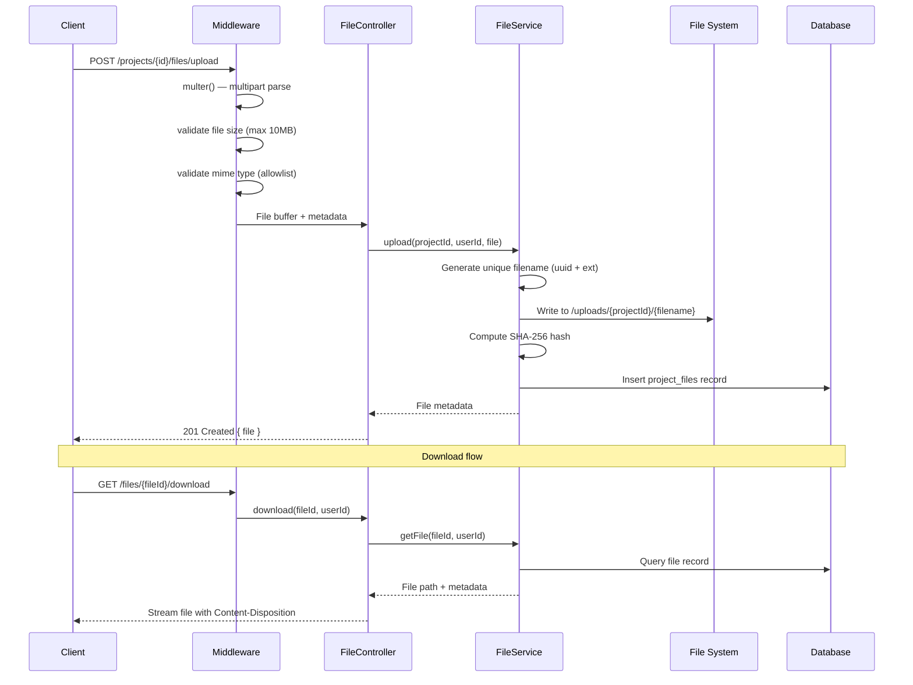

### 21.2 Upload Validation

| Check | Limit | Error |
|-------|-------|-------|
| Max file size | 10 MB | `413 PAYLOAD_TOO_LARGE` |
| Allowed MIME types | `text/*`, `application/json`, `image/png`, `image/jpeg`, `image/svg+xml`, `application/pdf`, `text/x-typescript`, `text/javascript` | `415 UNSUPPORTED_MEDIA_TYPE` |
| File name sanitisation | Strip path separators, special chars | `400 VALIDATION_ERROR` |
| Project directory quota | 500 MB per project | `409 CONFLICT` |

---

## 22. Background Task Strategy

### 22.1 BullMQ Queue Architecture

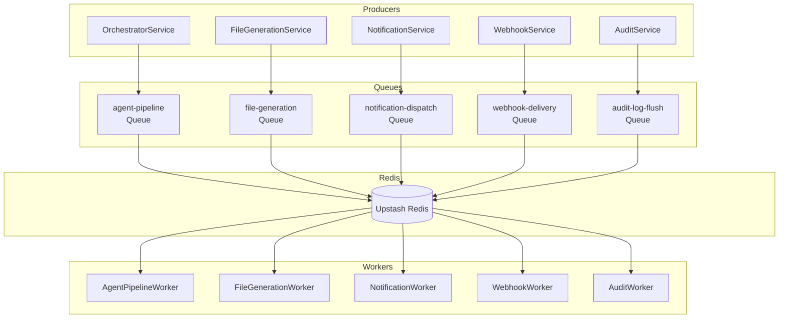

### 22.2 Queue Definitions

| Queue | Concurrency | Retries | Job Data | Purpose |
|-------|-------------|---------|----------|---------|
| `agent-pipeline` | 4 | 3 | `{ workflowId, stepId, context }` | Execute agent pipeline steps |
| `file-generation` | 2 | 2 | `{ projectId, agentId, outputId }` | Write generated files to disk |
| `notification-dispatch` | 5 | 3 | `{ notificationId, channels[] }` | Send notifications (in-app, email, Slack) |
| `webhook-delivery` | 3 | 5 | `{ webhookId, payload }` | Deliver outbound webhooks |
| `audit-log-flush` | 1 | 2 | `{ batchId }` | Batch flush audit logs to permanent storage |

### 22.3 Background Task Pattern

```typescript
// Enqueue a background job (non-blocking)
class OrchestratorService {
  async startPipeline(workflowId: string): Promise<void> {
    const job = await this.pipelineQueue.add('execute', {
      workflowId,
      timestamp: new Date().toISOString(),
    }, {
      attempts: 3,
      backoff: { type: 'exponential', delay: 2000 },
      removeOnComplete: true,
      removeOnFail: false,     // Keep failed jobs for debugging
    });

    this.logger.info({ workflowId, jobId: job.id }, 'Pipeline job enqueued');
  }
}
```

---

## 23. Streaming Response Strategy

### 23.1 Dual Streaming Architecture

```mermaid
graph TB
    subgraph "SSE Streams"
        SSE1[GET /streaming/workflows/{id}/events]
        SSE2[Server → Client]
        SSE3[Agent progress, workflow events]
    end

    subgraph "WebSocket (Socket.IO)"
        WS1[wss://api.aisoftco.com/ws]
        WS2[Bidirectional]
        WS3[Chat messages, approvals, real-time UI]
    end

    subgraph "Pub/Sub"
        PS[Redis Pub/Sub]
        PS2[Multi-instance broadcasting]
    end

    subgraph "Server"
        BQ[BullMQ Worker]
        AE[Agent Executor]
        SSEP[SSE Publisher]
        WSS[WebSocket Server]
    end

    subgraph "Client"
        SSE_C[SSE EventSource]
        WS_C[Socket.IO Client]
    end

    BQ -->|Agent events| AE
    AE --> SSEP
    AE --> WSS
    SSEP --> PS
    WSS --> PS
    PS --> SSEP
    PS --> WSS
    SSEP -->|text/event-stream| SSE_C
    WSS -->|Socket.IO| WS_C
```

### 23.2 SSE Event Stream

```typescript
// controllers/stream.controller.ts
class StreamController {
  async streamWorkflowEvents(req: Request, res: Response): Promise<void> {
    const { workflowId } = req.params;

    res.writeHead(200, {
      'Content-Type': 'text/event-stream',
      'Cache-Control': 'no-cache',
      'Connection': 'keep-alive',
      'X-Accel-Buffering': 'no',
    });

    // Subscribe to Redis pub/sub for this workflow
    const subscriber = this.redis.duplicate();
    await subscriber.subscribe(`workflow:${workflowId}:events`);

    subscriber.on('message', (channel, message) => {
      const event = JSON.parse(message);
      res.write(`event: ${event.type}\n`);
      res.write(`data: ${JSON.stringify(event.data)}\n\n`);
    });

    // Heartbeat every 30s
    const heartbeat = setInterval(() => {
      res.write(`event: heartbeat\ndata: {}\n\n`);
    }, 30000);

    // Cleanup on disconnect
    req.on('close', () => {
      clearInterval(heartbeat);
      subscriber.unsubscribe();
      subscriber.quit();
    });
  }
}
```

---

## 24. Scalability Strategy

### 24.1 Horizontal Scaling Points

| Component | Scaling Strategy | Stateful? | Notes |
|-----------|-----------------|-----------|-------|
| Express API | Vercel serverless functions | No | Stateless by design |
| WebSocket | Socket.IO Redis adapter | Minimal | Session affinity via sticky sessions |
| BullMQ Workers | Multiple worker processes | No | Queue is the source of truth |
| MCP Servers | Container replicas | No | Stateless, load-balanced |
| Database | Neon auto-scaling compute | Yes | Connection pooling via pgBouncer |
| Redis | Upstash managed | Yes | Single instance, high durability |

### 24.2 Stateless API Design

| Practice | Implementation |
|----------|---------------|
| No in-memory session | JWT carries all auth data |
| No local file storage | Files stored in DB (project_files) or S3-compatible |
| No process-local queues | All jobs in BullMQ (Redis-backed) |
| No server-local cache | Redis for distributed caching |
| Correlation IDs for tracing | `X-Request-Id` across all services |

### 24.3 Connection Pooling

```typescript
// Neon PostgreSQL via @neondatabase/serverless
// Built-in connection pooling via pgBouncer (transaction mode)
const sql = neon(CONFIG.DATABASE_URL, {
  poolSize: CONFIG.DATABASE_POOL_SIZE,
  maxRetries: 3,
  retryInterval: 1000,
});
```

---

## 25. Performance Strategy

### 25.1 Performance Targets

| Metric | Target | Measurement |
|--------|--------|-------------|
| API response (simple read) | < 50ms p95 | Request logging |
| API response (with DB query) | < 150ms p95 | Request logging |
| API response (with AI call) | < 5s p95 | AI service tracing |
| Query execution | < 20ms p95 | Neon Query Stats |
| Transaction (3-5 queries) | < 50ms p95 | Drizzle logging |
| Agent execution (planning) | < 60s p95 | Execution tracking |
| Agent execution (code gen) | < 180s p95 | Execution tracking |

### 25.2 Optimization Techniques

| Technique | Applied To | Impact |
|-----------|------------|--------|
| Connection pooling | Database | -80% connection overhead |
| Query optimisation | Drizzle queries | -60% execution time |
| Response compression | All responses | -70% bandwidth |
| Caching (Redis) | Context7, metadata | -80% latency |
| Cursor-based pagination | List endpoints | -90% query time on large datasets |
| Selective column fetching | Drizzle queries | -50% data transfer |
| Parallel queries | Independent data fetches | -40% page load time |
| Batch inserts | Audit logs, activity logs | -90% insert overhead |

---

## 26. Monitoring Strategy

### 26.1 Health Endpoints

| Endpoint | Purpose | Checks |
|----------|---------|--------|
| `GET /health` | Liveness | Always returns 200 |
| `GET /health/ready` | Readiness | DB connection, Redis, OpenAI API |
| `GET /health/detailed` | Detailed health | All upstream services + latency |

### 26.2 Metrics

```typescript
// Key metrics to track
interface Metrics {
  http: {
    requestsTotal: number;       // Counter
    requestDuration: number;     // Histogram (ms)
    requestsByStatus: Map<number, number>;  // Counter by status
    activeConnections: number;   // Gauge
  };
  queue: {
    jobsTotal: number;           // Counter
    jobsActive: number;          // Gauge
    jobsWaiting: number;         // Gauge
    jobsFailed: number;          // Counter
    jobDuration: number;         // Histogram
  };
  ai: {
    executionsTotal: number;     // Counter
    executionsFailed: number;    // Counter
    executionDuration: number;   // Histogram
    tokensUsed: number;          // Counter
    toolCallsTotal: number;      // Counter
    toolCallDuration: number;    // Histogram
  };
}
```

---

## 27. Testing Strategy

### 27.1 Test Pyramid

| Level | Scope | Tools | Target Coverage | Run Frequency |
|-------|-------|-------|----------------|---------------|
| **Unit** | Individual functions, services | Vitest | > 80% | Every commit |
| **Integration** | Service + DB, middleware + controller | Vitest + Test DB | > 60% | Every PR |
| **E2E** | Full request lifecycle | Vitest + Supertest | Critical paths | CI main branch |
| **AI Integration** | Mocked agent execution | Vitest + nock | Agent workflows | Every PR |

### 27.2 Test Architecture

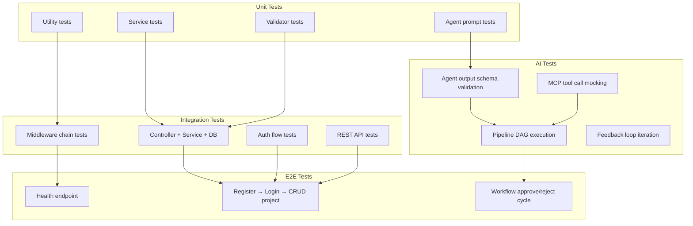

### 27.3 Test Infrastructure

```typescript
// vitest.config.ts
import { defineConfig } from 'vitest/config';

export default defineConfig({
  test: {
    globals: true,
    environment: 'node',
    setupFiles: ['./src/test/setup.ts'],
    testTimeout: 10000,
    coverage: {
      provider: 'v8',
      reporter: ['text', 'lcov'],
      thresholds: {
        branches: 80,
        functions: 80,
        lines: 80,
        statements: 80,
      },
    },
  },
});

// src/test/setup.ts — test database setup
import { db } from '@/db/client';

beforeEach(async () => {
  await db.transaction(async (tx) => {
    // Truncate all tables for clean state
    for (const table of Object.values(schema)) {
      await tx.delete(table);
    }
  });
});
```

---

## 28. Future Expansion Strategy

### 28.1 Extension Points

```mermaid
graph TB
    subgraph "Current (v1)"
        C1[MVC + Service Layer]
        C2[BullMQ for AI pipeline]
        C3[12 agents, fixed DAG]
        C4[REST API]
    end

    subgraph "Phase 2"
        P1[Webhook system]
        P2[API keys for M2M]
        P3[Rate limit tiers per plan]
        P4[Batch operations endpoint]
    end

    subgraph "Phase 3"
        P5[Read replicas]
        P6[Event sourcing for audit]
        P7[GraphQL gateway (optional)]
        P8[Cache layer (Redis)]
    end

    subgraph "Phase 4"
        P9[Multi-region deployment]
        P10[gRPC for MCP transport]
        P11[Custom agent definitions API]
        P12[Plugin system for services]
    end

    C1 --> P1
    C1 --> P2
    C2 --> P6
    C3 --> P11
    C4 --> P4
    C4 --> P7
    P1 --> P12
    P2 --> P2
    P5 --> P9
    P6 --> P10
```

### 28.2 Design Decisions for Extensibility

| Decision | Why | Enables |
|----------|-----|---------|
| DI at composition root | Services are swappable | Add new data sources, swap implementations |
| BullMQ for async work | Queue isolation per work type | Add new workers without touching HTTP layer |
| MCP for tool access | Standardised protocol | Add new tools without agent changes |
| Zod schemas in shared package | Single source of truth | Add new fields without breaking existing validation |
| Event emitter for side effects | Decoupled cross-cutting | Add new side effects (Slack, webhook, analytics) without modifying services |

### 28.3 Future Module Checklist

| Module | Phase | Dependencies | Complexity |
|--------|-------|-------------|------------|
| Billing | 2 | Stripe API, Webhook handling | Medium |
| Team management | 2 | Organizations, Memberships, RBAC | Medium |
| API keys (M2M) | 2 | api_keys table, rate limiting | Low |
| Webhook system | 2 | webhook_endpoints, webhook_events | Medium |
| Admin panel API | 2 | System routes, admin middleware | Low |
| Read replicas | 3 | Database config, query routing | High |
| Event sourcing | 3 | Event store, projections | High |
| Usage metering | 3 | usage_metrics table, counters | Medium |
| GraphQL gateway | 3 | Apollo/urql, schema stitching | High |
| Multi-region | 4 | Global Redis, data replication | Very High |

---

## Complete Module Architecture

### Module: Authentication

```
src/controllers/auth.controller.ts
src/services/auth.service.ts
src/routes/auth.routes.ts
src/validators/auth.validator.ts

Data: users, sessions, audit_logs
```

**Service Responsibilities:**
- `register()` — Validate input, check email uniqueness, hash password, create user + session, emit `auth:registered`
- `login()` — Find user by email, bcrypt compare, create session, rotate tokens, emit `auth:logged_in`
- `refresh()` — Validate refresh token, check session, rotate token, revoke old session
- `logout()` — Revoke session, blacklist access token jti, emit `auth:logged_out`
- `forgotPassword()` — Generate reset token, send email link
- `resetPassword()` — Validate reset token, hash new password, revoke all sessions
- `verifyEmail()` — Validate verification token, set `email_verified_at`

### Module: Users

```
src/controllers/user.controller.ts
src/services/user.service.ts
src/routes/user.routes.ts

Data: users, settings
```

**Service Responsibilities:**
- `getProfile()` — Fetch user by ID, include preferences
- `updateProfile()` — Update name, preferences; emit `user:updated`
- `changePassword()` — Verify current password, hash new, revoke other sessions
- `uploadAvatar()` — Validate file, resize, store, update avatar_url
- `deleteAvatar()` — Remove avatar file, clear avatar_url

### Module: Projects

```
src/controllers/project.controller.ts
src/services/project.service.ts
src/routes/project.routes.ts
src/validators/project.validator.ts

Data: projects, project_requirements
```

**Service Responsibilities:**
- `create()` — Insert project (status: draft), enqueue CEO agent job
- `findMany()` — List with filters, pagination, sorting
- `findById()` — Get project with related data
- `update()` — Update fields, emit `project:updated`
- `delete()` — Soft delete (set deleted_at), emit `project:deleted`
- `archive()` — Set status to archived, set archived_at
- `restore()` — Clear archived_at, set status to draft
- `getActivity()` — Paginated activity log for project

### Module: Workflows

```
src/controllers/workflow.controller.ts
src/services/workflow.service.ts
src/routes/workflow.routes.ts

Data: workflows, workflow_steps
```

**Service Responsibilities:**
- `start()` — Create workflow + steps, enqueue pipeline job, return 202
- `findById()` — Get workflow with steps and current status
- `findMany()` — List workflows for project
- `pause()` — Set status to paused, cancel current agent
- `resume()` — Set status to running, re-enqueue current step
- `cancel()` — Set status to cancelled, cancel all pending jobs
- `approve()` — Mark current execution approved, advance pipeline
- `reject()` — Mark current execution rejected, enqueue retry or fail
- `getTimeline()` — Full execution timeline with events

### Module: Agent Executions

```
src/controllers/execution.controller.ts
src/services/execution.service.ts
src/routes/execution.routes.ts

Data: agent_executions, agent_outputs
```

**Service Responsibilities:**
- `findMany()` — List executions for project/workflow
- `findById()` — Get execution with outputs and conversation
- `getProgress()` — Current progress percentage and status
- `getOutput()` — Get structured output for execution
- `retry()` — Reset status to pending, re-enqueue

### Module: Conversations & Messages

```
src/controllers/conversation.controller.ts
src/services/conversation.service.ts
src/routes/conversation.routes.ts

Data: ai_conversations, ai_messages
```

**Service Responsibilities:**
- `getConversation()` — Get conversation for execution
- `getMessages()` — Paginated messages for conversation
- `sendMessage()` — Insert user message, trigger agent response
- `getMessageStream()` — SSE stream of agent response tokens

### Module: Notifications

```
src/controllers/notification.controller.ts
src/services/notification.service.ts
src/routes/notification.routes.ts

Data: notifications
```

**Service Responsibilities:**
- `findMany()` — List notifications for user (filtered, paginated)
- `getUnreadCount()` — Count of unread notifications
- `markRead()` — Set single notification as read
- `markAllRead()` — Set all notifications as read
- `create()` — Create notification + emit via WebSocket
- `dispatch()` — Send via configured channels (in-app, email, Slack)

### Module: Files

```
src/controllers/file.controller.ts
src/services/file.service.ts
src/routes/file.routes.ts

Data: project_files
```

**Service Responsibilities:**
- `findMany()` — List files for project (filtered by type, paginated)
- `upload()` — Validate, hash, store, create record
- `download()` — Stream file with Content-Disposition
- `delete()` — Soft delete, emit `file:deleted`

### Module: Settings

```
src/controllers/settings.controller.ts
src/services/settings.service.ts
src/routes/settings.routes.ts

Data: settings
```

**Service Responsibilities:**
- `get()` — Get all settings for user/project/team
- `update()` — Upsert settings values
- `delete()` — Remove specific setting

### Module: Health & System

```
src/controllers/health.controller.ts
src/controllers/system.controller.ts
src/routes/health.routes.ts
src/routes/system.routes.ts
```

**Service Responsibilities:**
- `HealthService.check()` — Return status + timestamp
- `HealthService.ready()` — Check DB, Redis, OpenAI connectivity
- `HealthService.detailed()` — Per-component health with latency
- `SystemService.info()` — Version, uptime, environment
- `SystemService.metrics()` — Application metrics (Prometheus format)

---

## Complete Folder Structure

```
backend/
├── src/
│   ├── app.ts                          # Express app setup, middleware registration
│   ├── server.ts                       # HTTP server + graceful shutdown
│   │
│   ├── config/
│   │   └── index.ts                    # Typed environment config (Zod)
│   │
│   ├── routes/
│   │   ├── index.ts                    # Root router — mounts all modules
│   │   ├── auth.routes.ts
│   │   ├── user.routes.ts
│   │   ├── project.routes.ts
│   │   ├── workflow.routes.ts
│   │   ├── execution.routes.ts
│   │   ├── conversation.routes.ts
│   │   ├── agent.routes.ts
│   │   ├── file.routes.ts
│   │   ├── notification.routes.ts
│   │   ├── requirement.routes.ts
│   │   ├── task.routes.ts
│   │   ├── settings.routes.ts
│   │   ├── health.routes.ts
│   │   └── system.routes.ts
│   │
│   ├── controllers/
│   │   ├── auth.controller.ts
│   │   ├── user.controller.ts
│   │   ├── project.controller.ts
│   │   ├── workflow.controller.ts
│   │   ├── execution.controller.ts
│   │   ├── conversation.controller.ts
│   │   ├── agent.controller.ts
│   │   ├── file.controller.ts
│   │   ├── notification.controller.ts
│   │   ├── requirement.controller.ts
│   │   ├── task.controller.ts
│   │   ├── settings.controller.ts
│   │   ├── health.controller.ts
│   │   └── system.controller.ts
│   │
│   ├── services/
│   │   ├── auth.service.ts
│   │   ├── user.service.ts
│   │   ├── project.service.ts
│   │   ├── workflow.service.ts
│   │   ├── execution.service.ts
│   │   ├── conversation.service.ts
│   │   ├── agent.service.ts           # OpenAI Agents SDK execution
│   │   ├── file.service.ts
│   │   ├── notification.service.ts
│   │   ├── requirement.service.ts
│   │   ├── task.service.ts
│   │   ├── settings.service.ts
│   │   ├── activity.service.ts
│   │   ├── audit.service.ts
│   │   ├── health.service.ts
│   │   └── system.service.ts
│   │
│   ├── middleware/
│   │   ├── authenticate.ts             # JWT verification
│   │   ├── authorize.ts                # Role/permission check
│   │   ├── validate.ts                 # Zod validation factory
│   │   ├── error-handler.ts            # Global error handler
│   │   ├── request-id.ts               # Correlation ID
│   │   ├── request-logger.ts           # Pino HTTP logging
│   │   └── rate-limiter.ts             # express-rate-limit config
│   │
│   ├── validators/
│   │   ├── auth.validator.ts           # loginSchema, registerSchema, ...
│   │   ├── project.validator.ts
│   │   ├── workflow.validator.ts
│   │   └── common.validator.ts         # paginationSchema, uuidSchema
│   │
│   ├── orchestrator/                   # AI pipeline orchestration
│   │   ├── orchestrator.service.ts     # Pipeline DAG execution
│   │   ├── pipeline.engine.ts          # DAG state machine
│   │   ├── approval.gates.ts           # Approval state management
│   │   ├── feedback.loop.ts            # Iteration + retry logic
│   │   ├── agent.executor.ts           # OpenAI Agents SDK runner
│   │   └── context.builder.ts          # Accumulated context assembly
│   │
│   ├── agents/                         # AI agent definitions
│   │   ├── registry.ts                 # Agent slug → definition mapping
│   │   ├── base.agent.ts               # Base agent factory
│   │   ├── prompts/
│   │   │   ├── ceo.prompt.ts
│   │   │   ├── pm.prompt.ts
│   │   │   ├── ba.prompt.ts
│   │   │   ├── architect.prompt.ts
│   │   │   ├── ui-ux.prompt.ts
│   │   │   ├── db-engineer.prompt.ts
│   │   │   ├── backend-engineer.prompt.ts
│   │   │   ├── frontend-engineer.prompt.ts
│   │   │   ├── qa.prompt.ts
│   │   │   ├── security.prompt.ts
│   │   │   ├── devops.prompt.ts
│   │   │   └── docs.prompt.ts
│   │   └── schemas/
│   │       ├── ceo.schema.ts           # Zod output schemas
│   │       ├── pm.schema.ts
│   │       └── ...
│   │
│   ├── mcp/                            # MCP client integration
│   │   ├── client.ts                   # Unified MCP client gateway
│   │   ├── session.ts                  # MCP session management
│   │   ├── types.ts                    # MCP types + interfaces
│   │   └── tools/
│   │       ├── registry.ts             # Available tool definitions
│   │       └── wrappers.ts             # Tool → Agent SDK conversion
│   │
│   ├── ws/                             # WebSocket (Socket.IO)
│   │   ├── index.ts                    # Socket.IO server setup
│   │   ├── auth.ts                     # Socket.IO auth middleware
│   │   ├── namespaces/
│   │   │   ├── workflow.ts             # /workflows/{id} namespace
│   │   │   ├── project.ts              # /projects/{id} namespace
│   │   │   └── notifications.ts        # /notifications/{userId} namespace
│   │   └── handlers/
│   │       ├── approval.ts             # Approve/reject events
│   │       ├── conversation.ts         # Chat message events
│   │       └── ping.ts                 # Keep-alive
│   │
│   ├── db/
│   │   ├── client.ts                   # Drizzle client instance
│   │   ├── enums.ts                    # PostgreSQL enum definitions
│   │   ├── schema/
│   │   │   ├── index.ts                # Re-export all schemas
│   │   │   ├── users.ts
│   │   │   ├── sessions.ts
│   │   │   ├── api-keys.ts
│   │   │   ├── organizations.ts
│   │   │   ├── teams.ts
│   │   │   ├── memberships.ts
│   │   │   ├── projects.ts
│   │   │   ├── project-requirements.ts
│   │   │   ├── project-files.ts
│   │   │   ├── workflows.ts
│   │   │   ├── workflow-steps.ts
│   │   │   ├── ai-agents.ts
│   │   │   ├── agent-executions.ts
│   │   │   ├── agent-outputs.ts
│   │   │   ├── ai-conversations.ts
│   │   │   ├── ai-messages.ts
│   │   │   ├── tasks.ts
│   │   │   ├── notifications.ts
│   │   │   ├── activity-logs.ts
│   │   │   ├── audit-logs.ts
│   │   │   └── settings.ts
│   │   ├── migrations/                 # Drizzle Kit generated SQL
│   │   │   ├── 0000_initial.sql
│   │   │   └── meta/
│   │   ├── queries/                    # Shared query modules
│   │   │   ├── projects.ts
│   │   │   ├── workflows.ts
│   │   │   └── activity.ts
│   │   └── seeds/                      # Development seed data
│   │       ├── users.ts
│   │       ├── agents.ts
│   │       └── projects.ts
│   │
│   ├── events/                         # Domain event system
│   │   ├── emitter.ts                  # Event emitter instance
│   │   ├── handlers/
│   │   │   ├── project.handlers.ts     # On project:created → notify
│   │   │   ├── workflow.handlers.ts    # On workflow:completed → notify
│   │   │   └── auth.handlers.ts        # On auth:login → audit
│   │   └── types.ts                    # Event type definitions
│   │
│   ├── jobs/                           # BullMQ queue definitions
│   │   ├── queues.ts                   # Queue definitions + connections
│   │   ├── workers/
│   │   │   ├── pipeline.worker.ts      # Agent pipeline execution
│   │   │   ├── file-generation.worker.ts
│   │   │   ├── notification.worker.ts
│   │   │   └── webhook.worker.ts
│   │   └── schedulers/
│   │       └── cleanup.scheduler.ts    # Periodic cleanup jobs
│   │
│   ├── lib/                            # Core libraries
│   │   ├── token.service.ts            # JWT sign/verify
│   │   ├── hash.service.ts             # bcrypt hash/compare
│   │   ├── file-storage.service.ts     # Local/S3 file operations
│   │   └── email.service.ts            # Email dispatch (future)
│   │
│   ├── types/                          # TypeScript type definitions
│   │   ├── express.d.ts                # Express type augmentation
│   │   ├── api.ts                      # API request/response types
│   │   ├── auth.ts                     # Auth context types
│   │   ├── project.ts
│   │   ├── workflow.ts
│   │   ├── agent.ts
│   │   ├── file.ts
│   │   └── common.ts
│   │
│   ├── constants/
│   │   ├── http.ts                     # HTTP status codes
│   │   ├── errors.ts                   # Error code constants
│   │   ├── limits.ts                   # Pagination, rate limit constants
│   │   └── agents.ts                   # Agent slugs, categories
│   │
│   └── utils/
│       ├── logger.ts                   # Pino logger setup
│       ├── errors.ts                   # Error class hierarchy
│       ├── response.ts                 # Response helper functions
│       ├── async-handler.ts            # Async route wrapper
│       └── pagination.ts              # Pagination helper
│
├── tests/
│   ├── setup.ts                        # Test DB setup + teardown
│   ├── helpers/
│   │   ├── factories.ts                # Test data factories
│   │   ├── auth.ts                     # Auth test helpers
│   │   └── db.ts                       # DB test utilities
│   ├── unit/
│   │   ├── services/
│   │   │   ├── auth.service.test.ts
│   │   │   ├── project.service.test.ts
│   │   │   └── workflow.service.test.ts
│   │   ├── validators/
│   │   │   └── auth.validator.test.ts
│   │   └── utils/
│   │       └── errors.test.ts
│   ├── integration/
│   │   ├── middleware/
│   │   │   ├── authenticate.test.ts
│   │   │   └── validate.test.ts
│   │   ├── routes/
│   │   │   ├── auth.routes.test.ts
│   │   │   ├── project.routes.test.ts
│   │   │   └── workflow.routes.test.ts
│   │   └── orchestrator/
│   │       └── pipeline.test.ts
│   └── e2e/
│       ├── auth-flow.test.ts
│       ├── project-workflow.test.ts
│       └── approval-cycle.test.ts
│
├── types/                              # Shared types (re-exported)
├── constants/
├── utils/
├── vitest.config.ts
├── tsconfig.json
├── package.json
└── .env.example
```

---

## Summary

| Aspect | Design Decision |
|--------|----------------|
| **Architecture** | MVC + Service Layer with Dependency Injection |
| **Controllers** | Thin — HTTP parsing, delegation, response formatting only |
| **Services** | All business logic, orchestration, external integrations |
| **Data Access** | Direct Drizzle in services (ADR-012); query modules for complex patterns |
| **Dependency Injection** | Manual DI at composition root (`src/app.ts`) |
| **AI Orchestration** | BullMQ queues → Agent Executor → OpenAI Agents SDK → MCP tools |
| **Validation** | Zod schemas in `@aisoftco/shared`, middleware-per-route |
| **Error Handling** | Custom `AppError` hierarchy → global error handler |
| **Logging** | Pino with correlation IDs, structured JSON, sensitive data redaction |
| **Security** | 7-layer defence-in-depth: TLS → headers → rate limit → JWT → RBAC → Zod → audit |
| **Background Jobs** | BullMQ with 5 queues, exponential backoff, failed job persistence |
| **Real-Time** | SSE for unidirectional events (agent progress), WebSocket for bidirectional (chat, approvals) |
| **Scalability** | Stateless API, Vercel serverless, Neon auto-scaling, Redis pub/sub |
| **Testing** | Vitest with test DB, 3-tier pyramid (unit → integration → E2E) + AI integration tests |
| **Config** | Zod-validated environment config, never access `process.env` directly |
| **Folder Structure** | 19 top-level directories under `src/`: routes, controllers, services, middleware, orchestrator, agents, mcp, ws, db, events, jobs, validators, config, lib, types, constants, utils |
