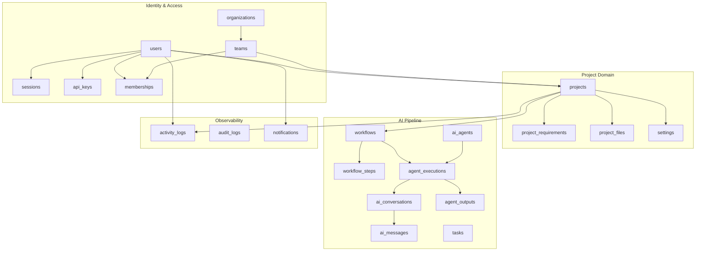
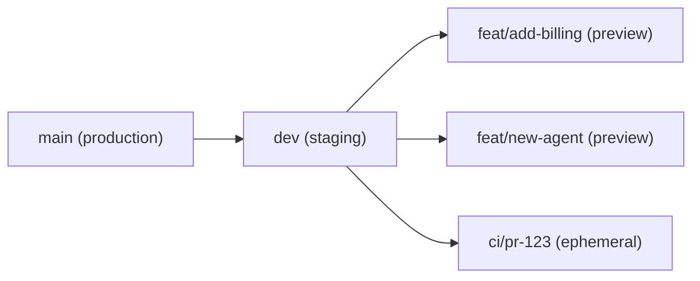

# Database Architecture

## Technology Stack

| Component | Technology | Version | Rationale |
|-----------|-----------|---------|-----------|
| Database Engine | PostgreSQL (Neon) | 16 | Serverless, auto-scaling, branching, pgBouncer built-in |
| ORM | Drizzle ORM | Latest | Type-safe, SQL-like API, lightweight, excellent Neon support |
| Migration | Drizzle Kit | Latest | SQL-based migrations, no hidden state |
| Connection Pool | pgBouncer (via Neon) | Transaction mode | 1000+ concurrent connections |
| Cache / Queue | Redis (Upstash) | Latest | BullMQ backend, response cache, rate limiter store |

---

## 1. Database Architecture Overview

### 1.1 Architectural Principles

| Principle | Application |
|-----------|-------------|
| **Third Normal Form (3NF)** | All tables satisfy 3NF; no transitive dependencies |
| **UUID Primary Keys** | All tables use UUID v4; no auto-increment integers |
| **Soft Deletes** | All user-facing entities use `deleted_at`; system-only tables hard-delete |
| **Audit Trail** | Every mutation recorded in `audit_logs`; `activity_logs` for user actions |
| **Immutable History** | `agent_messages`, `audit_logs`, `activity_logs` are append-only |
| **Enum over String** | All status/type fields use PostgreSQL ENUM types |
| **JSONB for Flexibility** | Metadata, payloads, and variable schemas stored as JSONB |
| **Timestamp with TZ** | All timestamps are `timestamptz` (TIMESTAMP WITH TIME ZONE) |
| **Index All FKs** | Every foreign key column has an index |
| **Composite Indexes** | High-frequency query patterns covered by composite indexes |

### 1.2 Namespace Diagram



---

## 2. Entity Relationship Diagram (Mermaid)

```mermaid
erDiagram
    users ||--o{ sessions : "has"
    users ||--o{ api_keys : "owns"
    users ||--o{ memberships : "has"
    users ||--o{ projects : "creates"
    users ||--o{ activity_logs : "performs"
    users ||--o{ notifications : "receives"
    users ||--o{ settings : "configures"
    users ||--o{ ai_conversations : "participates"

    organizations ||--o{ teams : "contains"
    organizations ||--o{ projects : "scopes"

    teams ||--o{ memberships : "contains"
    teams ||--o{ projects : "scopes"

    projects ||--o{ project_requirements : "defines"
    projects ||--o{ project_files : "contains"
    projects ||--o{ workflows : "has"
    projects ||--o{ settings : "configures"
    projects ||--o{ activity_logs : "logs"
    projects ||--o{ tasks : "tracks"

    workflows ||--o{ workflow_steps : "composed_of"
    workflows ||--o{ agent_executions : "triggers"

    workflow_steps ||--o{ agent_executions : "runs"

    ai_agents ||--o{ agent_executions : "executed_by"

    agent_executions ||--o{ agent_outputs : "produces"
    agent_executions ||--o{ ai_conversations : "logs"
    agent_executions ||--o{ tasks : "creates"

    ai_conversations ||--o{ ai_messages : "contains"

    users {
        uuid id PK
        varchar email UK
        varchar name
        varchar password_hash
        varchar avatar_url
        user_role role
        boolean is_active
        timestamptz email_verified_at
        timestamptz last_login_at
        jsonb preferences
        timestamptz created_at
        timestamptz updated_at
        timestamptz deleted_at
    }

    sessions {
        uuid id PK
        uuid user_id FK
        varchar refresh_token_hash UK
        varchar user_agent
        inet ip_address
        timestamptz expires_at
        timestamptz created_at
        timestamptz revoked_at
    }

    api_keys {
        uuid id PK
        uuid user_id FK
        varchar name
        varchar key_hash UK
        api_key_permissions permissions
        timestamptz last_used_at
        timestamptz expires_at
        timestamptz created_at
        timestamptz revoked_at
    }

    organizations {
        uuid id PK
        varchar name
        varchar slug UK
        uuid owner_id FK
        organization_tier tier
        jsonb billing_info
        timestamptz created_at
        timestamptz updated_at
        timestamptz deleted_at
    }

    teams {
        uuid id PK
        uuid organization_id FK
        varchar name
        varchar slug
        uuid owner_id FK
        timestamptz created_at
        timestamptz updated_at
        timestamptz deleted_at
    }

    memberships {
        uuid id PK
        uuid user_id FK
        uuid team_id FK
        membership_role role
        timestamptz joined_at
        timestamptz expired_at
    }

    projects {
        uuid id PK
        uuid user_id FK
        uuid team_id FK
        uuid organization_id FK
        varchar title
        text description
        jsonb tech_stack
        project_status status
        project_phase current_phase
        project_priority priority
        jsonb metadata
        timestamptz created_at
        timestamptz updated_at
        timestamptz archived_at
        timestamptz deleted_at
    }

    project_requirements {
        uuid id PK
        uuid project_id FK
        varchar title
        text description
        requirement_type type
        requirement_priority priority
        requirement_status status
        jsonb acceptance_criteria
        integer sort_order
        uuid parent_id FK
        timestamptz created_at
        timestamptz updated_at
    }

    project_files {
        uuid id PK
        uuid project_id FK
        uuid agent_execution_id FK
        varchar file_path
        text content
        file_type type
        varchar language
        varchar hash SHA256
        integer size_bytes
        timestamptz created_at
    }

    workflows {
        uuid id PK
        uuid project_id FK
        varchar name
        workflow_status status
        workflow_phase phase
        jsonb pipeline_definition
        timestamptz started_at
        timestamptz completed_at
        timestamptz created_at
        timestamptz updated_at
    }

    workflow_steps {
        uuid id PK
        uuid workflow_id FK
        varchar name
        varchar agent_type
        integer sort_order
        boolean is_parallel
        boolean requires_approval
        workflow_step_status status
        integer max_retries
        integer max_iterations
        jsonb input_schema
        jsonb output_schema
        timestamptz started_at
        timestamptz completed_at
        timestamptz created_at
    }

    ai_agents {
        uuid id PK
        varchar name
        varchar slug UK
        varchar description
        agent_category category
        varchar model_name
        integer max_tokens
        numeric temperature
        jsonb system_prompt_template
        jsonb tool_definitions
        boolean is_active
        timestamptz created_at
        timestamptz updated_at
    }

    agent_executions {
        uuid id PK
        uuid workflow_id FK
        uuid workflow_step_id FK
        uuid project_id FK
        uuid agent_id FK
        uuid user_id FK
        execution_status status
        integer attempt_number
        integer iteration_count
        jsonb input_context
        jsonb output_summary
        integer tokens_prompt
        integer tokens_completion
        integer duration_ms
        text user_feedback
        text error_message
        timestamptz started_at
        timestamptz completed_at
        timestamptz created_at
    }

    agent_outputs {
        uuid id PK
        uuid agent_execution_id FK
        output_type type
        varchar section_name
        jsonb content
        jsonb content_json
        integer tokens_used
        boolean is_approved
        text approval_comment
        timestamptz approved_at
        uuid approved_by FK
        timestamptz created_at
    }

    ai_conversations {
        uuid id PK
        uuid agent_execution_id FK
        uuid project_id FK
        uuid user_id FK
        varchar title
        conversation_status status
        integer message_count
        integer total_tokens
        timestamptz created_at
        timestamptz updated_at
    }

    ai_messages {
        uuid id PK
        uuid conversation_id FK
        message_role role
        text content
        jsonb tool_calls
        jsonb tool_results
        integer tokens
        integer sort_order
        timestamptz created_at
    }

    tasks {
        uuid id PK
        uuid project_id FK
        uuid agent_execution_id FK
        uuid assignee_id FK
        varchar title
        text description
        task_status status
        task_priority priority
        task_category category
        jsonb metadata
        timestamptz due_at
        timestamptz completed_at
        timestamptz created_at
        timestamptz updated_at
    }

    notifications {
        uuid id PK
        uuid user_id FK
        uuid project_id FK
        notification_type type
        notification_channel channel
        varchar title
        text body
        jsonb data
        boolean is_read
        timestamptz read_at
        timestamptz created_at
    }

    activity_logs {
        uuid id PK
        uuid user_id FK
        uuid project_id FK
        activity_type type
        activity_severity severity
        varchar action
        varchar resource_type
        uuid resource_id
        jsonb metadata
        inet ip_address
        varchar user_agent
        timestamptz created_at
    }

    audit_logs {
        uuid id PK
        uuid user_id FK
        audit_action action
        audit_target target_type
        uuid target_id
        jsonb old_values
        jsonb new_values
        jsonb diff
        varchar source_ip
        varchar user_agent
        timestamptz created_at
    }

    settings {
        uuid id PK
        uuid user_id FK
        uuid project_id FK
        uuid team_id FK
        varchar category
        varchar key
        text value
        timestamptz created_at
        timestamptz updated_at
    }
```

---

## 3. Table Definitions

### 3.1 `users`

| Column | Type | Constraints | Description |
|--------|------|-------------|-------------|
| `id` | `uuid` | PK, DEFAULT `gen_random_uuid()` | Primary identifier |
| `email` | `varchar(255)` | UNIQUE, NOT NULL | Login email |
| `name` | `varchar(255)` | NOT NULL | Display name |
| `password_hash` | `varchar(255)` | NOT NULL | bcrypt hash (12 rounds) |
| `avatar_url` | `varchar(512)` | NULLABLE | Profile image URL |
| `role` | `user_role` | NOT NULL, DEFAULT `'member'` | System-wide role |
| `is_active` | `boolean` | NOT NULL, DEFAULT `true` | Account active flag |
| `email_verified_at` | `timestamptz` | NULLABLE | Email verification timestamp |
| `last_login_at` | `timestamptz` | NULLABLE | Last successful login |
| `preferences` | `jsonb` | NOT NULL, DEFAULT `'{}'` | User preferences (theme, locale) |
| `created_at` | `timestamptz` | NOT NULL, DEFAULT `now()` | Row creation time |
| `updated_at` | `timestamptz` | NOT NULL, DEFAULT `now()` | Row last update |
| `deleted_at` | `timestamptz` | NULLABLE | Soft delete timestamp |

**Indexes:**
- `idx_users_email` — UNIQUE on `email` WHERE `deleted_at IS NULL`
- `idx_users_role` — on `role`
- `idx_users_active` — on `is_active` WHERE `deleted_at IS NULL`

---

### 3.2 `sessions`

Tracks active JWT refresh tokens for session management and revocation.

| Column | Type | Constraints | Description |
|--------|------|-------------|-------------|
| `id` | `uuid` | PK | Primary identifier |
| `user_id` | `uuid` | FK → `users.id`, NOT NULL | Owning user |
| `refresh_token_hash` | `varchar(255)` | UNIQUE, NOT NULL | SHA-256 of refresh token |
| `user_agent` | `varchar(512)` | NULLABLE | Client user-agent string |
| `ip_address` | `inet` | NULLABLE | Client IP at session creation |
| `expires_at` | `timestamptz` | NOT NULL | Session expiry (7 days from creation) |
| `created_at` | `timestamptz` | NOT NULL, DEFAULT `now()` | Creation time |
| `revoked_at` | `timestamptz` | NULLABLE | Revocation timestamp |

**Indexes:**
- `idx_sessions_user` — on `user_id`
- `idx_sessions_token_hash` — UNIQUE on `refresh_token_hash`
- `idx_sessions_expires` — on `expires_at` (for cleanup queries)

---

### 3.3 `api_keys`

API keys for programmatic access to the platform (future-ready).

| Column | Type | Constraints | Description |
|--------|------|-------------|-------------|
| `id` | `uuid` | PK | Primary identifier |
| `user_id` | `uuid` | FK → `users.id`, NOT NULL | Owning user |
| `name` | `varchar(255)` | NOT NULL | Human-readable key name |
| `key_hash` | `varchar(255)` | UNIQUE, NOT NULL | SHA-256 hash of the API key |
| `permissions` | `api_key_permissions` | NOT NULL | Bitfield or array of permissions |
| `last_used_at` | `timestamptz` | NULLABLE | Last usage timestamp |
| `expires_at` | `timestamptz` | NULLABLE | Key expiry |
| `created_at` | `timestamptz` | NOT NULL, DEFAULT `now()` | Creation time |
| `revoked_at` | `timestamptz` | NULLABLE | Revocation timestamp |

**Indexes:**
- `idx_api_keys_user` — on `user_id`
- `idx_api_keys_hash` — UNIQUE on `key_hash`
- `idx_api_keys_expires` — on `expires_at`

---

### 3.4 `organizations`

Top-level multi-tenant entity. Every user belongs to at least one organization. Free-tier users get a personal organization.

| Column | Type | Constraints | Description |
|--------|------|-------------|-------------|
| `id` | `uuid` | PK | Primary identifier |
| `name` | `varchar(255)` | NOT NULL | Organization display name |
| `slug` | `varchar(255)` | UNIQUE, NOT NULL | URL-friendly identifier |
| `owner_id` | `uuid` | FK → `users.id`, NOT NULL | Organization owner |
| `tier` | `organization_tier` | NOT NULL, DEFAULT `'free'` | Subscription tier |
| `billing_info` | `jsonb` | NULLABLE | Stripe customer metadata |
| `created_at` | `timestamptz` | NOT NULL, DEFAULT `now()` | Creation time |
| `updated_at` | `timestamptz` | NOT NULL, DEFAULT `now()` | Last update |
| `deleted_at` | `timestamptz` | NULLABLE | Soft delete |

**Indexes:**
- `idx_orgs_slug` — UNIQUE on `slug` WHERE `deleted_at IS NULL`
- `idx_orgs_owner` — on `owner_id`

---

### 3.5 `teams`

Teams group users within an organization for collaborative project access.

| Column | Type | Constraints | Description |
|--------|------|-------------|-------------|
| `id` | `uuid` | PK | Primary identifier |
| `organization_id` | `uuid` | FK → `organizations.id`, NOT NULL | Parent organization |
| `name` | `varchar(255)` | NOT NULL | Team name |
| `slug` | `varchar(255)` | NOT NULL | URL-friendly identifier |
| `owner_id` | `uuid` | FK → `users.id`, NOT NULL | Team creator/owner |
| `created_at` | `timestamptz` | NOT NULL, DEFAULT `now()` | Creation time |
| `updated_at` | `timestamptz` | NOT NULL, DEFAULT `now()` | Last update |
| `deleted_at` | `timestamptz` | NULLABLE | Soft delete |

**Indexes:**
- `idx_teams_org` — on `organization_id`
- `idx_teams_org_slug` — UNIQUE on `(organization_id, slug)` WHERE `deleted_at IS NULL`
- `idx_teams_owner` — on `owner_id`

---

### 3.6 `memberships`

Join table linking users to teams with role-based permissions.

| Column | Type | Constraints | Description |
|--------|------|-------------|-------------|
| `id` | `uuid` | PK | Primary identifier |
| `user_id` | `uuid` | FK → `users.id`, NOT NULL | Member user |
| `team_id` | `uuid` | FK → `teams.id`, NOT NULL | Team |
| `role` | `membership_role` | NOT NULL, DEFAULT `'member'` | Team role |
| `joined_at` | `timestamptz` | NOT NULL, DEFAULT `now()` | Join timestamp |
| `expired_at` | `timestamptz` | NULLABLE | Membership expiry |

**Indexes:**
- `idx_memberships_user_team` — UNIQUE on `(user_id, team_id)`
- `idx_memberships_user` — on `user_id`
- `idx_memberships_team` — on `team_id`

---

### 3.7 `projects`

The core unit of work — a user's software idea being built by AI agents.

| Column | Type | Constraints | Description |
|--------|------|-------------|-------------|
| `id` | `uuid` | PK | Primary identifier |
| `user_id` | `uuid` | FK → `users.id`, NOT NULL | Creator |
| `team_id` | `uuid` | FK → `teams.id`, NULLABLE | Owning team |
| `organization_id` | `uuid` | FK → `organizations.id`, NULLABLE | Owning organization |
| `title` | `varchar(255)` | NOT NULL | Project title |
| `description` | `text` | NOT NULL | User's natural language description |
| `tech_stack` | `jsonb` | NOT NULL, DEFAULT `'[]'` | Preferred technologies |
| `status` | `project_status` | NOT NULL, DEFAULT `'draft'` | Lifecycle status |
| `current_phase` | `project_phase` | NOT NULL, DEFAULT `'ideation'` | Active pipeline phase |
| `priority` | `project_priority` | NOT NULL, DEFAULT `'medium'` | User-assigned priority |
| `metadata` | `jsonb` | NOT NULL, DEFAULT `'{}'` | Flexible metadata |
| `created_at` | `timestamptz` | NOT NULL, DEFAULT `now()` | Creation time |
| `updated_at` | `timestamptz` | NOT NULL, DEFAULT `now()` | Last update |
| `archived_at` | `timestamptz` | NULLABLE | Archive timestamp |
| `deleted_at` | `timestamptz` | NULLABLE | Soft delete |

**Indexes:**
- `idx_projects_user_status` — on `(user_id, status)` WHERE `deleted_at IS NULL`
- `idx_projects_org` — on `organization_id` WHERE `deleted_at IS NULL`
- `idx_projects_team` — on `team_id` WHERE `deleted_at IS NULL`
- `idx_projects_created_desc` — on `created_at DESC` WHERE `deleted_at IS NULL`
- `idx_projects_priority` — on `priority` WHERE `deleted_at IS NULL`

---

### 3.8 `project_requirements`

Structured requirements extracted from the user's description and refined by agents.

| Column | Type | Constraints | Description |
|--------|------|-------------|-------------|
| `id` | `uuid` | PK | Primary identifier |
| `project_id` | `uuid` | FK → `projects.id`, NOT NULL | Parent project |
| `title` | `varchar(255)` | NOT NULL | Requirement title |
| `description` | `text` | NOT NULL | Detailed description |
| `type` | `requirement_type` | NOT NULL | Functional / Non-functional / UI / API / Data |
| `priority` | `requirement_priority` | NOT NULL, DEFAULT `'medium'` | MoSCoW priority |
| `status` | `requirement_status` | NOT NULL, DEFAULT `'draft'` | Lifecycle status |
| `acceptance_criteria` | `jsonb` | NOT NULL, DEFAULT `'[]'` | List of acceptance criteria |
| `sort_order` | `integer` | NOT NULL, DEFAULT `0` | Display ordering |
| `parent_id` | `uuid` | FK → `project_requirements.id`, NULLABLE | Parent req (hierarchy) |
| `created_at` | `timestamptz` | NOT NULL, DEFAULT `now()` | Creation time |
| `updated_at` | `timestamptz` | NOT NULL, DEFAULT `now()` | Last update |

**Indexes:**
- `idx_req_project` — on `project_id`
- `idx_req_parent` — on `parent_id`
- `idx_req_type_status` — on `(type, status)`

---

### 3.9 `project_files`

Every file generated by AI agents is recorded here with content hash for integrity.

| Column | Type | Constraints | Description |
|--------|------|-------------|-------------|
| `id` | `uuid` | PK | Primary identifier |
| `project_id` | `uuid` | FK → `projects.id`, NOT NULL | Parent project |
| `agent_execution_id` | `uuid` | FK → `agent_executions.id`, NULLABLE | Generating execution |
| `file_path` | `varchar(1024)` | NOT NULL | Relative path in project |
| `content` | `text` | NOT NULL | File contents |
| `type` | `file_type` | NOT NULL | Type classification |
| `language` | `varchar(50)` | NULLABLE | Programming language |
| `hash` | `varchar(64)` | NOT NULL | SHA-256 content hash |
| `size_bytes` | `integer` | NOT NULL, DEFAULT `0` | File size |
| `created_at` | `timestamptz` | NOT NULL, DEFAULT `now()` | Creation time |

**Indexes:**
- `idx_files_project_path` — UNIQUE on `(project_id, file_path)`
- `idx_files_project` — on `project_id`
- `idx_files_execution` — on `agent_execution_id`
- `idx_files_type` — on `type`

---

### 3.10 `workflows`

A workflow is a specific pipeline run for a project, composed of ordered steps.

| Column | Type | Constraints | Description |
|--------|------|-------------|-------------|
| `id` | `uuid` | PK | Primary identifier |
| `project_id` | `uuid` | FK → `projects.id`, NOT NULL | Parent project |
| `name` | `varchar(255)` | NOT NULL | Workflow name |
| `status` | `workflow_status` | NOT NULL, DEFAULT `'pending'` | Execution status |
| `phase` | `workflow_phase` | NOT NULL | Pipeline phase |
| `pipeline_definition` | `jsonb` | NOT NULL | Full pipeline configuration |
| `started_at` | `timestamptz` | NULLABLE | Execution start |
| `completed_at` | `timestamptz` | NULLABLE | Execution end |
| `created_at` | `timestamptz` | NOT NULL, DEFAULT `now()` | Creation time |
| `updated_at` | `timestamptz` | NOT NULL, DEFAULT `now()` | Last update |

**Indexes:**
- `idx_workflows_project` — on `project_id`
- `idx_workflows_status` — on `status`

---

### 3.11 `workflow_steps`

Individual steps within a workflow. May run sequentially or in parallel.

| Column | Type | Constraints | Description |
|--------|------|-------------|-------------|
| `id` | `uuid` | PK | Primary identifier |
| `workflow_id` | `uuid` | FK → `workflows.id`, NOT NULL | Parent workflow |
| `name` | `varchar(255)` | NOT NULL | Step name |
| `agent_type` | `varchar(100)` | NOT NULL | Type of agent to run |
| `sort_order` | `integer` | NOT NULL | Execution order |
| `is_parallel` | `boolean` | NOT NULL, DEFAULT `false` | Parallel execution flag |
| `requires_approval` | `boolean` | NOT NULL, DEFAULT `true` | Human approval required |
| `status` | `workflow_step_status` | NOT NULL, DEFAULT `'pending'` | Execution status |
| `max_retries` | `integer` | NOT NULL, DEFAULT `3` | Max retry attempts |
| `max_iterations` | `integer` | NOT NULL, DEFAULT `3` | Max feedback iterations |
| `input_schema` | `jsonb` | NULLABLE | Expected input structure |
| `output_schema` | `jsonb` | NULLABLE | Expected output structure |
| `started_at` | `timestamptz` | NULLABLE | Execution start |
| `completed_at` | `timestamptz` | NULLABLE | Execution end |
| `created_at` | `timestamptz` | NOT NULL, DEFAULT `now()` | Creation time |

**Indexes:**
- `idx_wf_steps_workflow` — on `workflow_id`
- `idx_wf_steps_order` — on `(workflow_id, sort_order)` UNIQUE

---

### 3.12 `ai_agents`

Registry of all available AI agent types with their configuration metadata.

| Column | Type | Constraints | Description |
|--------|------|-------------|-------------|
| `id` | `uuid` | PK | Primary identifier |
| `name` | `varchar(255)` | NOT NULL | Display name |
| `slug` | `varchar(100)` | UNIQUE, NOT NULL | Machine identifier |
| `description` | `text` | NULLABLE | Purpose description |
| `category` | `agent_category` | NOT NULL | Agent domain category |
| `model_name` | `varchar(100)` | NOT NULL, DEFAULT `'gpt-4o'` | LLM model |
| `max_tokens` | `integer` | NOT NULL, DEFAULT `8000` | Max output tokens |
| `temperature` | `numeric(3,2)` | NOT NULL, DEFAULT `0.3` | LLM temperature |
| `system_prompt_template` | `jsonb` | NOT NULL | Prompt template |
| `tool_definitions` | `jsonb` | NOT NULL, DEFAULT `'[]'` | Available MCP tools |
| `is_active` | `boolean` | NOT NULL, DEFAULT `true` | Active flag |
| `created_at` | `timestamptz` | NOT NULL, DEFAULT `now()` | Creation time |
| `updated_at` | `timestamptz` | NOT NULL, DEFAULT `now()` | Last update |

**Indexes:**
- `idx_agents_slug` — UNIQUE on `slug`
- `idx_agents_category` — on `category`

---

### 3.13 `agent_executions`

A single run of an agent within a workflow step. Tracks the full execution lifecycle.

| Column | Type | Constraints | Description |
|--------|------|-------------|-------------|
| `id` | `uuid` | PK | Primary identifier |
| `workflow_id` | `uuid` | FK → `workflows.id`, NOT NULL | Parent workflow |
| `workflow_step_id` | `uuid` | FK → `workflow_steps.id`, NOT NULL | Parent step |
| `project_id` | `uuid` | FK → `projects.id`, NOT NULL | Parent project |
| `agent_id` | `uuid` | FK → `ai_agents.id`, NULLABLE | Agent configuration |
| `user_id` | `uuid` | FK → `users.id`, NULLABLE | Triggering user |
| `status` | `execution_status` | NOT NULL, DEFAULT `'pending'` | Execution state |
| `attempt_number` | `integer` | NOT NULL, DEFAULT `1` | Retry attempt count |
| `iteration_count` | `integer` | NOT NULL, DEFAULT `0` | Feedback iteration count |
| `input_context` | `jsonb` | NOT NULL | Accumulated context |
| `output_summary` | `jsonb` | NULLABLE | Summary of output |
| `tokens_prompt` | `integer` | NOT NULL, DEFAULT `0` | Prompt tokens consumed |
| `tokens_completion` | `integer` | NOT NULL, DEFAULT `0` | Completion tokens consumed |
| `duration_ms` | `integer` | NULLABLE | Execution duration |
| `user_feedback` | `text` | NULLABLE | Feedback text |
| `error_message` | `text` | NULLABLE | Error details |
| `started_at` | `timestamptz` | NULLABLE | Execution start |
| `completed_at` | `timestamptz` | NULLABLE | Execution end |
| `created_at` | `timestamptz` | NOT NULL, DEFAULT `now()` | Creation time |

**Indexes:**
- `idx_executions_workflow` — on `workflow_id`
- `idx_executions_step` — on `workflow_step_id`
- `idx_executions_project` — on `project_id`
- `idx_executions_agent` — on `agent_id`
- `idx_executions_status` — on `status`
- `idx_executions_project_status` — on `(project_id, status)`

---

### 3.14 `agent_outputs`

Structured output produced by an agent execution, organised into sections.

| Column | Type | Constraints | Description |
|--------|------|-------------|-------------|
| `id` | `uuid` | PK | Primary identifier |
| `agent_execution_id` | `uuid` | FK → `agent_executions.id`, NOT NULL | Parent execution |
| `type` | `output_type` | NOT NULL | Output category |
| `section_name` | `varchar(255)` | NOT NULL | Document section |
| `content` | `text` | NOT NULL | Markdown content |
| `content_json` | `jsonb` | NULLABLE | Structured JSON variant |
| `tokens_used` | `integer` | NOT NULL, DEFAULT `0` | Tokens for this section |
| `is_approved` | `boolean` | NULLABLE | Approval decision |
| `approval_comment` | `text` | NULLABLE | Approval feedback |
| `approved_at` | `timestamptz` | NULLABLE | Approval timestamp |
| `approved_by` | `uuid` | FK → `users.id`, NULLABLE | Approver |
| `created_at` | `timestamptz` | NOT NULL, DEFAULT `now()` | Creation time |

**Indexes:**
- `idx_outputs_execution` — on `agent_execution_id`
- `idx_outputs_type` — on `type`

---

### 3.15 `ai_conversations`

An LLM conversation session, typically mapped one-to-one with an agent execution.

| Column | Type | Constraints | Description |
|--------|------|-------------|-------------|
| `id` | `uuid` | PK | Primary identifier |
| `agent_execution_id` | `uuid` | FK → `agent_executions.id`, NULLABLE | Related execution |
| `project_id` | `uuid` | FK → `projects.id`, NULLABLE | Parent project |
| `user_id` | `uuid` | FK → `users.id`, NULLABLE | User who can view |
| `title` | `varchar(255)` | NULLABLE | Auto-generated title |
| `status` | `conversation_status` | NOT NULL, DEFAULT `'active'` | Conversation state |
| `message_count` | `integer` | NOT NULL, DEFAULT `0` | Total messages |
| `total_tokens` | `integer` | NOT NULL, DEFAULT `0` | Total tokens consumed |
| `created_at` | `timestamptz` | NOT NULL, DEFAULT `now()` | Creation time |
| `updated_at` | `timestamptz` | NOT NULL, DEFAULT `now()` | Last message time |

**Indexes:**
- `idx_conv_execution` — on `agent_execution_id`
- `idx_conv_project` — on `project_id`

---

### 3.16 `ai_messages`

Individual messages within an AI conversation (user, assistant, tool). Append-only.

| Column | Type | Constraints | Description |
|--------|------|-------------|-------------|
| `id` | `uuid` | PK | Primary identifier |
| `conversation_id` | `uuid` | FK → `ai_conversations.id`, NOT NULL | Parent conversation |
| `role` | `message_role` | NOT NULL | user / assistant / tool / system |
| `content` | `text` | NOT NULL | Message text |
| `tool_calls` | `jsonb` | NULLABLE | Tool invocation details |
| `tool_results` | `jsonb` | NULLABLE | Tool execution results |
| `tokens` | `integer` | NOT NULL, DEFAULT `0` | Token count |
| `sort_order` | `integer` | NOT NULL | Message sequence |
| `created_at` | `timestamptz` | NOT NULL, DEFAULT `now()` | Creation time |

**Indexes:**
- `idx_messages_conversation` — on `conversation_id`
- `idx_messages_order` — on `(conversation_id, sort_order)` UNIQUE

---

### 3.17 `tasks`

Action items generated by agents or created manually for follow-up work.

| Column | Type | Constraints | Description |
|--------|------|-------------|-------------|
| `id` | `uuid` | PK | Primary identifier |
| `project_id` | `uuid` | FK → `projects.id`, NOT NULL | Parent project |
| `agent_execution_id` | `uuid` | FK → `agent_executions.id`, NULLABLE | Source execution |
| `assignee_id` | `uuid` | FK → `users.id`, NULLABLE | Assigned user |
| `title` | `varchar(255)` | NOT NULL | Task title |
| `description` | `text` | NULLABLE | Detailed description |
| `status` | `task_status` | NOT NULL, DEFAULT `'pending'` | Lifecycle status |
| `priority` | `task_priority` | NOT NULL, DEFAULT `'medium'` | Priority level |
| `category` | `task_category` | NOT NULL | Task domain |
| `metadata` | `jsonb` | NOT NULL, DEFAULT `'{}'` | Additional data |
| `due_at` | `timestamptz` | NULLABLE | Due date |
| `completed_at` | `timestamptz` | NULLABLE | Completion time |
| `created_at` | `timestamptz` | NOT NULL, DEFAULT `now()` | Creation time |
| `updated_at` | `timestamptz` | NOT NULL, DEFAULT `now()` | Last update |

**Indexes:**
- `idx_tasks_project` — on `project_id`
- `idx_tasks_assignee` — on `assignee_id`
- `idx_tasks_status` — on `status`
- `idx_tasks_due` — on `due_at` WHERE `status != 'completed'`

---

### 3.18 `notifications`

User notifications for events (approval required, project complete, etc.).

| Column | Type | Constraints | Description |
|--------|------|-------------|-------------|
| `id` | `uuid` | PK | Primary identifier |
| `user_id` | `uuid` | FK → `users.id`, NOT NULL | Recipient |
| `project_id` | `uuid` | FK → `projects.id`, NULLABLE | Related project |
| `type` | `notification_type` | NOT NULL | Notification category |
| `channel` | `notification_channel` | NOT NULL, DEFAULT `'in_app'` | Delivery channel |
| `title` | `varchar(255)` | NOT NULL | Notification title |
| `body` | `text` | NOT NULL | Notification body |
| `data` | `jsonb` | NULLABLE | Action payload |
| `is_read` | `boolean` | NOT NULL, DEFAULT `false` | Read status |
| `read_at` | `timestamptz` | NULLABLE | Read timestamp |
| `created_at` | `timestamptz` | NOT NULL, DEFAULT `now()` | Creation time |

**Indexes:**
- `idx_notifications_user` — on `user_id`
- `idx_notifications_user_read` — on `(user_id, is_read)`
- `idx_notifications_created` — on `created_at DESC`

---

### 3.19 `activity_logs`

User-facing activity feed. Denormalised for fast querying. Append-only.

| Column | Type | Constraints | Description |
|--------|------|-------------|-------------|
| `id` | `uuid` | PK | Primary identifier |
| `user_id` | `uuid` | FK → `users.id`, NULLABLE | Acting user |
| `project_id` | `uuid` | FK → `projects.id`, NULLABLE | Related project |
| `type` | `activity_type` | NOT NULL | Activity category |
| `severity` | `activity_severity` | NOT NULL, DEFAULT `'info'` | Importance level |
| `action` | `varchar(100)` | NOT NULL | Action name |
| `resource_type` | `varchar(100)` | NULLABLE | Resource type |
| `resource_id` | `uuid` | NULLABLE | Resource identifier |
| `metadata` | `jsonb` | NOT NULL, DEFAULT `'{}'` | Event context |
| `ip_address` | `inet` | NULLABLE | Client IP |
| `user_agent` | `varchar(512)` | NULLABLE | Client user-agent |
| `created_at` | `timestamptz` | NOT NULL, DEFAULT `now()` | Creation time |

**Indexes:**
- `idx_activity_user` — on `user_id`
- `idx_activity_project` — on `project_id`
- `idx_activity_type` — on `type`
- `idx_activity_created` — on `created_at DESC`
- `idx_activity_project_type` — on `(project_id, type, created_at DESC)`

---

### 3.20 `audit_logs`

System audit trail for compliance. Captures all data mutations. Append-only.

| Column | Type | Constraints | Description |
|--------|------|-------------|-------------|
| `id` | `uuid` | PK | Primary identifier |
| `user_id` | `uuid` | FK → `users.id`, NULLABLE | Acting user |
| `action` | `audit_action` | NOT NULL | CREATE / UPDATE / DELETE / APPROVE / REJECT |
| `target_type` | `varchar(100)` | NOT NULL | Table name |
| `target_id` | `uuid` | NOT NULL | Row identifier |
| `old_values` | `jsonb` | NULLABLE | State before change |
| `new_values` | `jsonb` | NULLABLE | State after change |
| `diff` | `jsonb` | NULLABLE | Changed fields |
| `source_ip` | `varchar(45)` | NULLABLE | Origin IP |
| `user_agent` | `varchar(512)` | NULLABLE | Client identifier |
| `created_at` | `timestamptz` | NOT NULL, DEFAULT `now()` | Creation time |

**Indexes:**
- `idx_audit_user` — on `user_id`
- `idx_audit_target` — on `(target_type, target_id)`
- `idx_audit_action` — on `action`
- `idx_audit_created` — on `created_at DESC`

---

### 3.21 `settings`

Polymorphic key-value settings for users, projects, and teams.

| Column | Type | Constraints | Description |
|--------|------|-------------|-------------|
| `id` | `uuid` | PK | Primary identifier |
| `user_id` | `uuid` | FK → `users.id`, NULLABLE | User scope |
| `project_id` | `uuid` | FK → `projects.id`, NULLABLE | Project scope |
| `team_id` | `uuid` | FK → `teams.id`, NULLABLE | Team scope |
| `category` | `varchar(100)` | NOT NULL | Setting namespace |
| `key` | `varchar(255)` | NOT NULL | Setting name |
| `value` | `text` | NOT NULL | Setting value |
| `created_at` | `timestamptz` | NOT NULL, DEFAULT `now()` | Creation time |
| `updated_at` | `timestamptz` | NOT NULL, DEFAULT `now()` | Last update |

**Indexes:**
- `idx_settings_user` — on `user_id`
- `idx_settings_project` — on `project_id`
- `idx_settings_team` — on `team_id`
- `idx_settings_lookup` — UNIQUE on `(user_id, project_id, team_id, category, key)`

**Constraint:** Exactly one of `user_id`, `project_id`, or `team_id` must be set (checked via trigger).

---

## 4. Relationships Summary

| Parent | Child | Cardinality | Foreign Key |
|--------|-------|-------------|-------------|
| `users` | `sessions` | 1:N | `sessions.user_id` |
| `users` | `api_keys` | 1:N | `api_keys.user_id` |
| `users` | `memberships` | 1:N | `memberships.user_id` |
| `users` | `projects` | 1:N | `projects.user_id` |
| `users` | `notifications` | 1:N | `notifications.user_id` |
| `users` | `activity_logs` | 1:N | `activity_logs.user_id` |
| `users` | `audit_logs` | 1:N | `audit_logs.user_id` |
| `users` | `settings` | 1:N | `settings.user_id` |
| `organizations` | `teams` | 1:N | `teams.organization_id` |
| `organizations` | `projects` | 1:N | `projects.organization_id` |
| `teams` | `memberships` | 1:N | `memberships.team_id` |
| `teams` | `projects` | 1:N | `projects.team_id` |
| `projects` | `project_requirements` | 1:N | `project_requirements.project_id` |
| `projects` | `project_files` | 1:N | `project_files.project_id` |
| `projects` | `workflows` | 1:N | `workflows.project_id` |
| `projects` | `settings` | 1:N | `settings.project_id` |
| `projects` | `activity_logs` | 1:N | `activity_logs.project_id` |
| `projects` | `tasks` | 1:N | `tasks.project_id` |
| `projects` | `ai_conversations` | 1:N | `ai_conversations.project_id` |
| `workflows` | `workflow_steps` | 1:N | `workflow_steps.workflow_id` |
| `workflows` | `agent_executions` | 1:N | `agent_executions.workflow_id` |
| `workflow_steps` | `agent_executions` | 1:N | `agent_executions.workflow_step_id` |
| `ai_agents` | `agent_executions` | 1:N | `agent_executions.agent_id` |
| `agent_executions` | `agent_outputs` | 1:N | `agent_outputs.agent_execution_id` |
| `agent_executions` | `ai_conversations` | 1:N | `ai_conversations.agent_execution_id` |
| `agent_executions` | `tasks` | 1:N | `tasks.agent_execution_id` |
| `agent_executions` | `project_files` | 1:N | `project_files.agent_execution_id` |
| `ai_conversations` | `ai_messages` | 1:N | `ai_messages.conversation_id` |
| `project_requirements` | `project_requirements` | 1:N (self-ref) | `project_requirements.parent_id` |

---

## 5. Primary Keys Strategy

All tables use **UUID v4** primary keys generated by PostgreSQL.

```sql
id UUID PRIMARY KEY DEFAULT gen_random_uuid()
```

**Rationale:**
- No sequential enumeration of resources (security by obscurity)
- Safe for distributed systems and multi-region replication
- No ID collisions during branching or migrations
- No auto-increment bottleneck under high write load
- Drizzle ORM natively supports UUID with `uuid()` helper

---

## 6. Foreign Keys Strategy

- Every FK column is indexed (implicitly or explicitly)
- FK constraints use `NO ACTION` (deferred) for flexibility
- Cascading deletes are NEVER used for soft-delete tables
- Hard-delete tables with clear ownership may use `CASCADE` for cleanup
- All FKs are NOT NULL unless explicitly nullable

```sql
-- Pattern: FK with index
user_id UUID NOT NULL REFERENCES users(id),
project_id UUID NOT NULL REFERENCES projects(id),

-- Nullable FK (optional relationship)
team_id UUID REFERENCES teams(id),
```

---

## 7. Constraints Strategy

### 7.1 Unique Constraints
- `users.email` — UNIQUE WHERE `deleted_at IS NULL`
- `organizations.slug` — UNIQUE WHERE `deleted_at IS NULL`
- `teams.slug` — UNIQUE per organization
- `project_files.file_path` — UNIQUE per project
- `memberships.user_id + team_id` — UNIQUE
- `settings.user_id + project_id + team_id + category + key` — UNIQUE

### 7.2 Check Constraints
- `password_hash` length >= 60 (bcrypt output)
- `file_path` must start with `/` (absolute within project)
- `sort_order` >= 0
- `tokens_prompt >= 0` and `tokens_completion >= 0`
- `temperature` between 0.0 and 2.0

### 7.3 Exclusion Constraints
- No overlapping project ownership (user cannot own same project via multiple teams)
- No duplicate active sessions per user (enforced by application, not DB)

---

## 8. Indexing Strategy

### 8.1 Index Classification

| Index Type | When to Use | Example |
|-----------|-------------|---------|
| **B-tree (default)** | Equality and range queries | `=`, `>`, `<`, `BETWEEN` |
| **Composite B-tree** | Multi-column query patterns | `(user_id, status)` |
| **Partial B-tree** | Filtered queries with WHERE | `WHERE deleted_at IS NULL` |
| **UNIQUE B-tree** | Uniqueness enforcement | `email` |
| **DESC B-tree** | Sort-heavy queries | `created_at DESC` |
| **GIN** | JSONB key/value lookups | `jsonb_path_ops` for metadata |
| **BRIN** | Large append-only tables | `audit_logs.created_at` |

### 8.2 Complete Index Manifest

```sql
-- users
CREATE UNIQUE INDEX idx_users_email ON users(email) WHERE deleted_at IS NULL;
CREATE INDEX idx_users_role ON users(role);
CREATE INDEX idx_users_active ON users(is_active) WHERE deleted_at IS NULL;

-- sessions
CREATE UNIQUE INDEX idx_sessions_token_hash ON sessions(refresh_token_hash);
CREATE INDEX idx_sessions_user ON sessions(user_id);
CREATE INDEX idx_sessions_expires ON sessions(expires_at);

-- api_keys
CREATE UNIQUE INDEX idx_api_keys_hash ON api_keys(key_hash);
CREATE INDEX idx_api_keys_user ON api_keys(user_id);

-- organizations
CREATE UNIQUE INDEX idx_orgs_slug ON organizations(slug) WHERE deleted_at IS NULL;
CREATE INDEX idx_orgs_owner ON organizations(owner_id);

-- teams
CREATE INDEX idx_teams_org ON teams(organization_id);
CREATE UNIQUE INDEX idx_teams_org_slug ON teams(organization_id, slug) WHERE deleted_at IS NULL;
CREATE INDEX idx_teams_owner ON teams(owner_id);

-- memberships
CREATE UNIQUE INDEX idx_memberships_user_team ON memberships(user_id, team_id);
CREATE INDEX idx_memberships_user ON memberships(user_id);
CREATE INDEX idx_memberships_team ON memberships(team_id);

-- projects
CREATE INDEX idx_projects_user_status ON projects(user_id, status) WHERE deleted_at IS NULL;
CREATE INDEX idx_projects_org ON projects(organization_id) WHERE deleted_at IS NULL;
CREATE INDEX idx_projects_team ON projects(team_id) WHERE deleted_at IS NULL;
CREATE INDEX idx_projects_created_desc ON projects(created_at DESC) WHERE deleted_at IS NULL;
CREATE INDEX idx_projects_priority ON projects(priority) WHERE deleted_at IS NULL;

-- project_requirements
CREATE INDEX idx_req_project ON project_requirements(project_id);
CREATE INDEX idx_req_parent ON project_requirements(parent_id);
CREATE INDEX idx_req_type_status ON project_requirements(type, status);

-- project_files
CREATE UNIQUE INDEX idx_files_project_path ON project_files(project_id, file_path);
CREATE INDEX idx_files_execution ON project_files(agent_execution_id);
CREATE INDEX idx_files_type ON project_files(type);

-- workflows
CREATE INDEX idx_workflows_project ON workflows(project_id);
CREATE INDEX idx_workflows_status ON workflows(status);

-- workflow_steps
CREATE UNIQUE INDEX idx_wf_steps_order ON workflow_steps(workflow_id, sort_order);
CREATE INDEX idx_wf_steps_workflow ON workflow_steps(workflow_id);

-- ai_agents
CREATE UNIQUE INDEX idx_agents_slug ON ai_agents(slug);
CREATE INDEX idx_agents_category ON ai_agents(category);

-- agent_executions
CREATE INDEX idx_executions_workflow ON agent_executions(workflow_id);
CREATE INDEX idx_executions_step ON agent_executions(workflow_step_id);
CREATE INDEX idx_executions_project ON agent_executions(project_id);
CREATE INDEX idx_executions_agent ON agent_executions(agent_id);
CREATE INDEX idx_executions_status ON agent_executions(status);
CREATE INDEX idx_executions_project_status ON agent_executions(project_id, status);

-- agent_outputs
CREATE INDEX idx_outputs_execution ON agent_outputs(agent_execution_id);
CREATE INDEX idx_outputs_type ON agent_outputs(type);

-- ai_conversations
CREATE INDEX idx_conv_execution ON ai_conversations(agent_execution_id);
CREATE INDEX idx_conv_project ON ai_conversations(project_id);

-- ai_messages
CREATE UNIQUE INDEX idx_messages_order ON ai_messages(conversation_id, sort_order);
CREATE INDEX idx_messages_conversation ON ai_messages(conversation_id);

-- tasks
CREATE INDEX idx_tasks_project ON tasks(project_id);
CREATE INDEX idx_tasks_assignee ON tasks(assignee_id);
CREATE INDEX idx_tasks_status ON tasks(status);
CREATE INDEX idx_tasks_due ON tasks(due_at) WHERE status != 'completed';

-- notifications
CREATE INDEX idx_notifications_user ON notifications(user_id);
CREATE INDEX idx_notifications_user_read ON notifications(user_id, is_read);
CREATE INDEX idx_notifications_created ON notifications(created_at DESC);

-- activity_logs
CREATE INDEX idx_activity_user ON activity_logs(user_id);
CREATE INDEX idx_activity_project ON activity_logs(project_id);
CREATE INDEX idx_activity_type ON activity_logs(type);
CREATE INDEX idx_activity_created ON activity_logs(created_at DESC);
CREATE INDEX idx_activity_project_type ON activity_logs(project_id, type, created_at DESC);

-- audit_logs
CREATE INDEX idx_audit_user ON audit_logs(user_id);
CREATE INDEX idx_audit_target ON audit_logs(target_type, target_id);
CREATE INDEX idx_audit_action ON audit_logs(action);
CREATE INDEX idx_audit_created ON audit_logs(created_at DESC);

-- settings
CREATE UNIQUE INDEX idx_settings_lookup ON settings(user_id, project_id, team_id, category, key);
CREATE INDEX idx_settings_user ON settings(user_id);
CREATE INDEX idx_settings_project ON settings(project_id);
CREATE INDEX idx_settings_team ON settings(team_id);
```

---

## 9. Soft Delete Strategy

### 9.1 Policy

| Table | Delete Strategy | Notes |
|-------|----------------|-------|
| `users` | Soft delete (`deleted_at`) | Cannot hard-delete; GDPR right-to-erasure sets `email = NULL` |
| `organizations` | Soft delete (`deleted_at`) | Preserve billing records |
| `teams` | Soft delete (`deleted_at`) | Preserve membership history |
| `memberships` | Hard delete | Clean removal on team leave |
| `projects` | Soft delete (`deleted_at`) | 90-day retention then archivable |
| `project_requirements` | No delete | Marked as `status = 'archived'` |
| `project_files` | No delete | Preserve with project |
| `sessions` | Hard delete (revoked) | Cleanup via TTL |
| `api_keys` | Soft revoke (`revoked_at`) | Cannot be permanently deleted |
| `workflows` | No delete | Immutable execution history |
| `workflow_steps` | No delete | Immutable execution history |
| `agent_executions` | No delete | Immutable execution history |
| `agent_outputs` | No delete | Immutable output history |
| `ai_conversations` | No delete | Immutable conversation history |
| `ai_messages` | No delete | Append-only |
| `tasks` | No delete | Status-based lifecycle |
| `notifications` | No delete | Cleanup via TTL (90 days) |
| `activity_logs` | No delete | Append-only; TTL-based archival |
| `audit_logs` | No delete | Append-only; permanent retention |
| `settings` | Hard delete | Clean removal on scope deletion |

### 9.2 Query Pattern for Soft Delete

```sql
-- All queries on soft-deletable tables MUST include:
WHERE deleted_at IS NULL

-- Drizzle equivalent:
and(eq(table.column, value), isNull(table.deletedAt))

-- Indexed for performance (partial indexes on WHERE deleted_at IS NULL)
```

---

## 10. Audit Fields

### 10.1 Standard Columns

Every mutable table includes:

| Column | Purpose | Set By |
|--------|---------|--------|
| `created_at` | Row creation time | `DEFAULT now()` |
| `updated_at` | Last modification | `DEFAULT now()` + trigger |
| `deleted_at` | Soft delete timestamp | Application |
| `created_by` | Who created (optional) | Application |
| `updated_by` | Who last modified (optional) | Application |

### 10.2 Audit Trigger

```sql
-- All mutations to user-facing tables are captured in audit_logs
CREATE OR REPLACE FUNCTION capture_audit() RETURNS TRIGGER AS $$
BEGIN
  IF TG_OP = 'INSERT' THEN
    INSERT INTO audit_logs (user_id, action, target_type, target_id, new_values)
    VALUES (current_user_id(), 'CREATE', TG_TABLE_NAME, NEW.id, row_to_json(NEW));
    RETURN NEW;
  ELSIF TG_OP = 'UPDATE' THEN
    INSERT INTO audit_logs (user_id, action, target_type, target_id, old_values, new_values, diff)
    VALUES (current_user_id(), 'UPDATE', TG_TABLE_NAME, NEW.id,
            row_to_json(OLD), row_to_json(NEW),
            jsonb_strip_nulls(jsonb_build_object(
              'changed_fields', (SELECT jsonb_agg(key) FROM jsonb_each(row_to_json(NEW)::jsonb)
                                 WHERE row_to_json(OLD)::jsonb->>key IS DISTINCT FROM row_to_json(NEW)::jsonb->>key)
            )));
    RETURN NEW;
  ELSIF TG_OP = 'DELETE' THEN
    INSERT INTO audit_logs (user_id, action, target_type, target_id, old_values)
    VALUES (current_user_id(), 'DELETE', TG_TABLE_NAME, OLD.id, row_to_json(OLD));
    RETURN OLD;
  END IF;
END;
$$ LANGUAGE plpgsql SECURITY DEFINER;
```

---

## 11. Timestamp Strategy

| Rule | Implementation |
|------|---------------|
| **Always timestamptz** | `timestamptz` (TIMESTAMP WITH TIME ZONE), never `timestamp` or `timestampz` |
| **Default now()** | `DEFAULT now()` for creation timestamps |
| **Auto-update** | `updated_at` set via application or trigger: `$onUpdate(() => new Date())` |
| **UTC everywhere** | Application always works in UTC; timezone conversion at presentation layer |
| **No `CURRENT_TIMESTAMP` in queries** | Let the application set timestamps for consistency |
| **Precision** | Microsecond precision (default) is sufficient |

```typescript
// Drizzle auto-update pattern
createdAt: timestamp('created_at', { withTimezone: true }).defaultNow().notNull(),
updatedAt: timestamp('updated_at', { withTimezone: true })
  .defaultNow()
  .notNull()
  .$onUpdate(() => new Date()),
```

---

## 12. UUID Strategy

| Aspect | Decision |
|--------|----------|
| **Generation** | PostgreSQL `gen_random_uuid()` (UUID v4) |
| **Storage** | `uuid` native PostgreSQL type (16 bytes) |
| **Index** | B-tree index on UUID is acceptable for < 1B rows |
| **Display** | Hyphenated format: `550e8400-e29b-41d4-a716-446655440000` |
| **URL-safe** | No dashes for URL params: `550e8400e29b41d4a716446655440000` |
| **Collision** | Negligible risk (2^122 possible values) |

```sql
-- Pattern for all tables
id UUID PRIMARY KEY DEFAULT gen_random_uuid()

-- Drizzle pattern
id: uuid('id').primaryKey().defaultRandom(),
```

---

## 13. Enum Strategy

### 13.1 Complete Enum List

```sql
-- user_role
CREATE TYPE user_role AS ENUM ('admin', 'member');

-- organization_tier
CREATE TYPE organization_tier AS ENUM ('free', 'pro', 'enterprise');

-- membership_role
CREATE TYPE membership_role AS ENUM ('owner', 'admin', 'member', 'viewer');

-- project_status
CREATE TYPE project_status AS ENUM ('draft', 'running', 'awaiting_approval', 'completed', 'failed', 'archived');

-- project_phase
CREATE TYPE project_phase AS ENUM ('ideation', 'planning', 'architecture', 'implementation', 'testing', 'deployment', 'delivery');

-- project_priority
CREATE TYPE project_priority AS ENUM ('low', 'medium', 'high', 'critical');

-- requirement_type
CREATE TYPE requirement_type AS ENUM ('functional', 'non_functional', 'ui', 'api', 'data', 'security');

-- requirement_priority
CREATE TYPE requirement_priority AS ENUM ('must_have', 'should_have', 'could_have', 'wont_have');

-- requirement_status
CREATE TYPE requirement_status AS ENUM ('draft', 'approved', 'in_progress', 'completed', 'archived');

-- file_type
CREATE TYPE file_type AS ENUM ('documentation', 'config', 'source_code', 'test', 'migration', 'seed', 'docker', 'script', 'style', 'type_definition');

-- workflow_status
CREATE TYPE workflow_status AS ENUM ('pending', 'running', 'awaiting_approval', 'completed', 'failed', 'cancelled');

-- workflow_phase
CREATE TYPE workflow_phase AS ENUM ('ideation', 'planning', 'architecture', 'implementation', 'testing', 'deployment', 'delivery');

-- workflow_step_status
CREATE TYPE workflow_step_status AS ENUM ('pending', 'running', 'awaiting_approval', 'approved', 'rejected', 'completed', 'failed', 'skipped');

-- agent_category
CREATE TYPE agent_category AS ENUM ('strategic', 'design', 'engineering', 'testing', 'operations', 'documentation');

-- execution_status
CREATE TYPE execution_status AS ENUM ('pending', 'queued', 'running', 'awaiting_approval', 'approved', 'rejected', 'completed', 'failed', 'cancelled');

-- output_type
CREATE TYPE output_type AS ENUM ('specification', 'code', 'config', 'test', 'documentation', 'analysis', 'plan', 'review');

-- conversation_status
CREATE TYPE conversation_status AS ENUM ('active', 'paused', 'completed', 'archived');

-- message_role
CREATE TYPE message_role AS ENUM ('system', 'user', 'assistant', 'tool');

-- task_status
CREATE TYPE task_status AS ENUM ('pending', 'in_progress', 'completed', 'blocked', 'cancelled');

-- task_priority
CREATE TYPE task_priority AS ENUM ('low', 'medium', 'high', 'critical');

-- task_category
CREATE TYPE task_category AS ENUM ('code', 'documentation', 'review', 'deployment', 'testing', 'design', 'other');

-- notification_type
CREATE TYPE notification_type AS ENUM ('approval_required', 'approval_granted', 'approval_rejected', 'project_completed', 'project_failed', 'agent_error', 'task_assigned', 'invitation', 'billing', 'system');

-- notification_channel
CREATE TYPE notification_channel AS ENUM ('in_app', 'email', 'slack', 'webhook');

-- activity_type
CREATE TYPE activity_type AS ENUM ('auth', 'project', 'agent', 'team', 'file', 'deployment', 'billing', 'settings', 'admin');

-- activity_severity
CREATE TYPE activity_severity AS ENUM ('info', 'warning', 'error', 'critical');

-- audit_action
CREATE TYPE audit_action AS ENUM ('CREATE', 'UPDATE', 'DELETE', 'APPROVE', 'REJECT', 'LOGIN', 'LOGOUT', 'EXPORT', 'IMPORT');

-- api_key_permissions
CREATE TYPE api_key_permissions AS ENUM ('read', 'write', 'admin', 'custom');
```

---

## 14. Migration Strategy

### 14.1 Workflow

```
┌──────────┐    ┌────────────┐    ┌───────────┐    ┌──────────┐
│ Schema   │───►│ Drizzle Kit│───►│ Migration │───►│ Apply to │
│ Changes  │    │ generate   │    │ SQL files │    │ Neon DB  │
└──────────┘    └────────────┘    └───────────┘    └──────────┘
                                       │
                                       ▼
                                 ┌──────────┐
                                 │ Committed │
                                 │ to Git    │
                                 └──────────┘
```

### 14.2 Commands

```bash
# Generate migration after schema changes
npx drizzle-kit generate

# Preview upcoming changes
npx drizzle-kit check

# Apply to development database
npx drizzle-kit migrate

# Open Drizzle Studio for data browsing
npx drizzle-kit studio

# Create a new Neon branch for isolated testing
# (via Neon CLI or dashboard)
```

### 14.3 Rules

| Rule | Rationale |
|------|-----------|
| Never edit existing migration files | Immutable history; always create a new migration |
| One migration per schema change | Granular rollback and review |
| Migrations committed to Git | Reproducible environments |
| Migration as CI step | Prevent schema drift |
| Down migrations for rollback | Safe revert path |
| Test against DB copy before prod | Catch issues early |
| No app-startup migrations | Drizzle Kit runs separately |

---

## 15. Transaction Strategy

### 15.1 When to Use Transactions

| Scenario | Transaction Required | Example |
|----------|---------------------|---------|
| Multi-table insert | Yes | Create user + session + activity_log |
| Read-then-write | Yes | Check quota → insert project |
| Update with history | Yes | Update project + insert audit_log |
| Referential integrity | Yes | Delete cascade across related tables |
| Simple single-row read | No | `SELECT * FROM projects WHERE id = $1` |
| Single-row insert (no FKs) | No | `INSERT INTO activity_logs ...` |

### 15.2 Transaction Pattern

```typescript
// Drizzle transaction
await db.transaction(async (tx) => {
  const [project] = await tx.insert(projects).values({...}).returning();

  await tx.insert(projectEvents).values({
    projectId: project.id,
    eventType: 'project:created',
    payload: {}
  });

  return project;
});
```

### 15.3 Isolation Level

- Default: `READ COMMITTED` (PostgreSQL default)
- Serializable: Used only for billing operations where phantom reads must be prevented

---

## 16. Query Optimization

### 16.1 Performance Targets

| Query Type | Target (p95) | Monitoring |
|------------|-------------|------------|
| Simple read (PK lookup) | < 5ms | Neon Query Stats |
| List with filters + pagination | < 20ms | Neon Query Stats |
| Insert single row | < 10ms | Neon Query Stats |
| Transaction (3-5 queries) | < 50ms | Application tracing |
| Aggregation (count, sum) | < 100ms | Neon Query Stats |

### 16.2 Optimization Rules

1. **Always index FKs** — every foreign key column has an index
2. **Covering indexes** for hot queries — include all selected columns
3. **Partial indexes** for soft-delete filters — `WHERE deleted_at IS NULL`
4. **Composite indexes** for multi-condition queries — column order matters (equality first, then range)
5. **LIMIT queries** — always use `LIMIT` + `OFFSET` or cursor-based pagination
6. **No `SELECT *`** — specify columns explicitly
7. **JSONB `path_ops`** — GIN index with `jsonb_path_ops` for JSON containment queries
8. **Prepared statements** — Drizzle uses parameterised queries by default
9. **Connection pool** — pgBouncer in transaction mode for connection reuse
10. **`EXPLAIN ANALYZE`** before adding any new index

### 16.3 Slow Query Detection

```sql
-- Log queries exceeding 100ms
LOAD 'auto_explain';
SET auto_explain.log_min_duration = 100;
SET auto_explain.log_analyze = true;
```

---

## 17. Naming Conventions

| Item | Convention | Example |
|------|------------|---------|
| **Tables** | snake_case, plural | `users`, `agent_executions`, `project_requirements` |
| **Columns** | snake_case | `created_at`, `password_hash`, `refresh_token_hash` |
| **Primary keys** | `id` | `id UUID PRIMARY KEY` |
| **Foreign keys** | `{referenced_table}_id` | `user_id`, `project_id`, `agent_execution_id` |
| **Enums (type)** | snake_case | `project_status`, `execution_status` |
| **Enums (values)** | snake_case | `'awaiting_approval'`, `'in_progress'` |
| **Indexes** | `idx_{table}_{columns}` | `idx_projects_user_status` |
| **Unique indexes** | `idx_{table}_{columns}_unique` | `idx_users_email_unique` |
| **Triggers** | `trg_{table}_{action}` | `trg_users_updated_at` |
| **Functions** | `fn_{description}` | `fn_capture_audit`, `fn_update_timestamp` |
| **JSONB keys** | camelCase | `"techStack"`, `"acceptanceCriteria"` |
| **Timestamps** | `_at` suffix | `created_at`, `updated_at`, `deleted_at`, `archived_at`, `completed_at` |
| **Boolean flags** | `is_` prefix | `is_active`, `is_read`, `is_approved`, `is_parallel` |
| **Count columns** | `_count` suffix | `message_count`, `total_tokens` |
| **Size columns** | `_bytes` suffix | `size_bytes` |

---

## 18. Future Scalability

### 18.1 Projected Growth

| Metric | Year 1 | Year 2 | Year 3 |
|--------|--------|--------|--------|
| Users | 10,000 | 100,000 | 500,000 |
| Projects | 50,000 | 500,000 | 2,500,000 |
| Agent Executions | 500,000 | 5,000,000 | 25,000,000 |
| Audit Logs | 5,000,000 | 50,000,000 | 250,000,000 |
| Messages | 10,000,000 | 100,000,000 | 500,000,000 |

### 18.2 Scalability Measures

| Challenge | Solution | When |
|-----------|----------|------|
| Growing `audit_logs` | Partition by month on `created_at` | > 10M rows |
| Growing `ai_messages` | Partition by conversation `created_at` month | > 50M rows |
| Project listing slow | Cursor-based pagination (over offset-based) | > 100K projects |
| Connection pool exhaustion | Increase pgBouncer pool; add read replicas | > 500 concurrent |
| JSONB query performance | GIN indexes on `jsonb_path_ops` | Heavy metadata queries |
| Table bloat | `VACUUM` scheduling; monitor `pg_stat_user_tables` | Weekly |
| Archive old data | Move projects > 90d to cold storage (Parquet/S3) | > 1M projects |

### 18.3 Future Table Additions

| Table | Purpose | Phase |
|-------|---------|-------|
| `billing_invoices` | Stripe invoice records | Phase 2 |
| `billing_subscriptions` | Subscription lifecycle | Phase 2 |
| `usage_metrics` | Per-user/preject token usage | Phase 3 |
| `feature_flags` | Toggle feature availability | Phase 3 |
| `webhook_endpoints` | Outbound webhook config | Phase 4 |
| `webhook_events` | Outbound webhook delivery log | Phase 4 |
| `mcp_tools` | Registry of available MCP tools | Phase 4 |
| `mcp_tool_calls` | MCP tool execution log | Phase 4 |

### 18.4 Branching Strategy (Neon)



- Each feature branch gets an isolated Neon database branch
- CI runs create ephemeral branches for test runs
- Branches are deleted after merge
- `main` branch has PITR and automated backups
