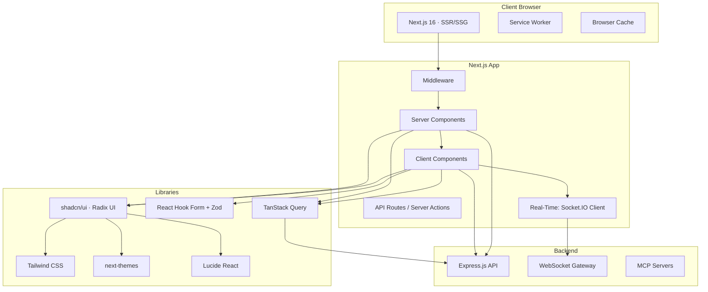
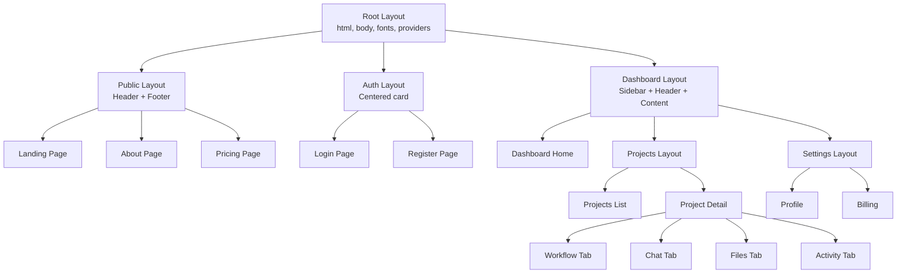
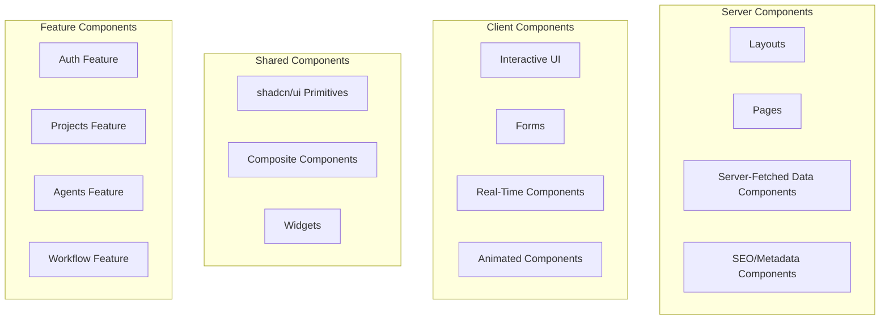
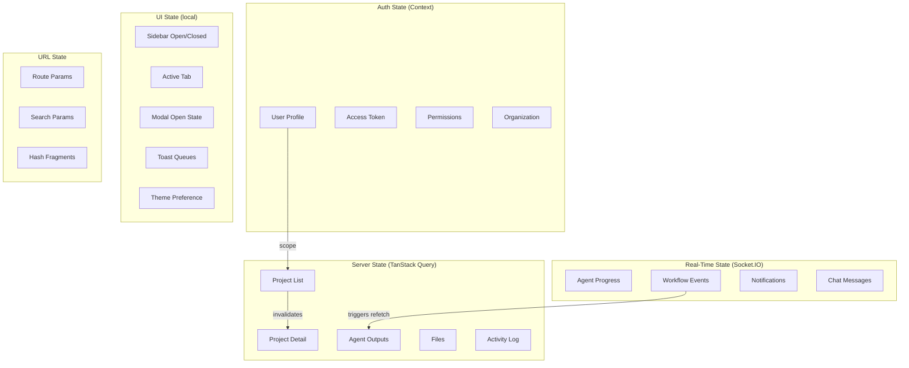
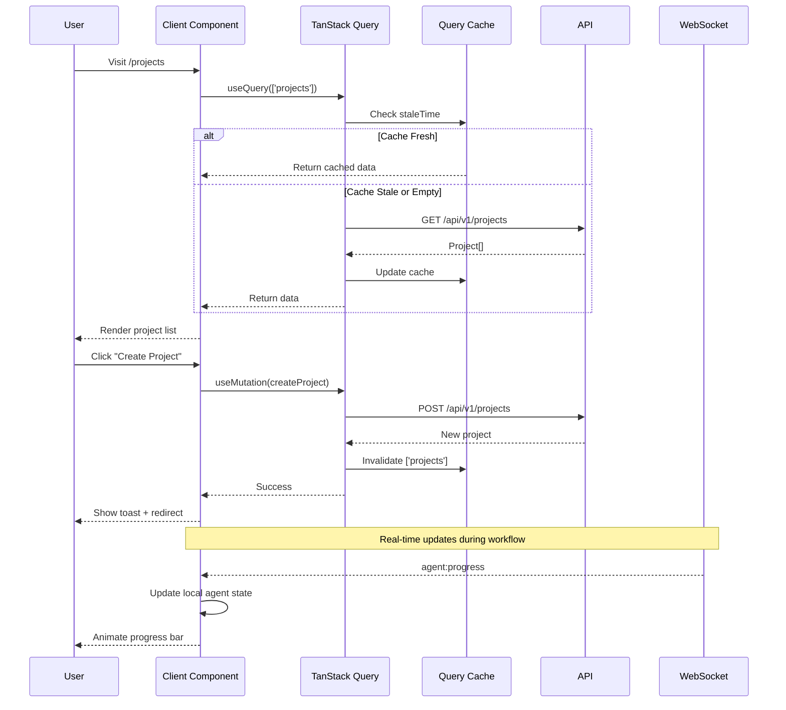
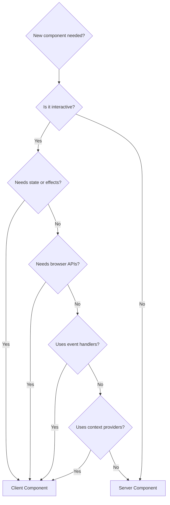
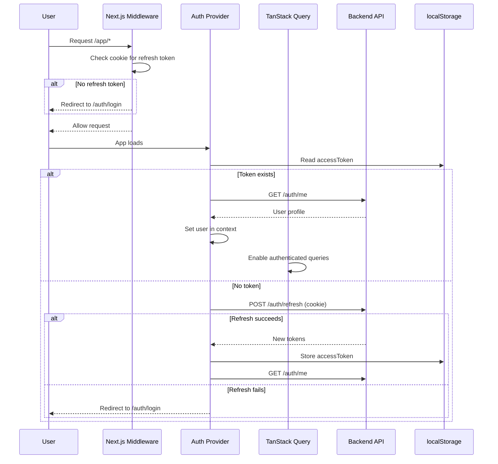
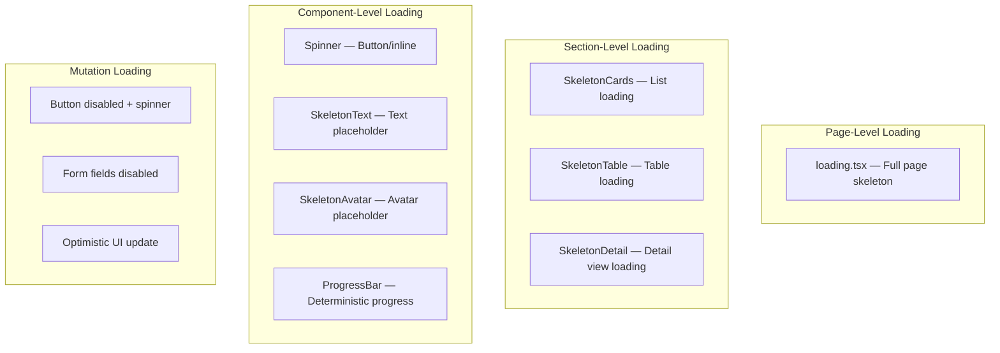
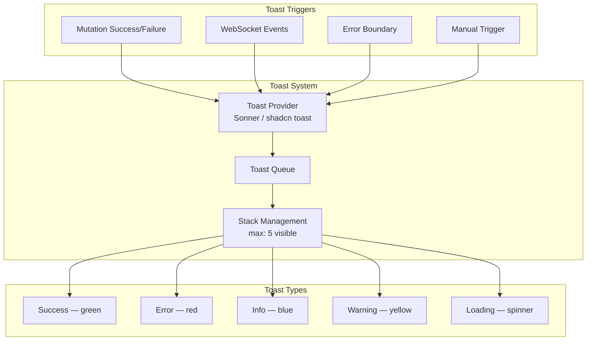
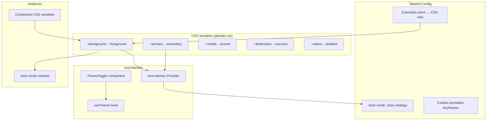

# Frontend Architecture

## Overview

Production-grade Next.js 16 frontend for the AI Software Company — a multi-agent AI orchestration SaaS platform. The architecture prioritises server-first rendering, feature-based organisation, real-time AI streaming, and enterprise-grade UX patterns.

### Architecture Tenets

| Tenet | Application |
|-------|-------------|
| **Server-First** | Default to Server Components; `'use client'` only for interactivity |
| **Feature Isolation** | Every domain owns its components, hooks, types, and API queries |
| **Real-Time First** | Socket.IO for live agent progress; SSE fallback |
| **Progressive Enhancement** | Skeleton → data → interactive — never flash of loading |
| **Accessibility Built-In** | WCAG 2.1 AA; keyboard nav; screen reader support |
| **Optimistic UI** | Instant feedback on mutations; TanStack Query background sync |

---

## 1. Frontend Architecture

### 1.1 High-Level Architecture



### 1.2 Layer Architecture

```
┌────────────────────────────────────────────────────────────────────┐
│                        Routing Layer                                │
│  Middleware (auth) · App Router · Route Groups · Parallel Routes   │
├────────────────────────────────────────────────────────────────────┤
│                       Server Component Layer                        │
│  Layouts · Pages · Data Fetching · SEO · Metadata                  │
├────────────────────────────────────────────────────────────────────┤
│                       Client Component Layer                        │
│  Interactive UI · Forms · Real-Time · Event Handlers               │
├────────────────────────────────────────────────────────────────────┤
│                          Feature Layer                              │
│  auth/ · projects/ · agents/ · workflow/ · files/ · settings/     │
├────────────────────────────────────────────────────────────────────┤
│                          Shared Layer                               │
│  UI Components · Hooks · Providers · API Client · Types · Utils   │
├────────────────────────────────────────────────────────────────────┤
│                        External Layer                               │
│  Express API · WebSocket · MCP Servers · Stripe                     │
└────────────────────────────────────────────────────────────────────┘
```

---

## 2. App Router Structure

### 2.1 Route Tree

```
/                              → Landing Page (public)
/about                         → About Page (public)
/pricing                       → Pricing Page (public)
/contact                       → Contact Page (public)

/auth                          → (auth) route group
  /login                       → Login Page
  /register                    → Register Page
  /forgot-password             → Forgot Password Page
  /reset-password              → Reset Password Page
  /verify-email                → Verify Email Page

/app                           → (dashboard) route group — requires auth
  /                            → Dashboard Home
  /projects                    → Projects List
  /projects/[id]               → Project Detail
  /projects/[id]/workflow      → AI Workflow View
  /projects/[id]/chat          → AI Chat / Conversation
  /projects/[id]/files         → Generated Files
  /projects/[id]/activity      → Project Activity Log

  /agents                      → Agents Overview
  /agents/[slug]               → Agent Detail & History

  /notifications               → Notifications Center

  /settings                    → Settings
  /settings/profile            → User Profile
  /settings/billing            → Billing (future)
  /settings/team               → Team Management (future)
  /settings/organization       → Organization Settings (future)

  /admin                       → Admin Panel (future)
```

### 2.2 Route Hierarchy Diagram

```mermaid
graph TB
    ROOT[/] --> LANDING[Landing Page]
    ROOT --> ABOUT[/about]
    ROOT --> PRICING[/pricing]
    ROOT --> CONTACT[/contact]

    ROOT --> AUTH_GROUP[(auth)]
    AUTH_GROUP --> LOGIN[/auth/login]
    AUTH_GROUP --> REGISTER[/auth/register]
    AUTH_GROUP --> FORGOT[/auth/forgot-password]
    AUTH_GROUP --> RESET[/auth/reset-password]
    AUTH_GROUP --> VERIFY[/auth/verify-email]

    ROOT --> DASH_GROUP[(dashboard)]
    DASH_GROUP --> DASH[/app]
    DASH_GROUP --> PROJECTS[/app/projects]
    PROJECTS --> PROJ_DETAIL[/app/projects/id]
    PROJ_DETAIL --> WORKFLOW[/app/projects/id/workflow]
    PROJ_DETAIL --> CHAT[/app/projects/id/chat]
    PROJ_DETAIL --> FILES[/app/projects/id/files]
    PROJ_DETAIL --> ACTIVITY[/app/projects/id/activity]

    DASH_GROUP --> AGENTS[/app/agents]
    AGENTS --> AGENT_DETAIL[/app/agents/slug]

    DASH_GROUP --> NOTIF[/app/notifications]
    DASH_GROUP --> SETTINGS[/app/settings]
    SETTINGS --> PROFILE[/app/settings/profile]
    SETTINGS --> BILLING[/app/settings/billing]
    SETTINGS --> TEAM[/app/settings/team]

    DASH_GROUP --> ADMIN[/app/admin]
```

---

## 3. Route Groups

### 3.1 Route Group Strategy

| Route Group | Directory | Purpose | Layout |
|-------------|-----------|---------|--------|
| Public | `(public)` | Landing, about, pricing, contact | Minimal header + footer |
| Auth | `(auth)` | Login, register, password flows | Centered card layout |
| Dashboard | `(dashboard)` | All authenticated pages | Sidebar + header + content |
| Settings | `(settings)` | Profile, billing, team | Settings sidebar + content |

### 3.2 Route Group Files

```
app/
  (public)/
    layout.tsx          # Public layout (header, footer)
    page.tsx            # Landing page
    about/page.tsx
    pricing/page.tsx
    contact/page.tsx

  (auth)/
    layout.tsx          # Centered auth layout
    login/page.tsx
    register/page.tsx
    forgot-password/page.tsx
    reset-password/page.tsx
    verify-email/page.tsx

  (dashboard)/
    layout.tsx          # Dashboard layout (sidebar + header)
    page.tsx            # Dashboard home
    projects/
    agents/
    notifications/
    settings/
    admin/
```

### 3.3 Middleware Route Protection

| Path Pattern | Auth Required | Redirect |
|-------------|---------------|----------|
| `/app/*` | Yes | `/auth/login` if unauthenticated |
| `/auth/*` | No | `/app` if already authenticated |
| `/` (public) | No | — |
| `/api/*` | Varies | 401 if token invalid |

---

## 4. Layout Strategy

### 4.1 Layout Hierarchy



### 4.2 Layout Components

| Layout File | Responsibility | Type |
|-------------|---------------|------|
| `app/layout.tsx` | HTML shell, fonts, metadata, providers | Server |
| `app/(public)/layout.tsx` | Public header + footer | Server |
| `app/(auth)/layout.tsx` | Centered card wrapper | Server |
| `app/(dashboard)/layout.tsx` | Sidebar + header + content area | Server |
| `app/(dashboard)/projects/layout.tsx` | Projects sub-navigation | Server |
| `app/(dashboard)/projects/[id]/layout.tsx` | Project tabs navigation | Server |
| `app/(dashboard)/settings/layout.tsx` | Settings sidebar navigation | Server |

---

## 5. Component Architecture

### 5.1 Component Types



### 5.2 Component Decision Tree

```
Need a new component?
  │
  ├── Does it fetch data? ──→ Server Component
  │     │
  │     └── Does the data change frequently? ──→ Client Component (+ TanStack Query)
  │
  ├── Does it handle user events? ──→ Client Component
  │     │
  │     └── Is it a form? ──→ Client Component (+ React Hook Form)
  │
  ├── Does it use browser APIs? ──→ Client Component
  │
  ├── Does it need real-time updates? ──→ Client Component (+ Socket.IO)
  │
  └── None of the above? ──→ Server Component (default)
```

### 5.3 Component Composition Pattern

```
┌──────────────────────────────────────────────┐
│  Page (Server Component)                      │
│  ┌──────────────────────────────────────────┐ │
│  │  Layout (Server)                         │ │
│  │  ┌──────────────────────────────────────┐│ │
│  │  │  Data Section (Server)               ││ │
│  │  │  ┌──────────┐  ┌──────────────────┐  ││ │
│  │  │  │ Card (SC) │  │ List (SC → CC)   │  ││ │
│  │  │  └──────────┘  └──────────────────┘  ││ │
│  │  └──────────────────────────────────────┘│ │
│  │  ┌──────────────────────────────────────┐│ │
│  │  │  Interactive Section (Client)        ││ │
│  │  │  ┌──────────┐  ┌──────────────────┐  ││ │
│  │  │  │ Form(CC) │  │ Approval Panel   │  ││ │
│  │  │  │          │  │ (Client + WS)     │  ││ │
│  │  │  └──────────┘  └──────────────────┘  ││ │
│  │  └──────────────────────────────────────┘│ │
│  └──────────────────────────────────────────┘ │
└──────────────────────────────────────────────┘
```

---

## 6. Feature-Based Organization

### 6.1 Feature Module Structure

Each feature follows a consistent internal structure:

```
features/{feature}/
  components/       # Feature-specific components
    {Component}.tsx
  hooks/            # Feature-specific hooks
    use-{hook}.ts
  api/              # API query/mutation definitions
    queries.ts
    mutations.ts
    keys.ts
  schemas/          # Zod schemas (shared from @aisoftco/shared)
  types/            # Feature-specific types
    index.ts
  utils/            # Feature-specific utilities
    {util}.ts
  index.ts          # Public barrel exports
```

### 6.2 Feature List

| Feature | Slug | Description |
|---------|------|-------------|
| Landing | `landing` | Public marketing pages |
| Auth | `auth` | Login, register, password flows |
| Dashboard | `dashboard` | Home page with summary |
| Projects | `projects` | Project CRUD, list, detail |
| Agents | `agents` | Agent registry and history |
| Workflow | `workflow` | AI pipeline execution view |
| Chat | `chat` | Agent conversation interface |
| Files | `files` | Generated file browser |
| Activity | `activity` | Project activity log |
| Notifications | `notifications` | Notification center |
| Settings | `settings` | User and app settings |
| Admin | `admin` | Admin panel (future) |

---

## 7. State Management Strategy

### 7.1 State Layers



### 7.2 State Management Decisions

| State Category | Tool | Scope | Persistence | Rationale |
|---------------|------|-------|-------------|-----------|
| Server data | TanStack Query | Global cache | In-memory + staleTime | Automatic refetch, cache invalidation, deduplication |
| Auth session | React Context + localStorage | App-wide | localStorage (tokens) | Token hydration on reload |
| Real-time events | Socket.IO | Per-connection | In-memory only | Ephemeral by nature |
| Form state | React Hook Form | Component-scoped | None | Local to form lifecycle |
| UI state (toggles) | `useState` / `useReducer` | Component-scoped | None | Ephemeral UI decisions |
| Theme | `next-themes` | App-wide | localStorage | Persist user preference |
| URL state | `useParams` / `useSearchParams` | Route-scoped | URL bar | Shareable, bookmarkable |

### 7.3 State Flow Diagram



---

## 8. Data Fetching Strategy

### 8.1 Fetching Patterns by Component Type

| Component Type | Fetching Pattern | Caching | Revalidation |
|---------------|------------------|---------|-------------|
| Server Component page | `async function Page() { const data = await fetch() }` | HTTP cache | On request |
| Server Component layout | Same as page | HTTP cache | On navigation |
| Client Component (static) | `useQuery` with `staleTime: Infinity` | TanStack Query | Manual refetch |
| Client Component (dynamic) | `useQuery` with `staleTime: 30s` | TanStack Query | Background refetch |
| Infinite list | `useInfiniteQuery` with cursor | TanStack Query | On scroll |
| Mutation → refetch | `useMutation` + `invalidateQueries` | TanStack Query | On success |
| Real-time data | Socket.IO event → local state | In-memory | On event |

### 8.2 Query Key Convention

```typescript
// Query keys follow a hierarchical pattern:
const queryKeys = {
  projects: {
    all: ['projects'] as const,
    list: (filters: ProjectFilters) => ['projects', 'list', filters] as const,
    detail: (id: string) => ['projects', 'detail', id] as const,
    activity: (id: string) => ['projects', 'activity', id] as const,
    files: (id: string) => ['projects', 'files', id] as const,
  },
  agents: {
    all: ['agents'] as const,
    detail: (slug: string) => ['agents', 'detail', slug] as const,
    executions: (slug: string) => ['agents', 'executions', slug] as const,
  },
  workflows: {
    detail: (id: string) => ['workflows', 'detail', id] as const,
    timeline: (id: string) => ['workflows', 'timeline', id] as const,
  },
  conversations: {
    messages: (executionId: string) => ['conversations', 'messages', executionId] as const,
  },
  notifications: {
    all: ['notifications'] as const,
    unread: ['notifications', 'unread'] as const,
  },
  user: {
    me: ['user', 'me'] as const,
    settings: ['user', 'settings'] as const,
  },
};
```

### 8.3 Mutation → Invalidation Map

| Mutation | Invalidates |
|----------|-------------|
| `createProject` | `['projects', 'list']`, `['projects', 'all']` |
| `updateProject` | `['projects', 'detail', id]`, `['projects', 'list']` |
| `deleteProject` | `['projects', 'list']`, `['projects', 'all']` |
| `startWorkflow` | `['workflows', 'detail', id]` |
| `approveExecution` | `['workflows', 'detail']`, `['projects', 'detail', id]` |
| `sendMessage` | `['conversations', 'messages', executionId]` |
| `markNotificationRead` | `['notifications', 'all']`, `['notifications', 'unread']` |
| `updateProfile` | `['user', 'me']` |

---

## 9. Server Components Strategy

### 9.1 When to Use Server Components



### 9.2 Server Component Patterns

| Pattern | Usage | Example |
|---------|-------|---------|
| **Page Shell** | Layout wrapper, metadata, SEO | `app/projects/[id]/page.tsx` |
| **Data Fetching** | Fetch and render initial data | `async function ProjectList()` |
| **Static Content** | Marketing pages, documentation | Landing page, about page |
| **Composition** | Pass data to client children | `<ProjectCard project={data} />` |
| **Parallel Fetching** | Multiple independent fetches | `const [a, b] = await Promise.all([...])` |

### 9.3 Server Component Data Fetching Pattern

```
Server Component Page:
  1. Parallel fetch all required data
  2. Render layout shell
  3. Pass data as props to client components
  4. Client components add interactivity

Benefits:
  - Data fetched on server (no API call from client)
  - SEO metadata rendered server-side
  - Smaller client bundle (component is pure markup)
  - Faster initial page load
```

---

## 10. Client Components Strategy

### 10.1 When to Use Client Components

| Scenario | Example | Reason |
|----------|---------|--------|
| User input | Forms, search bars | `onChange`, `onSubmit` handlers |
| Real-time updates | Agent progress, chat | Socket.IO subscriptions |
| Animations | Progress bars, transitions | `useState`, `useEffect` |
| Browser APIs | localStorage, clipboard | `window` object access |
| Context consumers | Theme toggle, auth state | `useContext` hook |
| Stateful UI | Accordions, tabs, modals | `useState` for open/close |

### 10.2 Client Component Boundary Guidelines

```
❌ BAD — Entire page as Client Component:
'use client';
function ProjectPage() {
  const [data, setData] = useState(null);
  useEffect(() => { fetch('/api/projects').then(setData); }, []);
  return <div>{...}</div>;
}

✅ GOOD — Server shell with client islands:
// Server Component (page.tsx)
async function ProjectPage() {
  const project = await getProject(id);
  return (
    <div>
      <ProjectHeader project={project} />          {/* Server */}
      <AgentProgress executionId={project.execId} /> {/* Client */}
      <ProjectFiles files={project.files} />        {/* Server */}
      <ApprovalPanel executionId={project.execId} />  {/* Client */}
    </div>
  );
}
```

### 10.3 Client Component Optimization Rules

| Rule | Rationale |
|------|-----------|
| Push `'use client'` as deep as possible | Minimize client JS bundle |
| Pass serializable data as props | Avoid passing functions/classes across boundary |
| Wrap heavy third-party libs in dynamic imports | `next/dynamic` with `ssr: false` |
| Use `React.memo` on expensive renders | Prevent re-renders from parent state changes |
| Keep context providers minimal | Every consumer re-renders on context change |

---

## 11. Authentication Flow

### 11.1 Auth Architecture



### 11.2 Auth State Shape

```typescript
interface AuthState {
  user: User | null;
  accessToken: string | null;
  isAuthenticated: boolean;
  isVerifying: boolean;     // Initial token validation
  organization: Organization | null;
  permissions: string[];    // Computed permission list
}

interface AuthActions {
  login: (email: string, password: string) => Promise<void>;
  register: (data: RegisterInput) => Promise<void>;
  logout: () => Promise<void>;
  refreshToken: () => Promise<string | null>;
  updateProfile: (data: Partial<User>) => void;
}
```

### 11.3 Auth UI States

| State | Visual | User Can |
|-------|--------|----------|
| `loading` | Full-page skeleton | Nothing |
| `unauthenticated` | Login form | Login or register |
| `authenticated` | Dashboard | Access all app features |
| `token_expired` | Inline toast | Click to re-authenticate |
| `error` | Error alert | Retry or contact support |

---

## 12. Authorization UI

### 12.1 Permission-Based Rendering

```typescript
// Authorized components based on user permissions
function Authorized({
  permission,        // Required permission
  fallback,          // Optional fallback UI (default: null)
  children,
}: {
  permission: string;
  fallback?: ReactNode;
  children: ReactNode;
}) {
  const { permissions } = useAuth();
  if (!permissions.includes(permission)) return fallback ?? null;
  return <>{children}</>;
}
```

### 12.2 UI Authorization Rules

| Permission | UI Element | Unauthorized Behavior |
|------------|------------|----------------------|
| `project:delete` | Delete button | Hidden |
| `project:create` | Create button | Hidden |
| `team:manage` | Team settings tab | Tab not rendered |
| `billing:view` | Billing section | Section not rendered |
| `admin:access` | Admin nav item | Nav item not shown |
| `agent:approve` | Approve/Reject buttons | Read-only view |

---

## 13. Form Architecture

### 13.1 Form Pattern

Every form follows a consistent structure:

```
Form Component (Client)
  ├── useForm (React Hook Form) — form state management
  ├── zodResolver — Zod schema for validation
  ├── shadcn/ui Form Controls — Input, Select, Textarea
  └── useMutation — TanStack Query for submission
```

### 13.2 Form Components Inventory

| Form | Schema | Fields | Mutation |
|------|--------|--------|----------|
| `LoginForm` | `loginSchema` | email, password | `useLogin` |
| `RegisterForm` | `registerSchema` | email, password, name | `useRegister` |
| `ForgotPasswordForm` | `forgotPasswordSchema` | email | `useForgotPassword` |
| `ResetPasswordForm` | `resetPasswordSchema` | token, password | `useResetPassword` |
| `CreateProjectForm` | `createProjectSchema` | title, description, techStack, priority | `useCreateProject` |
| `EditProjectForm` | `editProjectSchema` | title, description, priority | `useUpdateProject` |
| `ProfileForm` | `updateProfileSchema` | name, preferences | `useUpdateProfile` |
| `ChangePasswordForm` | `changePasswordSchema` | currentPassword, newPassword | `useChangePassword` |
| `SettingsForm` | `updateSettingsSchema` | theme, locale, notifications | `useUpdateSettings` |
| `FeedbackForm` | `feedbackSchema` | comment, specificIssues | `useSubmitFeedback` |

### 13.3 Form Submission States

| State | UI | Behaviour |
|-------|-----|-----------|
| `idle` | Form fields enabled | User can fill and submit |
| `submitting` | Submit button disabled + spinner | Mutation in flight |
| `success` | Toast notification + form reset/redirect | Cache invalidation |
| `error` | Inline error alert | Form remains filled, user can retry |
| `validation_error` | Field-level error messages | Focus on first errored field |

---

## 14. Validation Strategy

### 14.1 Validation Architecture

```mermaid
graph TB
    subgraph "Server (Backend)"
        S1[Zod Schema (shared)]
        S2[API Validation Middleware]
    end

    subgraph "Shared Package"
        SH1[Zod Schemas]
        SH2[TypeScript Types]
    end

    subgraph "Client (Frontend)"
        C1[React Hook Form + zodResolver]
        C2[Client-Side Validation]
        C3[Inline Errors]
    end

    SH1 --> S1
    SH1 --> C1
    S1 --> S2
    C1 --> C2
    C2 --> C3
    C2 -->|Submit| S2
```

### 14.2 Validation Rules

| Rule | Frontend | Backend |
|------|----------|---------|
| Required fields | Client-side blur + submit | Server-side body parse |
| Format validation | Real-time on input | On request |
| Business rules | Async validation optional | Always enforced |
| Cross-field validation | On submit | On request |
| File upload validation | Before upload (size, type) | On upload |

---

## 15. Error Handling

### 15.1 Error Boundary Hierarchy

```mermaid
graph TB
    ROOT[Root Error Boundary<br/>app/error.tsx] --> LAYOUT[Layout Error Boundary<br/>app/(dashboard)/error.tsx]
    ROOT --> AUTH[AUTH Error Boundary<br/>app/(auth)/error.tsx]

    LAYOUT --> PROJ[Projects Error Boundary<br/>app/projects/error.tsx]
    LAYOUT --> SETT[Settings Error Boundary<br/>app/settings/error.tsx]

    PROJ --> PROJ_DETAIL[Project Detail Error<br/>app/projects/[id]/error.tsx]
    PROJ_DETAIL --> WORKFLOW[Workflow Error<br/>app/projects/[id]/workflow/error.tsx]
```

### 15.2 Error Types and UI

| Error Type | Source | User Action | UI Component |
|-----------|--------|-------------|-------------|
| `VALIDATION_ERROR` | Form submission | Fix input | Inline field errors |
| `UNAUTHORIZED` | Expired token | Re-login | Auth modal → redirect |
| `FORBIDDEN` | Permission denied | Contact support | Inline alert |
| `NOT_FOUND` | Invalid URL | Navigate away | `not-found.tsx` |
| `RATE_LIMITED` | Too many requests | Wait | Toast with countdown |
| `NETWORK_ERROR` | Connection lost | Retry | Banner + retry button |
| `SERVER_ERROR` | Backend crash | Retry later | Error boundary page |

### 15.3 Error UI Components

| Component | Purpose | When to Show |
|-----------|---------|-------------|
| `ErrorBoundary` | Catch React render errors | Unexpected crashes |
| `ErrorPage` | Full-page error with retry | Route-level errors |
| `ErrorAlert` | Inline error in card/section | Data fetch failures |
| `ErrorToast` | Transient error notification | Non-blocking errors |
| `NotFoundPage` | 404 page | Invalid routes |
| `OfflineBanner` | Network connectivity banner | `navigator.onLine` change |

---

## 16. Loading Strategy

### 16.1 Loading State Hierarchy



### 16.2 Loading Strategy by Route Segment

| Route Segment | Loading File | Content |
|---------------|-------------|---------|
| `app/(public)` | None | Minimal — static pages |
| `app/(auth)` | `loading.tsx` | Centered spinner |
| `app/(dashboard)` | `loading.tsx` | Dashboard skeleton |
| `app/projects` | `loading.tsx` | Project cards skeleton grid |
| `app/projects/[id]` | `loading.tsx` | Detail view skeleton |
| `app/projects/[id]/workflow` | `loading.tsx` | Workflow skeleton |
| `app/agents` | `loading.tsx` | Agent cards skeleton |
| `app/notifications` | `loading.tsx` | Notification list skeleton |
| `app/settings` | `loading.tsx` | Settings form skeleton |

---

## 17. Skeleton Strategy

### 17.1 Skeleton Component Inventory

| Skeleton | Shape | Usage |
|----------|-------|-------|
| `SkeletonText` | Horizontal bar | Headings, paragraphs |
| `SkeletonCard` | Card outline | Project cards, agent cards |
| `SkeletonAvatar` | Circle | User avatars |
| `SkeletonTable` | Row + columns | Data tables |
| `SkeletonChart` | Bar/line placeholder | Charts |
| `SkeletonTimeline` | Vertical line + dots | Timeline views |
| `SkeletonForm` | Input + label placeholders | Form pages |
| `SkeletonDetail` | Full detail page | Project/agent detail |

### 17.2 Skeleton Pattern

```typescript
// Every data-displaying component has a matching skeleton
// Convention: {Component}Skeleton

// Example usage:
function Page() {
  const { data, isLoading } = useProjects();
  if (isLoading) return <ProjectCardSkeleton count={6} />;
  return <ProjectCardList projects={data} />;
}
```

---

## 18. Empty State Strategy

### 18.1 Empty State Components

| Empty State | Illustration | Message | Action |
|-------------|-------------|---------|--------|
| No projects | Document icon | "No projects yet" | "Create your first project" |
| No notifications | Bell icon | "All caught up" | — |
| No activity | Clock icon | "No activity yet" | "Start a workflow" |
| No files | File icon | "No files generated" | "Run the pipeline" |
| No agents | Bot icon | "No agents available" | — |
| No search results | Search icon | "No results found" | "Try different keywords" |
| No messages | Chat icon | "No messages" | "Start a conversation" |

### 18.2 Empty State Pattern

```typescript
// Components show empty state when data is an empty array
function ProjectList({ projects }: { projects: Project[] }) {
  if (projects.length === 0) {
    return (
      <EmptyState
        icon={<FilePlus />}
        title="No projects yet"
        description="Create your first project to start building with AI."
        action={<Button onClick={handleCreate}>Create Project</Button>}
      />
    );
  }
  return <ProjectCards projects={projects} />;
}
```

---

## 19. Toast Notification Strategy

### 19.1 Toast Architecture



### 19.2 Toast Events

| Event | Type | Duration | Dismissible | Action |
|-------|------|----------|-------------|--------|
| Project created | success | 4s | Yes | "View" link |
| Project deleted | success | 4s | Yes | "Undo" button |
| Workflow started | info | 6s | Yes | "View progress" |
| Agent needs approval | info | Persistent | Yes | "Review" button |
| Approval submitted | success | 4s | Yes | — |
| File uploaded | success | 4s | Yes | — |
| Error occurred | error | 8s | Yes | "Retry" button |
| Network offline | warning | Persistent | No | — |
| Token expiring | warning | 10s | Yes | "Refresh" button |
| Rate limited | error | Countdown | Yes | — |

---

## 20. Modal/Dialog Strategy

### 20.1 Dialog Components

| Dialog | Trigger | Content | Type |
|--------|---------|---------|------|
| `LoginDialog` | "Login" button | Login form | Modal |
| `CreateProjectDialog` | "New Project" button | Create project form | Modal |
| `ConfirmDeleteDialog` | Delete button | Confirmation message | Alert dialog |
| `ApproveConfirmDialog` | Approve button | Output preview + confirm | Modal |
| `RejectDialog` | Reject button | Feedback form | Modal |
| `ImagePreviewDialog` | Avatar/file thumbnail | Full-size image | Modal |
| `AgentOutputDialog` | Output row click | Full output content | Side drawer |
| `FilePreviewDialog` | File row click | File content preview | Side drawer |

### 20.2 Dialog Pattern

```typescript
// Every dialog follows the same pattern:
// 1. Trigger button in parent
// 2. Dialog component with open/close state
// 3. Form/confirmation inside dialog
// 4. onSuccess callback for parent actions

// Dialog types:
// - Modal: Centered overlay, blocks background interaction
// - AlertDialog: Confirmation with danger actions
// - Sheet: Slide-in panel from right side
// - Drawer: Slide-in panel from bottom (mobile)
```

---

## 21. Accessibility Strategy

### 21.1 WCAG Compliance Targets

| Criterion | Level | Implementation |
|-----------|-------|----------------|
| Perceivable | AA | Proper contrast, alt text, captions |
| Operable | AA | Keyboard navigation, no keyboard traps |
| Understandable | AA | Clear labels, error messages, consistent nav |
| Robust | AA | Semantic HTML, ARIA attributes, screen reader tested |

### 21.2 Accessibility Checklist

| Requirement | Check | Tool |
|-------------|-------|------|
| Semantic HTML | All `<nav>`, `<main>`, `<aside>`, `<section>` correctly used | Manual review |
| Heading hierarchy | No skipped levels (`h1 → h2 → h3`) | axe DevTools |
| Alt text on images | Every `<Image>` has `alt` prop | ESLint `jsx-a11y` |
| ARIA labels | Interactive elements have `aria-label` when no visible text | axe DevTools |
| Keyboard navigation | All actions accessible via Tab + Enter + Escape | Manual testing |
| Focus management | Modal focus trap, focus restoration on close | Manual testing |
| Color contrast | Text meets 4.5:1 ratio, large text 3:1 | Contrast checker |
| Reduced motion | `prefers-reduced-motion` respected | CSS media query |
| Screen reader | Announcements via `aria-live` regions | VoiceOver / NVDA |
| Error announcements | Form errors announced via `aria-describedby` | Screen reader test |

### 21.3 Radix UI Accessibility

shadcn/ui components (built on Radix UI) provide built-in accessibility:

| Component | Accessibility Features |
|-----------|----------------------|
| `Dialog` | Focus trap, `Escape` to close, `aria-modal`, role="dialog" |
| `DropdownMenu` | Arrow key navigation, `aria-orientation`, role="menu" |
| `Tabs` | Arrow key switching, `aria-selected`, role="tablist" |
| `Accordion` | `aria-expanded`, `aria-controls`, role="region" |
| `AlertDialog` | Focus trap, description read by screen reader |
| `Sheet` | Focus trap, `Escape` to close, `aria-modal` |
| `Select` | Combobox pattern, `aria-expanded`, list navigation |

---

## 22. Responsive Design Strategy

### 22.1 Breakpoint Strategy

| Breakpoint | Width | Target | Layout Changes |
|------------|-------|--------|----------------|
| `xs` | < 640px | Mobile phones | Single column, bottom nav, full-width cards |
| `sm` | 640px | Large phones | Single column, sidebar hidden |
| `md` | 768px | Tablets | Two-column layouts, sidebar as overlay |
| `lg` | 1024px | Small desktops | Sidebar visible, multi-column grids |
| `xl` | 1280px | Desktops | Full layout, side panels visible |
| `2xl` | 1536px | Large screens | Max-width container, wider sidebars |

### 22.2 Responsive Patterns

| Pattern | Mobile | Desktop |
|---------|--------|---------|
| Sidebar | Hidden (hamburger toggle) | Fixed left panel |
| Navigation | Bottom tab bar | Top header + sidebar |
| Data tables | Card list | Full table |
| Project grid | Single column | 2-3 column grid |
| Agent monitor | Full width | Side panel |
| Dialogs | Full-screen drawer | Centered modal |
| Forms | Single column | Two columns |
| Settings | Single page | Sidebar + content |

---

## 23. Theme Strategy

### 23.1 Theme Architecture



### 23.2 Theme System

| Token | Light | Dark | Used By |
|-------|-------|------|---------|
| `--background` | white | `#09090b` | Page backgrounds |
| `--foreground` | `#09090b` | white | Text color |
| `--primary` | Blue 600 | Blue 400 | Buttons, links |
| `--secondary` | Gray 100 | Gray 800 | Secondary buttons |
| `--muted` | Gray 50 | Gray 900 | Muted backgrounds |
| `--muted-foreground` | Gray 500 | Gray 400 | Muted text |
| `--accent` | Gray 100 | Gray 800 | Accent backgrounds |
| `--destructive` | Red 600 | Red 500 | Delete actions |
| `--success` | Green 600 | Green 500 | Success states |
| `--warning` | Amber 500 | Amber 400 | Warning states |
| `--border` | Gray 200 | Gray 800 | Borders |
| `--input` | Gray 200 | Gray 800 | Form inputs |
| `--ring` | Blue 400 | Blue 400 | Focus rings |
| `--radius` | `0.5rem` | `0.5rem` | Border radius |

### 23.3 Theme Toggle

| Theme | Preference | Storage |
|-------|------------|---------|
| Light | Default | `localStorage.theme = 'light'` |
| Dark | User selects | `localStorage.theme = 'dark'` |
| System | `prefers-color-scheme` | `localStorage.theme = 'system'` |

---

## 24. SEO Strategy

### 24.1 SEO Metadata Pattern

| Page | Title | Description | Open Graph |
|------|-------|-------------|------------|
| Landing | "AI Software Company" | "From idea to production..." | ✓ |
| About | "About — AI Software Company" | "Our mission..." | ✓ |
| Pricing | "Pricing — AI Software Company" | "Choose your plan..." | ✓ |
| Contact | "Contact — AI Software Company" | "Get in touch..." | ✓ |
| Login | "Sign In — AI Software Company" | "Access your projects..." | — |
| Dashboard | "Dashboard — AI Software Company" | "Your projects overview" | — |
| Project | "{title} — AI Software Company" | "{description}" | — |

### 24.2 SEO Implementation

```typescript
// Page-level metadata (Server Component)
export async function generateMetadata({ params }: Props): Promise<Metadata> {
  const project = await getProject(params.id);
  return {
    title: `${project.title} — AI Software Company`,
    description: project.description,
    openGraph: {
      title: project.title,
      description: project.description,
    },
  };
}
```

---

## 25. Performance Optimization

### 25.1 Performance Budget

| Metric | Target | Measurement |
|--------|--------|-------------|
| First Contentful Paint (FCP) | < 1.5s | Lighthouse |
| Largest Contentful Paint (LCP) | < 2.5s | Lighthouse |
| Time to Interactive (TTI) | < 3.5s | Lighthouse |
| First Input Delay (FID) | < 100ms | Web Vitals |
| Cumulative Layout Shift (CLS) | < 0.1 | Web Vitals |
| JavaScript bundle (initial) | < 200KB | bundle-analyzer |
| Total page weight | < 500KB | Network tab |

### 25.2 Optimization Techniques

| Technique | Applied To | Impact |
|-----------|------------|--------|
| Server Components | All non-interactive parts | -60% client JS |
| Image optimization | `<Image>` with `next/legacy` | -40% image size |
| Font optimization | `next/font` self-hosting | -30% font load |
| Dynamic imports | Charts, code viewer, markdown | -50% initial bundle |
| Route prefetching | `next/link` in viewport | Instant navigation |
| Streaming SSR | `loading.tsx` boundaries | Progressive rendering |
| Static generation | Marketing pages | Instant load |
| ISR | Documentation pages | Periodic rebuild |
| Bundle analysis | `@next/bundle-analyzer` in CI | Prevent bundle bloat |

---

## 26. Code Splitting

### 26.1 Split Points

| Component | Import Strategy | Chunk Name | Rationale |
|-----------|----------------|------------|-----------|
| `WorkflowVisualization` | `next/dynamic` | `workflow-viz` | Heavy D3/large library |
| `TimelineChart` | `next/dynamic` | `timeline-chart` | Chart library heavy |
| `CodePreview` | `next/dynamic` | `code-preview` | Syntax highlighting |
| `MarkdownRenderer` | `next/dynamic` | `markdown` | Large renderer |
| `CommandPalette` | `next/dynamic` | `command` | Modal, not always used |
| `LogsViewer` | `next/dynamic` | `logs-viewer` | Virtualized list |
| `AuthForm` | Route-level | `auth` | Auth pages only |
| `AdminPanel` | Route-level | `admin` | Admin only |

### 26.2 Dynamic Import Pattern

```typescript
// Heavy component loaded only when needed
const WorkflowVisualization = dynamic(
  () => import('@/features/workflow/components/workflow-visualization'),
  {
    loading: () => <WorkflowSkeleton />,
    ssr: false,  // Client-only rendering
  }
);
```

---

## 27. Lazy Loading

### 27.1 Lazy Loading Strategy

| Element | Technique | Trigger |
|---------|-----------|---------|
| Images below fold | `loading="lazy"` on `<Image>` | Scrolls into viewport |
| Infinite scroll lists | `useInfiniteQuery` + IntersectionObserver | Last item visible |
| Tab content | Conditional render | Tab activated |
| Accordion content | Conditional render | Accordion expanded |
| Dropdown/select options | Load on open | Dropdown triggered |
| Side panel content | Load on slide-in | Panel opened |

---

## 28. Image Optimization

### 28.1 Image Strategy

| Image Type | Component | Optimization | Sizing |
|------------|-----------|-------------|--------|
| User avatars | `<Image>` | WebP, lazy | 96x96, 128x128 |
| Project screenshots | `<Image>` | WebP, lazy | 640x480, 1280x720 |
| Landing page hero | `<Image>` | WebP, priority, eager | 1920x1080 |
| Icons | Lucide React | SVG inline | 16-24px |
| Logo | `<Image>` | PNG/SVG, priority | 32x32, 64x64 |
| Agent avatars | Lucide/bot icons | SVG inline | 32-48px |
| Empty state illustrations | `<Image>` | WebP, lazy | 240x240 |

### 28.2 Image Pattern

```typescript
import Image from 'next/image';

// Avatar with correct sizing and lazy loading
<Image
  src={user.avatarUrl}
  alt={`${user.name}'s avatar`}
  width={96}
  height={96}
  className="rounded-full"
  priority={false}
  loading="lazy"
  placeholder="blur"
  blurDataURL="data:image/webp;base64,..."
/>
```

---

## 29. Security Best Practices

### 29.1 Frontend Security

| Practice | Implementation |
|----------|---------------|
| **XSS Prevention** | React's built-in escaping; never use `dangerouslySetInnerHTML` |
| **CSRF Protection** | SameSite cookies for refresh token; `X-CSRF-Token` header for mutations |
| **Token Storage** | Access token in memory (React Context); refresh token in httpOnly cookie |
| **Input Sanitisation** | Zod validation on all form inputs |
| **Content Security Policy** | Set via `next.config.js` headers |
| **HTTPS Only** | Vercel enforces HTTPS; `Strict-Transport-Security` header |
| **No Sensitive Data in URLs** | UUIDs for resource IDs; no tokens in query strings |
| **Environment Variables** | `NEXT_PUBLIC_*` only for public values; secrets server-side only |
| **Dependency Scanning** | `npm audit` in CI; Dependabot alerts |
| **Rate Limit Handling** | Exponential backoff on 429 responses |

### 29.2 CSP Headers

```typescript
// next.config.js
const csp = [
  "default-src 'self'",
  "script-src 'self' 'unsafe-eval' 'unsafe-inline'",  // Next.js needs unsafe-inline
  "style-src 'self' 'unsafe-inline'",                  // Tailwind needs unsafe-inline
  "img-src 'self' data: blob: https://*.vercel.app",
  "font-src 'self'",
  "connect-src 'self' https://api.aisoftco.com wss://api.aisoftco.com",
  "frame-src 'none'",
  "object-src 'none'",
].join('; ');
```

---

## 30. Folder Organization

### 30.1 Complete Folder Structure

```
frontend/
├── app/                              # Next.js App Router pages
│   ├── layout.tsx                    # Root layout (html, body, providers)
│   ├── globals.css                   # Global styles + CSS variables
│   ├── not-found.tsx                 # 404 page
│   ├── error.tsx                     # Root error boundary
│   ├── loading.tsx                   # Root loading state
│   │
│   ├── (public)/                     # Public route group
│   │   ├── layout.tsx                # Public layout (header + footer)
│   │   ├── page.tsx                  # Landing page
│   │   ├── about/page.tsx
│   │   ├── pricing/page.tsx
│   │   └── contact/page.tsx
│   │
│   ├── (auth)/                       # Auth route group
│   │   ├── layout.tsx                # Centered card layout
│   │   ├── login/page.tsx
│   │   ├── register/page.tsx
│   │   ├── forgot-password/page.tsx
│   │   ├── reset-password/page.tsx
│   │   └── verify-email/page.tsx
│   │
│   ├── (dashboard)/                  # Authenticated route group
│   │   ├── layout.tsx                # Dashboard layout (sidebar + header)
│   │   ├── page.tsx                  # Dashboard home
│   │   │
│   │   ├── projects/
│   │   │   ├── layout.tsx            # Projects layout
│   │   │   ├── page.tsx              # Project list
│   │   │   └── [id]/
│   │   │       ├── layout.tsx        # Project tabs layout
│   │   │       ├── page.tsx          # Project detail overview
│   │   │       ├── workflow/page.tsx # AI workflow view
│   │   │       ├── chat/page.tsx     # AI conversation
│   │   │       ├── files/page.tsx    # Generated files
│   │   │       └── activity/page.tsx # Activity log
│   │   │
│   │   ├── agents/
│   │   │   ├── page.tsx              # Agent registry
│   │   │   └── [slug]/
│   │   │       └── page.tsx          # Agent detail + history
│   │   │
│   │   ├── notifications/
│   │   │   └── page.tsx              # Notifications center
│   │   │
│   │   ├── settings/
│   │   │   ├── layout.tsx            # Settings sidebar layout
│   │   │   ├── page.tsx              # General settings
│   │   │   ├── profile/page.tsx      # User profile
│   │   │   ├── billing/page.tsx      # Billing (future)
│   │   │   ├── team/page.tsx         # Team (future)
│   │   │   └── organization/page.tsx # Org settings (future)
│   │   │
│   │   └── admin/
│   │       └── page.tsx              # Admin panel (future)
│   │
│   └── api/                          # API routes / server actions
│       └── auth/
│           └── refresh/route.ts      # Refresh token endpoint
│
├── components/                       # Shared UI components
│   ├── ui/                           # shadcn/ui primitives
│   │   ├── button.tsx
│   │   ├── input.tsx
│   │   ├── card.tsx
│   │   ├── dialog.tsx
│   │   ├── dropdown-menu.tsx
│   │   ├── select.tsx
│   │   ├── tabs.tsx
│   │   ├── toast.tsx
│   │   ├── skeleton.tsx
│   │   ├── badge.tsx
│   │   ├── progress.tsx
│   │   ├── avatar.tsx
│   │   ├── separator.tsx
│   │   └── ...
│   │
│   ├── layout/                       # Layout components
│   │   ├── sidebar.tsx
│   │   ├── header.tsx
│   │   ├── footer.tsx
│   │   ├── breadcrumbs.tsx
│   │   ├── mobile-nav.tsx
│   │   └── dashboard-shell.tsx
│   │
│   ├── data-display/                 # Data display components
│   │   ├── data-table.tsx
│   │   ├── data-grid.tsx
│   │   ├── pagination.tsx
│   │   ├── empty-state.tsx
│   │   ├── status-badge.tsx
│   │   └── metric-card.tsx
│   │
│   ├── feedback/                     # Feedback components
│   │   ├── toast-provider.tsx
│   │   ├── error-boundary.tsx
│   │   ├── error-page.tsx
│   │   ├── error-alert.tsx
│   │   ├── offline-banner.tsx
│   │   └── loading-spinner.tsx
│   │
│   ├── navigation/                   # Navigation components
│   │   ├── nav-item.tsx
│   │   ├── nav-section.tsx
│   │   ├── command-palette.tsx
│   │   ├── search-command.tsx
│   │   └── tab-navigation.tsx
│   │
│   ├── form/                         # Form components
│   │   ├── form-field.tsx
│   │   ├── form-section.tsx
│   │   ├── submit-button.tsx
│   │   └── form-error.tsx
│   │
│   ├── ai/                           # AI-specific components
│   │   ├── agent-status-card.tsx
│   │   ├── agent-progress.tsx
│   │   ├── workflow-visualization.tsx
│   │   ├── approval-dialog.tsx
│   │   ├── agent-timeline.tsx
│   │   ├── conversation-view.tsx
│   │   ├── message-bubble.tsx
│   │   ├── code-preview.tsx
│   │   ├── file-explorer.tsx
│   │   ├── activity-feed.tsx
│   │   └── logs-viewer.tsx
│   │
│   └── shared/                       # Other shared components
│       ├── confirm-dialog.tsx
│       ├── image-upload.tsx
│       ├── avatar-upload.tsx
│       ├── theme-toggle.tsx
│       ├── user-menu.tsx
│       ├── search-input.tsx
│       ├── page-header.tsx
│       ├── section-header.tsx
│       └── loading-overlay.tsx
│
├── features/                         # Feature-based modules
│   ├── auth/
│   │   ├── components/
│   │   │   ├── login-form.tsx
│   │   │   ├── register-form.tsx
│   │   │   ├── forgot-password-form.tsx
│   │   │   ├── reset-password-form.tsx
│   │   │   ├── oauth-buttons.tsx
│   │   │   └── auth-guard.tsx
│   │   ├── hooks/
│   │   │   ├── use-auth.ts
│   │   │   └── use-session.ts
│   │   ├── api/
│   │   │   ├── queries.ts
│   │   │   └── mutations.ts
│   │   ├── schemas/
│   │   │   └── auth-schemas.ts
│   │   ├── types/
│   │   │   └── index.ts
│   │   └── index.ts
│   │
│   ├── projects/
│   │   ├── components/
│   │   │   ├── project-card.tsx
│   │   │   ├── project-list.tsx
│   │   │   ├── project-detail.tsx
│   │   │   ├── create-project-dialog.tsx
│   │   │   ├── edit-project-dialog.tsx
│   │   │   ├── project-status-badge.tsx
│   │   │   ├── project-filters.tsx
│   │   │   └── project-skeleton.tsx
│   │   ├── hooks/
│   │   │   ├── use-projects.ts
│   │   │   ├── use-project.ts
│   │   │   ├── use-create-project.ts
│   │   │   └── use-update-project.ts
│   │   ├── api/
│   │   │   ├── queries.ts
│   │   │   ├── mutations.ts
│   │   │   └── keys.ts
│   │   ├── schemas/
│   │   │   └── project-schemas.ts
│   │   ├── types/
│   │   │   └── index.ts
│   │   └── index.ts
│   │
│   ├── agents/
│   │   ├── components/
│   │   │   ├── agent-card.tsx
│   │   │   ├── agent-list.tsx
│   │   │   ├── agent-detail.tsx
│   │   │   └── agent-status-badge.tsx
│   │   ├── hooks/
│   │   │   ├── use-agents.ts
│   │   │   └── use-agent-executions.ts
│   │   ├── api/
│   │   │   ├── queries.ts
│   │   │   └── keys.ts
│   │   ├── types/
│   │   │   └── index.ts
│   │   └── index.ts
│   │
│   ├── workflow/
│   │   ├── components/
│   │   │   ├── workflow-overview.tsx
│   │   │   ├── step-progress.tsx
│   │   │   ├── approval-panel.tsx
│   │   │   ├── feedback-form.tsx
│   │   │   ├── workflow-timeline.tsx
│   │   │   ├── agent-output-viewer.tsx
│   │   │   └── workflow-actions.tsx
│   │   ├── hooks/
│   │   │   ├── use-workflow.ts
│   │   │   ├── use-workflow-stream.ts
│   │   │   └── use-approval.ts
│   │   ├── api/
│   │   │   ├── queries.ts
│   │   │   └── mutations.ts
│   │   ├── types/
│   │   │   └── index.ts
│   │   └── index.ts
│   │
│   ├── chat/
│   │   ├── components/
│   │   │   ├── conversation-view.tsx
│   │   │   ├── message-list.tsx
│   │   │   ├── message-bubble.tsx
│   │   │   ├── message-input.tsx
│   │   │   ├── tool-call-display.tsx
│   │   │   └── chat-header.tsx
│   │   ├── hooks/
│   │   │   ├── use-conversation.ts
│   │   │   └── use-send-message.ts
│   │   ├── api/
│   │   │   ├── queries.ts
│   │   │   └── mutations.ts
│   │   ├── utils/
│   │   │   └── format-message.ts
│   │   └── index.ts
│   │
│   ├── files/
│   │   ├── components/
│   │   │   ├── file-list.tsx
│   │   │   ├── file-row.tsx
│   │   │   ├── file-preview.tsx
│   │   │   ├── file-upload.tsx
│   │   │   └── file-icon.tsx
│   │   ├── hooks/
│   │   │   ├── use-files.ts
│   │   │   └── use-upload-file.ts
│   │   ├── api/
│   │   │   ├── queries.ts
│   │   │   └── mutations.ts
│   │   └── index.ts
│   │
│   ├── notifications/
│   │   ├── components/
│   │   │   ├── notification-list.tsx
│   │   │   ├── notification-item.tsx
│   │   │   ├── notification-badge.tsx
│   │   │   └── notification-toast.tsx
│   │   ├── hooks/
│   │   │   ├── use-notifications.ts
│   │   │   └── use-unread-count.ts
│   │   ├── api/
│   │   │   ├── queries.ts
│   │   │   └── mutations.ts
│   │   └── index.ts
│   │
│   ├── activity/
│   │   ├── components/
│   │   │   ├── activity-feed.tsx
│   │   │   ├── activity-item.tsx
│   │   │   └── activity-filters.tsx
│   │   ├── hooks/
│   │   │   └── use-activity.ts
│   │   ├── api/
│   │   │   └── queries.ts
│   │   └── index.ts
│   │
│   ├── settings/
│   │   ├── components/
│   │   │   ├── settings-sidebar.tsx
│   │   │   ├── profile-section.tsx
│   │   │   ├── billing-section.tsx
│   │   │   ├── team-section.tsx
│   │   │   ├── notification-preferences.tsx
│   │   │   └── appearance-section.tsx
│   │   ├── hooks/
│   │   │   ├── use-settings.ts
│   │   │   └── use-update-profile.ts
│   │   ├── api/
│   │   │   ├── queries.ts
│   │   │   └── mutations.ts
│   │   └── index.ts
│   │
│   ├── dashboard/
│   │   ├── components/
│   │   │   ├── stats-cards.tsx
│   │   │   ├── recent-activity.tsx
│   │   │   ├── agent-queue-status.tsx
│   │   │   └── quick-actions.tsx
│   │   ├── hooks/
│   │   │   └── use-dashboard.ts
│   │   ├── api/
│   │   │   └── queries.ts
│   │   └── index.ts
│   │
│   └── landing/
│       ├── components/
│       │   ├── hero-section.tsx
│       │   ├── features-section.tsx
│       │   ├── how-it-works.tsx
│       │   ├── pricing-section.tsx
│       │   ├── cta-section.tsx
│       │   └── faq-section.tsx
│       └── index.ts
│
├── hooks/                            # Global shared hooks
│   ├── use-debounce.ts
│   ├── use-intersection-observer.ts
│   ├── use-local-storage.ts
│   ├── use-media-query.ts
│   ├── use-online-status.ts
│   ├── use-scroll-position.ts
│   └── use-keyboard-shortcut.ts
│
├── lib/                              # Core libraries
│   ├── api-client.ts                 # API fetch wrapper
│   ├── socket-client.ts              # Socket.IO client
│   ├── auth-provider.tsx             # Auth context + provider
│   ├── query-provider.tsx            # TanStack Query provider
│   ├── theme-provider.tsx            # next-themes provider
│   ├── socket-provider.tsx           # Socket.IO connection provider
│   ├── toast-provider.tsx            # Toast system provider
│   └── utils.ts                      # cn() helper + misc utils
│
├── providers/                        # App providers composition
│   └── app-providers.tsx             # Composed provider tree
│
├── services/                         # Service layer
│   ├── auth-service.ts               # Auth API calls
│   ├── project-service.ts            # Project API calls
│   ├── workflow-service.ts           # Workflow API calls
│   ├── file-service.ts               # File API calls
│   └── notification-service.ts       # Notification API calls
│
├── types/                            # Global TypeScript types
│   ├── api.ts                        # API response types
│   ├── auth.ts                       # Auth types
│   ├── project.ts                    # Project types
│   ├── agent.ts                      # Agent types
│   ├── workflow.ts                   # Workflow types
│   ├── file.ts                       # File types
│   ├── notification.ts               # Notification types
│   └── common.ts                     # Shared utility types
│
├── constants/                        # App constants
│   ├── routes.ts                     # Route paths
│   ├── api.ts                        # API endpoints
│   ├── agents.ts                     # Agent registry constants
│   └── limits.ts                     # Rate limit / pagination constants
│
├── utils/                            # Global utilities
│   ├── cn.ts                         # clsx + tailwind-merge
│   ├── format.ts                     # Date, number, text formatters
│   ├── validation.ts                 # Shared validation helpers
│   └── auth.ts                       # Auth utility functions
│
├── styles/                           # Styling
│   └── globals.css                   # Tailwind directives + CSS variables
│
├── public/                           # Static assets
│   ├── images/
│   │   ├── logo.svg
│   │   ├── logo-dark.svg
│   │   ├── og-image.png              # Open Graph image
│   │   └── illustrations/
│   └── favicon.ico
│
├── middleware.ts                      # Next.js middleware (auth protection)
├── next.config.ts                    # Next.js configuration
├── tailwind.config.ts                # Tailwind configuration
├── tsconfig.json                     # TypeScript configuration
├── package.json
└── .env.example                      # Environment variable template
```

---

## Summary

| Aspect | Design Decision |
|--------|----------------|
| **Framework** | Next.js 16 App Router — server-first, file-based routing |
| **Component Default** | Server Components everywhere; `'use client'` only for interactivity |
| **Organization** | Feature-based: each domain owns components, hooks, API queries, schemas, types |
| **State Management** | TanStack Query (server) + React Context (auth) + local state (UI) |
| **Real-Time** | Socket.IO for agent progress, chat, notifications |
| **Styling** | Tailwind CSS utility-first + shadcn/ui primitives + CSS variables for theming |
| **Forms** | React Hook Form + Zod resolver (schemas shared via `@aisoftco/shared`) |
| **Accessibility** | WCAG 2.1 AA; Radix UI primitives with built-in a11y |
| **Performance** | Dynamic imports, image optimization, route prefetching, streaming SSR |
| **Security** | CSP headers, httpOnly refresh tokens, Zod validation, no `dangerouslySetInnerHTML` |
| **Error Handling** | Nested error boundaries per route segment; error type → UI component map |
| **Loading** | Per-route `loading.tsx` + skeleton components for every data component |
| **Responsive** | Mobile-first with 6 breakpoints; sidebar collapses to bottom nav on mobile |
| **Folder Structure** | `app/` (pages) + `components/` (shared UI) + `features/` (domain logic) + `lib/` (infrastructure) |
