# MCP Architecture

## Overview

The MCP (Model Context Protocol) architecture provides a standardised, secure, and extensible bridge between AI agents and external systems. Each MCP server encapsulates a specific domain (filesystem, GitHub, database, etc.) and exposes typed tools that agents invoke through the OpenAI Agents SDK. Communication follows the **MCP specification (2025-03-26)** over **JSON-RPC 2.0**.

### Architecture Tenets

| Tenet | Application |
|-------|-------------|
| **Secure by Default** | Every tool call is authenticated, authorised, rate-limited, and audited |
| **Principle of Least Privilege** | Each agent receives only the tools it needs for its domain |
| **Modular Server Isolation** | Each MCP server is independently deployable, testable, and replaceable |
| **Stateless Protocol** | All session state lives in the MCP Client, not in the server |
| **Fail Closed** | Any error, timeout, or auth failure blocks the tool call — no fallback to unsafe behaviour |
| **Observability by Default** | Every tool invocation is logged with agent ID, timing, input, and output |

---

## 1. MCP System Architecture

### 1.1 High-Level Architecture

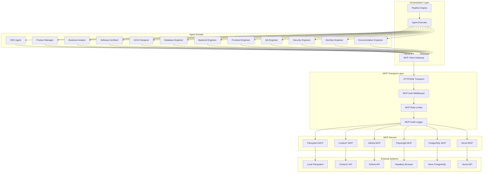

### 1.2 Component Interaction

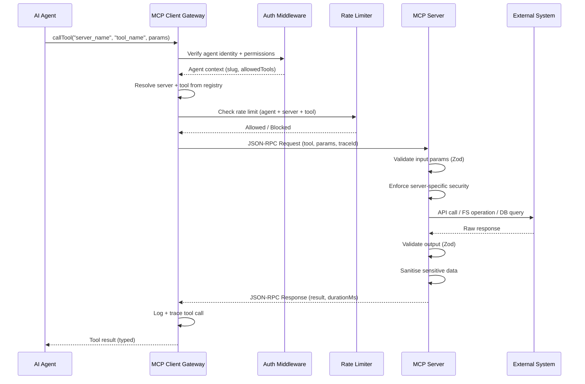

### 1.3 Layer Mapping

```
Agent (OpenAI Agents SDK)
  → MCP Client Gateway (tool routing, auth, rate limiting, logging)
    → HTTP/SSE Transport (JSON-RPC 2.0)
      → MCP Server
        → Tool Registry
          → GitHub Tools
          → Context7 Tools
          → Filesystem Tools
          → Playwright Tools
          → PostgreSQL Tools
          → Vercel Tools
        → Resource Providers
        → Authz Middleware
        → Validation Middleware
```

---

## 2. MCP Server Registry

### 2.1 Server Inventory

| # | Server | Slug | Port | Transport | Language | Status |
|---|--------|------|------|-----------|----------|--------|
| 1 | GitHub MCP | `github` | 3010 | HTTP/SSE | TypeScript | Active |
| 2 | Context7 MCP | `context7` | 3011 | HTTP/SSE | TypeScript | Active |
| 3 | Filesystem MCP | `filesystem` | 3012 | HTTP/SSE + stdio | TypeScript | Active |
| 4 | Playwright MCP | `playwright` | 3013 | HTTP/SSE | TypeScript | Active |
| 5 | PostgreSQL MCP | `postgresql` | 3014 | HTTP/SSE | TypeScript | Active |
| 6 | Vercel MCP | `vercel` | 3015 | HTTP/SSE | TypeScript | Active |

### 2.2 Server Discovery Table

| Property | Details |
|----------|---------|
| Discovery mechanism | Environment variables (`MCP_SERVER_{SLUG}_URL`) |
| Health check | `GET /health` per server returns `{ status: "ok", uptime, version }` |
| Tool listing | `GET /tools` returns registered tool schemas |
| Registration | Static config file: `mcp-servers.json` |
| Startup order | No dependency between servers; all start independently |

### 2.3 Server Configuration Schema

```typescript
interface MCPServerConfig {
  slug: string;                  // Unique server identifier
  name: string;                  // Human-readable name
  version: string;               // Semver
  transport: 'http-sse' | 'stdio';
  baseUrl: string;               // HTTP transport URL
  auth: {
    type: 'api-key' | 'oauth' | 'none';
    credentials: string;         // Resolved from secret store
  };
  rateLimits: {
    global: number;              // Total calls/min for server
    perAgent: number;            // Calls/min per agent
    perTool: Record<string, number>; // Calls/min per specific tool
  };
  timeout: number;               // Default tool timeout (ms)
  retry: {
    maxAttempts: number;
    backoffMs: number;
  };
}
```

---

## 3. MCP Client Architecture

### 3.1 Client Gateway

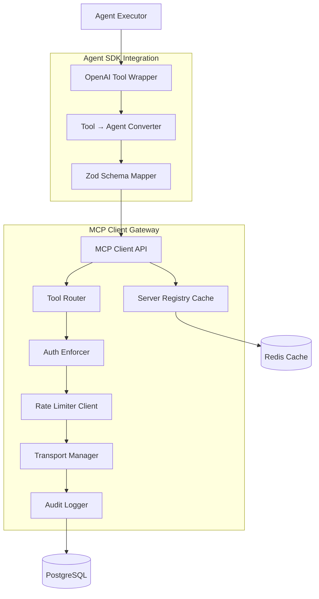

### 3.2 Client Responsibilities

| Responsibility | Implementation |
|----------------|----------------|
| **Tool Routing** | Map `agent.callTool("slug/tool", params)` → correct MCP server |
| **Auth Enforcement** | Verify agent is authorised for the requested tool |
| **Rate Limiting** | Enforce per-agent, per-server, and per-tool rate limits |
| **Connection Pooling** | Maintain persistent HTTP connections to each MCP server |
| **Timeout Management** | Enforce per-tool timeout, cancel stale requests |
| **Retry Logic** | Transparent retry with exponential backoff on transient failures |
| **Response Caching** | Cache idempotent tool responses (Context7, metadata reads) |
| **Audit Logging** | Record every tool call with trace ID, timing, success/failure |
| **Server Health Monitoring** | Track server health, route around degraded servers |
| **Schema Translation** | Convert MCP tool schemas (JSON Schema) to OpenAI Agents SDK Tool objects |

### 3.3 Tool Wrapper Pattern

```typescript
// Every MCP tool is wrapped as an OpenAI Agents SDK Tool
// The translation layer converts JSON-RPC tool definitions to SDK tools

interface MCPToolDefinition {
  serverSlug: string;
  toolName: string;
  description: string;
  inputSchema: z.ZodSchema;       // Zod (converted from JSON Schema)
  outputSchema: z.ZodSchema;
  requiresApproval: boolean;      // Some tools need user confirmation
  permission: string;             // Permission key for authz
  timeout: number;                // Per-tool timeout override
}
```

---

## 4. MCP Connection Lifecycle

### 4.1 Connection States

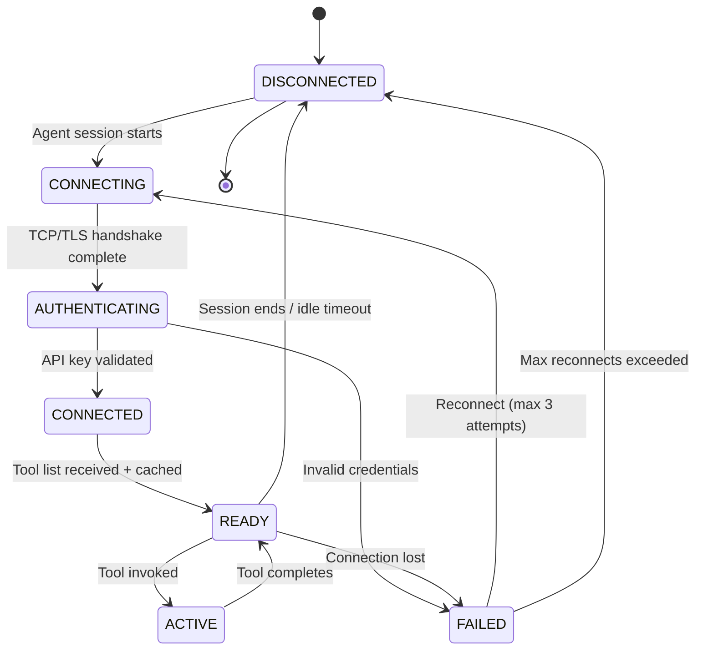

### 4.2 Connection Lifecycle Sequence

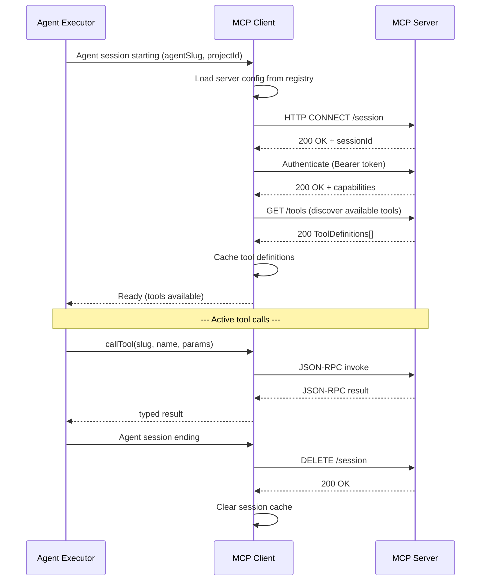

### 4.3 Connection Pool Configuration

| Pool | Max Connections | Idle Timeout | Health Check |
|------|----------------|-------------|--------------|
| GitHub MCP | 5 | 60s | Every 30s |
| Context7 MCP | 10 | 30s | Every 30s |
| Filesystem MCP | 20 | 60s | Every 60s |
| Playwright MCP | 3 | 120s | Every 30s |
| PostgreSQL MCP | 5 | 60s | Every 30s |
| Vercel MCP | 5 | 60s | Every 30s |

---

## 5. MCP Session Management

### 5.1 Session Key

Each MCP session is identified by a composite key:

```
{agentExecutionId}:{serverSlug}:{sessionId}
```

### 5.2 Session Properties

| Property | Type | Description |
|----------|------|-------------|
| `sessionId` | UUID v4 | Unique session identifier |
| `agentExecutionId` | UUID | Owning agent execution |
| `agentSlug` | string | Agent type (e.g., "backend-engineer") |
| `serverSlug` | string | MCP server (e.g., "github") |
| `toolAllowlist` | string[] | Tools this session may invoke |
| `tokenBudget` | `{ used: number; max: number }` | Token tracking |
| `createdAt` | timestamptz | Session creation |
| `lastActivity` | timestamptz | Last tool call |
| `toolCallCount` | number | Total calls in session |
| `expiresAt` | timestamptz | Session TTL |

### 5.3 Session TTL

| Server | Session TTL | Idle Timeout |
|--------|-------------|-------------|
| GitHub | 30 min | 5 min |
| Context7 | 15 min | 2 min |
| Filesystem | 60 min | 15 min |
| Playwright | 30 min | 5 min |
| PostgreSQL | 15 min | 5 min |
| Vercel | 30 min | 5 min |

---

## 6. MCP Authentication Strategy

### 6.1 Authentication Model

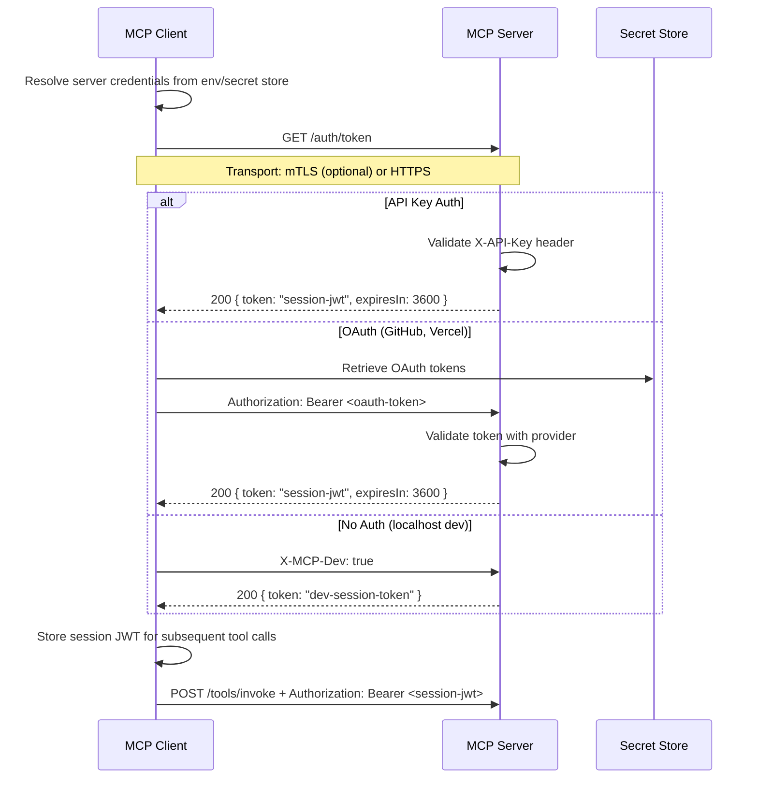

### 6.2 Credential Sources

| Server | Auth Method | Credential Source | Rotation |
|--------|-------------|-------------------|----------|
| GitHub | OAuth (PAT) | `MCP_GITHUB_TOKEN` env var | Manual, prompt user |
| Context7 | API Key | `MCP_CONTEXT7_KEY` env var | Manual |
| Filesystem | None (localhost) | N/A (path-restricted) | N/A |
| Playwright | None (localhost) | N/A | N/A |
| PostgreSQL | Password | `MCP_PG_*` env vars | Via Neon dashboard |
| Vercel | OAuth (PAT) | `MCP_VERCEL_TOKEN` env var | Manual, prompt user |

### 6.3 Session JWT Payload

```json
{
  "sub": "session-550e8400",
  "agentSlug": "backend-engineer",
  "serverSlug": "github",
  "permissions": ["repo:read", "repo:write", "pr:create"],
  "projectId": "proj-456",
  "iat": 1720800000,
  "exp": 1720803600,
  "jti": "unique-token-id"
}
```

---

## 7. MCP Authorization Strategy

### 7.1 Authorization Model

MCP authorization uses a **three-layer check**:

```
Layer 1: Agent → Server       (Can this agent access this MCP server?)
Layer 2: Agent → Tool         (Can this agent invoke this specific tool?)
Layer 3: Tool → Operation     (Is the tool's operation permitted for this context?)
```

### 7.2 Authorization Flow

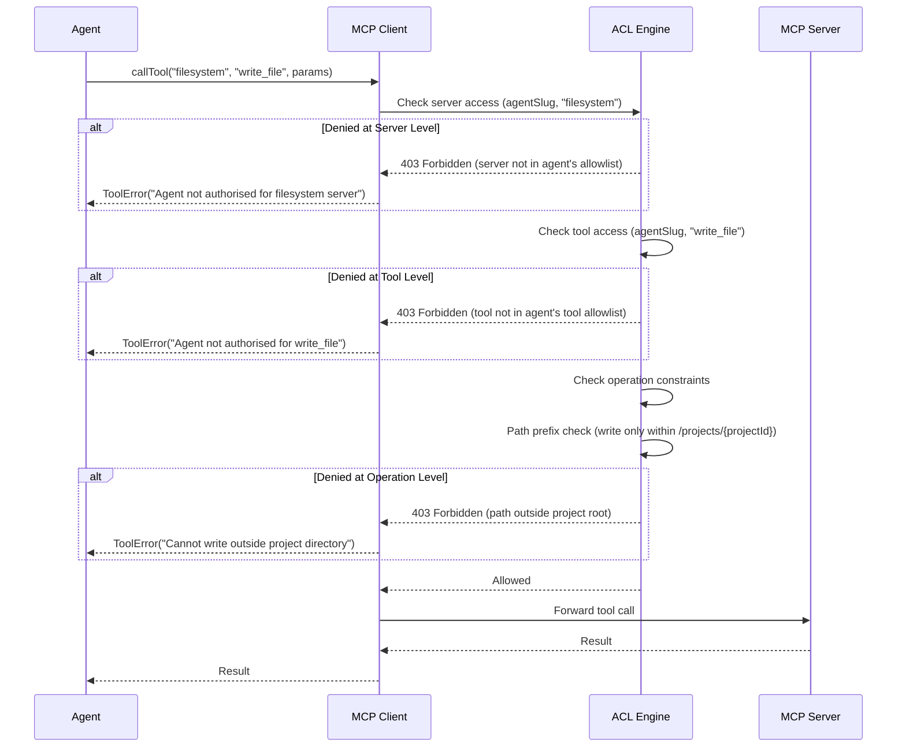

### 7.3 Permission Resolution Order

1. **Global deny list** — Tools that no agent may ever call (e.g., `drop_database`, `delete_repo`)
2. **Server allowlist** — Which agents may access which servers
3. **Tool allowlist** — Which specific tools per agent-server pair
4. **Operation constraints** — Runtime parameter validation (path prefix, repo scope, database name)
5. **Resource-level ACL** — Per-repository, per-project, per-database permissions

---

## 8. MCP Tool Discovery

### 8.1 Discovery Protocol

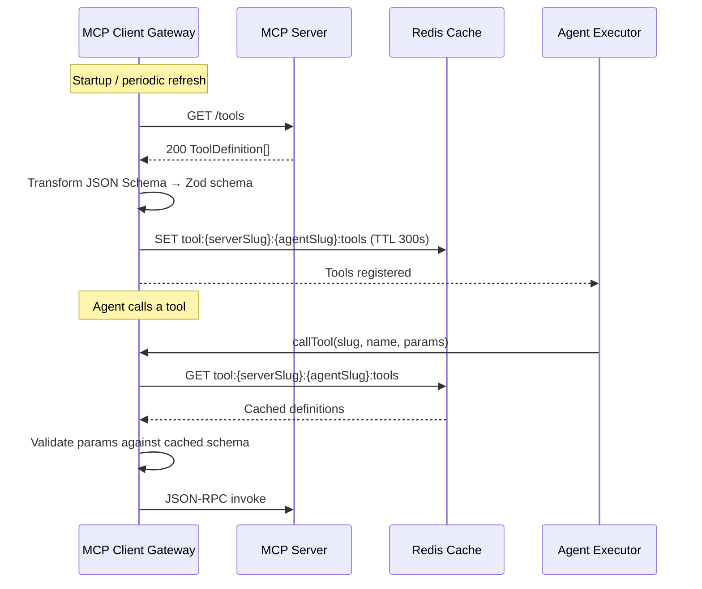

### 8.2 Tool Definition Schema

```json
{
  "name": "create_repository",
  "description": "Create a new GitHub repository",
  "inputSchema": {
    "type": "object",
    "properties": {
      "name": { "type": "string", "description": "Repository name" },
      "private": { "type": "boolean", "default": true },
      "description": { "type": "string" }
    },
    "required": ["name"]
  },
  "outputSchema": {
    "type": "object",
    "properties": {
      "repoUrl": { "type": "string" },
      "repoId": { "type": "integer" }
    }
  },
  "permission": "repo:create",
  "timeout": 30000,
  "idempotent": true
}
```

### 8.3 Tool Discovery Cache

| Server | Cache TTL | Refresh Strategy |
|--------|-----------|------------------|
| GitHub | 300s | Periodic refresh + on-demand |
| Context7 | 600s | Periodic refresh |
| Filesystem | 3600s | On startup only (static) |
| Playwright | 600s | Periodic refresh |
| PostgreSQL | 3600s | On startup only (static) |
| Vercel | 300s | Periodic refresh + on-demand |

---

## 9. MCP Tool Registration

### 9.1 Server-Side Registration

Each MCP server registers its tools at startup:

```typescript
interface ToolRegistration {
  name: string;
  description: string;
  inputSchema: JSONSchema;
  outputSchema: JSONSchema;
  handler: (params: unknown, context: ToolContext) => Promise<unknown>;
  middleware?: ToolMiddleware[];
  permission: string;
  timeout: number;
  idempotent: boolean;
  rateLimit?: { max: number; windowMs: number };
}
```

### 9.2 Client-Side Registration

The MCP Client Gateway maintains a registry that maps agent types to tool allowlists:

```typescript
interface AgentToolRegistry {
  [agentSlug: string]: {
    [serverSlug: string]: {
      tools: string[];           // Allowed tool names
      permissions: string[];     // Permission keys
      restrictions: {
        pathPrefix?: string;     // Filesystem path restriction
        repoScope?: string[];    // GitHub repo restriction
        dbScope?: string[];      // PostgreSQL database restriction
        allowedHosts?: string[]; // Playwright URL restriction
      };
    };
  };
}
```

### 9.3 Tool Registration Flow

```mermaid
flowchart LR
    A[MCP Server Starts] --> B[Load tool definitions]
    B --> C[Validate tool schemas]
    C --> D[Register with internal router]
    D --> E[Expose GET /tools endpoint]
    E --> F[MCP Client discovers tools]
    F --> G[Client caches tool definitions]
    G --> H[Agent session begins]
    H --> I[Client filters tools by agent ACL]
    I --> J[Agent receives filtered tool set]
```

---

## 10. MCP Tool Invocation

### 10.1 Invocation Protocol

```
Request:  POST /tools/invoke
Headers:  Authorization: Bearer <session-jwt>
          X-Trace-Id: <uuid>
          Content-Type: application/json

Body: {
  "method": "tools/call",
  "params": {
    "name": "create_repository",
    "arguments": {
      "name": "my-project",
      "private": true
    }
  },
  "id": "req-001"
}

Response: {
  "jsonrpc": "2.0",
  "id": "req-001",
  "result": {
    "content": [
      {
        "type": "text",
        "text": "{\"repoUrl\":\"https://github.com/org/my-project\",\"repoId\":12345}"
      }
    ],
    "isError": false
  }
}
```

### 10.2 Invocation Lifecycle

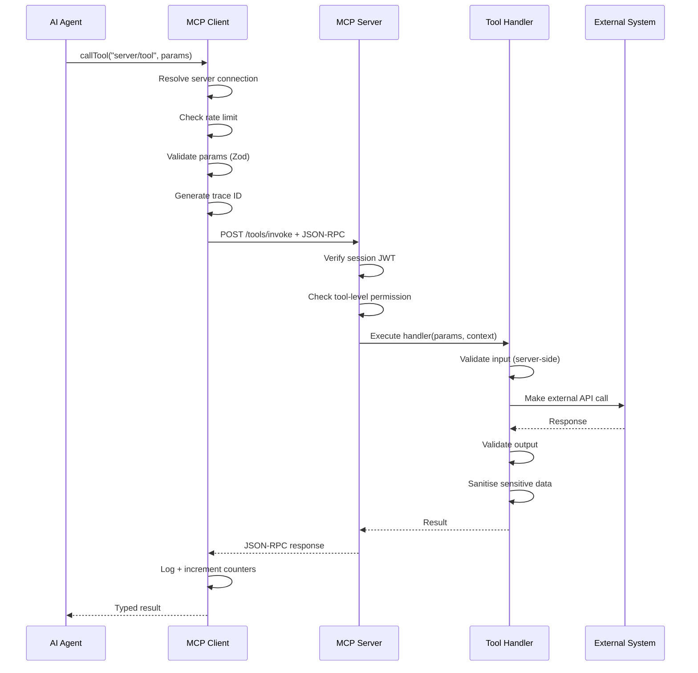

### 10.3 Tool Invocation Contract

| Check | Where | What Happens on Failure |
|-------|-------|------------------------|
| Input validation | Client + Server | `INVALID_INPUT` error with Zod details |
| Permission check | Client | `FORBIDDEN` error — tool not in agent's allowlist |
| Rate limit | Client | `RATE_LIMITED` error with `Retry-After` header |
| Session expiry | Server | `SESSION_EXPIRED` error — client must re-authenticate |
| Tool timeout | Client | `TIMEOUT` error — cancel request, log partial data |
| Output validation | Server | `INVALID_OUTPUT` error — log for debugging, return error to client |
| External API error | Server | `UPSTREAM_ERROR` with status code |

---

## 11. MCP Response Handling

### 11.1 Response Envelope

Successful response:
```json
{
  "jsonrpc": "2.0",
  "id": "req-001",
  "result": {
    "content": [
      {
        "type": "text",
        "text": "{\"key\": \"value\"}"
      }
    ],
    "meta": {
      "durationMs": 342,
      "cached": false,
      "toolVersion": "1.0.0"
    },
    "isError": false
  }
}
```

Error response:
```json
{
  "jsonrpc": "2.0",
  "id": "req-001",
  "error": {
    "code": -32000,
    "message": "GitHub API rate limit exceeded",
    "data": {
      "retryAfter": 45,
      "limit": 5000,
      "remaining": 0,
      "reset": 1720800900
    }
  }
}
```

### 11.2 JSON-RPC Error Codes

| Code | Name | When |
|------|------|------|
| `-32700` | Parse Error | Invalid JSON |
| `-32600` | Invalid Request | Malformed request structure |
| `-32601` | Method Not Found | Unknown tool name |
| `-32602` | Invalid Params | Zod validation failure |
| `-32603` | Internal Error | Unexpected server error |
| `-32000` | Upstream Error | External API failure |
| `-32001` | Rate Limited | Server-level rate limit hit |
| `-32002` | Timeout | Tool execution exceeded timeout |
| `-32003` | Forbidden | Agent not authorised |
| `-32004` | Not Found | Resource not found in external system |
| `-32005` | Conflict | Resource state conflict |

### 11.3 Response Size Limits

| Server | Max Response Size | Truncation Strategy |
|--------|-------------------|---------------------|
| GitHub | 500 KB | Truncate with warning |
| Context7 | 100 KB | Truncate with warning |
| Filesystem | 10 MB (per file) | Reject oversized reads |
| Playwright | 5 MB (screenshots) | Downscale images |
| PostgreSQL | 1 MB | Limit row count, truncate long columns |
| Vercel | 500 KB | Truncate log output |

---

## 12. MCP Error Handling

### 12.1 Error Taxonomy

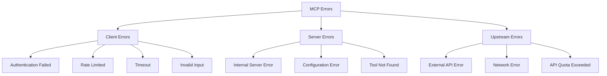

### 12.2 Error Handling Matrix

| Error Type | HTTP Code | JSON-RPC Code | Client Action | Retryable |
|-----------|-----------|---------------|---------------|-----------|
| Invalid JSON | 400 | `-32700` | Fix request | No |
| Invalid params | 422 | `-32602` | Fix params | No |
| Tool not found | 404 | `-32601` | Rediscover tools | No |
| Auth failed | 401 | `-32003` | Re-authenticate | No |
| Rate limited | 429 | `-32001` | Wait `Retry-After` | Yes |
| Timeout | 504 | `-32002` | Retry with backoff | Yes |
| Upstream API error | 502 | `-32000` | Retry with backoff | Yes |
| Network error | — | `-32000` | Retry with backoff | Yes |
| Upstream quota | 429 | `-32004` | Alert + slow down | Yes (after reset) |
| Internal error | 500 | `-32603` | Alert operations | Maybe |

### 12.3 Error Response Envelope

```json
{
  "error": true,
  "code": "UPSTREAM_ERROR",
  "message": "GitHub API returned 422 Unprocessable Entity",
  "details": {
    "upstreamStatusCode": 422,
    "upstreamMessage": "Repository already exists",
    "upstreamDocumentation": "https://docs.github.com/..."
  },
  "retryable": false,
  "retryAfter": null,
  "traceId": "7a1e8b3c-f5d2-4a6e-9b8c-1d2e3f4a5b6c"
}
```

---

## 13. MCP Retry Strategy

### 13.1 Retry Decision Matrix

| Error | Retryable | Max Attempts | Backoff | Fallback |
|-------|-----------|-------------|---------|----------|
| Rate limited (429) | Yes | 3 | Exponential + jitter | Wait `Retry-After` header |
| Timeout (504) | Yes | 2 | Fixed 2s | Cancel after 2nd attempt |
| Upstream 5xx | Yes | 3 | Exponential (1s, 2s, 4s) | Fallback to cached result |
| Network error | Yes | 3 | Exponential (1s, 2s, 4s) | Reconnect session |
| Upstream 4xx | No | 1 | — | Return error to agent |
| Invalid input | No | 1 | — | Return validation error |
| Auth failure | No | 1 | — | Re-authenticate session |

### 13.2 Retry Flow

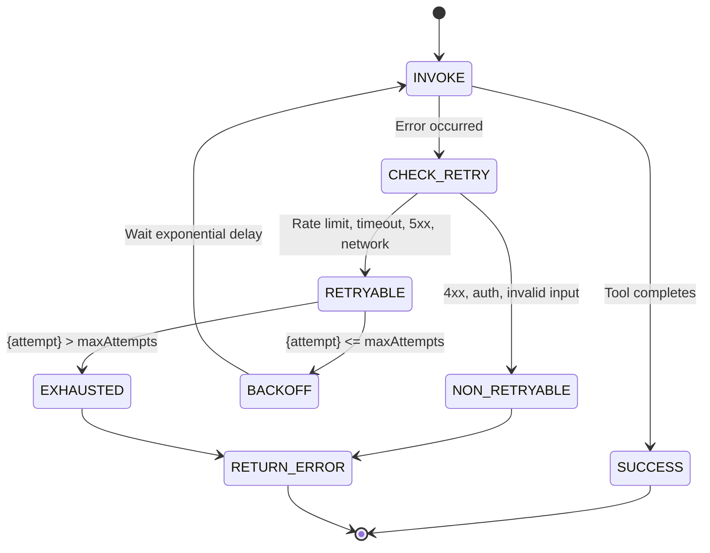

### 13.3 Backoff Algorithm

```typescript
function getRetryDelay(attempt: number, baseMs: number = 1000): number {
  const exponential = baseMs * Math.pow(2, attempt - 1);  // 1s, 2s, 4s
  const jitter = Math.random() * 0.5 * exponential;        // 50% jitter
  const capped = Math.min(exponential + jitter, 30000);     // Cap at 30s

  // Check Retry-After header if present (rate limiting)
  const retryAfter = getRetryAfterHeader();                 // From last response
  return retryAfter ? Math.max(capped, retryAfter * 1000) : capped;
}
```

### 13.4 Per-Server Retry Config

| Server | Max Retries | Base Backoff | Max Backoff | Retryable Errors |
|--------|------------|-------------|-------------|------------------|
| GitHub | 3 | 2s | 30s | 429, 5xx, network |
| Context7 | 2 | 1s | 10s | 429, 5xx, network |
| Filesystem | 1 | — | — | None (local ops) |
| Playwright | 2 | 2s | 15s | Timeout, 5xx |
| PostgreSQL | 1 | — | — | None (transactional) |
| Vercel | 3 | 2s | 30s | 429, 5xx, network |

---

## 14. MCP Timeout Strategy

### 14.1 Timeout Hierarchy

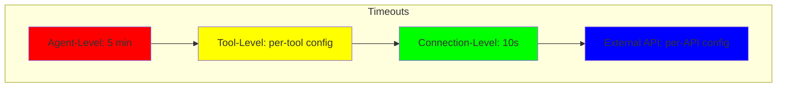

### 14.2 Tool Timeouts

| Server | Tool | Timeout | Rationale |
|--------|------|---------|-----------|
| GitHub | `create_repository` | 15s | Fast API call |
| GitHub | `list_commits` | 30s | Paginated data |
| GitHub | `create_pull_request` | 20s | API call with validation |
| Context7 | `resolve_library_id` | 10s | Simple lookup |
| Context7 | `query_docs` | 30s | Full doc retrieval |
| Filesystem | `read_file` | 5s | Local FS, fast |
| Filesystem | `search_code` | 30s | Regex on large tree |
| Playwright | `launch_browser` | 30s | Browser startup |
| Playwright | `screenshot` | 30s | Page render + capture |
| Playwright | `e2e_test` | 120s | Full test suite |
| PostgreSQL | `execute_query` | 30s | Read query |
| PostgreSQL | `inspect_schema` | 10s | Metadata query |
| Vercel | `deploy` | 120s | Build + deploy |
| Vercel | `get_logs` | 30s | Log retrieval |

### 14.3 Timeout Handling

When a tool call times out:
1. MCP Client cancels the HTTP request (AbortController)
2. MCP Server cancels the in-flight operation if possible
3. Client returns `TIMEOUT` error to the agent
4. For write operations: agent should check if the write actually occurred before retrying
5. Log the timeout with full trace context for debugging

---

## 15. MCP Logging Strategy

### 15.1 Log Events

| Event | Data | Destination | Retention |
|-------|------|-------------|-----------|
| Tool invocation | agentSlug, serverSlug, toolName, traceId, timestamp | PostgreSQL (`mcp_tool_calls`) | 90 days |
| Tool completion | traceId, durationMs, success, responseSize | PostgreSQL (`mcp_tool_calls`) | 90 days |
| Tool error | traceId, errorCode, errorMessage, attempt | PostgreSQL (`mcp_tool_calls`) | 90 days |
| Auth failure | agentSlug, serverSlug, reason | PostgreSQL (`audit_logs`) | 1 year |
| Rate limit hit | agentSlug, serverSlug, toolName, limit, window | PostgreSQL (`audit_logs`) | 30 days |
| Session lifecycle | sessionId, event (create/destroy), agentSlug | PostgreSQL (`audit_logs`) | 90 days |
| Connection pool | poolSize, active, idle, waiting | Prometheus metrics | — |

### 15.2 Log Schema

```typescript
interface MCPToolCallLog {
  id: string;                      // UUID
  traceId: string;                 // Correlation ID
  agentExecutionId: string;        // FK → agent_executions.id
  agentSlug: string;
  serverSlug: string;
  toolName: string;
  inputTruncated: string;          // First 1000 chars of input
  outputTruncated: string;         // First 1000 chars of output
  durationMs: number;
  success: boolean;
  errorCode?: string;
  errorMessage?: string;
  cached: boolean;
  attemptNumber: number;
  tokenEstimate: number;           // Estimated tokens consumed
  createdAt: string;
}

interface MCPAuditLog {
  id: string;
  timestamp: string;
  eventType: 'auth_failure' | 'rate_limit' | 'session_create' | 'session_destroy';
  agentSlug: string;
  serverSlug: string;
  metadata: Record<string, unknown>;
  ipAddress?: string;
}
```

### 15.3 Sensitive Data Redaction

| Field | Redaction | Example |
|-------|-----------|---------|
| `inputTruncated` | API keys, tokens, passwords replaced with `[REDACTED]` | `{ "token": "[REDACTED]" }` |
| `outputTruncated` | Personal data, secrets stripped | `"content": "[REDACTED 2048 bytes]"` |
| SQL queries | Table/column names preserved; values redacted | `SELECT * FROM users WHERE email = '[REDACTED]'` |
| File contents | First 100 chars + `...[TRUNCATED]` | — |

---

## 16. MCP Security Model

### 16.1 Defence in Depth

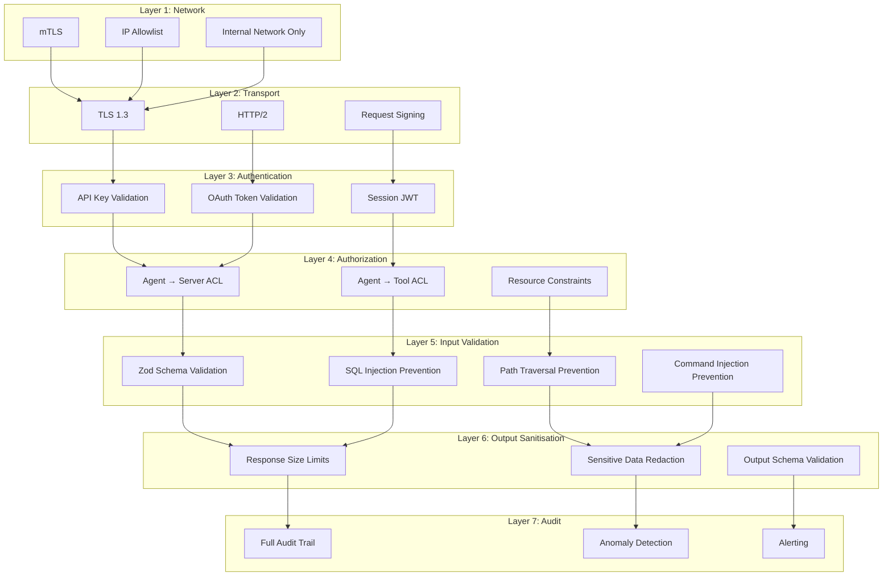

### 16.2 Security Controls by Server

| Server | Network | Auth | Input Validation | Output Sanitisation | Special Controls |
|--------|---------|------|-----------------|-------------------|------------------|
| GitHub | Internal + HTTPS | OAuth (PAT) | Zod + URL validation | Size limit | — |
| Context7 | Internal + HTTPS | API Key | Zod + query length limit | Token truncation | Response caching |
| Filesystem | Localhost only | None (path-restricted) | Path traversal check (resolveSafePath) | File size limit | Write confirmation for overwrites |
| Playwright | Localhost only | None (URL-restricted) | URL allowlist | Screenshot downscale | Navigation blocklist |
| PostgreSQL | Internal + TLS | Password | Parameterised queries only | Row count limit | Read-only by default; explicit write flag |
| Vercel | Internal + HTTPS | OAuth (PAT) | Zod + project validation | Log truncation | Deployment confirmation |

### 16.3 Path Traversal Prevention (Filesystem)

```typescript
const PROJECT_ROOT = '/projects';
const SAFE_PATHS = new Map<string, string>(); // projectId → resolved path

function resolveSafePath(projectId: string, userPath: string): string {
  const projectRoot = SAFE_PATHS.get(projectId);
  if (!projectRoot) throw new Error(`Unknown project: ${projectId}`);

  // Normalise path
  const resolved = path.resolve(projectRoot, userPath);

  // Prevent traversal
  if (!resolved.startsWith(projectRoot)) {
    throw new Error('Path traversal detected');
  }

  return resolved;
}
```

### 16.4 SQL Injection Prevention (PostgreSQL)

- All queries are parameterised via Drizzle ORM
- Never construct SQL strings from agent-provided values
- Tool input accepts only: table names, column names, WHERE conditions (as structured objects)
- Free-text SQL is explicitly rejected with `FORBIDDEN` error

### 16.5 Command Injection Prevention (Shell Execution)

- Tool uses parameterised execution: `{ command: 'npm', args: ['install'] }` not `{ command: 'npm install' }`
- Command allowlist enforced server-side
- No pipes (`|`), semicolons (`;`), subshells (`$()`, ` ``` `), or redirects (`>`, `<`) allowed
- Arguments are escaped before shell execution

### 16.6 Playwright URL Blocklist

```typescript
const BLOCKED_DOMAINS = [
  'localhost:3001',          // Production API
  'localhost:3002',          // MCP server itself
  '127.0.0.1',
  '169.254.169.254',         // Metadata endpoints (cloud)
  '*.internal',
  '*.local',
];

const ALLOWED_PROTOCOLS = ['http:', 'https:'];
```

---

## 17. MCP Performance Strategy

### 17.1 Performance Targets

| Metric | Target | Measurement |
|--------|--------|-------------|
| Tool invocation (local) | < 50ms p95 | Filesystem read/write |
| Tool invocation (API) | < 500ms p95 | GitHub, Context7, Vercel |
| Tool invocation (heavy) | < 5s p95 | Playwright E2E, Vercel deploy |
| Connection establishment | < 100ms | Per-session |
| Tool discovery | < 200ms | First call; cached thereafter |
| Concurrency | 50 simultaneous tool calls | Across all agents |
| Memory per server | < 256MB | Steady state |

### 17.2 Performance Optimizations

| Optimization | Server | Technique | Impact |
|-------------|--------|-----------|--------|
| Tool response caching | Context7, GitHub | Redis cache (TTL 5min) | -80% latency |
| Connection pooling | All | Keep-alive HTTP/2 | -60% connection overhead |
| Response compression | All | Gzip on responses > 1KB | -70% bandwidth |
| Parallel tool execution | Filesystem | Concurrent FS reads | -50% batch read time |
| Browser instance reuse | Playwright | Reuse Chromium for session | -90% startup cost |
| Schema caching | All | Cache Zod schemas in memory | -99% validation overhead |
| Truncated logging | All | Log first 1KB of I/O | -90% log volume |

### 17.3 Connection Pool Per Server

| Server | Pool Size | Pending Queue | Idle Timeout | Max Lifetime |
|--------|-----------|---------------|-------------|-------------|
| GitHub | 5 | 10 | 60s | 30 min |
| Context7 | 10 | 20 | 30s | 15 min |
| Filesystem | 20 | 50 | 60s | 60 min |
| Playwright | 3 | 5 | 120s | 30 min |
| PostgreSQL | 5 | 10 | 60s | 15 min |
| Vercel | 5 | 10 | 60s | 30 min |

---

## 18. MCP Caching Strategy

### 18.1 Cacheable Operations

| Server | Cacheable Tools | Cache Key | TTL | Invalidation |
|--------|----------------|-----------|-----|-------------|
| GitHub | `list_repos`, `get_file`, `list_commits` | `gh:{org}:{repo}:{path}` | 60s | On push event |
| Context7 | `resolve_library_id`, `query_docs` | `c7:{libraryId}:{query}` | 300s | None (static docs) |
| Filesystem | `read_file`, `list_directory`, `search_code` | `fs:{projectId}:{path}` | 30s | On file write |
| PostgreSQL | `inspect_schema`, `list_tables` | `pg:{schema}:{table}` | 300s | On schema change |
| Vercel | `get_deployments`, `get_logs` | `vc:{projectId}:{deployId}` | 60s | On new deploy |

### 18.2 Cache Architecture

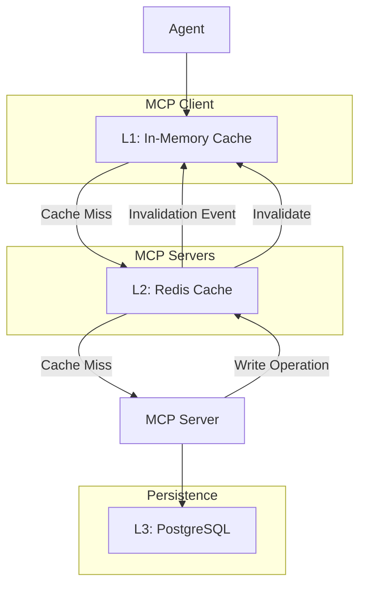

### 18.3 Cache Rules

| Rule | Implementation |
|------|---------------|
| **Never cache mutations** | `create_*`, `update_*`, `delete_*` always hit the server |
| **Cache key includes agent context** | Prevent cross-agent data leaks |
| **Max cache entry size** | 100 KB (Context7), 1 MB (Filesystem) |
| **Stale-while-revalidate** | Serve stale data + refresh in background (TTL + 60s grace) |
| **No cache for errors** | Error responses are never cached |

---

## 19. MCP Monitoring Strategy

### 19.1 Metrics

| Metric | Type | Labels | Source |
|--------|------|--------|--------|
| `mcp_tool_calls_total` | Counter | server, tool, agent, success | Client-side |
| `mcp_tool_duration_ms` | Histogram | server, tool | Client-side |
| `mcp_tool_errors_total` | Counter | server, tool, error_code | Client-side |
| `mcp_cache_hits_total` | Counter | server, tool | Cache layer |
| `mcp_cache_misses_total` | Counter | server, tool | Cache layer |
| `mcp_connection_pool_size` | Gauge | server | Client-side |
| `mcp_connection_pool_waiting` | Gauge | server | Client-side |
| `mcp_upstream_latency_ms` | Histogram | server, upstream | Server-side |
| `mcp_rate_limit_hits_total` | Counter | agent, server | Client-side |

### 19.2 Health Checks

| Server | Health Endpoint | Check Interval | Degraded Threshold |
|--------|----------------|----------------|-------------------|
| GitHub | `GET /health` | 30s | 3 consecutive failures |
| Context7 | `GET /health` | 30s | 3 consecutive failures |
| Filesystem | `GET /health` | 60s | 5 consecutive failures |
| Playwright | `GET /health` | 30s | 3 consecutive failures |
| PostgreSQL | `GET /health` | 30s | 3 consecutive failures |
| Vercel | `GET /health` | 30s | 3 consecutive failures |

### 19.3 Alerting Rules

| Alert | Condition | Severity | Channel |
|-------|-----------|----------|---------|
| MCP Server Down | Health check fails > 3 times | Critical | PagerDuty |
| High Error Rate | Error rate > 10% over 5 min | Warning | Slack |
| High Latency | p95 latency > 2x target over 5 min | Warning | Slack |
| Rate Limit Saturation | Rate limit hits > 50/min | Info | Dashboard |
| Connection Pool Exhaustion | Pool at 100% capacity | Warning | Slack |
| Cache Hit Rate Drop | Cache hit rate < 50% over 5 min | Info | Dashboard |

---

## 20. Future MCP Expansion

### 20.1 Extension Points

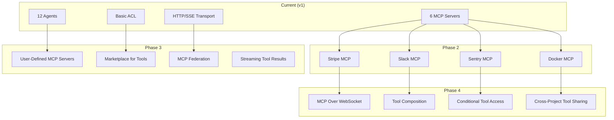

### 20.2 Future Server Candidates

| Server | Purpose | Estimated Phase | Complexity |
|--------|---------|----------------|------------|
| Stripe MCP | Billing, subscriptions, invoices | Phase 2 | Low |
| Slack MCP | Notifications, collaboration | Phase 2 | Low |
| Sentry MCP | Error tracking, performance monitoring | Phase 2 | Low |
| Docker MCP | Container build, push, run | Phase 2 | Medium |
| Jira MCP | Issue tracking, sprint management | Phase 3 | Medium |
| Linear MCP | Project management | Phase 3 | Low |
| AWS MCP | Cloud infrastructure provisioning | Phase 3 | High |
| Datadog MCP | Monitoring + observability | Phase 3 | Medium |
| Figma MCP | Design token extraction, spec export | Phase 4 | High |

### 20.3 Server Addition Checklist

To add a new MCP server:

1. Create server implementation following MCP specification
2. Register server in `mcp-servers.json` config
3. Define tool schemas (Zod input + output)
4. Implement tool handlers with security controls
5. Add server entry to Agent Access Matrix
6. Define rate limits and timeouts
7. Add health check endpoint
8. Register in monitoring dashboards
9. Update audit logging schema
10. Write integration tests

---

## GitHub MCP

**Slug:** `github` **Port:** 3010 **Transport:** HTTP/SSE **Auth:** OAuth (PAT)

### Purpose

Provide AI agents with controlled access to GitHub repositories — reading code, creating branches, committing changes, opening pull requests, and managing issues. Enables the AI pipeline to interact with real repositories.

### Capabilities

| Capability | Description |
|------------|-------------|
| Repository management | Create repos, manage visibility, configure settings |
| Code access | Read files, list directories, search code within repos |
| Branch management | Create branches, list branches, delete branches |
| Commit and push | Stage changes, commit with messages, push to remote |
| Pull request management | Create PRs, review, merge, list PRs |
| Issue tracking | Create issues, list issues, comment on issues |
| Repository metadata | List repos, get repo details, list collaborators |

### Available Tools

| Tool | Input | Output | Permission | Idempotent |
|------|-------|--------|------------|------------|
| `create_repository` | name, private?, description?, org? | repoUrl, repoId | `repo:create` | No |
| `get_repository` | owner, repo | repo details | `repo:read` | Yes |
| `list_repositories` | org?, type? | repo[] | `repo:read` | Yes |
| `get_file` | owner, repo, path, ref? | content, sha | `repo:read` | Yes |
| `list_directory` | owner, repo, path, ref? | file[] | `repo:read` | Yes |
| `create_branch` | owner, repo, branch, sourceBranch? | branchRef | `branch:create` | No |
| `list_branches` | owner, repo | branch[] | `repo:read` | Yes |
| `commit_file` | owner, repo, path, content, message, branch | commitSha | `code:write` | No |
| `push_files` | owner, repo, branch, files[], message | commitSha | `code:write` | No (use Idempotency-Key) |
| `create_pull_request` | owner, repo, title, body, head, base | prUrl, prNumber | `pr:create` | No |
| `list_pull_requests` | owner, repo, state? | pr[] | `pr:read` | Yes |
| `merge_pull_request` | owner, repo, prNumber, method? | merged | `pr:merge` | No |
| `create_issue` | owner, repo, title, body, labels? | issueUrl, issueNumber | `issue:create` | No |
| `list_issues` | owner, repo, state?, labels? | issue[] | `issue:read` | Yes |
| `search_code` | query, owner?, repo? | match[] | `repo:read` | Yes |

### Dependencies

| Dependency | Purpose | Required |
|------------|---------|----------|
| GitHub PAT (`MCP_GITHUB_TOKEN`) | Authentication | Yes |
| Network access to api.github.com | API calls | Yes |
| Internet connection | All operations | Yes |

### Limitations

| Limitation | Detail |
|------------|--------|
| GitHub API rate limit | 5,000 requests/hour (authenticated) |
| File size | Max 100 MB per file (GitHub limit) |
| Repository count | Limited by GitHub plan |
| Concurrent operations | 5 simultaneous tool calls |
| No direct `git` operations | Uses GitHub REST API, not raw Git |
| No webhook management | Out of scope for v1 |

### Rate Limits

| Limit Type | Value | Scope |
|------------|-------|-------|
| Global | 60 calls/min | Per server instance |
| Per agent | 20 calls/min | Per agent execution |
| `create_repository` | 5 calls/min | Per agent |
| `push_files` | 10 calls/min | Per agent |
| `search_code` | 10 calls/min | Per agent |

### Failure Recovery

| Failure | Recovery |
|---------|----------|
| GitHub API 429 (rate limit) | Wait `Retry-After` header, retry up to 3x |
| GitHub API 5xx | Exponential backoff, retry 3x |
| Network error | Retry 3x with exponential backoff |
| Conflict (422, repo exists) | Return error to agent — not retryable |
| Not found (404) | Return error to agent — not retryable |
| Auth failure (401) | Re-authenticate session, retry once |

### Logging

| Field | Captured |
|-------|----------|
| Every API call | Method, endpoint, status, duration |
| Rate limit state | Used, remaining, reset |
| Agent context | agentSlug, executionId, projectId |
| Request/response | Truncated payload (first 1KB) |

### Example Workflows

**Create Repository + Initial Commit + PR:**
```
1. Agent calls github/create_repository({ name: "my-app", private: true })
2. Agent calls github/create_branch({ owner, repo, branch: "feat/setup" })
3. Agent calls github/push_files({ owner, repo, branch, files: [
     { path: "README.md", content: "# My App" },
     { path: "package.json", content: "{...}" }
   ], message: "Initial setup" })
4. Agent calls github/create_pull_request({
     owner, repo, title: "Initial setup", head: "feat/setup", base: "main"
   })
```

---

## Context7 MCP

**Slug:** `context7` **Port:** 3011 **Transport:** HTTP/SSE **Auth:** API Key

### Purpose

Provide AI agents with real-time access to current, version-specific documentation for any library, framework, API, or tool. Enables agents to make informed technology decisions and generate correct code.

### Capabilities

| Capability | Description |
|------------|-------------|
| Library resolution | Search and resolve library names to Context7 IDs |
| Documentation query | Retrieve documentation, API references, code examples |
| Best practices | Fetch idiomatic patterns and recommended approaches |
| Version-specific docs | Target specific library versions |
| Framework references | Framework-specific setup, configuration, usage |

### Available Tools

| Tool | Input | Output | Permission | Idempotent |
|------|-------|--------|------------|------------|
| `resolve_library_id` | query, libraryName | LibraryID[] | `docs:read` | Yes |
| `query_docs` | libraryId, query | DocResult | `docs:read` | Yes |

### Dependencies

| Dependency | Purpose | Required |
|------------|---------|----------|
| Context7 API Key (`MCP_CONTEXT7_KEY`) | Authentication | Yes |
| Network access to Context7 API | API calls | Yes |

### Limitations

| Limitation | Detail |
|------------|--------|
| API rate limit | Varies by Context7 plan |
| Query depth | Single concept per query |
| Response size | Max 100 KB per query |
| No streaming responses | All responses are synchronous |

### Rate Limits

| Limit Type | Value | Scope |
|------------|-------|-------|
| Global | 120 calls/min | Per server instance |
| Per agent | 30 calls/min | Per agent execution |
| `resolve_library_id` | 30 calls/min | Per agent |

### Failure Recovery

| Failure | Recovery |
|---------|----------|
| API 429 | Wait + retry 2x |
| API 5xx | Retry 2x with exponential backoff |
| Network error | Retry 2x |
| Invalid library ID | Return error to agent — not retryable |

### Logging

| Field | Captured |
|-------|----------|
| Query | libraryName, query (truncated to 200 chars) |
| Response | Result count, total tokens, duration |
| Cache | Hit/miss status |

### Example Workflows

**Research + Architecture Decision:**
```
1. Agent calls context7/resolve_library_id("Next.js", "Next.js 16 routing")
2. Agent receives library ID "/vercel/next.js"
3. Agent calls context7/query_docs("/vercel/next.js", "How to implement App Router with RBAC middleware")
4. Agent receives documentation with code examples
```

---

## Filesystem MCP

**Slug:** `filesystem` **Port:** 3012 **Transport:** HTTP/SSE + stdio **Auth:** Path-restricted (no external auth)

### Purpose

Provide AI agents with controlled access to the project filesystem — reading, writing, searching, and managing files within the project workspace. The primary mechanism for agents to generate and modify code.

### Capabilities

| Capability | Description |
|------------|-------------|
| File reading | Read file contents with offset and limit support |
| File writing | Create and overwrite files (with directory auto-creation) |
| Directory listing | List files with glob pattern matching |
| Code search | Regex-based code search across the project |
| File deletion | Delete files (requires explicit confirm for destructive ops) |
| Static analysis | Run linter, type checker, complexity analysis |

### Available Tools

| Tool | Input | Output | Permission | Idempotent |
|------|-------|--------|------------|------------|
| `read_file` | projectId, path, offset?, limit? | content: string | `fs:read` | Yes |
| `write_file` | projectId, path, content, overwrite? | void | `fs:write` | No |
| `list_directory` | projectId, path, pattern? | FileEntry[] | `fs:read` | Yes |
| `search_code` | projectId, pattern, include?, path? | Match[] | `fs:read` | Yes |
| `delete_file` | projectId, path | void | `fs:delete` | No |
| `lint_code` | projectId, path, fix? | LintResult[] | `fs:analyze` | Yes |
| `type_check` | projectId, path | TypeResult[] | `fs:analyze` | Yes |
| `analyse_complexity` | projectId, path | ComplexityReport | `fs:analyze` | Yes |
| `execute_command` | projectId, command, args[], timeout? | ExecResult | `fs:exec` | No |

### Shell Command Allowlist

| Command | Allowed Args | Purpose |
|---------|-------------|---------|
| `npm` | install, run, test, exec, audit, ls | Package management |
| `npx` | — | Execute npm packages |
| `node` | script path | Run Node.js scripts |
| `git` | status, log, diff, add, commit, push, pull, branch, checkout, merge, remote, fetch | Version control |
| `ls` | path, -la, -R | Directory listing |
| `cat` | path | Concatenate files |

### Dependencies

| Dependency | Purpose | Required |
|------------|---------|----------|
| Project directory | Workspace root | Yes |
| Node.js (for shell commands) | npm, npx, node execution | Yes |
| Git (for version control) | git commands | Yes |

### Limitations

| Limitation | Detail |
|------------|--------|
| Path restriction | Tools cannot read/write outside `/projects/{projectId}/` |
| Max file size | 10 MB per read/write |
| Max concurrent shell commands | 1 per agent session |
| Shell command timeout | 60s default, 300s max |
| Write confirmation | `delete_file` requires explicit confirmation |
| No symlink following | Prevents path traversal via symlinks |

### Rate Limits

| Limit Type | Value | Scope |
|------------|-------|-------|
| Global | 200 calls/min | Per server instance |
| Per agent | 60 calls/min | Per agent execution |
| `write_file` | 30 calls/min | Per agent |
| `execute_command` | 10 calls/min | Per agent |

### Failure Recovery

| Failure | Recovery |
|---------|----------|
| File not found | Return error — not retryable |
| Permission denied (path traversal) | Return FORBIDDEN — not retryable |
| Disk full | Return error — not retryable |
| Shell command timeout | Return TIMEOUT — agent may retry |
| Shell command non-zero exit | Return error with stderr — agent may retry |

### Logging

| Field | Captured |
|-------|----------|
| Operation | Tool name, path, file size |
| Shell execution | Command, args (redacted), exit code, stdout size |
| Write operations | Path, overwrite flag, content hash |
| Path traversal attempts | Full path (for audit) |

### Example Workflows

**Generate backend code:**
```
1. Agent calls filesystem/list_directory("proj-123", "/backend/src")
2. Agent reads existing files to understand structure
3. Agent calls filesystem/write_file("proj-123", "/backend/src/routes/auth.ts", content)
4. Agent calls filesystem/write_file("proj-123", "/backend/src/controllers/auth.ts", content)
5. Agent calls filesystem/execute_command("proj-123", "npm", ["run", "typecheck"])
6. Agent checks type check results
7. Agent calls filesystem/execute_command("proj-123", "npm", ["run", "lint"])
```

---

## Playwright MCP

**Slug:** `playwright` **Port:** 3013 **Transport:** HTTP/SSE **Auth:** URL-restricted

### Purpose

Provide AI agents with browser automation capabilities — rendering pages, taking screenshots, running accessibility audits, and executing end-to-end tests against the generated application.

### Capabilities

| Capability | Description |
|------------|-------------|
| Browser launch | Start Chromium instance (headless) |
| Page navigation | Navigate to URLs within allowlist |
| Screenshot capture | Full page, viewport, or element screenshots |
| Accessibility audit | Run axe-core accessibility checks |
| E2E test execution | Run Playwright test files |
| Console log capture | Capture browser console output |
| Network request capture | Monitor API calls from the page |

### Available Tools

| Tool | Input | Output | Permission | Idempotent |
|------|-------|--------|------------|------------|
| `launch_browser` | projectId | sessionId | `browser:launch` | No |
| `navigate` | url, waitUntil? | pageTitle, status | `browser:navigate` | No |
| `screenshot` | url?, fullPage?, selector? | screenshotBase64 | `browser:screenshot` | Yes |
| `run_accessibility` | url | AuditResult[] | `browser:audit` | Yes |
| `get_console_logs` | — | LogEntry[] | `browser:read` | Yes |
| `get_network_requests` | — | Request[] | `browser:read` | Yes |
| `run_e2e_test` | testPath | TestResult | `browser:e2e` | No |
| `close_browser` | — | void | `browser:close` | Yes |

### URL Allowlist

```typescript
const ALLOWED_URL_PATTERNS = [
  /^http:\/\/localhost:\d{4,5}/,         // Local dev servers
  /^https:\/\/.*\.vercel\.app/,           // Vercel preview deployments
  /^https:\/\/app\.aisoftco\.com/,        // Production app
];
```

### Dependencies

| Dependency | Purpose | Required |
|------------|---------|----------|
| Playwright Chromium | Browser engine | Yes |
| Display server (xvfb) | Headless rendering | Linux only |
| Network access | URL navigation | Yes |

### Limitations

| Limitation | Detail |
|------------|--------|
| Browser instances | Max 3 concurrent browser instances |
| Screenshot size | Max 5 MB per screenshot |
| Navigation allowlist | Only URLs matching allowlist patterns |
| E2E test timeout | 120s per test file |
| No file downloads | Browser download not supported |
| No video recording | Out of scope for v1 |

### Rate Limits

| Limit Type | Value | Scope |
|------------|-------|-------|
| Global | 30 calls/min | Per server instance |
| Per agent | 10 calls/min | Per agent execution |
| `launch_browser` | 3 calls/min | Per agent |
| `screenshot` | 15 calls/min | Per agent |
| `run_e2e_test` | 3 calls/min | Per agent |

### Failure Recovery

| Failure | Recovery |
|---------|----------|
| Browser crash | Retry `launch_browser` once |
| Navigation timeout | Retry with longer timeout |
| Screenshot failure | Return error — not retryable |
| E2E test failure | Return test results (not an error) |

### Logging

| Field | Captured |
|-------|----------|
| Navigation | URL, status, duration |
| Screenshot | URL, dimensions, file size |
| Accessibility | Violation count, impact levels |
| E2E tests | Test file, passed, failed, duration |

### Example Workflows

**QA visual + accessibility audit:**
```
1. Agent calls playwright/launch_browser("proj-123")
2. Agent calls playwright/navigate("http://localhost:3000")
3. Agent calls playwright/screenshot({ fullPage: true })
4. Agent calls playwright/run_accessibility("http://localhost:3000")
5. Agent analyses violations from audit result
6. Agent calls playwright/close_browser()
```

---

## PostgreSQL MCP

**Slug:** `postgresql` **Port:** 3014 **Transport:** HTTP/SSE **Auth:** Password

### Purpose

Provide AI agents with read-only access to database schema inspection, safe query execution (read-only by default), and migration validation. Enables the Database Engineer agent to design schema and verify migrations without granting full database access.

### Capabilities

| Capability | Description |
|------------|-------------|
| Schema inspection | List tables, columns, indexes, enums, relationships |
| Safe queries | Execute read-only SELECT queries with row limits |
| Migration validation | Test migration SQL against a sandbox (preview mode) |
| Database metadata | View database size, active connections, table stats |
| Query analysis | EXPLAIN ANALYZE for query performance |

### Available Tools

| Tool | Input | Output | Permission | Idempotent |
|------|-------|--------|------------|------------|
| `inspect_schema` | table? | SchemaDefinition | `db:read` | Yes |
| `list_tables` | — | TableInfo[] | `db:read` | Yes |
| `list_enums` | — | EnumDef[] | `db:read` | Yes |
| `list_indexes` | table? | IndexDef[] | `db:read` | Yes |
| `list_foreign_keys` | table? | FKDef[] | `db:read` | Yes |
| `get_table_stats` | table | TableStats | `db:read` | Yes |
| `execute_query` | query, params?, limit? | QueryResult | `db:read` | Yes |
| `explain_query` | query, params? | ExplainResult | `db:read` | Yes |
| `validate_migration` | migrationSQL | ValidationResult | `db:migrate` | Yes |

### Database Connection Configuration

```typescript
interface PostgresConnectionConfig {
  host: string;
  port: number;
  database: string;
  schema: string;              // Typically 'public' or project-specific schema
  ssl: boolean;
  readonly: boolean;           // Force READ ONLY transaction mode
  maxRows: number;             // Max rows returned per query (default 1000)
  statementTimeout: number;    // Max query duration (default 30s)
}
```

### Dependencies

| Dependency | Purpose | Required |
|------------|---------|----------|
| Neon PostgreSQL instance | Database connection | Yes |
| Connection credentials | `MCP_PG_*` env vars | Yes |
| Network access to Neon | Database connection | Yes |

### Limitations

| Limitation | Detail |
|------------|--------|
| Read-only by default | All queries executed in `READ ONLY` transaction mode |
| Row limit | Max 1,000 rows returned per query |
| Query timeout | 30s statement timeout |
| Schema scope | Single schema per connection |
| No DDL execution | `CREATE TABLE`, `ALTER TABLE` etc. blocked |
| No writes | `INSERT`, `UPDATE`, `DELETE`, `TRUNCATE` blocked |
| Migration validation | Dry-run only — never applies migrations |

### Rate Limits

| Limit Type | Value | Scope |
|------------|-------|-------|
| Global | 120 calls/min | Per server instance |
| Per agent | 30 calls/min | Per agent execution |
| `execute_query` | 15 calls/min | Per agent |
| `validate_migration` | 5 calls/min | Per agent |

### Failure Recovery

| Failure | Recovery |
|---------|----------|
| Connection lost | Reconnect, retry query once |
| Query timeout | Return error — agent should simplify query |
| Invalid query syntax | Return validation error — not retryable |
| Constraint violation | Return error — not retryable |
| Deadlock detected | Return error — not retryable |

### Logging

| Field | Captured |
|-------|----------|
| Query | Table names, column names (values redacted) |
| Schema inspection | Full schema metadata |
| Migration validation | SQL fingerprint, validation result |
| Performance | Query duration, row count, index usage |

### Example Workflows

**Schema design + migration validation:**
```
1. Agent calls postgresql/inspect_schema() → gets current schema
2. Agent calls postgresql/list_tables() → existing tables
3. Agent designs new schema based on requirements
4. Agent calls postgresql/validate_migration("CREATE TABLE users (...)")
5. Validation returns: "Valid: creates new table 'users' with no conflicts"
6. Agent calls postgresql/execute_query("SELECT COUNT(*) FROM users", { limit: 1 })
   → Confirms table is empty (new migration is safe)
```

---

## Vercel MCP

**Slug:** `vercel` **Port:** 3015 **Transport:** HTTP/SSE **Auth:** OAuth (PAT)

### Purpose

Provide AI agents with the ability to deploy applications to Vercel, monitor deployment status, retrieve logs, and manage environment variables. Enables the DevOps Engineer agent to manage the full deployment lifecycle.

### Capabilities

| Capability | Description |
|------------|-------------|
| Deployment | Trigger deployments from GitHub branches |
| Status monitoring | Check deployment state and progress |
| Log retrieval | Access build and runtime logs |
| Environment management | List, create, update, delete environment variables |
| Project metadata | Get project configuration and settings |
| Domain management | List and configure custom domains |

### Available Tools

| Tool | Input | Output | Permission | Idempotent |
|------|-------|--------|------------|------------|
| `deploy` | projectId, branch?, gitRepo? | deployId, status, url | `deploy:create` | No (use Idempotency-Key) |
| `get_deployment` | deployId | DeploymentDetail | `deploy:read` | Yes |
| `list_deployments` | projectId, limit? | DeploymentSummary[] | `deploy:read` | Yes |
| `get_deployment_logs` | deployId, type? | LogEntry[] | `deploy:read` | Yes |
| `list_env_vars` | projectId | EnvVar[] | `env:read` | Yes |
| `create_env_var` | projectId, key, value, target? | EnvVar | `env:write` | No |
| `update_env_var` | projectId, id, key?, value?, target? | EnvVar | `env:write` | No |
| `delete_env_var` | projectId, id | void | `env:write` | No |
| `get_project` | projectId | ProjectDetail | `deploy:read` | Yes |
| `list_projects` | — | ProjectSummary[] | `deploy:read` | Yes |

### Dependencies

| Dependency | Purpose | Required |
|------------|---------|----------|
| Vercel PAT (`MCP_VERCEL_TOKEN`) | Authentication | Yes |
| Vercel project ID | Target project | Yes |
| Network access to vercel.com | API calls | Yes |
| Git repository connected | Deployment source | Yes |

### Limitations

| Limitation | Detail |
|------------|--------|
| Vercel API rate limit | Varies by plan |
| Deployment frequency | Limited by Vercel plan (concurrent deploys) |
| Log retention | Vercel retains logs for 7 days |
| No rollback tool | Use Vercel dashboard for rollbacks |
| No team/org management | Out of scope for v1 |
| No function configuration | Uses project defaults |

### Rate Limits

| Limit Type | Value | Scope |
|------------|-------|-------|
| Global | 30 calls/min | Per server instance |
| Per agent | 10 calls/min | Per agent execution |
| `deploy` | 3 calls/min | Per agent |
| `list_env_vars` | 10 calls/min | Per agent |

### Failure Recovery

| Failure | Recovery |
|---------|----------|
| Vercel API 429 | Wait + retry 3x |
| Deployment failure | Return deployment status (not tool error) |
| Network error | Retry 3x with exponential backoff |
| Env var conflict | Return error — not retryable |

### Logging

| Field | Captured |
|-------|----------|
| Deployment | Project, branch, commit SHA, status, duration |
| Logs | Log type, line count, first/last timestamp |
| Env vars | Key name (value redacted), target |
| Errors | Error code, message, upstream status |

### Example Workflows

**Deploy after pipeline completes:**
```
1. Agent calls vercel/list_env_vars("prj_abc123")
2. Agent reads existing environment configuration
3. Agent calls vercel/create_env_var("prj_abc123", "DATABASE_URL", "...", ["production"])
4. Agent calls vercel/deploy({ projectId: "prj_abc123", branch: "main" })
5. Agent polls vercel/get_deployment("dpl_xyz789") every 15s
6. Deployment status: "ready"
7. Agent calls vercel/get_deployment_logs("dpl_xyz789", "build")
8. Agent verifies successful deployment
```

---

## Agent Access Matrix

### Access Matrix: Agents → MCP Servers

| Agent | GitHub | Context7 | Filesystem | Playwright | PostgreSQL | Vercel |
|-------|--------|----------|------------|------------|------------|--------|
| CEO | — | **read** | — | — | — | — |
| Product Manager | — | **read** | — | — | — | — |
| Business Analyst | — | **read** | — | — | — | — |
| Software Architect | — | **read** | — | — | — | — |
| UI/UX Designer | — | **read** | — | — | — | — |
| Database Engineer | — | **read** | **schema** | — | **read** | — |
| Backend Engineer | **write** | **read** | **write** | — | — | — |
| Frontend Engineer | — | **read** | **write** | — | — | — |
| QA Engineer | **read** | — | **read** | **read** | — | — |
| Security Engineer | **read** | — | **read** | — | — | — |
| DevOps Engineer | **write** | — | **write** | — | — | **write** |
| Documentation Eng | — | — | **write** | — | — | — |

**Legend:** `—` = no access · `read` = read-only tools · `write` = read + write tools · `schema` = file operations limited to schema/database directory · `**bold**` = primary access level

### Access Matrix: Agents → Specific Tools

| Agent | Allowed Servers | Allowed Tools | Restrictions |
|-------|----------------|---------------|--------------|
| **CEO** | Context7 | `resolve_library_id`, `query_docs` | Max 10 calls per session |
| **Product Manager** | Context7 | `resolve_library_id`, `query_docs` | Max 20 calls per session |
| **Business Analyst** | Context7 | `resolve_library_id`, `query_docs` | Max 20 calls per session |
| **Software Architect** | Context7 | `resolve_library_id`, `query_docs` | Max 30 calls per session |
| **UI/UX Designer** | Context7 | `resolve_library_id`, `query_docs` | Framework/CSS docs only |
| **Database Engineer** | Context7, Filesystem, PostgreSQL | C7: all tools; FS: `read_file`, `list_directory` (schema dir only); PG: all tools | FS restricted to `/backend/src/db/` and `/shared/schemas/` |
| **Backend Engineer** | GitHub, Context7, Filesystem | GH: `get_file`, `read_file`, `push_files`, `create_branch`, `create_pull_request`; C7: all; FS: all tools | FS restricted to `/backend/` and `/shared/` |
| **Frontend Engineer** | Context7, Filesystem | C7: all; FS: `read_file`, `write_file`, `list_directory`, `search_code` | FS restricted to `/frontend/` and `/shared/` |
| **QA Engineer** | GitHub, Filesystem, Playwright | GH: `get_file`, `list_directory`; FS: `read_file`, `lint_code`, `type_check`, `analyse_complexity`; PW: all tools | GitHub read-only; no file write |
| **Security Engineer** | GitHub, Filesystem | GH: `get_file`, `list_directory`, `search_code`; FS: `read_file`, `search_code` | Read-only on all operations |
| **DevOps Engineer** | GitHub, Filesystem, Vercel | GH: all tools; FS: all tools; VC: all tools | FS restricted to `/` (project root) |
| **Documentation Eng** | Filesystem | FS: `read_file`, `write_file`, `list_directory` | FS restricted to `/` (project root); write only `.md` files |

### Permission Levels

| Level | Value | Semantics |
|-------|-------|-----------|
| `denied` | 0 | Agent cannot access this server or tool |
| `read` | 1 | Read-only operations (get, list, search, inspect) |
| `write` | 2 | Read + create/update/delete operations |
| `admin` | 3 | All operations including destructive actions |

### Restrictions

| Restriction Type | Applies To | Implementation |
|-----------------|------------|----------------|
| Path restriction | Filesystem | `resolveSafePath()` enforces per-agent directory scope |
| Read-only mode | QA, Security | `write_file`, `delete_file` blocked by ACL |
| Schema-only | DB Engineer | `/backend/src/db/` and `/shared/schemas/` path prefix |
| Code-only | FE/BE Engineer | `/frontend/` or `/backend/` path prefix |
| Markdown-only | Docs Engineer | File extension must be `.md` |
| URL allowlist | Playwright | Only localhost and Vercel preview URLs |
| Read-only DB | PostgreSQL MCP | All queries wrapped in `READ ONLY` transaction |
| Query row limit | PostgreSQL MCP | Max 1,000 rows per query result |

---

## Security Summary

### Principle of Least Privilege

| MCP Server | Principle Applied |
|------------|-------------------|
| GitHub | Agents only have access to repos relevant to their project; read-only for non-engineering agents |
| Context7 | All agents have read access (docs are public); rate-limited per agent |
| Filesystem | Each agent restricted to its domain directory; write access only for engineering agents |
| Playwright | Only localhost and Vercel preview URLs; no arbitrary internet navigation |
| PostgreSQL | Read-only by default; write/migration only via validated, explicit `validate_migration` tool |
| Vercel | Only DevOps and agents requiring deployment have write access |

### Secret Management

| Secret | Storage | Access | Rotation |
|--------|---------|--------|----------|
| GitHub PAT | Environment variable (`MCP_GITHUB_TOKEN`) | MCP Client → GitHub MCP | Manual (user generates new token) |
| Context7 API Key | Environment variable (`MCP_CONTEXT7_KEY`) | MCP Client → Context7 MCP | Manual |
| PostgreSQL password | Environment variable (`MCP_PG_PASSWORD`) | MCP Client → PostgreSQL MCP | Via Neon dashboard |
| Vercel PAT | Environment variable (`MCP_VERCEL_TOKEN`) | MCP Client → Vercel MCP | Manual (user generates new token) |
| MCP Session JWT | In-memory (signed with `MCP_SESSION_SECRET`) | Between MCP Client and Server | Every session (15-60 min TTL) |

### Security Checklist

| Security Measure | GitHub | Context7 | Filesystem | Playwright | PostgreSQL | Vercel |
|-----------------|--------|----------|------------|------------|------------|--------|
| Authentication | ✓ | ✓ | N/A (localhost) | N/A (localhost) | ✓ | ✓ |
| Authorization (agent-level) | ✓ | ✓ | ✓ | ✓ | ✓ | ✓ |
| Authorization (tool-level) | ✓ | ✓ | ✓ | ✓ | ✓ | ✓ |
| Input validation (Zod) | ✓ | ✓ | ✓ | ✓ | ✓ | ✓ |
| Output validation | ✓ | ✓ | ✓ | ✓ | ✓ | ✓ |
| Rate limiting | ✓ | ✓ | ✓ | ✓ | ✓ | ✓ |
| Timeout enforcement | ✓ | ✓ | ✓ | ✓ | ✓ | ✓ |
| Audit logging | ✓ | ✓ | ✓ | ✓ | ✓ | ✓ |
| Sensitive data redaction | ✓ | ✓ | ✓ | ✓ | ✓ | ✓ |
| Path traversal prevention | N/A | N/A | ✓ | N/A | N/A | N/A |
| SQL injection prevention | N/A | N/A | N/A | N/A | ✓ | N/A |
| Command injection prevention | N/A | N/A | ✓ | N/A | N/A | N/A |
| URL allowlist | N/A | N/A | N/A | ✓ | N/A | N/A |
| Confirm destructive writes | ✓ | N/A | ✓ | N/A | N/A | ✓ |

---

## Best Practices

| # | Practice | Detail |
|---|----------|--------|
| 1 | **Fail closed** | Any error, timeout, or auth failure blocks the tool call; never fall back to unsafe behaviour |
| 2 | **Principle of least privilege** | Start with zero permissions; add only what each agent needs |
| 3 | **All inputs validated twice** | Client-side (Zod) + Server-side (JSON Schema) |
| 4 | **Never log secrets** | API keys, tokens, passwords redacted by default |
| 5 | **Every tool call is audited** | Trace ID, agent, server, tool, timing, success/failure |
| 6 | **Idempotency for mutations** | All non-idempotent tools accept `Idempotency-Key` |
| 7 | **Cache read responses** | Reduce latency and external API usage |
| 8 | **Timeouts on every layer** | Agent → Tool → Connection → External API |
| 9 | **Retry with exponential backoff** | Transient errors are retried; permanent errors are surfaced immediately |
| 10 | **Servers are independently deployable** | No shared state between MCP servers |
| 11 | **Schema-first tool design** | Every tool has an explicit Zod input/output schema |
| 12 | **No direct external calls from agents** | All external communication goes through MCP |
| 13 | **Connection pooling** | Persistent HTTP/2 connections with keep-alive |
| 14 | **Health checks on all servers** | Every server exposes `/health` for monitoring |
| 15 | **Sensitive data never leaves MCP** | Secrets resolved inside MCP server; agents only see operation results |
