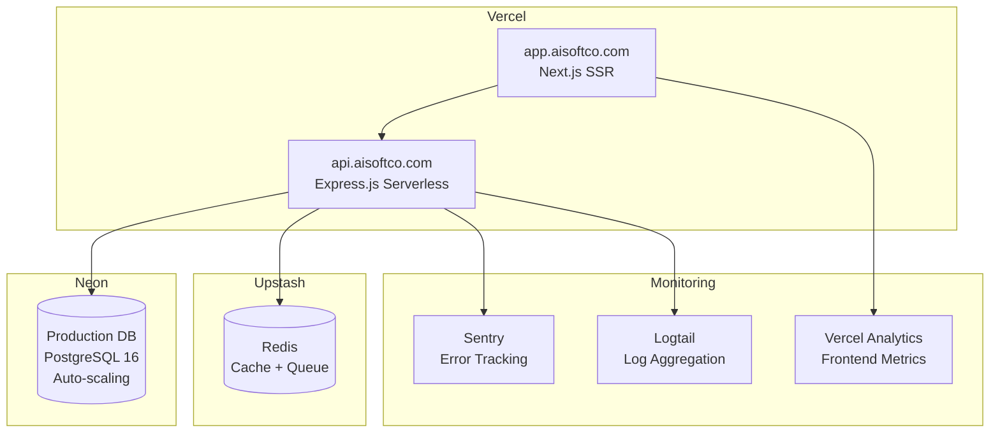

# Phase 5 — Production & Deployment

## Objective
Harden the platform for production: performance optimisation, security auditing, production infrastructure setup, load testing, and go-live.

## Scope
Non-functional improvements and operations only. No feature changes.

## Internal Phases

| Internal Phase | Deliverable |
|----------------|-------------|
| 5.1 Performance | LLM token budget optimisation, response caching (Redis), DB query optimisation, connection pooling (pgBouncer), frontend bundle analysis, lazy loading, image/font optimisation |
| 5.2 Security | OWASP ZAP scan, SAST (SonarQube), npm audit fix, prompt injection testing, CORS/CSP audit, rate limiting verification |
| 5.3 Production Infrastructure | Vercel project config, Neon production branch, custom domain (DNS + SSL), Sentry error tracking, Logtail log aggregation, uptime monitoring, alerting (Slack/email) |
| 5.4 CI/CD | GitHub Actions pipeline (lint → typecheck → test → build → deploy), preview deployments per PR, environment management (staging/production) |
| 5.5 Load Testing | k6 scripts for critical flows: project creation, dashboard, agent pipeline |
| 5.6 Launch | Smoke tests, rollback procedure, incident response runbook, launch checklist |

## Performance Targets

| Metric | Target | Tool |
|--------|--------|------|
| API p95 response time | < 200ms | k6, PM2 metrics |
| Frontend LCP | < 1.5s | Lighthouse CI |
| First load JS bundle | < 150KB | @next/bundle-analyzer |
| Lighthouse score | > 90 (all categories) | Lighthouse CI |
| Agent pipeline time | < 10 min | Platform timer |
| Concurrent users | 250 simultaneous | k6 |

## Security Checklist

- [ ] OWASP ZAP active scan — zero high-risk findings
- [ ] SonarQube — zero critical/high security hotspots
- [ ] `npm audit` — zero critical/high vulnerabilities
- [ ] CSP headers configured and functional
- [ ] CORS restricted to known origins
- [ ] Rate limiting blocks abusive requests
- [ ] Prompt injection attempts blocked (input sanitisation)
- [ ] JWT secrets stored in Vercel Environment Variables
- [ ] No secrets in code, .env, or generated output
- [ ] All endpoints have Zod validation

## Infrastructure Setup



## CI/CD Pipeline

```yaml
name: CI/CD
on: [push, pull_request]
jobs:
  ci:
    steps:
      - lint (ESLint)
      - typecheck (tsc --noEmit)
      - test (vitest run --coverage)
      - build (npm run build)
  
  deploy:
    if: github.ref == 'refs/heads/main'
    needs: ci
    steps:
      - Vercel Deploy (Production)
      - Smoke tests (curl health endpoint)
```

## Dependencies
- Phase 4 complete (MCP integration)
- Vercel Pro/Team account
- Neon Production plan (auto-scaling)
- Custom domain (app.aisoftco.com)
- Stripe Production keys
- Sentry account
- Logtail or equivalent log service

## Acceptance Criteria

### Performance
- [ ] API p95 response time < 200ms (k6 verified)
- [ ] Frontend Lighthouse score > 90
- [ ] First load JS bundle < 150KB
- [ ] Database query time < 50ms (p95)

### Security
- [ ] OWASP ZAP — zero high-risk findings
- [ ] SAST — zero critical security hotspots
- [ ] Prompt injection fuzzing — all attempts blocked
- [ ] `npm audit` — zero critical/high

### Infrastructure
- [ ] Vercel deployment succeeds (both frontend and backend)
- [ ] Neon production DB connected and responsive
- [ ] Sentry captures errors with correct context
- [ ] CI passes for every PR
- [ ] Deploy happens automatically on main merge

### Launch
- [ ] Load test: 250 concurrent users, < 2s p95, zero errors
- [ ] Rollback procedure tested (< 15 min)
- [ ] Incident response runbook documented
- [ ] All smoke tests pass:
  - [ ] Register → Login → Dashboard
  - [ ] Create project → Full pipeline → Approval
  - [ ] Team creation → Invitation → Access
  - [ ] Billing checkout → Subscription active
  - [ ] Deploy generated project to Vercel

## Launch Smoke Test Script

```bash
echo "=== Smoke Test Suite ==="

# 1. Health
curl -f https://api.aisoftco.com/api/v1/health

# 2. Auth
TOKEN=$(curl -s -X POST https://api.aisoftco.com/api/v1/auth/login \
  -H "Content-Type: application/json" \
  -d '{"email":"test@test.com","password":"Test123!"}' | jq -r '.data.tokens.accessToken')

# 3. Create project
PROJECT_ID=$(curl -s -X POST https://api.aisoftco.com/api/v1/projects \
  -H "Authorization: Bearer $TOKEN" \
  -H "Content-Type: application/json" \
  -d '{"title":"Smoke Test","description":"...","techStack":["next.js","express"]}' | jq -r '.data.project.id')

# 4. WebSocket connects (via wscat or similar)
# 5. Approve pipeline at each gate
# 6. Verify files generated
# 7. Deploy to Vercel

echo "=== Smoke Test Complete ==="
```
