# System Architecture — AI Software Company

## Document Control

| Field | Value |
|-------|-------|
| **Document ID** | SA-002 |
| **Version** | 2.0 |
| **Status** | Approved |
| **Author** | Principal Software Architect |
| **Date** | 2026-07-13 |
| **Supersedes** | SA-001 (v1.0) |

---

## 1. High-Level System Architecture

### 1.1 Architecture Style

The system follows a **Layered Hexagonal Architecture** combined with an **Event-Driven Pipeline** for AI agent orchestration. This hybrid approach provides:

- **Separation of concerns** through strict layer boundaries
- **Domain isolation** via ports and adapters
- **Async resilience** through event-driven agent execution
- **Extensibility** by allowing any layer to be replaced independently

### 1.2 Layer Diagram (Mermaid)

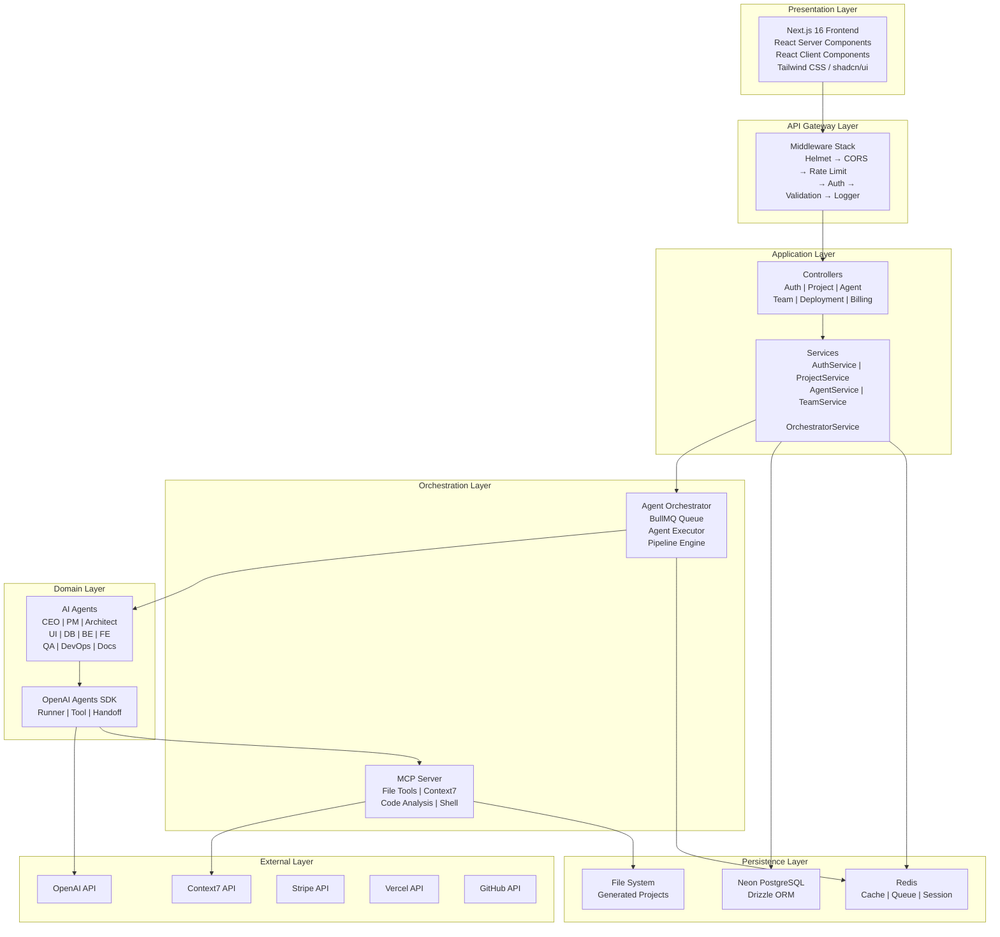
```mermaid
graph TB
    subgraph "Presentation Layer"
        FE["Next.js 16 Frontend
             React Server Components
             React Client Components
             Tailwind CSS / shadcn/ui"]
    end

    subgraph "API Gateway Layer"
        MW["Middleware Stack
             Helmet → CORS → Rate Limit
             → Auth → Validation → Logger"]
    end

    subgraph "Application Layer"
        CTRL["Controllers
             Auth | Project | Agent
             Team | Deployment | Billing"]
        SVC["Services
             AuthService | ProjectService
             AgentService | TeamService
             OrchestratorService"]
    end

    subgraph "Orchestration Layer"
        ORCH["Agent Orchestrator
             BullMQ Queue
             Agent Executor
             Pipeline Engine"]
        MCP["MCP Server
             File Tools | Context7
             Code Analysis | Shell"]
    end

    subgraph "Domain Layer"
        AI["AI Agents
             CEO | PM | Architect
             UI | DB | BE | FE
             QA | DevOps | Docs"]
        AGNT["OpenAI Agents SDK
             Runner | Tool | Handoff"]
    end

    subgraph "Persistence Layer"
        DB["Neon PostgreSQL
             Drizzle ORM"]
        CACHE["Redis
             Cache | Queue | Session"]
        FS["File System
             Generated Projects"]
    end

    subgraph "External Layer"
        OA["OpenAI API"]
        C7["Context7 API"]
        ST["Stripe API"]
        VC["Vercel API"]
        GH["GitHub API"]
    end

    FE --> MW
    MW --> CTRL
    CTRL --> SVC
    SVC --> ORCH
    ORCH --> AI
    AI --> AGNT
    AGNT --> OA
    AGNT --> MCP
    MCP --> C7
    MCP --> FS
    SVC --> DB
    SVC --> CACHE
    ORCH --> CACHE
```

### 1.3 System Context Diagram (Mermaid)

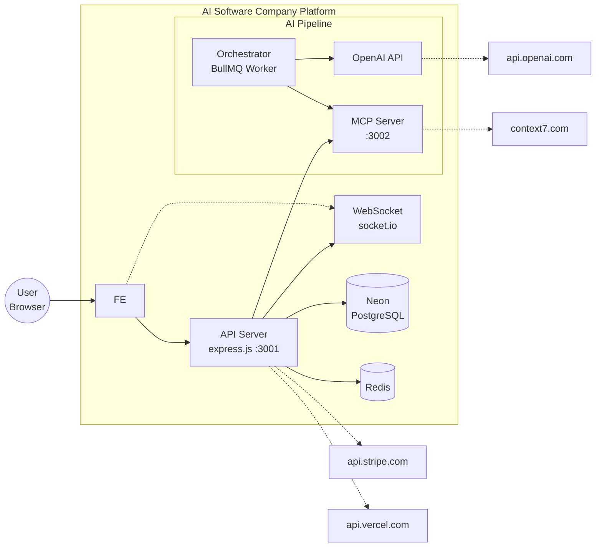
```mermaid
graph LR
    USER(("User
          Browser")) --> FE
    
    subgraph "AI Software Company Platform"
        FE --> API["API Server
                    express.js :3001"]
        API --> WS["WebSocket
                    socket.io"]
        API --> MCP["MCP Server
                     :3002"]
        API --> DB[("Neon
                     PostgreSQL")]
        API --> RD[("Redis")]
        
        subgraph "AI Pipeline"
            ORCH["Orchestrator
                  BullMQ Worker"] --> LLM["OpenAI API"]
            ORCH --> MCP
        end
    end

    FE -.-> WS
    
    LLM -.-> OA["api.openai.com"]
    MCP -.-> C7["context7.com"]
    API -.-> ST["api.stripe.com"]
    API -.-> VC["api.vercel.com"]
```

### 1.4 Architecture Decisions Record

| ID | Decision | Rationale | Consequence |
|----|----------|-----------|-------------|
| ADR-001 | Layered Hexagonal Architecture | Domain isolation, testability, replaceable adapters | More boilerplate but cleaner boundaries |
| ADR-002 | Event-driven agent pipeline via BullMQ | Async execution, retries, scalability, observability | Redis dependency |
| ADR-003 | Monorepo with npm workspaces | Shared types, single build, unified tooling | Coupled release cycle |
| ADR-004 | MCP as tool abstraction layer | Standardised protocol, tool isolation, extensibility | Slight latency overhead |
| ADR-005 | Serverless-first (Vercel) | Auto-scaling, reduced ops, edge CDN | Cold starts, 10s function limit |

---

## 2. Monorepo Architecture

### 2.1 Workspace Topology

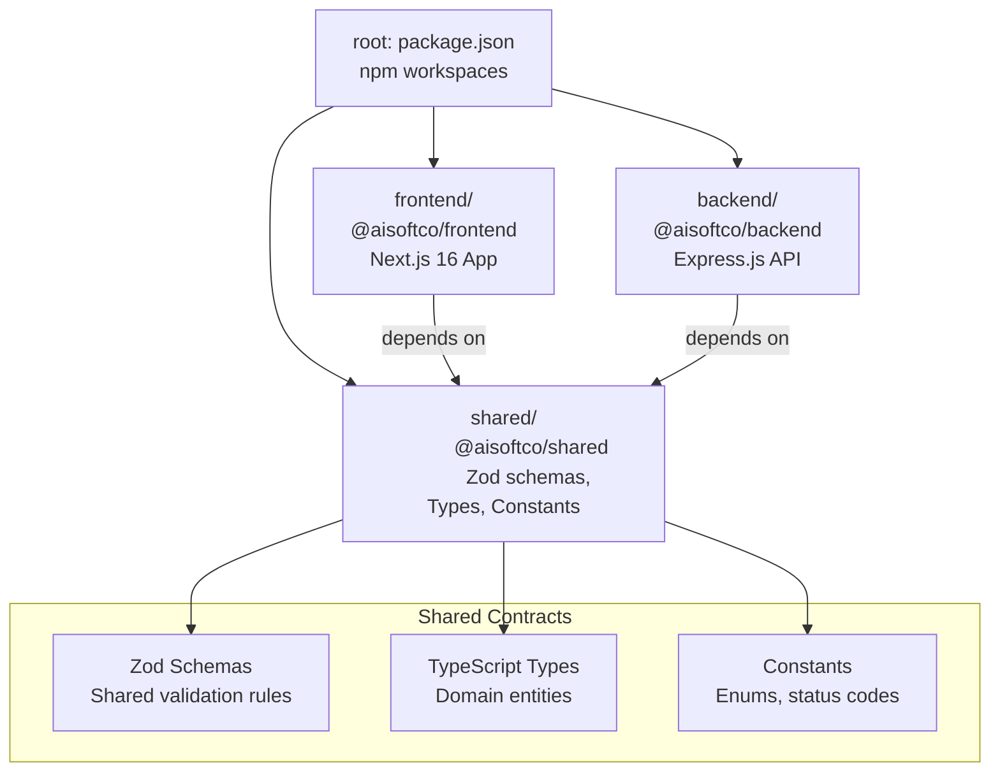
```mermaid
graph TD
    ROOT["root: package.json
          npm workspaces"] --> SHARED["shared/
          @aisoftco/shared
          Zod schemas, Types, Constants"]
    ROOT --> FE["frontend/
          @aisoftco/frontend
          Next.js 16 App"]
    ROOT --> BE["backend/
          @aisoftco/backend
          Express.js API"]
    
    FE -->|"depends on"| SHARED
    BE -->|"depends on"| SHARED
    
    subgraph "Shared Contracts"
        S1["Zod Schemas
            Shared validation rules"]
        S2["TypeScript Types
            Domain entities"]
        S3["Constants
            Enums, status codes"]
    end
    
    SHARED --> S1
    SHARED --> S2
    SHARED --> S3
```

### 2.2 Root Configuration

```
ai-soft-comp/
├── package.json              # npm workspaces: ["shared", "frontend", "backend"]
├── tsconfig.base.json        # strict: true, ES2022, bundler module resolution
├── .eslintrc.cjs             # Flat config with @typescript-eslint/strict
├── .prettierrc               # semi, singleQuote, trailingComma: es5
├── .gitignore                # node_modules, .env, .next, dist
│
├── shared/                   # @aisoftco/shared (library)
│   ├── package.json          # name: @aisoftco/shared, type: module
│   ├── tsconfig.json         # extends: ../tsconfig.base.json
│   └── src/
│
├── frontend/                 # @aisoftco/frontend (application)
│   ├── package.json          # name: @aisoftco/frontend
│   ├── tsconfig.json         # extends: ../tsconfig.base.json
│   ├── next.config.ts
│   ├── tailwind.config.ts
│   └── src/
│
├── backend/                  # @aisoftco/backend (application)
│   ├── package.json          # name: @aisoftco/backend
│   ├── tsconfig.json         # extends: ../tsconfig.base.json
│   ├── drizzle.config.ts
│   └── src/
│
└── docs/                     # Architecture specifications
    └── 01-PRD.md ... 13-Implementation-Guide.md
```

### 2.3 Dependency Rules

- `shared/` must NOT depend on `frontend/` or `backend/`
- `frontend/` may import from `shared/` only
- `backend/` may import from `shared/` only
- No circular dependencies between any workspaces
- All cross-workspace imports use the workspace name: `@aisoftco/shared`

---

## 3. Frontend Architecture

### 3.1 Component Architecture

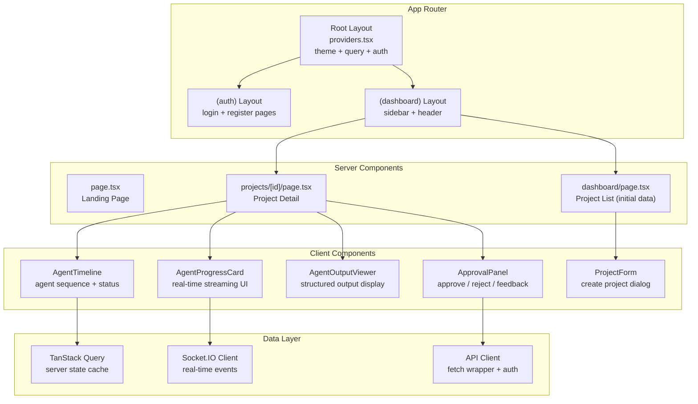
```mermaid
graph TD
    subgraph "App Router"
        RL["Root Layout
            providers.tsx
            theme + query + auth"]
        LL["(auth) Layout
            login + register pages"]
        DL["(dashboard) Layout
            sidebar + header"]
    end

    subgraph "Server Components"
        PL["page.tsx
            Landing Page"]
        DPL["dashboard/page.tsx
            Project List (initial data)"]
        PDL["projects/[id]/page.tsx
            Project Detail"]
    end

    subgraph "Client Components"
        AP["ApprovalPanel
            approve / reject / feedback"]
        AT["AgentTimeline
            agent sequence + status"]
        AV["AgentOutputViewer
            structured output display"]
        APF["AgentProgressCard
            real-time streaming UI"]
        PF["ProjectForm
            create project dialog"]
    end

    subgraph "Data Layer"
        RQ["TanStack Query
            server state cache"]
        WS["Socket.IO Client
            real-time events"]
        AC["API Client
            fetch wrapper + auth"]
    end

    RL --> LL
    RL --> DL
    DL --> DPL
    DL --> PDL
    PDL --> AP
    PDL --> AT
    PDL --> AV
    PDL --> APF
    DPL --> PF
    APF --> WS
    AP --> AC
    AT --> RQ
```

### 3.2 Server vs Client Component Split

| Category | Server Components | Client Components |
|----------|-----------------|-------------------|
| **Data Fetching** | Initial page data, SEO content | Mutations, real-time updates |
| **Auth** | Middleware redirect | Auth context, token management |
| **Projects** | List with initial data | CRUD mutations, detail view |
| **Agent UI** | — | Timeline, streaming, approval |
| **Settings** | Static form layout | Form state, validation |
| **Layout** | Shell, metadata | Sidebar toggle, theme switch |

### 3.3 State Management Matrix

| State Category | Tool | Scope | Persistence |
|---------------|------|-------|-------------|
| Server state | TanStack Query | Global | Cache in memory |
| Auth state | React Context | Global | JWT in localStorage |
| Real-time state | Socket.IO | Per-project | In-memory only |
| Form state | React Hook Form | Local | Not persisted |
| UI state | useState / useReducer | Component | Not persisted |
| Theme | next-themes | Global | localStorage |
| URL state | useParams / useSearchParams | Route | URL bar |

### 3.4 Route Design

```typescript
// Route hierarchy with component allocation
export const routes = {
  public: {
    '/'                     // Server: Landing page
    '/login'                // Client: Login form
    '/register'             // Client: Register form
  },
  protected: {
    '/dashboard'            // Server: Project list (initial data)
    '/projects/[id]'        // Mixed: Detail (server) + interactive (client)
    '/projects/[id]/settings' // Client: Project settings form
    '/teams'                // Server: Team list
    '/teams/[id]'           // Mixed: Team detail + member management
    '/settings'             // Server: User settings
    '/settings/billing'     // Client: Billing management
  }
}
```

---

## 4. Backend Architecture

### 4.1 Application Topology

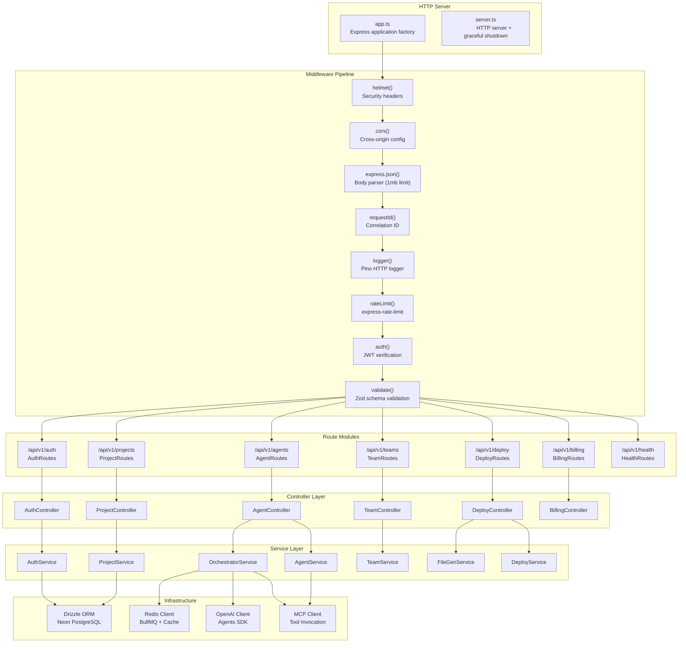
```mermaid
graph TD
    subgraph "HTTP Server"
        APP["app.ts
            Express application factory"]
        SRV["server.ts
            HTTP server + graceful shutdown"]
    end

    subgraph "Middleware Pipeline"
        M1["helmet()
            Security headers"]
        M2["cors()
            Cross-origin config"]
        M3["express.json()
            Body parser (1mb limit)"]
        M4["requestId()
            Correlation ID"]
        M5["logger()
            Pino HTTP logger"]
        M6["rateLimit()
            express-rate-limit"]
        M7["auth()
            JWT verification"]
        M8["validate()
            Zod schema validation"]
    end

    subgraph "Route Modules"
        R1["/api/v1/auth
            AuthRoutes"]
        R2["/api/v1/projects
            ProjectRoutes"]
        R3["/api/v1/agents
            AgentRoutes"]
        R4["/api/v1/teams
            TeamRoutes"]
        R5["/api/v1/deploy
            DeployRoutes"]
        R6["/api/v1/billing
            BillingRoutes"]
        R7["/api/v1/health
            HealthRoutes"]
    end

    subgraph "Controller Layer"
        C1["AuthController"]
        C2["ProjectController"]
        C3["AgentController"]
        C4["TeamController"]
        C5["DeployController"]
        C6["BillingController"]
    end

    subgraph "Service Layer"
        S1["AuthService"]
        S2["ProjectService"]
        S3["OrchestratorService"]
        S4["AgentService"]
        S5["TeamService"]
        S6["FileGenService"]
        S7["DeployService"]
    end

    subgraph "Infrastructure"
        I1["Drizzle ORM
            Neon PostgreSQL"]
        I2["Redis Client
            BullMQ + Cache"]
        I3["OpenAI Client
            Agents SDK"]
        I4["MCP Client
            Tool Invocation"]
    end

    APP --> M1 --> M2 --> M3 --> M4 --> M5
    M5 --> M6 --> M7 --> M8
    M8 --> R1 & R2 & R3 & R4 & R5 & R6 & R7
    R1 --> C1
    R2 --> C2
    R3 --> C3
    R4 --> C4
    R5 --> C5
    R6 --> C6
    C1 --> S1
    C2 --> S2
    C3 --> S3
    C3 --> S4
    C4 --> S5
    C5 --> S6
    C5 --> S7
    S1 --> I1
    S2 --> I1
    S3 --> I2
    S3 --> I3
    S3 --> I4
    S4 --> I4
```

### 4.2 Request Lifecycle

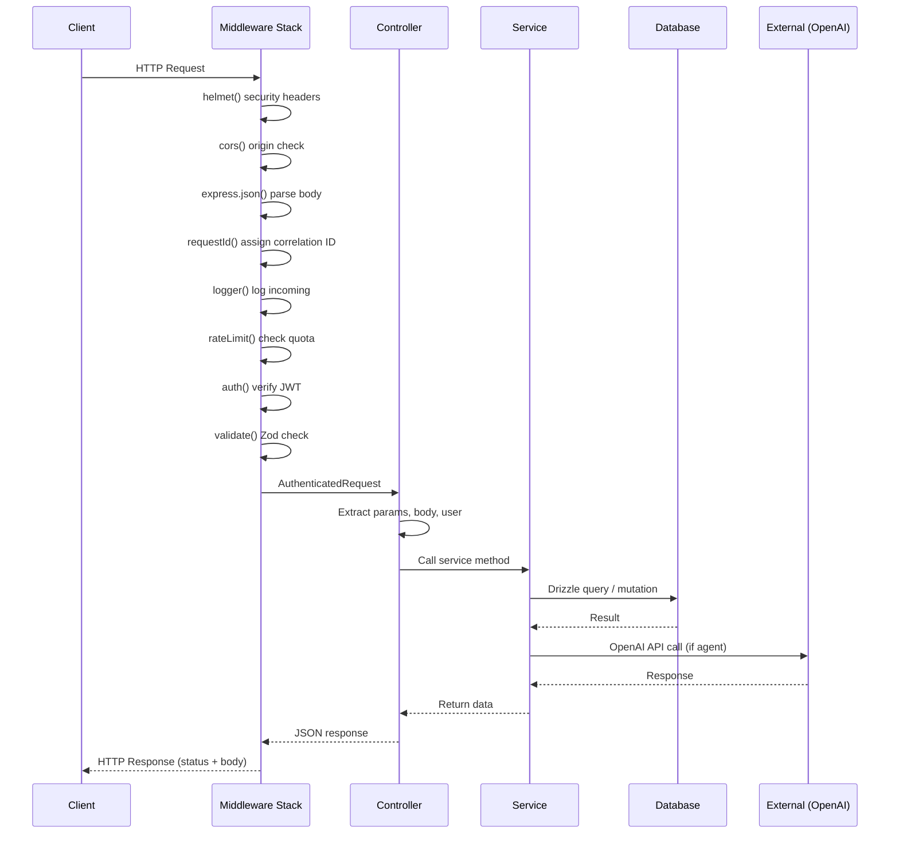
```mermaid
sequenceDiagram
    participant C as Client
    participant MW as Middleware Stack
    participant CTRL as Controller
    participant SVC as Service
    participant DB as Database
    participant EXT as External (OpenAI)

    C->>MW: HTTP Request
    MW->>MW: helmet() security headers
    MW->>MW: cors() origin check
    MW->>MW: express.json() parse body
    MW->>MW: requestId() assign correlation ID
    MW->>MW: logger() log incoming
    MW->>MW: rateLimit() check quota
    MW->>MW: auth() verify JWT
    MW->>MW: validate() Zod check
    MW->>CTRL: AuthenticatedRequest

    CTRL->>CTRL: Extract params, body, user
    CTRL->>SVC: Call service method
    SVC->>DB: Drizzle query / mutation
    DB-->>SVC: Result
    SVC->>EXT: OpenAI API call (if agent)
    EXT-->>SVC: Response
    SVC-->>CTRL: Return data
    CTRL-->>MW: JSON response
    MW-->>C: HTTP Response (status + body)
```

---

## 5. MVC Layer Responsibilities

### 5.1 Layer Contract

| Layer | Responsibility | Allowed to Import | NOT Allowed |
|-------|---------------|-------------------|-------------|
| **Route** | Map URL pattern to controller method | Controller, Middleware | Business logic, DB access |
| **Middleware** | Pre-process request, post-process response | Services (rarely) | Business logic |
| **Controller** | Parse HTTP concerns, delegate to services, format response | Services, Zod schemas | DB access, external APIs |
| **Service** | Business logic, orchestration, workflow coordination | Other Services, Repository/DB | HTTP req/res objects |
| **Repository** | Data access, query construction (via Drizzle) | Drizzle ORM | Business logic, HTTP |

### 5.2 Controller Pattern (Strict)

```typescript
// Controller — ONLY handles HTTP, delegates everything
export class ProjectController {
  constructor(private projectService: ProjectService) {}
  //                    ^ Dependency injection via constructor

  create = async (req: AuthenticatedRequest, res: Response, next: NextFunction) => {
    // 1. Extract — no parsing logic in controller
    const input = req.body as CreateProjectInput;

    try {
      // 2. Delegate — single service call, no conditional logic
      const project = await this.projectService.create(req.user.id, input);

      // 3. Respond — standardised JSON envelope
      res.status(201).json({ success: true, data: { project } });
    } catch (error) {
      next(error); // Delegate to global error handler
    }
  };
  // Controller method is exactly 3 concerns: extract, delegate, respond
}
```

### 5.3 Service Pattern (Strict)

```typescript
// Service — ALL business logic lives here
export class ProjectService {
  constructor(
    private db: DrizzleClient,
    private orchestrator: OrchestratorService
  ) {}

  async create(userId: string, input: CreateProjectInput): Promise<Project> {
    // 1. Validate business rules
    const quotaOk = await this.checkUserQuota(userId);
    if (!quotaOk) throw new AppError(429, 'QUOTA_EXCEEDED', 'Project limit reached');

    // 2. Execute domain logic
    const [project] = await this.db.insert(projects)
      .values({ userId, ...input, status: 'draft' })
      .returning();

    // 3. Trigger side effects (async, fire-and-forget)
    this.orchestrator.startPipeline(project.id).catch(
      error => logger.error({ error, projectId: project.id }, 'Pipeline failed')
    );

    // 4. Return domain object
    return project;
  }
}
```

---

## 6. Service Layer Design

### 6.1 Service Inventory

| Service | Responsibility | Dependencies |
|---------|---------------|--------------|
| `AuthService` | Register, login, refresh, logout | UserRepository, TokenService, EmailService |
| `TokenService` | JWT sign, verify, refresh | None (stateless) |
| `UserService` | Profile CRUD, preferences | UserRepository |
| `ProjectService` | Project CRUD, status mgmt | ProjectRepository, OrchestratorService |
| `OrchestratorService` | Pipeline lifecycle, agent sequencing | BullMQ queue, AgentExecutor |
| `AgentService` | Agent output CRUD, feedback processing | AgentOutputRepository |
| `TeamService` | Team CRUD, membership, roles | TeamRepository, MembershipRepository |
| `FileGenerationService` | Write generated files to disk | ProjectRepository |
| `DeployService` | Deployment to Vercel | Vercel API client |
| `BillingService` | Stripe subscriptions, webhooks | Stripe API client |
| `MCPService` | MCP tool invocation, caching | MCP client |

### 6.2 Service Interaction Rules

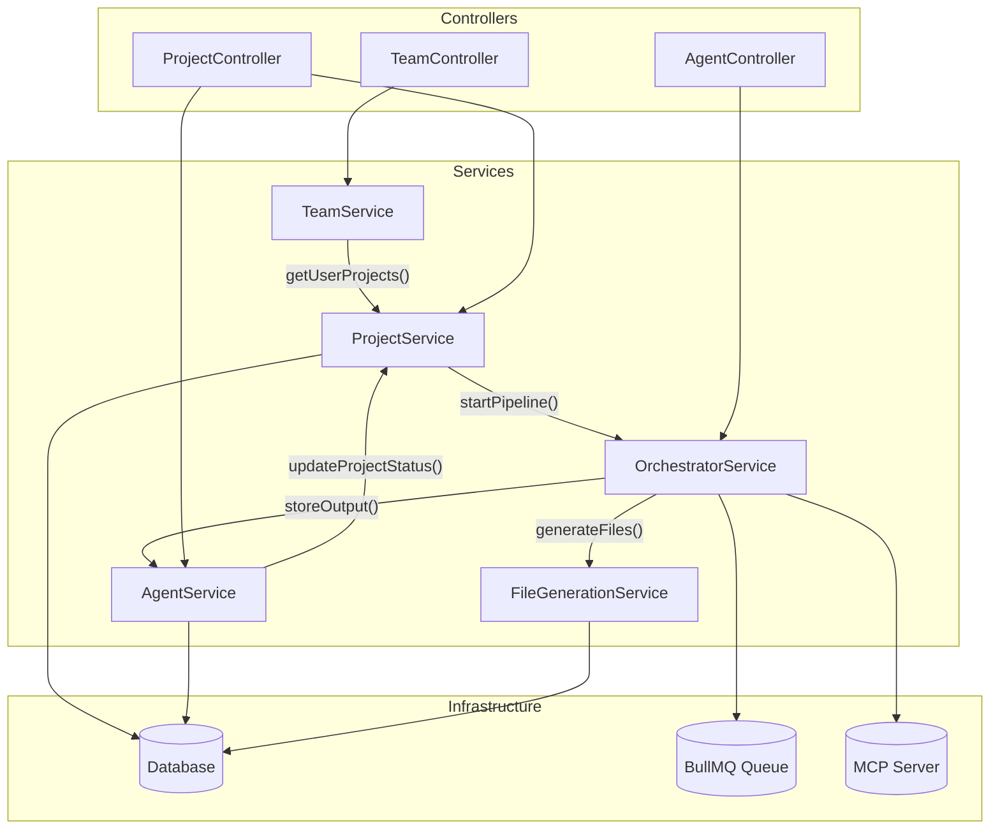
```mermaid
graph TD
    subgraph "Controllers"
        PC["ProjectController"]
        AC["AgentController"]
        TC["TeamController"]
    end

    subgraph "Services"
        PS["ProjectService"]
        OR["OrchestratorService"]
        AS["AgentService"]
        TS["TeamService"]
        FG["FileGenerationService"]
    end

    subgraph "Infrastructure"
        DB[("Database")]
        Q[("BullMQ Queue")]
        MCP[("MCP Server")]
    end

    %% Service-to-service calls (allowed)
    PS -->|"startPipeline()"| OR
    OR -->|"storeOutput()"| AS
    OR -->|"generateFiles()"| FG
    AS -->|"updateProjectStatus()"| PS
    TS -->|"getUserProjects()"| PS

    %% Service-to-infrastructure (allowed)
    PS --> DB
    OR --> Q
    AS --> DB
    FG --> DB
    OR --> MCP

    %% Controller-to-service (allowed)
    PC --> PS
    PC --> AS
    AC --> OR
    TC --> TS
```

### 6.3 Cross-Cutting Services

| Cross-Cutting Concern | Implementation | Applied At |
|----------------------|----------------|------------|
| Logging | Pino logger singleton | Service + Middleware |
| Error handling | Custom AppError classes | Service (throw) + Middleware (catch) |
| Validation | Zod schemas in `@aisoftco/shared` | Controller (via middleware) + Service |
| Caching | Redis cache-aside pattern | Service layer |
| Rate limiting | express-rate-limit + Redis | Middleware layer |
| Metrics | Prometheus client (future) | Middleware layer |

---

## 7. Repository Layer Design

### 7.1 Data Access Pattern

The system uses **Drizzle ORM directly in the service layer** rather than an additional repository abstraction. Drizzle's query builder already provides type-safe, composable data access that serves the role of a repository.

```typescript
// Direct Drizzle usage in service (no separate repository class)
export class ProjectService {
  constructor(private db: DrizzleClient) {}

  async findById(id: string, userId: string): Promise<ProjectDetail | null> {
    return this.db.query.projects.findFirst({
      where: and(
        eq(projects.id, id),
        eq(projects.userId, userId),
        isNull(projects.deletedAt)
      ),
      with: {
        agentOutputs: {
          orderBy: [desc(agentOutputs.createdAt)],
          limit: 10
        },
        projectFiles: true,
        deployments: { orderBy: [desc(deployments.createdAt)], limit: 1 }
      }
    });
  }
}
```

### 7.2 When to Extract a Repository

| Condition | Extract Repository? | Example |
|-----------|-------------------|---------|
| Simple CRUD, one table | No — use Drizzle directly in service | UserService |
| Complex queries shared across services | Yes — extract query builder | AnalyticsRepository |
| Cross-aggregate queries | No — compose in service | ProjectService with agent outputs |
| Test mocking required | Yes — extract interface | PaymentRepository (Stripe wrapper) |

### 7.3 Transaction Boundaries

```typescript
// Services manage their own transactions
export class ProjectService {
  async createWithPipeline(userId: string, input: CreateProjectInput): Promise<Project> {
    return this.db.transaction(async (tx) => {
      // All operations within this callback share the same transaction
      const [project] = await tx.insert(projects).values({ ... }).returning();
      await tx.insert(projectEvents).values({
        projectId: project.id,
        eventType: 'project:created',
        payload: { userId }
      });
      return project;
    });
  }
  // Orchestrator runs in a SEPARATE async context (BullMQ job)
  // — it reads the committed project from the database
}
```

---

## 8. Database Architecture

### 8.1 Entity Relationship Diagram

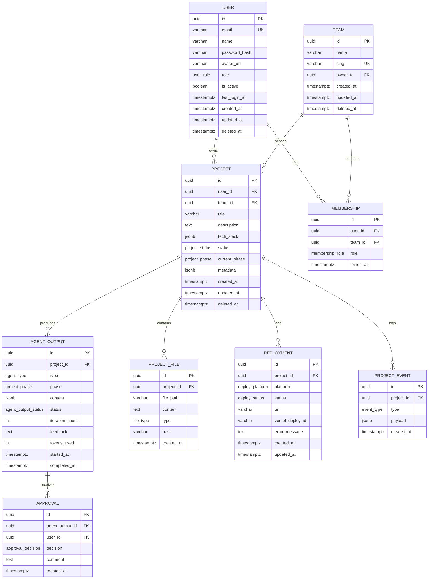
```mermaid
erDiagram
    USER ||--o{ PROJECT : owns
    USER ||--o{ MEMBERSHIP : has
    TEAM ||--o{ MEMBERSHIP : contains
    TEAM ||--o{ PROJECT : scopes
    PROJECT ||--o{ AGENT_OUTPUT : produces
    PROJECT ||--o{ PROJECT_FILE : contains
    PROJECT ||--o{ DEPLOYMENT : has
    PROJECT ||--o{ PROJECT_EVENT : logs
    AGENT_OUTPUT ||--o{ APPROVAL : receives

    USER {
        uuid id PK
        varchar email UK
        varchar name
        varchar password_hash
        varchar avatar_url
        user_role role
        boolean is_active
        timestamptz last_login_at
        timestamptz created_at
        timestamptz updated_at
        timestamptz deleted_at
    }

    TEAM {
        uuid id PK
        varchar name
        varchar slug UK
        uuid owner_id FK
        timestamptz created_at
        timestamptz updated_at
        timestamptz deleted_at
    }

    MEMBERSHIP {
        uuid id PK
        uuid user_id FK
        uuid team_id FK
        membership_role role
        timestamptz joined_at
    }

    PROJECT {
        uuid id PK
        uuid user_id FK
        uuid team_id FK
        varchar title
        text description
        jsonb tech_stack
        project_status status
        project_phase current_phase
        jsonb metadata
        timestamptz created_at
        timestamptz updated_at
        timestamptz deleted_at
    }

    AGENT_OUTPUT {
        uuid id PK
        uuid project_id FK
        agent_type type
        project_phase phase
        jsonb content
        agent_output_status status
        int iteration_count
        text feedback
        int tokens_used
        timestamptz started_at
        timestamptz completed_at
    }

    APPROVAL {
        uuid id PK
        uuid agent_output_id FK
        uuid user_id FK
        approval_decision decision
        text comment
        timestamptz created_at
    }

    PROJECT_FILE {
        uuid id PK
        uuid project_id FK
        varchar file_path
        text content
        file_type type
        varchar hash
        timestamptz created_at
    }

    DEPLOYMENT {
        uuid id PK
        uuid project_id FK
        deploy_platform platform
        deploy_status status
        varchar url
        varchar vercel_deploy_id
        text error_message
        timestamptz created_at
        timestamptz updated_at
    }

    PROJECT_EVENT {
        uuid id PK
        uuid project_id FK
        event_type type
        jsonb payload
        timestamptz created_at
    }
```

### 8.2 Indexing Strategy

```sql
-- Performance-critical indexes
CREATE INDEX idx_projects_user_status ON projects(user_id, status) WHERE deleted_at IS NULL;
CREATE INDEX idx_projects_created_desc ON projects(created_at DESC) WHERE deleted_at IS NULL;
CREATE INDEX idx_agent_outputs_project ON agent_outputs(project_id, agent_type, iteration_count);
CREATE INDEX idx_agent_outputs_status ON agent_outputs(status);
CREATE INDEX idx_project_files_path ON project_files(project_id, file_path);
CREATE INDEX idx_project_events_timeline ON project_events(project_id, created_at DESC);
CREATE INDEX idx_memberships_user ON memberships(user_id);
CREATE INDEX idx_memberships_team ON memberships(team_id);
```

### 8.3 Neon PostgreSQL Configuration

| Parameter | Value | Rationale |
|-----------|-------|-----------|
| Engine | PostgreSQL 16 | Latest stable with Drizzle support |
| Compute | Auto-scaling (0.25–4 vCPU) | Match demand, minimise cost |
| Storage | 10 GB minimum, auto-scaling | Project file metadata growth |
| Connection pooler | pgBouncer (transaction mode) | Handle 1000+ concurrent connections |
| Backup | Daily automated + PITR 7-day | RPO < 1 hour |
| Branches | main (prod), dev, preview per PR | Isolated development |

---

## 9. AI Agent Architecture

### 9.1 Agent Pipeline Topology

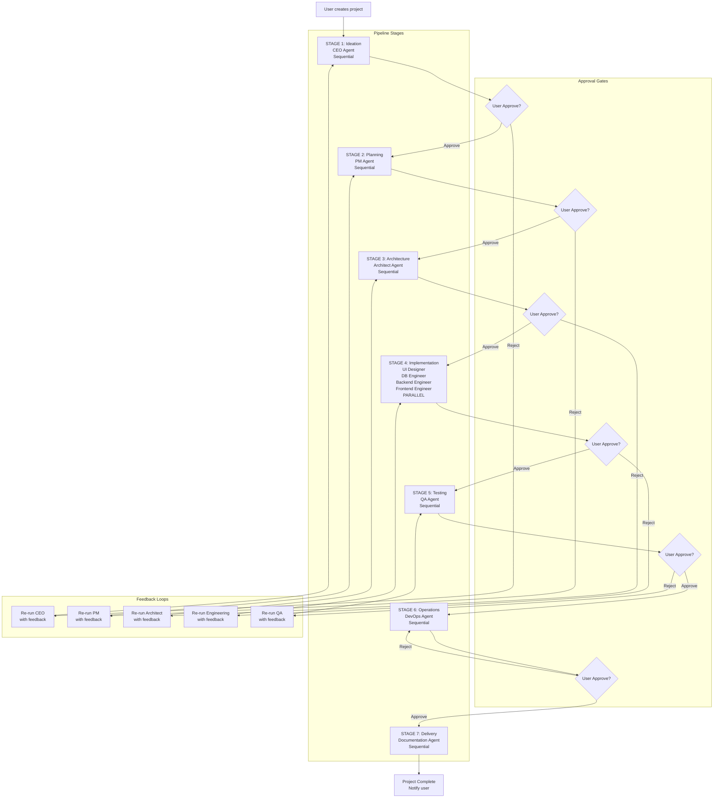
```mermaid
graph TB
    subgraph "Pipeline Stages"
        S1["STAGE 1: Ideation
             CEO Agent
             Sequential"]
        S2["STAGE 2: Planning
             PM Agent
             Sequential"]
        S3["STAGE 3: Architecture
             Architect Agent
             Sequential"]
        S4["STAGE 4: Implementation
             UI Designer
             DB Engineer
             Backend Engineer
             Frontend Engineer
             PARALLEL"]
        S5["STAGE 5: Testing
             QA Agent
             Sequential"]
        S6["STAGE 6: Operations
             DevOps Agent
             Sequential"]
        S7["STAGE 7: Delivery
             Documentation Agent
             Sequential"]
    end

    subgraph "Approval Gates"
        G1{User Approve?}
        G2{User Approve?}
        G3{User Approve?}
        G4{User Approve?}
        G5{User Approve?}
        G6{User Approve?}
    end

    subgraph "Feedback Loops"
        F1["Re-run CEO
            with feedback"]
        F2["Re-run PM
            with feedback"]
        F3["Re-run Architect
            with feedback"]
        F4["Re-run Engineering
            with feedback"]
        F5["Re-run QA
            with feedback"]
    end

    Start["User creates project"] --> S1
    S1 --> G1
    G1 -->|Approve| S2
    G1 -->|Reject| F1
    F1 --> S1
    S2 --> G2
    G2 -->|Approve| S3
    G2 -->|Reject| F2
    F2 --> S2
    S3 --> G3
    G3 -->|Approve| S4
    G3 -->|Reject| F3
    F3 --> S3
    S4 --> G4
    G4 -->|Approve| S5
    G4 -->|Reject| F4
    F4 --> S4
    S5 --> G5
    G5 -->|Approve| S6
    G5 -->|Reject| F5
    F5 --> S5
    S6 --> G6
    G6 -->|Approve| S7
    G6 -->|Reject| S6
    S7 --> Done["Project Complete
                  Notify user"]
```

### 9.2 Agent Execution Model

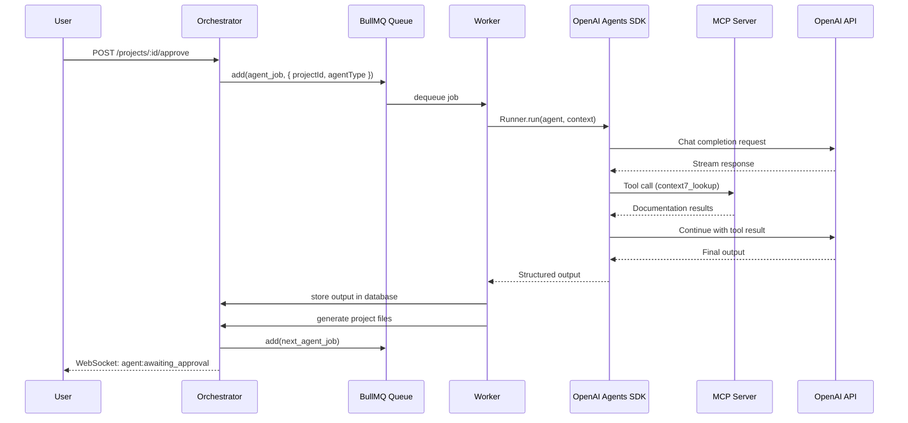
```mermaid
sequenceDiagram
    participant U as User
    participant O as Orchestrator
    participant Q as BullMQ Queue
    participant W as Worker
    participant SDK as OpenAI Agents SDK
    participant MCP as MCP Server
    participant LLM as OpenAI API

    U->>O: POST /projects/:id/approve
    O->>Q: add(agent_job, { projectId, agentType })
    Q->>W: dequeue job
    W->>SDK: Runner.run(agent, context)
    SDK->>LLM: Chat completion request
    LLM-->>SDK: Stream response
    SDK->>MCP: Tool call (context7_lookup)
    MCP-->>SDK: Documentation results
    SDK->>LLM: Continue with tool result
    LLM-->>SDK: Final output
    SDK-->>W: Structured output
    W->>O: store output in database
    W->>O: generate project files
    O->>Q: add(next_agent_job)
    O-->>U: WebSocket: agent:awaiting_approval
```

### 9.3 Prompt Architecture

```typescript
// Every agent prompt follows the same structure:
const systemPrompt = `
You are ${ROLE}. Your purpose is ${PURPOSE}.

## Project Context
${accumulatedContext}

## Current Task
${taskDescription}

## Available Tools
${toolDescriptions}

## Output Format
Respond with valid JSON matching this schema:
${JSON.stringify(outputSchema, null, 2)}

## Quality Constraints
- ${constraint1}
- ${constraint2}

## User Preferences
- Tech Stack: ${techStack}
- ${additionalPreferences}
`;
```

### 9.4 Agent Tool Registry

| Agent | Tools Available | Purpose |
|-------|----------------|---------|
| CEO | `resolve_library_id`, `query_docs` | Tech stack research |
| PM | `resolve_library_id`, `query_docs` | Market/requirement research |
| Architect | `resolve_library_id`, `query_docs` | Architecture pattern research |
| UI Designer | `resolve_library_id`, `query_docs` | Component API lookup |
| DB Engineer | `resolve_library_id`, `query_docs` | Drizzle/Postgres docs |
| Backend Engineer | `read_file`, `write_file`, `execute_command`, `query_docs` | Code generation |
| Frontend Engineer | `read_file`, `write_file`, `execute_command`, `query_docs` | Code generation |
| QA | `read_file`, `lint_code`, `type_check`, `execute_command` | Test + verify |
| DevOps | `read_file`, `write_file`, `execute_command` | Config generation |
| Documentation | `read_file`, `write_file` | Final document compilation |

---

## 10. MCP Architecture

### 10.1 MCP Server Topology

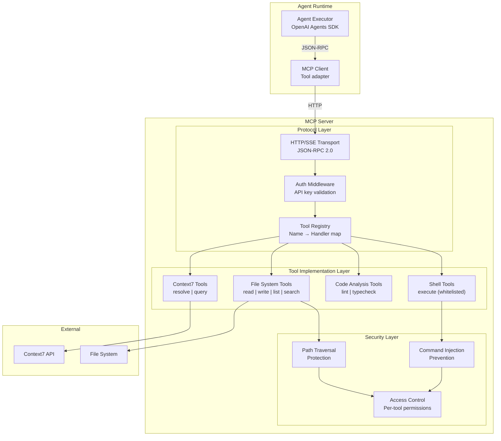
```mermaid
graph TB
    subgraph "Agent Runtime"
        AE["Agent Executor
            OpenAI Agents SDK"]
        MC["MCP Client
            Tool adapter"]
    end

    subgraph "MCP Server"
        subgraph "Protocol Layer"
            H["HTTP/SSE Transport
                JSON-RPC 2.0"]
            R["Tool Registry
                Name → Handler map"]
            AUTH["Auth Middleware
                API key validation"]
        end

        subgraph "Tool Implementation Layer"
            FS["File System Tools
                read | write | list | search"]
            C7["Context7 Tools
                resolve | query"]
            CA["Code Analysis Tools
                lint | typecheck"]
            SH["Shell Tools
                execute (whitelisted)"]
        end

        subgraph "Security Layer"
            PT["Path Traversal
                Protection"]
            CI["Command Injection
                Prevention"]
            ACL["Access Control
                Per-tool permissions"]
        end
    end

    subgraph "External"
        CTX["Context7 API"]
        LOCAL["File System"]
    end

    AE -->|JSON-RPC| MC
    MC -->|HTTP| H
    H --> AUTH
    AUTH --> R
    R --> FS
    R --> C7
    R --> CA
    R --> SH
    FS --> PT
    SH --> CI
    C7 --> CTX
    FS --> LOCAL
    PT --> ACL
    CI --> ACL
```

### 10.2 Tool Definition Contract

```typescript
// Every MCP tool follows this contract:
interface MCPTool {
  name: string;                    // Unique tool identifier
  description: string;             // Human-readable purpose
  inputSchema: {                   // Zod-compatible JSON Schema
    type: 'object';
    properties: Record<string, Schema>;
    required: string[];
  };
  execute: (args: unknown) => Promise<unknown>;
}

// Example tool registration:
const tools = new Map<string, MCPTool>([
  ['read_file', {
    name: 'read_file',
    description: 'Read file contents within project directory',
    inputSchema: {
      type: 'object',
      properties: {
        path: { type: 'string', description: 'Relative path from project root' }
      },
      required: ['path']
    },
    execute: async ({ path }) => {
      const safePath = resolveSafePath(path); // Path traversal protection
      return fs.readFile(safePath, 'utf-8');
    }
  }],
  // ... 11 more tools
]);
```

### 10.3 Security Controls

| Control | Implementation | Enforced At |
|---------|---------------|-------------|
| Path traversal prevention | `resolveSafePath()` normalises + validates path is within project root | Every file system tool |
| Command allowlist | Only `npm`, `npx`, `node`, `git`, `ls`, `cat` allowed | Shell tool |
| Command argument sanitisation | Regex validation, no pipes/semicolons/subshells | Shell tool |
| File size limit | Max 10MB per read/write operation | File system tools |
| Rate limiting | 60 tool calls/min per agent session | MCP auth middleware |
| Authentication | Bearer token in `Authorization` header | MCP auth middleware |
| Audit logging | All tool calls logged with agent ID, timestamp, params | MCP logging middleware |

---

## 11. API Architecture

### 11.1 API Design Conventions

| Convention | Standard | Rationale |
|------------|----------|-----------|
| Base URL | `/api/v1/` | URL-based versioning |
| Protocol | HTTPS (WSS for WebSocket) | Encrypted transport |
| Format | JSON (`application/json`) | Universal, type-safe |
| Pagination | Cursor-based for lists | Stable under write load |
| Errors | Consistent envelope `{ success, error, meta }` | Predictable parsing |
| Idempotency | Idempotency key header for mutations | Safe retries |

### 11.2 Endpoint Catalogue

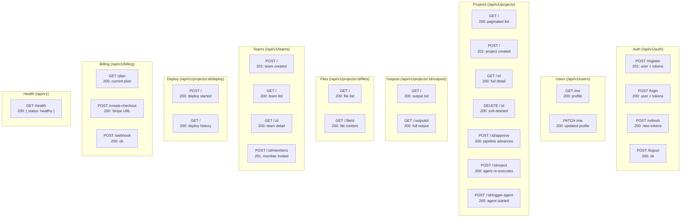
```mermaid
graph TD
    subgraph "Auth (/api/v1/auth)"
        REG["POST /register
             201: user + tokens"]
        LOG["POST /login
             200: user + tokens"]
        REF["POST /refresh
             200: new tokens"]
        LOGOUT["POST /logout
             200: ok"]
    end

    subgraph "Users (/api/v1/users)"
        ME["GET /me
             200: profile"]
        UPD["PATCH /me
             200: updated profile"]
    end

    subgraph "Projects (/api/v1/projects)"
        PLIST["GET /
              200: paginated list"]
        PCREATE["POST /
               201: project created"]
        PGET["GET /:id
             200: full detail"]
        PDEL["DELETE /:id
             200: soft deleted"]
        PAPP["POST /:id/approve
             200: pipeline advances"]
        PREJ["POST /:id/reject
             200: agent re-executes"]
        PTRIG["POST /:id/trigger-agent
              200: agent started"]
    end

    subgraph "Outputs (/api/v1/projects/:id/outputs)"
        OLIST["GET /
              200: output list"]
        OGET["GET /:outputId
             200: full output"]
    end

    subgraph "Files (/api/v1/projects/:id/files)"
        FLIST["GET /
              200: file list"]
        FGET["GET /:fileId
             200: file content"]
    end

    subgraph "Teams (/api/v1/teams)"
        TCREATE["POST /
                201: team created"]
        TLIST["GET /
              200: team list"]
        TGET["GET /:id
             200: team detail"]
        TINV["POST /:id/members
             201: member invited"]
    end

    subgraph "Deploy (/api/v1/projects/:id/deploy)"
        DTRIG["POST /
              200: deploy started"]
        DLIST["GET /
              200: deploy history"]
    end

    subgraph "Billing (/api/v1/billing)"
        BPLAN["GET /plan
              200: current plan"]
        BCHK["POST /create-checkout
             200: Stripe URL"]
        BWEB["POST /webhook
             200: ok"]
    end

    subgraph "Health (/api/v1)"
        HLT["GET /health
             200: { status: healthy }"]
    end
```

### 11.3 Response Envelope Contract

```typescript
// Every API response uses this exact shape:

// Success (single resource)
type SuccessResponse<T> = {
  success: true;
  data: T;
  meta: {
    requestId: string;
    timestamp: string;
  };
};

// Success (list)
type ListResponse<T> = {
  success: true;
  data: T[];
  meta: {
    requestId: string;
    timestamp: string;
    page: number;
    limit: number;
    total: number;
    totalPages: number;
  };
};

// Error
type ErrorResponse = {
  success: false;
  error: {
    code: string;         // Machine-readable: "VALIDATION_ERROR"
    message: string;      // Human-readable: "Validation failed"
    details?: Array<{     // Field-level errors
      field: string;
      message: string;
      code: string;
    }>;
  };
  meta: {
    requestId: string;
    timestamp: string;
  };
};
```

---

## 12. Authentication Architecture

### 12.1 Token Flow

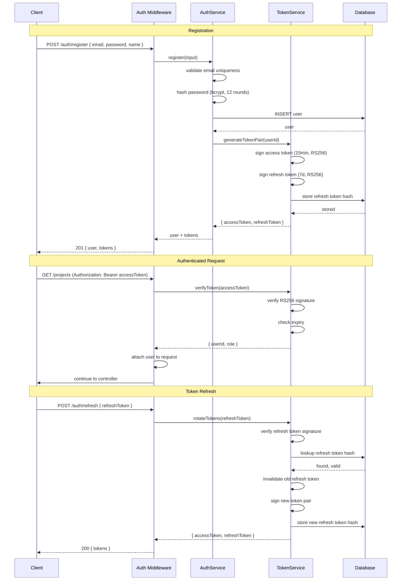
```mermaid
sequenceDiagram
    participant C as Client
    participant MW as Auth Middleware
    participant AS as AuthService
    participant TS as TokenService
    participant DB as Database

    Note over C,DB: Registration
    C->>MW: POST /auth/register { email, password, name }
    MW->>AS: register(input)
    AS->>AS: validate email uniqueness
    AS->>AS: hash password (bcrypt, 12 rounds)
    AS->>DB: INSERT user
    DB-->>AS: user
    AS->>TS: generateTokenPair(userId)
    TS->>TS: sign access token (15min, RS256)
    TS->>TS: sign refresh token (7d, RS256)
    TS->>DB: store refresh token hash
    DB-->>TS: stored
    TS-->>AS: { accessToken, refreshToken }
    AS-->>MW: user + tokens
    MW-->>C: 201 { user, tokens }

    Note over C,DB: Authenticated Request
    C->>MW: GET /projects (Authorization: Bearer accessToken)
    MW->>TS: verifyToken(accessToken)
    TS->>TS: verify RS256 signature
    TS->>TS: check expiry
    TS-->>MW: { userId, role }
    MW->>MW: attach user to request
    MW->>C: continue to controller

    Note over C,DB: Token Refresh
    C->>MW: POST /auth/refresh { refreshToken }
    MW->>TS: rotateTokens(refreshToken)
    TS->>TS: verify refresh token signature
    TS->>DB: lookup refresh token hash
    DB-->>TS: found, valid
    TS->>TS: invalidate old refresh token
    TS->>TS: sign new token pair
    TS->>DB: store new refresh token hash
    TS-->>MW: { accessToken, refreshToken }
    MW-->>C: 200 { tokens }
```

### 12.2 Token Specifications

| Attribute | Access Token | Refresh Token |
|-----------|-------------|---------------|
| **Format** | JWT (RS256 signed) | JWT (RS256 signed) |
| **Payload** | `{ sub: userId, role, type: 'access' }` | `{ sub: userId, jti: tokenId, type: 'refresh' }` |
| **Expiry** | 15 minutes | 7 days |
| **Storage (client)** | Memory / localStorage | Memory / httpOnly cookie |
| **Storage (server)** | Not stored (stateless) | SHA-256 hash in `refresh_tokens` table |
| **Rotation** | Re-issued on refresh | Old token invalidated, new one issued |
| **Revocation** | Not possible (short expiry) | Delete from database |

### 12.3 Auth Middleware

```typescript
// Middleware applies to all protected routes
// Three outcomes:
//   1. Valid token → attach user, call next()
//   2. Expired token → 401 TOKEN_EXPIRED (client should refresh)
//   3. Invalid/missing token → 401 UNAUTHORIZED
export const authMiddleware = async (req: Request, res: Response, next: NextFunction) => {
  const header = req.headers.authorization;
  if (!header?.startsWith('Bearer ')) throw new UnauthorizedError();

  const token = header.slice(7);
  const payload = await tokenService.verifyAccessToken(token);
  // payload = { sub: string, role: string }

  req.user = { id: payload.sub, role: payload.role };
  next();
};
```

---

## 13. Authorization Strategy

### 13.1 Role Hierarchy

```
System Roles (platform-wide):
─────────────────────────────────
admin     → Full system access
member    → Standard user

Team Roles (team-scoped):
─────────────────────────────────
owner     → Full team control, billing, delete
admin     → Manage members, edit team projects
member    → Create projects, view team projects
viewer    → Read-only access to team projects
```

### 13.2 Permission Matrix

| Action | Owner | Admin | Member | Viewer | Unauthenticated |
|--------|-------|-------|--------|--------|-----------------|
| Create project (personal) | ✓ | ✓ | ✓ | ✓ | ✗ |
| View own project | ✓ | ✓ | ✓ | ✓ | ✗ |
| Edit own project | ✓ | ✓ | ✓ | ✗ | ✗ |
| Delete own project | ✓ | ✓ | ✓ | ✗ | ✗ |
| Create team project | ✓ | ✓ | ✓ | ✗ | ✗ |
| View team project | ✓ | ✓ | ✓ | ✓ | ✗ |
| Edit team project | ✓ | ✓ | ✗ | ✗ | ✗ |
| Delete team project | ✓ | ✗ | ✗ | ✗ | ✗ |
| Invite team member | ✓ | ✓ | ✗ | ✗ | ✗ |
| Remove team member | ✓ | ✓ | ✗ | ✗ | ✗ |
| Change team role | ✓ | ✗ | ✗ | ✗ | ✗ |
| Delete team | ✓ | ✗ | ✗ | ✗ | ✗ |
| View billing | ✓ | ✓ | ✗ | ✗ | ✗ |
| Change plan | ✓ | ✗ | ✗ | ✗ | ✗ |

### 13.3 Authorization Enforcement

```typescript
// Strategy: Authorisation is enforced at the SERVICE layer,
// not in middleware or controllers.

export class TeamService {
  async deleteTeam(teamId: string, requestingUserId: string): Promise<void> {
    const membership = await this.getMembership(teamId, requestingUserId);
    // Authorisation check — single line, explicit
    if (membership?.role !== 'owner') throw new ForbiddenError('Only team owner can delete');

    await this.db.delete(teams).where(eq(teams.id, teamId));
  }

  async addMember(teamId: string, adminUserId: string, newMemberEmail: string): Promise<void> {
    const adminMembership = await this.getMembership(teamId, adminUserId);
    if (!adminMembership || !['owner', 'admin'].includes(adminMembership.role)) {
      throw new ForbiddenError('Only owner or admin can invite members');
    }
    // ... proceed with invitation
  }
}
```

---

## 14. File Storage Strategy

### 14.1 Storage Architecture

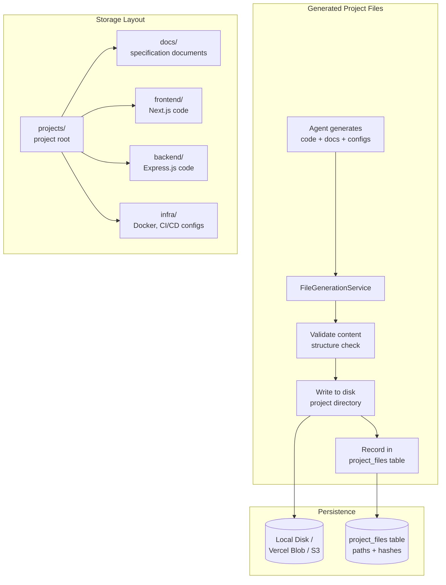
```mermaid
graph TB
    subgraph "Generated Project Files"
        GEN["Agent generates
             code + docs + configs"]
        GEN --> FGS["FileGenerationService"]
        FGS --> VAL["Validate content
                     structure check"]
        VAL --> WRITE["Write to disk
                       project directory"]
        WRITE --> DB["Record in
                      project_files table"]
    end

    subgraph "Storage Layout"
        BASE["projects/
              project root"]
        BASE --> DOCS["docs/
                       specification documents"]
        BASE --> FE["frontend/
                     Next.js code"]
        BASE --> BE["backend/
                     Express.js code"]
        BASE --> INFRA["infra/
                        Docker, CI/CD configs"]
    end

    subgraph "Persistence"
        DISK[("Local Disk /
               Vercel Blob / S3")]
        META[("project_files table
               paths + hashes")]
    end

    WRITE --> DISK
    DB --> META
```

### 14.2 Storage Location Strategy

| Environment | Storage Backend | Rationale |
|-------------|----------------|-----------|
| Development | Local filesystem (`./projects/`) | Simplicity, no network dependency |
| Production | Vercel Blob Storage (S3-compatible) | Scalable, CDN-backed, ephemeral-compatible |
| CI | Temporary directory | Ephemeral, cleaned after run |

### 14.3 File Integrity

```typescript
// Every file written has its SHA-256 hash stored in the database
// This enables:
//   1. Change detection between iterations
//   2. Integrity verification on download
//   3. Deduplication

async function writeGeneratedFile(
  projectId: string,
  filePath: string,
  content: string
): Promise<void> {
  const hash = crypto.createHash('sha256').update(content).digest('hex');

  await this.db.insert(projectFiles).values({
    projectId,
    filePath,
    content,
    hash,
    fileType: inferFileType(filePath)
  });

  await fs.mkdir(path.dirname(fullPath), { recursive: true });
  await fs.writeFile(fullPath, content, 'utf-8');
}
```

---

## 15. Logging Strategy

### 15.1 Log Architecture

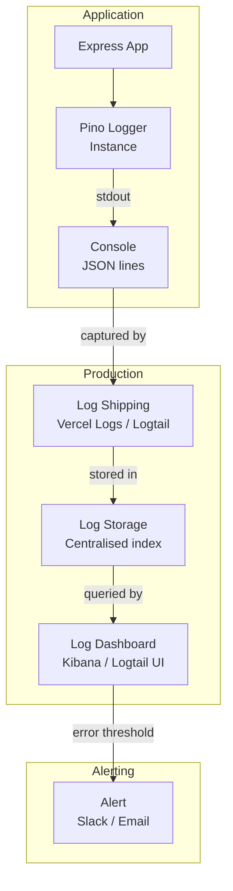
```mermaid
graph TB
    subgraph "Application"
        APP["Express App"]
        APP --> L["Pino Logger
                    Instance"]
        L -->|"stdout"| CONSOLE["Console
                                 JSON lines"]
    end

    subgraph "Production"
        CONSOLE -->|"captured by"| LOGSVC["Log Shipping
                                           Vercel Logs / Logtail"]
        LOGSVC -->|"stored in"| STORE["Log Storage
                                        Centralised index"]
        STORE -->|"queried by"| DASH["Log Dashboard
                                      Kibana / Logtail UI"]
    end

    subgraph "Alerting"
        DASH -->|"error threshold"| ALERT["Alert
                                           Slack / Email"]
    end
```

### 15.2 Log Levels and Usage

| Level | Usage | Example |
|-------|-------|---------|
| `fatal` | Unrecoverable, process will exit | Database connection failure on startup |
| `error` | Recoverable failure, operation failed | LLM API returning 500, DB query timeout |
| `warn` | Degraded state, retry in progress | Rate limit approaching, retry attempt 2/3 |
| `info` | State transition, lifecycle event | User registered, project created, agent completed |
| `debug` | Development troubleshooting | Request body, DB query params, token details |
| `trace` | Full internal state dump | LLM prompt text, full agent context |

### 15.3 Structured Log Format

```json
{
  "level": "info",
  "time": "2026-07-13T12:00:00.000Z",
  "msg": "Project created successfully",
  "reqId": "req_abc123",
  "service": "project-service",
  "userId": "usr_xyz789",
  "projectId": "proj_def456",
  "duration": 142,
  "metadata": {
    "title": "E-commerce Platform",
    "techStack": ["next.js", "express", "postgresql"]
  }
}
```

### 15.4 Logging Middleware

```typescript
// Every HTTP request is logged with:
//   - method, url, status code
//   - response time in ms
//   - request ID for correlation
//   - user ID (if authenticated)
//   - error message (if applicable)

app.use(pinoHttp({
  logger,
  autoLogging: {
    ignorePaths: ['/api/v1/health']  // Skip health check noise
  },
  customProps: (req) => ({
    userId: (req as AuthenticatedRequest).user?.id
  })
}));
```

---

## 16. Error Handling Strategy

### 16.1 Error Class Hierarchy

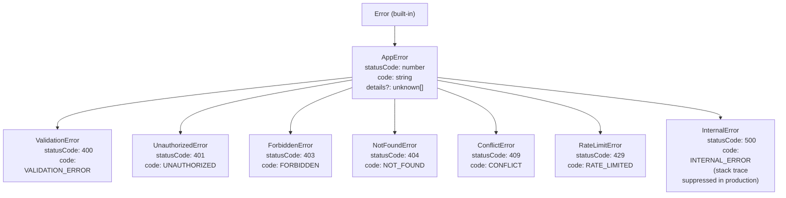
```mermaid
graph TD
    Err["Error (built-in)"]
    AppErr["AppError
            statusCode: number
            code: string
            details?: unknown[]"]
    ValErr["ValidationError
            statusCode: 400
            code: VALIDATION_ERROR"]
    AuthErr["UnauthorizedError
             statusCode: 401
             code: UNAUTHORIZED"]
    ForbErr["ForbiddenError
             statusCode: 403
             code: FORBIDDEN"]
    NFErr["NotFoundError
           statusCode: 404
           code: NOT_FOUND"]
    ConfErr["ConflictError
             statusCode: 409
             code: CONFLICT"]
    RateErr["RateLimitError
             statusCode: 429
             code: RATE_LIMITED"]
    IntErr["InternalError
            statusCode: 500
            code: INTERNAL_ERROR
            (stack trace suppressed in production)"]

    Err --> AppErr
    AppErr --> ValErr
    AppErr --> AuthErr
    AppErr --> ForbErr
    AppErr --> NFErr
    AppErr --> ConfErr
    AppErr --> RateErr
    AppErr --> IntErr
```

### 16.2 Error Propagation

```typescript
// Errors flow: Service → Controller → Global Error Handler → Client

// 1. Service layer throws domain-specific errors
export class ProjectService {
  async getById(id: string, userId: string): Promise<Project> {
    const project = await this.db.query.projects.findFirst({
      where: and(eq(projects.id, id), eq(projects.userId, userId))
    });
    if (!project) throw new NotFoundError('Project');
    //                                ^ Thrown here, caught by global handler
    return project;
  }
}

// 2. Controller catches nothing (delegates to next(error))
export class ProjectController {
  getById = async (req: AuthenticatedRequest, res: Response, next: NextFunction) => {
    try {
      const project = await this.projectService.getById(req.params.id, req.user.id);
      res.json({ success: true, data: { project } });
    } catch (error) {
      next(error);  // All errors forwarded to global handler
    }
  };
}

// 3. Global error handler formats consistently
export const errorHandler = (err: Error, req: Request, res: Response, next: NextFunction) => {
  if (err instanceof AppError) {
    return res.status(err.statusCode).json({
      success: false,
      error: {
        code: err.code,
        message: err.message,
        details: err.details
      },
      meta: { requestId: req.id, timestamp: new Date().toISOString() }
    });
  }

  // Unknown error — log full details, return generic message
  logger.error({ err, reqId: req.id }, 'Unhandled error');
  return res.status(500).json({
    success: false,
    error: {
      code: 'INTERNAL_ERROR',
      message: 'An unexpected error occurred'
    },
    meta: { requestId: req.id, timestamp: new Date().toISOString() }
  });
};
```

### 16.3 Error Codes Reference

| HTTP | Code | When |
|------|------|------|
| 400 | `VALIDATION_ERROR` | Zod schema validation failed |
| 400 | `INVALID_REQUEST` | Malformed JSON, missing required fields |
| 401 | `UNAUTHORIZED` | No token or invalid token |
| 401 | `TOKEN_EXPIRED` | Access token expired (client should refresh) |
| 403 | `FORBIDDEN` | Authenticated but insufficient permissions |
| 404 | `NOT_FOUND` | Resource does not exist |
| 409 | `CONFLICT` | Duplicate resource (email already registered) |
| 429 | `RATE_LIMITED` | Too many requests |
| 500 | `INTERNAL_ERROR` | Unexpected server error |
| 502 | `UPSTREAM_ERROR` | External service (OpenAI, Stripe) returned error |
| 503 | `SERVICE_UNAVAILABLE` | Maintenance or overload |

---

## 17. Validation Strategy

### 17.1 Validation Layers

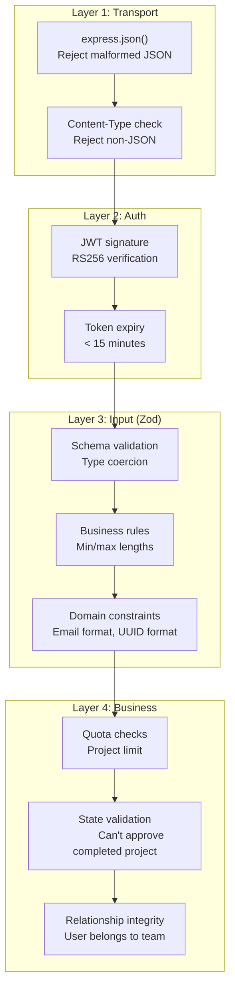
```mermaid
graph TB
    subgraph "Layer 1: Transport"
        T1["express.json()
            Reject malformed JSON"]
        T2["Content-Type check
            Reject non-JSON"]
    end

    subgraph "Layer 2: Auth"
        A1["JWT signature
            RS256 verification"]
        A2["Token expiry
            < 15 minutes"]
    end

    subgraph "Layer 3: Input (Zod)"
        Z1["Schema validation
            Type coercion"]
        Z2["Business rules
            Min/max lengths"]
        Z3["Domain constraints
            Email format, UUID format"]
    end

    subgraph "Layer 4: Business"
        B1["Quota checks
            Project limit"]
        B2["State validation
            Can't approve completed project"]
        B3["Relationship integrity
            User belongs to team"]
    end

    T1 --> T2 --> A1 --> A2 --> Z1 --> Z2 --> Z3 --> B1 --> B2 --> B3
```

### 17.2 Zod Schema Organisation

```typescript
// All Zod schemas live in shared/ and are imported by both frontend and backend.
// This guarantees validation parity across the stack.

// shared/src/schemas/project.ts
import { z } from 'zod';

// Input schemas (for API requests)
export const createProjectSchema = z.object({
  title: z.string()
    .min(3, 'Title must be at least 3 characters')
    .max(255, 'Title must be at most 255 characters'),
  description: z.string()
    .min(100, 'Description must be at least 100 characters')
    .max(5000, 'Description must be at most 5000 characters'),
  techStack: z.array(z.string())
    .min(1, 'At least one technology must be selected')
    .max(10, 'Maximum 10 technologies allowed'),
  teamId: z.string().uuid().nullable().optional()
});

// Output schemas (for API responses)
export const projectResponseSchema = z.object({
  id: z.string().uuid(),
  title: z.string(),
  description: z.string(),
  techStack: z.array(z.string()),
  status: z.enum(['draft', 'running', 'awaiting_approval', 'completed', 'failed']),
  createdAt: z.string().datetime(),
  updatedAt: z.string().datetime()
});

// Inferred types
export type CreateProjectInput = z.infer<typeof createProjectSchema>;
export type ProjectResponse = z.infer<typeof projectResponseSchema>;
```

### 17.3 Validation Middleware Factory

```typescript
// Single middleware factory handles all Zod validations
export const validate = (schema: ZodSchema, source: 'body' | 'query' | 'params' = 'body') => {
  return (req: Request, res: Response, next: NextFunction) => {
    const result = schema.safeParse(req[source]);

    if (!result.success) {
      // Transform Zod errors to standard API error format
      const details = result.error.errors.map(e => ({
        field: e.path.join('.'),
        message: e.message,
        code: e.code
      }));

      throw new ValidationError(details);
    }

    // Replace with parsed (and coerced) data
    req[source] = result.data;
    next();
  };
};

// Usage in route:
router.post('/projects',
  validate(createProjectSchema),  // validates req.body
  projectController.create
);
```

---

## 18. Configuration Management

### 18.1 Configuration Sources (Priority Order)

| Priority | Source | Method | Scope |
|----------|--------|--------|-------|
| 1 | Environment variables | `process.env` | Runtime |
| 2 | `.env` file (development) | dotenv | Local dev |
| 3 | Vercel Environment Variables | Vercel dashboard | Production |
| 4 | Neon secrets | Neon dashboard | Database URL |

### 18.2 Centralised Config Object

```typescript
// backend/src/config/env.ts
// Single source of truth for all configuration

export const config = {
  // Server
  port: parseInt(process.env.PORT || '3001', 10),
  nodeEnv: process.env.NODE_ENV || 'development',
  isProduction: process.env.NODE_ENV === 'production',

  // Database
  database: {
    url: process.env.DATABASE_URL!,
    ssl: process.env.NODE_ENV === 'production',
    poolSize: parseInt(process.env.DB_POOL_SIZE || '20', 10)
  },

  // Redis
  redis: {
    url: process.env.REDIS_URL!,
    ttl: parseInt(process.env.CACHE_TTL || '300', 10)  // 5 min default
  },

  // JWT
  jwt: {
    accessSecret: process.env.JWT_ACCESS_SECRET!,
    refreshSecret: process.env.JWT_REFRESH_SECRET!,
    accessExpiry: '15m',
    refreshExpiry: '7d',
    algorithm: 'RS256' as const
  },

  // OpenAI
  openai: {
    apiKey: process.env.OPENAI_API_KEY!,
    model: process.env.OPENAI_MODEL || 'gpt-4o',
    maxTokens: parseInt(process.env.OPENAI_MAX_TOKENS || '16000', 10),
    temperature: parseFloat(process.env.OPENAI_TEMPERATURE || '0.3')
  },

  // MCP
  mcp: {
    serverUrl: process.env.MCP_SERVER_URL || 'http://localhost:3002',
    apiKey: process.env.MCP_API_KEY!
  },

  // Context7
  context7: {
    apiKey: process.env.CONTEXT7_API_KEY!
  },

  // Stripe
  stripe: {
    secretKey: process.env.STRIPE_SECRET_KEY!,
    webhookSecret: process.env.STRIPE_WEBHOOK_SECRET!,
    priceIds: {
      pro: process.env.STRIPE_PRO_PRICE_ID!,
      enterprise: process.env.STRIPE_ENTERPRISE_PRICE_ID!
    }
  },

  // Rate Limiting
  rateLimit: {
    windowMs: 60 * 1000,    // 1 minute
    maxRequests: 100,        // 100 requests per window
    authMaxRequests: 10      // 10 auth requests per window
  }
} as const;
```

### 18.3 Validation on Startup

```typescript
// backend/src/config/index.ts
// Validate all required config on startup — fail fast

const requiredEnvVars = [
  'DATABASE_URL',
  'REDIS_URL',
  'JWT_ACCESS_SECRET',
  'JWT_REFRESH_SECRET',
  'OPENAI_API_KEY',
  'MCP_API_KEY',
  'CONTEXT7_API_KEY',
  'STRIPE_SECRET_KEY',
  'STRIPE_WEBHOOK_SECRET'
] as const;

export function validateConfig(): void {
  const missing = requiredEnvVars.filter(key => !process.env[key]);
  if (missing.length > 0) {
    logger.fatal({ missing }, 'Missing required environment variables');
    process.exit(1);
  }
}
```

---

## 19. Security Architecture

### 19.1 Defence-in-Depth Layers

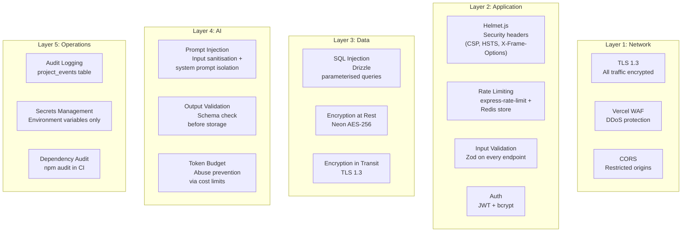
```mermaid
graph TB
    subgraph "Layer 1: Network"
        L1a["TLS 1.3
             All traffic encrypted"]
        L1b["Vercel WAF
             DDoS protection"]
        L1c["CORS
             Restricted origins"]
    end

    subgraph "Layer 2: Application"
        L2a["Helmet.js
             Security headers (CSP, HSTS, X-Frame-Options)"]
        L2b["Rate Limiting
             express-rate-limit + Redis store"]
        L2c["Input Validation
             Zod on every endpoint"]
        L2d["Auth
             JWT + bcrypt"]
    end

    subgraph "Layer 3: Data"
        L3a["SQL Injection
             Drizzle parameterised queries"]
        L3b["Encryption at Rest
             Neon AES-256"]
        L3c["Encryption in Transit
             TLS 1.3"]
    end

    subgraph "Layer 4: AI"
        L4a["Prompt Injection
             Input sanitisation + system prompt isolation"]
        L4b["Output Validation
             Schema check before storage"]
        L4c["Token Budget
             Abuse prevention via cost limits"]
    end

    subgraph "Layer 5: Operations"
        L5a["Audit Logging
             project_events table"]
        L5b["Secrets Management
             Environment variables only"]
        L5c["Dependency Audit
             npm audit in CI"]
    end
```

### 19.2 Security Headers (Helmet.js)

```typescript
app.use(helmet({
  contentSecurityPolicy: {
    directives: {
      defaultSrc: ["'self'"],
      scriptSrc: ["'self'", "'unsafe-inline'", 'https://vercel.live'],  // Next.js needs 'unsafe-inline'
      styleSrc: ["'self'", "'unsafe-inline'"],
      imgSrc: ["'self'", 'data:', 'https:'],
      connectSrc: ["'self'", process.env.NEXT_PUBLIC_API_URL].filter(Boolean) as string[],
      fontSrc: ["'self'", 'https://fonts.gstatic.com'],
      objectSrc: ["'none'"],
      mediaSrc: ["'none'"],
      frameSrc: ["'none'"]
    }
  },
  hsts: {
    maxAge: 31536000,      // 1 year
    includeSubDomains: true,
    preload: true
  },
  referrerPolicy: { policy: 'strict-origin-when-cross-origin' }
}));
```

### 19.3 Rate Limiting Configuration

```typescript
// General API rate limit
const apiLimiter = rateLimit({
  windowMs: 60 * 1000,
  max: 100,
  standardHeaders: true,
  legacyHeaders: false,
  message: {
    success: false,
    error: { code: 'RATE_LIMITED', message: 'Too many requests, please try again later' }
  }
});

// Stricter auth endpoint limit
const authLimiter = rateLimit({
  windowMs: 15 * 60 * 1000,  // 15 minutes
  max: 10,                     // 10 attempts per window
  standardHeaders: true,
  legacyHeaders: false
});

app.use('/api/', apiLimiter);
app.use('/api/v1/auth/login', authLimiter);
app.use('/api/v1/auth/register', authLimiter);
```

### 19.4 CORS Configuration

```typescript
const corsConfig = {
  origin: [
    process.env.FRONTEND_URL || 'http://localhost:3000',
    'https://app.aisoftco.com',
    'https://staging.aisoftco.com'
  ].filter(Boolean) as string[],
  methods: ['GET', 'POST', 'PATCH', 'DELETE', 'OPTIONS'],
  allowedHeaders: ['Content-Type', 'Authorization', 'X-Request-Id'],
  exposedHeaders: ['X-Request-Id'],
  credentials: true,
  maxAge: 86400  // 24 hours — cache preflight
};
```

---

## 20. Deployment Architecture

### 20.1 Vercel Deployment Topology

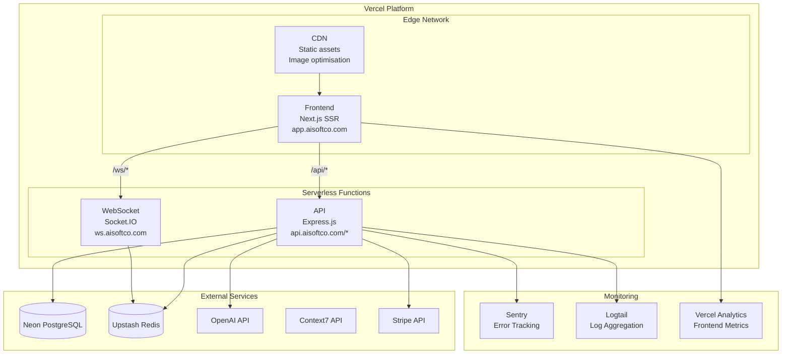
```mermaid
graph TB
    subgraph "Vercel Platform"
        subgraph "Edge Network"
            CDN["CDN
                 Static assets
                 Image optimisation"]
            FE_HOST["Frontend
                     Next.js SSR
                     app.aisoftco.com"]
        end

        subgraph "Serverless Functions"
            API["API
                 Express.js
                 api.aisoftco.com/*"]
            WS["WebSocket
                 Socket.IO
                 ws.aisoftco.com"]
        end
    end

    subgraph "External Services"
        NEON[("Neon PostgreSQL")]
        REDIS[("Upstash Redis")]
        OA["OpenAI API"]
        C7["Context7 API"]
        ST["Stripe API"]
    end

    subgraph "Monitoring"
        SENTRY["Sentry
                Error Tracking"]
        LOGS["Logtail
              Log Aggregation"]
        AN["Vercel Analytics
            Frontend Metrics"]
    end

    CDN --> FE_HOST
    FE_HOST -->|"/api/*"| API
    FE_HOST -->|"/ws/*"| WS
    API --> NEON
    API --> REDIS
    API --> OA
    API --> ST
    WS --> REDIS
    API --> SENTRY
    FE_HOST --> AN
    API --> LOGS
```

### 20.2 CI/CD Pipeline

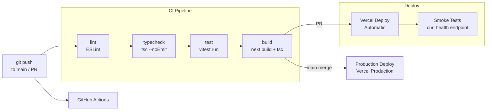
```mermaid
graph LR
    PUSH["git push
          to main / PR"] --> GHA["GitHub Actions"]

    subgraph "CI Pipeline"
        LINT["lint
              ESLint"]
        TYPE["typecheck
              tsc --noEmit"]
        TEST["test
              vitest run"]
        BUILD["build
              next build + tsc"]
    end

    subgraph "Deploy"
        VER["Vercel Deploy
             Automatic"]
        SMOKE["Smoke Tests
              curl health endpoint"]
    end

    PUSH --> LINT --> TYPE --> TEST --> BUILD
    BUILD -->|"PR"| VER
    VER --> SMOKE

    BUILD -->|"main merge"| PROD["Production Deploy
                                 Vercel Production"]
```

### 20.3 Docker Configuration (MCP Server)

```dockerfile
# MCP Server — runs as separate container for tool isolation
FROM node:20-alpine AS builder
WORKDIR /app
COPY package*.json ./
RUN npm ci
COPY . .
RUN npm run build -w backend

FROM node:20-alpine AS runner
WORKDIR /app
COPY --from=builder /app/backend/dist ./dist
COPY --from=builder /app/backend/node_modules ./node_modules
EXPOSE 3002
CMD ["node", "dist/mcp/index.js"]
```

---

## 21. Scalability Strategy

### 21.1 Horizontal Scaling Dimensions

| Component | Scaling Strategy | Limit | Trigger |
|-----------|-----------------|-------|---------|
| Frontend (Next.js) | Automatic via Vercel Edge | Unlimited (Vercel) | Traffic increase |
| API (Express.js) | Serverless function instances | 1000 concurrent | Request queue depth |
| WebSocket | Redis adapter + multiple instances | Connection count | Per-instance limit |
| BullMQ Workers | Worker process count | Queue processing rate | Queue depth |
| Database (Neon) | Auto-scaling compute | 4 vCPU per branch | CPU utilisation |
| Redis (Upstash) | Storage + bandwidth | Pricing tier | Memory usage |
| MCP Server | Container instances | 10 concurrent | Tool call queue |

### 21.2 Caching Strategy

```typescript
// Cache-aside pattern for Context7 lookups and API responses
export class CacheService {
  constructor(private redis: Redis) {}

  async getOrSet<T>(
    key: string,
    fetchFn: () => Promise<T>,
    ttlSeconds: number = 300
  ): Promise<T> {
    const cached = await this.redis.get(key);
    if (cached) return JSON.parse(cached) as T;

    const value = await fetchFn();
    await this.redis.setex(key, ttlSeconds, JSON.stringify(value));
    return value;
  }
}

// Usage — Context7 responses cached for 5 minutes
const docs = await cacheService.getOrSet(
  `context7:${libraryId}:${query}`,
  () => context7Service.queryDocs(libraryId, query),
  300  // 5 minutes TTL
);
```

### 21.3 Database Connection Pooling

| Environment | Pool Size | Max Connections | Idle Timeout |
|-------------|-----------|----------------|--------------|
| Development | 5 | 10 | 10s |
| Staging | 10 | 25 | 30s |
| Production | 20 | 100 (Neon plan) | 60s |

---

## 22. Coding Standards

### 22.1 TypeScript Strict Rules

```jsonc
{
  "compilerOptions": {
    "strict": true,
    "noUncheckedIndexedAccess": true,
    "noImplicitOverride": true,
    "exactOptionalPropertyTypes": false,
    "forceConsistentCasingInFileNames": true,
    "isolatedModules": true,
    "noUnusedLocals": true,
    "noUnusedParameters": true
  }
}
```

### 22.2 ESLint Rules

```javascript
// Core rules
'@typescript-eslint/no-explicit-any': 'error',      // No escape hatch
'@typescript-eslint/prefer-nullish-coalescing': 'error',
'@typescript-eslint/no-unnecessary-condition': 'warn',
'@typescript-eslint/consistent-type-imports': 'error',
'@typescript-eslint/no-floating-promises': 'error',
'no-console': ['warn', { allow: ['warn', 'error'] }],
'prefer-const': 'error',
'no-var': 'error',
'eqeqeq': ['error', 'always']
```

### 22.3 What Is NOT Allowed

```typescript
// NEVER do these:
const x: any = ...;                  // No 'any' type
const y = data as any;              // No type assertion to any
function foo(...args: any[])        // No rest params typed as any
// @ts-ignore                       // No suppress comments
// @ts-nocheck                      // No file-level disable
console.log('debug');               // No console.log (use logger)
eval(code);                         // No eval
require('module');                  // No CommonJS (ESM only)
process.env.VAR                     // No direct env access (use config object)
```

---

## 23. Folder Structure

### 23.1 Complete Directory Tree

```
ai-soft-comp/
│
├── package.json                         # npm workspaces root
├── tsconfig.base.json                   # Shared strict TypeScript config
├── .eslintrc.cjs                        # ESLint flat config
├── .prettierrc                          # Prettier formatting
├── .gitignore                           # Node, Next, env, dist
│
├── shared/                              # @aisoftco/shared
│   ├── package.json
│   ├── tsconfig.json
│   └── src/
│       ├── index.ts                     # Barrel exports
│       ├── schemas/
│       │   ├── auth.ts                  # Login, register, refresh schemas
│       │   ├── project.ts               # Create, update, list schemas
│       │   ├── agent.ts                 # Agent output, feedback schemas
│       │   ├── team.ts                  # Team CRUD schemas
│       │   ├── deployment.ts            # Deploy request schemas
│       │   └── billing.ts               # Billing schemas
│       ├── types/
│       │   ├── index.ts                 # Re-exports
│       │   ├── project.ts               # Project, ProjectDetail
│       │   ├── agent.ts                 # AgentOutput, Approval
│       │   ├── user.ts                  # User, AuthUser
│       │   ├── team.ts                  # Team, Membership
│       │   └── deployment.ts            # Deployment, DeployStatus
│       └── constants/
│           ├── index.ts                 # Re-exports
│           ├── agents.ts                # AGENT_TYPES, PHASES
│           ├── status.ts                # PROJECT_STATUS, OUTPUT_STATUS
│           └── errors.ts                # ERROR_CODES enum
│
├── frontend/                            # @aisoftco/frontend
│   ├── package.json
│   ├── tsconfig.json
│   ├── next.config.ts
│   ├── tailwind.config.ts
│   ├── postcss.config.mjs
│   ├── middleware.ts                    # Route protection
│   └── src/
│       ├── app/
│       │   ├── layout.tsx               # Root layout + providers
│       │   ├── page.tsx                 # Landing page
│       │   ├── globals.css              # Tailwind + theme CSS vars
│       │   ├── loading.tsx              # Global loading
│       │   ├── error.tsx                # Global error boundary
│       │   ├── not-found.tsx            # 404 page
│       │   ├── robots.ts                # SEO
│       │   ├── sitemap.ts               # SEO
│       │   │
│       │   ├── (auth)/                  # Auth route group
│       │   │   ├── layout.tsx
│       │   │   ├── login/page.tsx
│       │   │   └── register/page.tsx
│       │   │
│       │   └── (dashboard)/             # Protected route group
│       │       ├── layout.tsx           # Sidebar + header shell
│       │       ├── page.tsx             # Dashboard home
│       │       ├── projects/
│       │       │   ├── page.tsx         # Project list
│       │       │   └── [id]/
│       │       │       ├── page.tsx     # Project detail
│       │       │       └── settings/page.tsx
│       │       ├── teams/
│       │       │   ├── page.tsx
│       │       │   └── [id]/page.tsx
│       │       └── settings/
│       │           ├── page.tsx
│       │           └── billing/page.tsx
│       │
│       ├── components/
│       │   ├── ui/                      # shadcn/ui generated
│       │   │   ├── button.tsx
│       │   │   ├── card.tsx
│       │   │   ├── dialog.tsx
│       │   │   ├── input.tsx
│       │   │   ├── select.tsx
│       │   │   ├── toast.tsx
│       │   │   └── skeleton.tsx
│       │   ├── layout/
│       │   │   ├── sidebar.tsx
│       │   │   └── header.tsx
│       │   ├── landing/
│       │   │   ├── hero-section.tsx
│       │   │   ├── features-section.tsx
│       │   │   └── pricing-section.tsx
│       │   ├── project/
│       │   │   ├── project-card.tsx
│       │   │   ├── project-list.tsx
│       │   │   ├── project-form.tsx
│       │   │   ├── project-status-badge.tsx
│       │   │   ├── agent-timeline.tsx
│       │   │   ├── agent-output-viewer.tsx
│       │   │   ├── approval-panel.tsx
│       │   │   ├── feedback-form.tsx
│       │   │   ├── file-browser.tsx
│       │   │   ├── code-viewer.tsx
│       │   │   └── deployment-panel.tsx
│       │   ├── agent/
│       │   │   ├── agent-progress-card.tsx
│       │   │   ├── agent-streaming-text.tsx
│       │   │   ├── agent-thinking-bubble.tsx
│       │   │   └── tool-use-indicator.tsx
│       │   └── team/
│       │       ├── team-card.tsx
│       │       ├── member-list.tsx
│       │       └── invite-form.tsx
│       │
│       ├── hooks/
│       │   ├── use-auth.ts
│       │   ├── use-projects.ts
│       │   ├── use-project.ts
│       │   ├── use-agent-stream.ts
│       │   ├── use-approval.ts
│       │   ├── use-teams.ts
│       │   ├── use-deployment.ts
│       │   └── use-media-query.ts
│       │
│       ├── lib/
│       │   ├── api-client.ts            # Fetch wrapper
│       │   ├── auth-context.tsx         # Auth context
│       │   ├── socket.ts               # Socket.IO client
│       │   └── utils.ts                # cn(), formatters
│       │
│       └── providers/
│           ├── auth-provider.tsx
│           ├── theme-provider.tsx
│           └── query-provider.tsx
│
├── backend/                             # @aisoftco/backend
│   ├── package.json
│   ├── tsconfig.json
│   ├── drizzle.config.ts                # Drizzle Kit config
│   ├── .env.example
│   └── src/
│       ├── app.ts                       # Express app factory
│       ├── server.ts                    # HTTP server entry
│       │
│       ├── config/
│       │   ├── index.ts                 # Config validation on startup
│       │   ├── env.ts                   # Centralised config object
│       │   ├── database.ts              # Drizzle client init
│       │   ├── redis.ts                 # Redis client init
│       │   ├── openai.ts                # OpenAI client init
│       │   ├── cors.ts                  # CORS configuration
│       │   └── jwt.ts                   # JWT key loading
│       │
│       ├── middleware/
│       │   ├── auth.ts                  # JWT verification
│       │   ├── validate.ts              # Zod validation factory
│       │   ├── rate-limit.ts            # Rate limiter
│       │   ├── error-handler.ts         # Global error handler
│       │   ├── logging.ts              # Pino HTTP logger
│       │   └── request-id.ts           # Correlation ID
│       │
│       ├── routes/
│       │   ├── index.ts                 # Route aggregator
│       │   ├── auth.routes.ts
│       │   ├── user.routes.ts
│       │   ├── project.routes.ts
│       │   ├── agent.routes.ts
│       │   ├── team.routes.ts
│       │   ├── deployment.routes.ts
│       │   └── billing.routes.ts
│       │
│       ├── controllers/
│       │   ├── auth.controller.ts
│       │   ├── user.controller.ts
│       │   ├── project.controller.ts
│       │   ├── agent.controller.ts
│       │   ├── team.controller.ts
│       │   ├── deployment.controller.ts
│       │   └── billing.controller.ts
│       │
│       ├── services/
│       │   ├── auth.service.ts
│       │   ├── user.service.ts
│       │   ├── project.service.ts
│       │   ├── agent.service.ts
│       │   ├── orchestrator.service.ts
│       │   ├── file-generation.service.ts
│       │   ├── team.service.ts
│       │   ├── deployment.service.ts
│       │   ├── billing.service.ts
│       │   ├── token.service.ts
│       │   └── cache.service.ts
│       │
│       ├── orchestrator/
│       │   ├── index.ts                 # Orchestrator entry
│       │   ├── pipeline.ts              # Stage definitions
│       │   ├── agent-executor.ts        # OpenAI SDK wrapper
│       │   ├── context-builder.ts       # Context accumulation
│       │   ├── approval-gate.ts         # Pause/resume logic
│       │   └── feedback-loop.ts         # Re-execution with feedback
│       │
│       ├── agents/
│       │   ├── ceo.agent.ts
│       │   ├── pm.agent.ts
│       │   ├── architect.agent.ts
│       │   ├── ui-designer.agent.ts
│       │   ├── db-engineer.agent.ts
│       │   ├── backend-engineer.agent.ts
│       │   ├── frontend-engineer.agent.ts
│       │   ├── qa.agent.ts
│       │   ├── devops.agent.ts
│       │   ├── documentation.agent.ts
│       │   └── prompts/
│       │       ├── ceo.prompt.ts
│       │       ├── pm.prompt.ts
│       │       ├── architect.prompt.ts
│       │       ├── ui-designer.prompt.ts
│       │       ├── db-engineer.prompt.ts
│       │       ├── backend-engineer.prompt.ts
│       │       ├── frontend-engineer.prompt.ts
│       │       ├── qa.prompt.ts
│       │       ├── devops.prompt.ts
│       │       └── documentation.prompt.ts
│       │
│       ├── mcp/
│       │   ├── index.ts                 # MCP server entry
│       │   ├── server.ts               # Protocol handler
│       │   ├── client.ts               # Orchestrator-side client
│       │   ├── types.ts                # MCP type definitions
│       │   ├── transport/
│       │   │   ├── http.ts             # HTTP/SSE transport
│       │   │   └── stdio.ts            # Dev transport
│       │   ├── tools/
│       │   │   ├── registry.ts         # Tool registration
│       │   │   ├── file-system.ts      # read/write/list/search
│       │   │   ├── context7.ts         # resolve/query
│       │   │   ├── code-analysis.ts    # lint/typecheck
│       │   │   └── shell.ts            # execute command
│       │   ├── resources/
│       │   │   ├── provider.ts
│       │   │   └── project-context.ts
│       │   └── middleware/
│       │       ├── auth.ts
│       │       ├── error-handler.ts
│       │       └── logging.ts
│       │
│       ├── ws/
│       │   ├── index.ts                 # Socket.IO server
│       │   └── handlers.ts             # Connection + events
│       │
│       ├── db/
│       │   ├── index.ts                 # Drizzle client export
│       │   ├── enums.ts                 # PG enum definitions
│       │   ├── schema/
│       │   │   ├── index.ts
│       │   │   ├── users.ts
│       │   │   ├── teams.ts
│       │   │   ├── memberships.ts
│       │   │   ├── projects.ts
│       │   │   ├── agent-outputs.ts
│       │   │   ├── approvals.ts
│       │   │   ├── project-files.ts
│       │   │   ├── deployments.ts
│       │   │   └── project-events.ts
│       │   ├── migrations/
│       │   └── seed/
│       │       └── seed.ts
│       │
│       ├── types/
│       │   ├── index.ts
│       │   └── express.d.ts             # Request augmentation
│       │
│       └── utils/
│           ├── logger.ts                # Pino instance
│           ├── errors.ts                # Custom error classes
│           ├── hash.ts                  # bcrypt helpers
│           └── token.ts                 # JWT helpers
│
└── docs/                                # Specification documents
    ├── 01-PRD.md
    ├── 02-SRS.md
    ├── 03-SDD.md
    ├── 04-System-Architecture.md
    ├── 05-Database-Architecture.md
    ├── 06-API-Architecture.md
    ├── 07-AI-Architecture.md
    ├── 08-MCP-Architecture.md
    ├── 09-Frontend-Architecture.md
    ├── 10-Backend-Architecture.md
    ├── 11-Coding-Standards.md
    ├── 12-Roadmap.md
    └── 13-Implementation-Guide.md
```

---

## 24. Naming Conventions

### 24.1 Complete Naming Table

| Category | Convention | Pattern | Examples |
|----------|-----------|---------|----------|
| **Directories** | kebab-case | `[a-z]+(-[a-z]+)*` | `project-service/`, `db/schema/` |
| **TypeScript files** | kebab-case | `[a-z]+(-[a-z]+)*` | `auth.service.ts`, `project.routes.ts` |
| **React components** | PascalCase | `[A-Z][a-zA-Z]*` | `ProjectCard.tsx`, `ApprovalPanel.tsx` |
| **Classes** | PascalCase | `[A-Z][a-zA-Z]*` | `class ProjectService` |
| **Functions/methods** | camelCase | `[a-z][a-zA-Z]*` | `createProject()`, `findById()` |
| **Variables** | camelCase | `[a-z][a-zA-Z]*` | `const projectName`, `let userCount` |
| **Constants** | UPPER_SNAKE_CASE | `[A-Z]+(_[A-Z]+)*` | `MAX_RETRY_COUNT`, `DEFAULT_PAGE_SIZE` |
| **Types/interfaces** | PascalCase | `[A-Z][a-zA-Z]*` | `type Project`, `interface IAuthService` |
| **Enums (type)** | PascalCase | `[A-Z][a-zA-Z]*` | `enum ProjectStatus` |
| **Enums (values)** | UPPER_SNAKE_CASE | `[A-Z]+(_[A-Z]+)*` | `DRAFT`, `AWAITING_APPROVAL` |
| **DB tables** | snake_case (plural) | `[a-z]+(_[a-z]+)*` | `users`, `agent_outputs` |
| **DB columns** | snake_case | `[a-z]+(_[a-z]+)*` | `created_at`, `password_hash` |
| **API routes** | kebab-case | `[a-z]+(-[a-z]+)*` | `/api/v1/project-files` |
| **Zod schemas** | camelCase + Schema | `[a-z][a-zA-Z]*Schema` | `createProjectSchema` |
| **Zod inferred types** | PascalCase | `[A-Z][a-zA-Z]*` | `type CreateProjectInput` |
| **React hooks** | camelCase + `use` | `use[A-Z][a-zA-Z]*` | `useProject()`, `useAuth()` |
| **React context** | PascalCase + Context | `[A-Z][a-zA-Z]*Context` | `AuthContext` |
| **CSS classes** | kebab-case | `[a-z]+(-[a-z]+)*` | `project-card`, `agent-timeline` |
| **Environment vars** | UPPER_SNAKE_CASE | `[A-Z]+(_[A-Z]+)*` | `DATABASE_URL`, `OPENAI_API_KEY` |
| **BullMQ job names** | kebab-case | `[a-z]+-[a-z]+` | `ceo-agent-job`, `pm-agent-job` |

### 24.2 File Naming by Layer

| Layer | Suffix | Example |
|-------|--------|---------|
| Route definition | `*.routes.ts` | `auth.routes.ts` |
| Controller | `*.controller.ts` | `auth.controller.ts` |
| Service | `*.service.ts` | `auth.service.ts` |
| Agent definition | `*.agent.ts` | `ceo.agent.ts` |
| Agent prompt | `*.prompt.ts` | `ceo.prompt.ts` |
| Middleware | `*.ts` | `auth.ts`, `validate.ts` |
| Zod schema | `*.ts` (in schemas/) | `project.ts` |
| Type definition | `*.ts` (in types/) | `project.ts` |
| Database schema | `*.ts` (in schema/) | `users.ts` |
| React component | `*.tsx` | `ProjectCard.tsx` |
| React hook | `use-*.ts` | `use-auth.ts` |
| Configuration | `*.ts` (in config/) | `env.ts` |

---

## 25. Future Expansion Strategy

### 25.1 Extensibility Points

The architecture is designed with explicit extension points for future growth:

```mermaid
graph TB
    subgraph "Current Boundary"
        CORE["Core Platform"]
    end

    subgraph "Extension Point 1: Agent System"
        EA1["Custom Agent
             Register new agent type"]
        EA2["Custom Tool
             Implement MCP tool interface"]
        EA3["Custom Prompt
             Override system prompt"]
    end

    subgraph "Extension Point 2: Integration"
        EI1["OAuth Provider
             Implements OAuthStrategy"]
        EI2["Deployment Target
             Implements DeployAdapter"]
        EI3["Payment Provider
             Implements PaymentGateway"]
        EI4["Storage Backend
             Implements FileStorage"]
    end

    subgraph "Extension Point 3: Plugin System"
        EP1["MCP Plugin
             Dynamic tool loading"]
        EP2["Webhook
             Outbound event hooks"]
        EP3["API Extension
             Custom route prefix"]
    end

    CORE --> EA1
    CORE --> EA2
    CORE --> EA3
    CORE --> EI1
    CORE --> EI2
    CORE --> EI3
    CORE --> EI4
    CORE --> EP1
    CORE --> EP2
    CORE --> EP3
```

### 25.2 Planned Expansion Roadmap

| Quarter | Initiative | Architectural Impact |
|---------|------------|---------------------|
| **Q2 2027** | Multi-model LLM support (Claude, Gemini) | New `LLMAdapter` interface; agents select model per task |
| **Q2 2027** | OAuth2 login (Google, GitHub) | New `OAuthProvider` strategy implementations |
| **Q3 2027** | Marketplace for custom agents | Dynamic agent loading from registry; agent sandboxing |
| **Q3 2027** | SSO / SAML for enterprise | New `AuthProvider` interface; SAML protocol handler |
| **Q4 2027** | Plugin system (MCP-based) | Dynamic tool loading; plugin lifecycle hooks |
| **Q4 2027** | Audit logging & compliance | New `AuditService` writing to separate audit log store |
| **Q1 2028** | Multi-region deployment | Region abstraction; data residency controls |
| **Q1 2028** | Real-time collaboration | CRDT-based state sync; operational transforms |

### 25.3 Interface Contracts for Extensibility

```typescript
// Each extension point has a defined interface:

// 1. Agent System
interface AgentDefinition {
  type: AgentType;
  systemPrompt: string;
  tools: MCPTool[];
  outputSchema: ZodSchema;
  maxTokens: number;
  temperature: number;
}

// 2. LLM Provider
interface LLMProvider {
  chat(params: ChatParams): AsyncIterable<ChatChunk>;
  embed(text: string): Promise<number[]>;
  model: string;
}

// 3. OAuth Provider
interface OAuthProvider {
  name: string;
  getAuthorizationUrl(state: string): string;
  exchangeCode(code: string): Promise<OAuthTokens>;
  getUserInfo(tokens: OAuthTokens): Promise<OAuthUser>;
}

// 4. Deployment Target
interface DeployAdapter {
  deploy(projectId: string, files: ProjectFile[]): Promise<DeployResult>;
  getStatus(deployId: string): Promise<DeployStatus>;
  getUrl(deployId: string): string;
}

// 5. MCP Plugin
interface MCPPlugin {
  name: string;
  version: string;
  tools: MCPTool[];
  resources?: MCPResource[];
  initialize(): Promise<void>;
  shutdown(): Promise<void>;
}
```

### 25.4 Technology Upgrade Path

| Current | Future Trigger | Target |
|---------|---------------|--------|
| Express.js | Performance requirements | Fastify or Hono |
| Drizzle ORM | Complex migration needs | Prisma (if DX outweighs performance) |
| BullMQ + Redis | Queue growth | RabbitMQ or SQS |
| Vercel serverless | Cold start issues | Node.js hosting (Railway, Fly.io) |
| Neon PostgreSQL | Scale beyond single region | CockroachDB or Aurora |
| OpenAI Agents SDK | Multi-model support | LangChain or custom orchestrator |
| Socket.IO | Scale beyond 10K connections | WebSocket native + Redis pub/sub |

---

## Appendix A: Architecture Decision Records

| ADR | Decision | Context |
|-----|----------|---------|
| ADR-001 | npm workspaces over Turborepo | Simpler setup, sufficient for 3 workspaces |
| ADR-002 | Drizzle over Prisma | SQL-like API, lighter weight, better perf |
| ADR-003 | BullMQ over in-process queues | Reliability, retries, observability |
| ADR-004 | MCP over direct tool calls | Standardisation, isolation, extensibility |
| ADR-005 | Zod over Joi/Yup | TypeScript inference, shared with frontend |
| ADR-006 | Socket.IO over raw WebSocket | Fallback, rooms, auto-reconnect |
| ADR-007 | Pino over Winston | Performance, structured JSON native |
| ADR-008 | RS256 JWT over HS256 | Asymmetric keys, no shared secret |
| ADR-009 | Neon over Supabase | Serverless PG, branching, pgBouncer built-in |
| ADR-010 | Vercel over AWS | Next.js-native deployment, edge functions |
| ADR-011 | Service layer auth over middleware auth | Closer to data, explicit, testable |
| ADR-012 | Direct Drizzle in services over repository pattern | Simplicity, Drizzle IS the repository |

## Appendix B: System Quality Attributes

| Attribute | Target | How It Is Achieved |
|-----------|--------|-------------------|
| **Availability** | 99.9% | Vercel multi-region, Neon HA, stateless backend |
| **Scalability** | 1000 concurrent users | Horizontal scaling, auto-scaling DB, Redis caching |
| **Performance** | API p95 < 200ms | Connection pooling, caching, query optimisation |
| **Security** | Zero critical vulns | Defence-in-depth, SAST in CI, input validation everywhere |
| **Maintainability** | < 1hr to onboard | Strict layer separation, coding standards, docs |
| **Testability** | > 80% coverage | DI throughout, mocked externals, test DB per run |
| **Observability** | Full request tracing | Correlation IDs, structured logging, Sentry |
| **Extensibility** | New agent in < 1 day | Agent interface, MCP tools, pipeline config |
