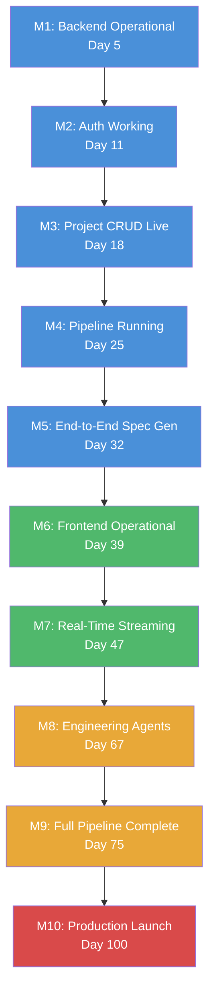
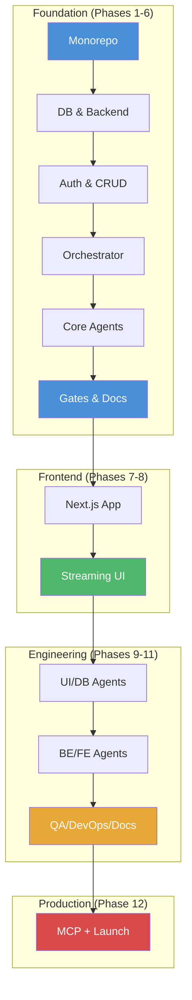

# Implementation Roadmap — AI Software Company

> **12 Phases · 22 Sections Each · Enterprise-Grade Delivery Plan**
>
> **Version:** 1.0.0  
> **Target:** Production-ready multi-agent AI orchestration SaaS platform  
> **Total Effort:** ~100 working days (~20 weeks for 2-3 engineers)

---

## Table of Contents

1. [Timeline Overview](#timeline-overview)
2. [Dependency Graph](#dependency-graph)
3. [Milestone Delivery Map](#milestone-delivery-map)
4. [Phase Architecture](#phase-architecture)
5. [Phase 1 — Monorepo Foundation](#phase-1--monorepo-foundation)
6. [Phase 2 — Database & Backend Core](#phase-2--database--backend-core)
7. [Phase 3 — Authentication & Project CRUD](#phase-3--authentication--project-crud)
8. [Phase 4 — Orchestrator & CEO Agent](#phase-4--orchestrator--ceo-agent)
9. [Phase 5 — PM & Architect Agents](#phase-5--pm--architect-agents)
10. [Phase 6 — Approval Gates & Document Generation](#phase-6--approval-gates--document-generation)
11. [Phase 7 — Frontend Foundation](#phase-7--frontend-foundation)
12. [Phase 8 — Real-Time Streaming & Advanced Frontend](#phase-8--real-time-streaming--advanced-frontend)
13. [Phase 9 — UI Designer & DB Engineer Agents](#phase-9--ui-designer--db-engineer-agents)
14. [Phase 10 — BE & FE Engineer Agents](#phase-10--be--fe-engineer-agents)
15. [Phase 11 — QA, DevOps & Documentation Agents](#phase-11--qa-devops--documentation-agents)
16. [Phase 12 — MCP Integration, Production & Launch](#phase-12--mcp-integration-production--launch)
17. [Dependency Matrix](#dependency-matrix)
18. [Risk Matrix](#risk-matrix)
19. [Quality Gates](#quality-gates)
20. [Release Checklist](#release-checklist)
21. [Definition of Done](#definition-of-done)

---

## Timeline Overview

```mermaid
gantt
    title AI Software Company — Implementation Timeline
    dateFormat  YYYY-MM-DD
    axisFormat  %b %d

    section Foundation
    Phase 1: Monorepo Foundation           :p1, 2026-07-14, 5d
    Phase 2: Database & Backend Core       :p2, after p1, 6d
    Phase 3: Authentication & Project CRUD :p3, after p2, 7d
    Phase 4: Orchestrator & CEO Agent      :p4, after p3, 7d
    Phase 5: PM & Architect Agents         :p5, after p4, 7d
    Phase 6: Approval Gates & Docs         :p6, after p5, 6d

    section Frontend
    Phase 7: Frontend Foundation           :p7, after p6, 7d
    Phase 8: Real-Time Streaming           :p8, after p7, 8d

    section Agents
    Phase 9: UI Designer & DB Engineer     :p9, after p8, 8d
    Phase 10: BE & FE Engineer Agents      :p10, after p9, 12d

    section Quality & Ops
    Phase 11: QA, DevOps & Docs Agents     :p11, after p10, 8d

    section Production
    Phase 12: MCP, Production & Launch     :p12, after p11, 14d
```

---

## Dependency Graph


---

## Milestone Delivery Map



---

## Phase Architecture



---

# Phase 1 — Monorepo Foundation

## 1. Objective

Scaffold the npm workspaces monorepo with shared configuration, tooling, and the `@aisoftco/shared` package containing all Zod schemas, TypeScript types, and constants that will be consumed by backend and frontend workspaces.

## 2. Scope

Repository structure, workspace configuration, shared package with schemas/types/constants, and developer tooling (ESLint, Prettier, TypeScript config). No application code. No backend or frontend workspaces yet.

## 3. Prerequisites

Node.js 20+ LTS, npm 10+, Git, access to GitHub repository.

## 4. Technical Context

- npm workspaces for monorepo management (per ADR-001)
- TypeScript strict mode across all packages
- Shared Zod schemas serve as the single source of truth for all validation (per ADR-005)
- `@aisoftco/shared` published workspace package consumed by backend and frontend

## 5. Implementation Plan

1. Initialize root `package.json` with npm workspaces config
2. Create `shared/`, `backend/`, `frontend/` workspace directories
3. Configure TypeScript: `tsconfig.base.json` with strict mode, path aliases
4. Configure ESLint with TypeScript rules, import ordering, complexity checks
5. Configure Prettier with consistent formatting rules
6. Create `shared/` package: package.json, tsconfig, src/index.ts barrel
7. Implement shared Zod schemas: auth, project, agent, team, deployment
8. Implement shared TypeScript types derived from schemas
9. Implement shared constants: agent registry, status enums, error codes
10. Configure `tsconfig.json` path aliases in backend and frontend
11. Add `.gitignore`, `.env.example`, `README.md` at root
12. Verify `npm install` from root completes without errors

## 6. Files to Create

```
package.json                          # Root workspace config
tsconfig.base.json                    # Shared TS config
.eslintrc.cjs                         # ESLint config
.prettierrc                           # Prettier config
.gitignore                            # Git ignore rules
.env.example                          # Environment template
shared/package.json                   # Shared workspace package
shared/tsconfig.json                  # Shared TS config
shared/src/index.ts                   # Barrel export
shared/src/schemas/auth.schema.ts     # Auth Zod schemas
shared/src/schemas/project.schema.ts  # Project Zod schemas
shared/src/schemas/agent.schema.ts    # Agent Zod schemas
shared/src/schemas/team.schema.ts     # Team Zod schemas
shared/src/schemas/deployment.schema.ts # Deployment Zod schemas
shared/src/schemas/common.schema.ts   # Common schemas (pagination, UUID)
shared/src/types/index.ts             # Derived TypeScript types
shared/src/constants/agents.ts        # Agent registry constants
shared/src/constants/status.ts        # Status enum constants
shared/src/constants/errors.ts        # Error code constants
```

## 7. Files to Modify

None — this is the initial scaffold.

## 8. Key Deliverables

- `npm install` from root completes with all workspace links
- `tsc --noEmit` passes for shared package
- ESLint runs without errors on shared package
- Shared Zod schemas cover auth, project, agent, team, deployment domains
- All derived TypeScript types are exported from barrel

## 9. Data Model Changes

None — no database yet.

## 10. API Endpoints

None — no application code yet.

## 11. Configuration Changes

Root `tsconfig.base.json` establishes project-wide TypeScript standards. ESLint config enforces coding standards across all workspaces.

## 12. Testing Strategy

- Manual verification: `npm install`, `npm run typecheck`, `npm run lint`
- Schema validation tested via `zod.safeParse()` on sample data

## 13. Migration Plan

N/A — initial scaffold.

## 14. Rollback Plan

`git checkout` to previous commit. The scaffold is low-risk.

## 15. Security Considerations

- No secrets committed (`.gitignore` covers `.env`)
- ESLint rules prevent `any` types, enforce strict null checks

## 16. Performance Considerations

- Workspace-linked packages avoid npm install duplication
- TypeScript project references for incremental builds (future)

## 17. Monitoring & Observability

N/A — no runtime code.

## 18. Documentation Requirements

- Root `README.md` with setup instructions
- Code comments on exported schema shapes

## 19. Acceptance Criteria

- [ ] `npm install` from root completes with zero errors
- [ ] `npx tsc --noEmit -p shared/tsconfig.json` passes
- [ ] `npx eslint shared/src/` passes with zero warnings
- [ ] All schema files export valid Zod schemas
- [ ] TypeScript types are correctly inferred from schemas
- [ ] Constants import without errors

## 20. Definition of Done

- All files created as specified
- TypeScript compilation passes
- ESLint passes
- Pull request reviewed and merged

## 21. Risks & Mitigation

| Risk | Impact | Mitigation |
|------|--------|------------|
| npm workspace version conflicts | Medium | Pin exact versions; lockfile committed |
| ESLint/Prettier disagreement | Low | Use `eslint-config-prettier` |
| Path alias misconfiguration | Medium | Verify `tsc --noEmit` with imports |

## 22. Future Considerations

- Add Turborepo for build caching if workspace count grows beyond 3
- Consider `dependency-cruiser` for enforcing module boundaries

---

# Phase 2 — Database & Backend Core

## 1. Objective

Set up Neon PostgreSQL database, define Drizzle ORM schema for all entities, generate initial migration, and build the Express.js backend foundation with middleware stack, configuration, error handling, and health endpoint.

## 2. Scope

Database schema (all tables, enums, indexes, relations), Drizzle client configuration, Express.js server with full middleware stack (Helmet, CORS, body parser, request ID, logging, error handler), health check endpoints, and environment configuration validation.

## 3. Prerequisites

Phase 1 complete (monorepo scaffold, shared package). Neon PostgreSQL database provisioned. Upstash Redis provisioned.

## 4. Technical Context

- Drizzle ORM over Prisma (per ADR-002): lighter weight, SQL-like API, better TypeScript inference
- Neon PostgreSQL with pgBouncer for connection pooling (per ADR-009)
- Pino for structured JSON logging (per ADR-007)
- Zod for environment variable validation at startup
- 21 database tables across Identity, Project, AI Pipeline, and Observability namespaces

## 5. Implementation Plan

1. Install backend dependencies: express, drizzle-orm, @neondatabase/serverless, pino, helmet, cors, zod
2. Configure Drizzle client with Neon connection string
3. Define all 21 tables as Drizzle schemas with proper types, defaults, and relations
4. Define all PostgreSQL ENUM types matching the enum strategy
5. Create initial migration using Drizzle Kit
6. Apply migration to Neon database
7. Set up Express.js app with middleware stack in correct order
8. Implement configuration module with Zod environment validation
9. Implement Pino logger with correlation ID support
10. Implement global error handler middleware
11. Implement 404 handler
12. Create health check endpoint (`GET /health`, `GET /health/ready`, `GET /health/detailed`)
13. Verify server starts and health endpoint responds

## 6. Files to Create

```
backend/package.json
backend/tsconfig.json
backend/drizzle.config.ts
backend/src/config/index.ts              # Environment validation
backend/src/config/database.ts            # Drizzle client
backend/src/config/redis.ts               # Redis client
backend/src/app.ts                        # Express app setup
backend/src/server.ts                     # Server entry point
backend/src/middleware/error-handler.ts   # Global error handler
backend/src/middleware/not-found.ts       # 404 handler
backend/src/db/schema/index.ts            # Schema barrel
backend/src/db/schema/users.ts            # Users table
backend/src/db/schema/sessions.ts         # Sessions table
backend/src/db/schema/api-keys.ts         # API keys table
backend/src/db/schema/organizations.ts    # Organizations table
backend/src/db/schema/teams.ts            # Teams table
backend/src/db/schema/memberships.ts      # Memberships table
backend/src/db/schema/projects.ts         # Projects table
backend/src/db/schema/project-requirements.ts
backend/src/db/schema/project-files.ts
backend/src/db/schema/workflows.ts
backend/src/db/schema/workflow-steps.ts
backend/src/db/schema/ai-agents.ts
backend/src/db/schema/agent-executions.ts
backend/src/db/schema/agent-outputs.ts
backend/src/db/schema/ai-conversations.ts
backend/src/db/schema/ai-messages.ts
backend/src/db/schema/tasks.ts
backend/src/db/schema/notifications.ts
backend/src/db/schema/activity-logs.ts
backend/src/db/schema/audit-logs.ts
backend/src/db/schema/settings.ts
backend/src/db/enums.ts                   # PostgreSQL enum definitions
backend/src/db/relations.ts               # Cross-table relations
backend/src/db/migrations/                # Drizzle Kit output
backend/src/utils/logger.ts               # Pino logger
backend/src/utils/errors.ts               # Error classes
backend/src/utils/env.ts                  # Re-export validated env
backend/src/routes/health.routes.ts       # Health routes
backend/src/controllers/health.controller.ts
```

## 7. Files to Modify

`shared/src/schemas/common.schema.ts` — add pagination, UUID schemas.

## 8. Key Deliverables

- Neon PostgreSQL with 21 tables, all enums, indexes, and relations
- Drizzle migrations applied successfully
- Express.js server on port 3001 with full middleware stack
- `GET /health`, `GET /health/ready`, `GET /health/detailed` endpoints
- Structured JSON logging with Pino
- Environment validation at startup (fails fast on missing config)

## 9. Data Model Changes

Initial creation of all 21 database tables, 15+ ENUM types, 40+ indexes, and all foreign key relations as defined in `Database.md`.

## 10. API Endpoints

| Method | Path | Description |
|--------|------|-------------|
| GET | `/api/v1/health` | Liveness check (always 200) |
| GET | `/api/v1/health/ready` | Readiness check (DB + Redis + OpenAI) |
| GET | `/api/v1/health/detailed` | Detailed health with latency per service |

## 11. Configuration Changes

- `backend/.env.development` (not committed) with DATABASE_URL, REDIS_URL, OPENAI_API_KEY
- `backend/.env.example` with all required keys and documentation

## 12. Testing Strategy

- Manual: `curl http://localhost:3001/api/v1/health` returns 200
- Manual: Drizzle migration apply via `npm run db:migrate`
- Planned: integration tests for health endpoints (Phase 3+)

## 13. Migration Plan

Drizzle Kit generates SQL migration files. Apply via `npm run db:migrate`. Test against a Neon branch before applying to main database.

## 14. Rollback Plan

Drizzle Kit generated down migrations. Rollback via `npm run db:rollback`. Git revert for code changes.

## 15. Security Considerations

- Helmet.js adds security headers (CSP, HSTS, X-Frame-Options)
- CORS restricted to known origins
- Body parser limited to 1MB
- Pino redacts sensitive fields (passwords, tokens)
- No secrets in code — all via environment variables

## 16. Performance Considerations

- Neon pgBouncer handles connection pooling (transaction mode)
- Indexes on all foreign keys and common query patterns
- Partial indexes for soft-delete queries

## 17. Monitoring & Observability

- Health endpoints for load balancer probing
- Correlation ID on every request (X-Request-Id)
- Pino structured logging with request duration

## 18. Documentation Requirements

- `.env.example` documents all required environment variables
- JSDoc on public controller methods

## 19. Acceptance Criteria

- [ ] `npm run dev -w backend` starts server on port 3001
- [ ] Drizzle migrations create all 21 tables with correct schema
- [ ] `GET /health` returns 200 with `{ status: 'ok' }`
- [ ] `GET /health/ready` returns 200 when DB/Redis connected
- [ ] Missing DATABASE_URL causes startup failure (Zod validation)
- [ ] Invalid path returns 404 with proper JSON envelope
- [ ] Unhandled error returns 500 with `{ success: false, error: { code: 'INTERNAL_ERROR' } }`

## 20. Definition of Done

- Server starts and responds to health check
- All database tables created with correct schema
- Middleware stack handles all request lifecycle stages
- Environment validation fails fast on missing config
- Pull request reviewed and merged

## 21. Risks & Mitigation

| Risk | Impact | Mitigation |
|------|--------|------------|
| Neon connection timeout | Medium | Configure pool timeout; test connection on startup |
| Migration conflicts | Medium | Use Neon branching for safe migration testing |
| Missing indexes | Medium | Run EXPLAIN ANALYZE on common query patterns |

## 22. Future Considerations

- Add connection pool metrics for monitoring (Phase 12)
- Consider read replicas for activity/audit log queries (post-launch)

---

# Phase 3 — Authentication & Project CRUD

## 1. Objective

Implement complete JWT-based authentication (register, login, refresh, logout) with bcrypt password hashing, RS256 token signing, session management, and project CRUD endpoints.

## 2. Scope

Auth service with full token lifecycle, auth middleware for route protection, project CRUD with Zod validation, activity logging, and audit trail for mutations.

## 3. Prerequisites

Phase 2 complete (database schema, Express.js foundation, middleware stack).

## 4. Technical Context

- JWT RS256 asymmetric keys (per ADR-008): access token (15 min) + refresh token (7 days)
- Refresh token rotation: each refresh invalidates the previous token
- bcrypt with 12 rounds for password hashing
- Sessions table tracks active refresh tokens for revocation
- Resource-level authorization: users can only access their own projects
- Audit logs record all mutations to user-facing entities

## 5. Implementation Plan

1. Implement `TokenService`: RS256 key pair loading, sign/verify access tokens, generate opaque refresh tokens
2. Implement `AuthService`: register, login, refresh, logout, forgot-password, reset-password, verify-email
3. Create auth routes and controller
4. Implement JWT auth middleware (`authenticate`)
5. Implement `UserService`: profile CRUD, avatar management
6. Create user routes and controller
7. Implement `ProjectService`: create, list, get, update, soft-delete with resource ownership checks
8. Create project routes and controller
9. Implement event/activity logging on project mutations
10. Implement audit logging service
11. Add `GET /auth/me` endpoint for current user profile
12. Add rate limiting on auth endpoints
13. Verification: register → login → create project → list projects → get project → delete project

## 6. Files to Create

```
backend/src/utils/token.ts
backend/src/services/auth.service.ts
backend/src/services/user.service.ts
backend/src/services/project.service.ts
backend/src/services/activity.service.ts
backend/src/services/audit.service.ts
backend/src/middleware/auth.ts
backend/src/middleware/rate-limit.ts
backend/src/routes/auth.routes.ts
backend/src/routes/user.routes.ts
backend/src/routes/project.routes.ts
backend/src/routes/index.ts                       # Mount all route modules
backend/src/controllers/auth.controller.ts
backend/src/controllers/user.controller.ts
backend/src/controllers/project.controller.ts
backend/src/db/seeds/users.ts                     # Dev seed data
backend/src/db/seeds/agents.ts                    # Agent registry seed
```

## 7. Files to Modify

`backend/src/app.ts` — mount API routes, add rate limiting middleware, seed on startup.

## 8. Key Deliverables

- Full auth flow: register → email verification → login → refresh → logout
- RS256 JWT access tokens (15 min) with refresh token rotation (7 days)
- Session revocation on logout
- Project CRUD with resource ownership enforcement
- Activity logging for all project mutations
- Audit logging for all data mutations
- Rate limiting on auth endpoints (10 req/15 min per IP)
- Dev seed data (test user, agent registry entries)

## 9. Data Model Changes

Seeds populate `users`, `sessions`, `ai_agents`, `activity_logs`, `audit_logs` tables.

## 10. API Endpoints

| Method | Path | Auth | Rate Limit |
|--------|------|------|------------|
| POST | `/auth/register` | No | Auth |
| POST | `/auth/login` | No | Auth |
| POST | `/auth/logout` | Yes | Standard |
| POST | `/auth/refresh` | Cookie | Auth |
| POST | `/auth/forgot-password` | No | Auth |
| POST | `/auth/reset-password` | No | Auth |
| POST | `/auth/verify-email` | No | Auth |
| GET | `/auth/me` | Yes | Standard |
| GET | `/users/:id` | Yes | Standard |
| PATCH | `/users/:id` | Yes | Standard |
| GET | `/projects` | Yes | Standard |
| POST | `/projects` | Yes | Standard |
| GET | `/projects/:id` | Yes | Standard |
| PATCH | `/projects/:id` | Yes | Standard |
| DELETE | `/projects/:id` | Yes | Standard |

## 11. Configuration Changes

Add `JWT_ACCESS_SECRET`, `JWT_REFRESH_SECRET`, `JWT_ACCESS_EXPIRY`, `JWT_REFRESH_EXPIRY` to env config.

## 12. Testing Strategy

- Manual smoke test: register → confirm email → login → create project → list → get → delete
- Plan: unit tests for AuthService, ProjectService (Phase 7+)

## 13. Migration Plan

N/A — existing schema supports auth and project features.

## 14. Rollback Plan

Git revert for code. Database rollback via down migration if schema changed.

## 15. Security Considerations

- bcrypt 12 rounds for password hashing
- Passwords never logged or returned in API responses
- JWT secrets validated at startup; server fails if missing
- Refresh tokens stored as SHA-256 hash (not plaintext)
- Resource ownership check on every project operation
- Rate limiting on auth endpoints prevents brute force

## 16. Performance Considerations

- Refresh token hashing is a one-time cost per refresh
- Pagination on project list endpoint (20 per page)
- Indexed queries on user_id + status for project listing

## 17. Monitoring & Observability

- Log every auth event (login, register, refresh) with correlation ID
- Log every project mutation with user ID and action
- Audit trail captures before/after values for all mutations

## 18. Documentation Requirements

- API docs for all auth and project endpoints
- Example curl commands in code comments

## 19. Acceptance Criteria

- [ ] `POST /auth/register` creates user, returns 201 with access token
- [ ] `POST /auth/login` with valid credentials returns 200 with tokens
- [ ] `POST /auth/login` with invalid password returns 401
- [ ] `POST /auth/refresh` rotates refresh token, returns new access token
- [ ] `POST /auth/logout` revokes session, returns 204
- [ ] `GET /auth/me` returns authenticated user profile
- [ ] `POST /projects` creates project under authenticated user
- [ ] `GET /projects` returns only user's projects (paginated)
- [ ] `GET /projects/:id` returns 404 for another user's project
- [ ] `DELETE /projects/:id` sets deleted_at (soft delete)
- [ ] Rate limiting returns 429 after 10 auth requests in 15 min

## 20. Definition of Done

- Full auth lifecycle working with Postman/curl
- Project CRUD operational with resource ownership
- Audit and activity logging working
- All acceptance criteria passed
- Pull request reviewed and merged

## 21. Risks & Mitigation

| Risk | Impact | Mitigation |
|------|--------|------------|
| JWT secret exposure | Critical | Validate at startup; use env vars; rotate if compromised |
| Token replay attack | High | Refresh token rotation; short access token TTL |
| Brute force login | Medium | Rate limiting + account lockout after 5 failed attempts |

## 22. Future Considerations

- OAuth integration (GitHub, Google) for Phase 12
- API key authentication for programmatic access (post-launch)
- MFA/TOTP support (post-launch)

---

# Phase 4 — Orchestrator & CEO Agent

## 1. Objective

Build the BullMQ-based pipeline engine that orchestrates sequential agent execution, and implement the CEO agent that interprets natural language project descriptions to produce a structured project charter.

## 2. Scope

BullMQ queue infrastructure, pipeline engine (DAG executor, context builder, step sequencer), CEO agent definition with OpenAI Agents SDK, structured output schema, agent executor wrapper, and end-to-end CEO pipeline execution.

## 3. Prerequisites

Phase 3 complete (project CRUD, user auth). OpenAI API key configured. BullMQ queue infrastructure requires Redis.

## 4. Technical Context

- BullMQ for reliable job processing with retries, delayed jobs, and progress reporting (per ADR-003)
- OpenAI Agents SDK for agent definition and execution
- 12 agents total, starting with CEO in this phase
- Sequential execution model (parallel comes in Phase 9)
- Each agent receives accumulated context from all prior agents
- Pipeline engine is the single source of truth for workflow state

## 5. Implementation Plan

1. Configure BullMQ queue connection (Redis via Upstash)
2. Implement `PipelineEngine`: DAG definition, step sequencing, context accumulation
3. Implement `AgentExecutor`: OpenAI SDK wrapper with retry, fallback, timeout
4. Implement `ContextBuilder`: aggregate prior outputs, handle token budget truncation
5. Create CEO agent definition with system prompt and output schema
6. Implement CEO agent prompt with Context7 tool access
7. Wire pipeline: project created → enqueue CEO job → BullMQ processes → CEO runs → output stored
8. Update project status through lifecycle (draft → running → awaiting_approval → completed)
9. Add workflow and execution tracking tables (workflows, workflow_steps, agent_executions, agent_outputs)
10. Create orchestrator routes and controller
11. Implement `WorkflowService` for workflow lifecycle management
12. Test end-to-end: create project → CEO executes → output stored → project status = completed

## 6. Files to Create

```
backend/src/orchestrator/pipeline-engine.ts
backend/src/orchestrator/agent-executor.ts
backend/src/orchestrator/context-builder.ts
backend/src/orchestrator/index.ts
backend/src/agents/ceo.agent.ts
backend/src/agents/prompts/ceo-prompt.ts
backend/src/services/orchestrator.service.ts
backend/src/services/workflow.service.ts
backend/src/services/execution.service.ts
backend/src/services/conversation.service.ts
backend/src/routes/workflow.routes.ts
backend/src/routes/agent.routes.ts
backend/src/controllers/workflow.controller.ts
backend/src/controllers/agent.controller.ts
```

## 7. Files to Modify

`backend/src/services/project.service.ts` — trigger pipeline on project creation.  
`backend/src/app.ts` — mount workflow and agent routes.

## 8. Key Deliverables

- BullMQ queue processing agent jobs with retry logic
- Pipeline engine capable of sequential agent execution
- CEO agent that produces structured project charter from natural language
- Context accumulation from prior agent outputs
- Workflow and execution tracking in database
- Project status transitions through lifecycle
- Agent execution logging (tokens, duration, status)

## 9. Data Model Changes

Workflows, workflow_steps, agent_executions, agent_outputs tables populated during pipeline execution.

## 10. API Endpoints

| Method | Path | Description |
|--------|------|-------------|
| POST | `/projects/:id/workflows` | Start pipeline for project |
| GET | `/workflows/:id` | Get workflow status and timeline |
| GET | `/executions/:id` | Get execution details |
| GET | `/executions/:id/outputs` | Get agent outputs |
| GET | `/agents` | List available agents |
| GET | `/agents/:slug` | Get agent details |

## 11. Configuration Changes

Add `OPENAI_API_KEY`, `OPENAI_MODEL`, `BULLMQ_CONCURRENCY` to env config.

## 12. Testing Strategy

- Manual: create project → verify CEO agent executes → check output in DB
- Manual: check BullMQ dashboard for job status
- Plan: integration test with mocked OpenAI (Phase 7+)

## 13. Migration Plan

N/A — existing workflow/execution tables support this functionality.

## 14. Rollback Plan

Git revert for code. BullMQ jobs are persisted — running jobs complete before rollback.

## 15. Security Considerations

- OpenAI API key stored in env var, never in code or logs
- Agent output validated against Zod schema before storage (prevents injection)
- Token budget enforced per agent execution
- User input sanitized before injection into system prompt

## 16. Performance Considerations

- BullMQ concurrency limited to 4 simultaneous agent executions
- Exponential backoff on OpenAI API retries (1s, 2s, 4s)
- Context truncation when accumulated context exceeds token budget

## 17. Monitoring & Observability

- Log every agent execution: start, tool calls, tokens, duration, completion
- Track token consumption per project per agent
- BullMQ dashboard for queue monitoring (Bull Board)
- Alert on agent failure rate > 10%

## 18. Documentation Requirements

- Pipeline architecture diagram
- Agent output schema documentation
- BullMQ queue configuration docs

## 19. Acceptance Criteria

- [ ] `POST /projects/:id/workflows` returns 202 with workflow ID
- [ ] CEO agent executes and produces structured output
- [ ] Output is validated against CEO output Zod schema
- [ ] Agent execution is stored in `agent_executions` table
- [ ] Output is stored in `agent_outputs` table
- [ ] Project status transitions: draft → running → completed
- [ ] BullMQ job appears in queue dashboard
- [ ] Token usage and duration recorded per execution
- [ ] Agent retries on OpenAI API failure (up to 3 attempts)

## 20. Definition of Done

- CEO agent produces valid structured output from natural language input
- Pipeline engine executes agent sequentially
- All execution data persisted in database
- Project status lifecycle working end-to-end
- All acceptance criteria passed

## 21. Risks & Mitigation

| Risk | Impact | Mitigation |
|------|--------|------------|
| OpenAI API outage | Critical | BullMQ retry (3 attempts), exponential backoff |
| CEO output malformed | Medium | Zod validation + retry with stricter prompt |
| Token budget exceeded | Medium | Context truncation strategy, token counting |
| Redis connection lost | High | BullMQ connection retry, health check on startup |

## 22. Future Considerations

- Parallel agent execution (Phase 9)
- Feedback loop for user rejection (Phase 6)
- LLM fallback to GPT-4o-mini on rate limit (Phase 6)

---

# Phase 5 — PM & Architect Agents

## 1. Objective

Implement the Product Manager agent (PRD generation with user stories) and Software Architect agent (SRS, SDD, architecture documents), extending the pipeline from CEO → PM → Architect with approval gates between each.

## 2. Scope

PM agent definition, Architect agent definition, extended pipeline DAG (CEO → PM → Architect), intermediate pending state between agents, structured output schemas for PRD and architecture documents.

## 3. Prerequisites

Phase 4 complete (orchestrator, CEO agent, BullMQ pipeline).

## 4. Technical Context

- Sequential execution: CEO completes → PM starts → PM completes → Architect starts
- Each agent receives full context from all prior agents
- Context is appended after each agent execution (CEO output → PM context → PM output → Architect context)
- Approval gates will be added in Phase 6 (currently auto-advance)
- Output schemas defined in `shared/` for type safety

## 5. Implementation Plan

1. Define PM agent output Zod schema (PRD structure with vision, market analysis, user stories, feature priority)
2. Create PM agent definition with system prompt and Context7 tool access
3. Define Architect agent output Zod schema (SRS, SDD, tech decisions, component decomposition)
4. Create Architect agent definition with system prompt and Context7 tool access
5. Implement PM system prompt with MoSCoW prioritization directives
6. Implement Architect system prompt with layered architecture, ADR format directives
7. Extend pipeline DAG: CEO → PM → Architect
8. Update pipeline engine to advance step sequentially
9. Implement context builder that appends each agent's output
10. Test full pipeline: create project → CEO → PM → Architect → all outputs stored

## 6. Files to Create

```
backend/src/agents/pm.agent.ts
backend/src/agents/architect.agent.ts
backend/src/agents/prompts/pm-prompt.ts
backend/src/agents/prompts/architect-prompt.ts
shared/src/schemas/pm-output.schema.ts
shared/src/schemas/architect-output.schema.ts
```

## 7. Files to Modify

`backend/src/orchestrator/pipeline-engine.ts` — extend DAG with PM and Architect steps.  
`shared/src/schemas/index.ts` — export new schemas.  
`backend/src/agents/index.ts` — register PM and Architect agents.

## 8. Key Deliverables

- PM agent produces structured PRD with user stories and MoSCoW priorities
- Architect agent produces structured SRS, SDD with component decomposition and ADRs
- Pipeline executes CEO → PM → Architect sequentially
- Full context accumulation across all three agents
- All outputs stored in agent_outputs and available via API

## 9. Data Model Changes

Agent outputs, agent_executions, and workflow_steps records created for PM and Architect executions.

## 10. API Endpoints

Same as Phase 4 — outputs available via `GET /executions/:id/outputs`.

## 11. Configuration Changes

None — agents use existing OpenAI configuration.

## 12. Testing Strategy

- Manual: create project → watch pipeline execute through all 3 agents
- Verify PRD contains vision, market analysis, user stories, priorities
- Verify architecture docs contain SRS, SDD, component diagram, ADRs
- Verify context passing: Architect output references CEO vision and PM user stories

## 13. Migration Plan

N/A — execution data fits existing schema.

## 14. Rollback Plan

Git revert for agent code. Existing pipeline data is retained for debugging.

## 15. Security Considerations

- Output schema validation prevents malformed data entering context
- User input isolated from system prompt (injection prevention)
- Token budget enforced for each agent (CEO: 4K, PM: 8K, Architect: 12K output)

## 16. Performance Considerations

- Target durations: CEO 30s, PM 60s, Architect 90s
- Total pipeline time: ~3 min for first three agents
- Context growth tracked; truncation applied if exceeding budget

## 17. Monitoring & Observability

- Log agent start/completion with execution ID and duration
- Track output quality metrics (confidence score, warnings)
- Monitor context size growth across pipeline

## 18. Documentation Requirements

- Agent output schema documentation for PM and Architect
- Example PRD and architecture document structure

## 19. Acceptance Criteria

- [ ] PM agent executes after CEO completes
- [ ] PM output contains: vision statement, target audience, user stories, MoSCoW priorities, success metrics
- [ ] Architect agent executes after PM completes
- [ ] Architect output contains: SRS overview, system architecture diagram (text), component decomposition, ADRs, tech stack recommendations
- [ ] Architect context includes CEO vision + PM PRD
- [ ] All outputs validated against Zod schemas
- [ ] Pipeline completes without errors end-to-end

## 20. Definition of Done

- PM and Architect agents produce valid structured outputs
- End-to-end CEO → PM → Architect pipeline executes successfully
- All acceptance criteria passed
- Pull request reviewed and merged

## 21. Risks & Mitigation

| Risk | Impact | Mitigation |
|------|--------|------------|
| PM output too verbose | Medium | Token budget enforcement, structured format limits |
| Architect hallucinates architecture | High | Constrained prompting, MCP context grounding (Phase 12) |
| Context exceeds token budget | Medium | Truncation strategy: drop oldest outputs first |

## 22. Future Considerations

- Add clarifying questions from CEO before pipeline proceeds (post-launch)
- Multiple architecture alternatives for user to choose from (post-launch)

---

# Phase 6 — Approval Gates & Document Generation

## 1. Objective

Implement the approval gate system (approve/reject with feedback loop) between each agent, and the document generation engine that writes structured agent outputs to markdown files in the project's `docs/` directory.

## 2. Scope

Approval gate state machine, approve/reject API endpoints, feedback iteration loop (max 3 iterations), document generation service, markdown formatting pipeline, project file management.

## 3. Prerequisites

Phase 5 complete (CEO → PM → Architect pipeline). Agent outputs available as structured data.

## 4. Technical Context

- Approval gates pause pipeline between agents; user must explicitly approve before next agent starts
- Rejection triggers re-execution with feedback (max 3 iterations per agent)
- Document generation converts structured JSON outputs to formatted markdown files
- Files written to `docs/` directory within the project workspace
- Each agent type maps to a specific document template

## 5. Implementation Plan

1. Implement `ApprovalGates` module: state tracking, approval/rejection logic, iteration counting
2. Create approve/reject API endpoints
3. Wire approval gates into pipeline engine (pause before next step)
4. Implement feedback storage and context injection for re-execution
5. Implement `FileGenerationService`: converts structured output to markdown
6. Create document templates per agent type (project charter → README, PRD, SRS, SDD)
7. Write generated documents to `docs/{projectId}/` directory
8. Track generated files in `project_files` table
9. Test approval flow: approve advances, reject re-executes, max iterations fails
10. Test document generation: verify formatted markdown output

## 6. Files to Create

```
backend/src/orchestrator/approval-gates.ts
backend/src/orchestrator/feedback-loop.ts
backend/src/services/file-generation.service.ts
backend/src/services/file.service.ts
backend/src/templates/ceo-doc.template.ts
backend/src/templates/pm-doc.template.ts
backend/src/templates/architect-doc.template.ts
backend/src/templates/index.ts
backend/src/routes/approval.routes.ts
backend/src/controllers/approval.controller.ts
```

## 7. Files to Modify

`backend/src/orchestrator/pipeline-engine.ts` — integrate approval gates between each step.  
`backend/src/orchestrator/context-builder.ts` — incorporate user feedback into context.  
`backend/src/app.ts` — mount approval routes.

## 8. Key Deliverables

- Approval gate pauses pipeline after each agent
- Approve endpoint advances pipeline to next agent
- Reject endpoint triggers re-execution with user feedback (max 3 iterations)
- Maximum iterations exceeded fails the workflow
- Document generation converts all agent outputs to formatted markdown files
- Generated files tracked in `project_files` table
- `docs/` directory contains readable project documentation

## 9. Data Model Changes

- `agent_outputs.is_approved`, `approval_comment`, `approved_at`, `approved_by` populated
- `agent_executions.iteration_count` incremented on rejection
- `project_files` populated for each generated document

## 10. API Endpoints

| Method | Path | Description |
|--------|------|-------------|
| POST | `/workflows/:id/approve` | Approve current agent output |
| POST | `/workflows/:id/reject` | Reject with feedback, trigger re-execution |
| POST | `/workflows/:id/pause` | Pause workflow execution |
| POST | `/workflows/:id/resume` | Resume paused workflow |
| POST | `/workflows/:id/cancel` | Cancel workflow entirely |
| GET | `/projects/:id/files` | List generated files |
| GET | `/projects/:id/files/:fileId` | Get file content |

## 11. Configuration Changes

Add `MAX_ITERATIONS` (default 3), `APPROVAL_TIMEOUT` (default 24h) to config.

## 12. Testing Strategy

- Manual: approve PM output → verify architect starts
- Manual: reject CEO output with feedback → verify CEO re-executes with feedback
- Manual: reject 3 times → verify workflow fails
- Manual: verify `docs/` directory contains formatted markdown files
- Manual: verify file content matches agent structured output

## 13. Migration Plan

N/A — existing schema supports approval tracking.

## 14. Rollback Plan

Git revert for code. Existing approvals and documents are preserved.

## 15. Security Considerations

- Approval authorization: only project owner/team members can approve/reject
- File path sanitization: documents written within project directory only
- Document content validated before writing

## 16. Performance Considerations

- Approval check is O(1) state lookup
- Document generation is I/O bound; non-blocking writes
- File writes are fire-and-forget with error logging

## 17. Monitoring & Observability

- Log every approval and rejection with user ID and comment
- Track iteration counts per agent execution
- Monitor document generation success/failure
- Alert on workflows stuck in awaiting_approval > 24h

## 18. Documentation Requirements

- Approval flow documentation for users
- Document template specifications

## 19. Acceptance Criteria

- [ ] Agent pauses after execution with status `awaiting_approval`
- [ ] `POST /workflows/:id/approve` advances pipeline to next agent
- [ ] `POST /workflows/:id/reject` with feedback triggers re-execution
- [ ] Re-executed agent receives feedback in context
- [ ] After 3 rejections, workflow enters `failed` status
- [ ] All agent outputs have corresponding markdown files in `docs/`
- [ ] Files are readable, formatted markdown with proper headings
- [ ] `project_files` table contains entries for all generated documents

## 20. Definition of Done

- Approval gates working with approve/reject/iteration limit
- Document generation produces formatted markdown for CEO, PM, Architect outputs
- Full pipeline completes end-to-end with user interaction
- All acceptance criteria passed

## 21. Risks & Mitigation

| Risk | Impact | Mitigation |
|------|--------|------------|
| User never approves (stuck pipeline) | Medium | Auto-pause after 24h, notification to user |
| Feedback loop never converges | Medium | Max 3 iterations, then fail with partial output |
| Document formatting inconsistent | Low | Template-based generation with validation |

## 22. Future Considerations

- Bulk approve (approve all pending gates at once)
- Auto-approve for low-risk agents (configurable per project)
- Document version history (track changes across iterations)

---

## Phase 7 — Frontend Foundation

> **Goal:** Build the Next.js frontend shell with shared UI components, routing, auth integration, layout, and a dashboard page.

### 1. Objective

Establish a production-grade Next.js 14 (App Router) frontend with TypeScript, Tailwind CSS, shadcn/ui component library, authentication integration (NextAuth v5), and a responsive dashboard layout for project management.

### 2. Scope

- Scaffold Next.js 14 app with App Router
- Integrate TypeScript strict mode, Tailwind CSS, shadcn/ui
- Set up NextAuth v5 with credentials + JWT backend integration
- Build shared UI components (Button, Card, Modal, Table, Form inputs)
- Create responsive layout shell (sidebar, top nav, content area)
- Implement routing structure (dashboard, projects, settings)
- Build dashboard overview page with mock data placeholders
- Configure API client layer (tRPC or fetch wrapper)
- Set up project directory structure conventions

### 3. Prerequisites

- Phase 3 (Auth) API endpoints available
- Phase 2 (Database) schema stable
- Node.js >= 18, pnpm installed
- Design tokens defined in Tailwind config

### 4. Technical Context

- **Framework:** Next.js 14 with App Router (`/app` directory)
- **UI Library:** shadcn/ui (Radix primitives + Tailwind)
- **Auth:** NextAuth v5 with JWT strategy, custom credentials provider calling backend `/auth/login`
- **State Management:** React Server Components by default; Zustand for client-side state
- **API Client:** Server-side fetch with cookies; client-side axios instance
- **Theming:** CSS variables + Tailwind dark mode via `next-themes`
- **Validation:** Zod for form schemas (shared with backend via package)
- **Testing:** Vitest + React Testing Library for unit; Playwright for E2E

### 5. Implementation Plan

1. **Scaffold Next.js app:**
   - `pnpm create next-app@latest web --typescript --tailwind --eslint --app --src-dir --import-alias "@/*"`
   - Move into `apps/web`
   - Configure `tsconfig.json` path aliases

2. **Install core dependencies:**
   - `shadcn/ui` init (`npx shadcn@latest init`)
   - `next-auth@beta`, `next-themes`, `zod`, `zustand`, `axios`
   - `lucide-react` for icons, `tailwind-merge`, `clsx`, `class-variance-authority`
   - Dev: `vitest`, `@testing-library/react`, `playwright`, `storybook`

3. **Configure Tailwind:**
   - Set up design tokens (colors, spacing, typography, breakpoints)
   - Dark mode with `class` strategy and `next-themes` provider
   - shadcn/ui CSS variables in `globals.css`

4. **Set up NextAuth:**
   - Auth route handler at `app/api/auth/[...nextauth]/route.ts`
   - Credentials provider calling `POST /api/auth/login`
   - JWT session strategy
   - Auth middleware for protected routes
   - Login page at `app/login`

5. **Build layout shell:**
   - Root layout with `<html>` + `<body>` + `<ThemeProvider>`
   - `<SessionProvider>` wrapper
   - Dashboard layout with sidebar (collapsible), top header, breadcrumbs
   - Responsive: sidebar collapses to icon-only on tablet, bottom nav on mobile

6. **Build shared UI components:**
   - `ui/button`, `ui/card`, `ui/dialog`, `ui/input`, `ui/select`, `ui/table`, `ui/badge`, `ui/skeleton`, `ui/toast`
   - Each follows shadcn/ui pattern: Radix primitives + `cn()` utility + `cva` variants

7. **Create routing structure:**
   ```
   app/
   ├── (auth)/login/page.tsx
   ├── (auth)/register/page.tsx
   ├── (dashboard)/
   │   ├── layout.tsx
   │   ├── page.tsx              # Dashboard home
   │   ├── projects/
   │   │   ├── page.tsx          # Project list
   │   │   ├── [id]/page.tsx     # Project detail
   │   │   └── new/page.tsx      # Create project
   │   └── settings/page.tsx
   ├── api/auth/[...nextauth]/route.ts
   └── layout.tsx
   ```

8. **Dashboard overview page:**
   - Stats cards (total projects, active, completed, failed) — placeholder data
   - Recent activity feed — placeholder
   - Quick-action buttons (New Project, View All)
   - Welcome card for first-time users

9. **Configure API client:**
   - Server-side: fetch wrapper with cookie forwarding
   - Client-side: axios instance with interceptor for 401 → redirect login
   - tRPC optional: consider for Phase 8 if real-time needed

10. **Set up testing:**
    - Vitest config with React Testing Library setup
    - Example component test
    - Playwright config for E2E
    - Storybook for visual component documentation

### 6. Files to Create

```
apps/web/
├── .env.local
├── .env.example
├── next.config.ts
├── tailwind.config.ts
├── tsconfig.json
├── vitest.config.ts
├── playwright.config.ts
├── src/
│   ├── app/
│   │   ├── layout.tsx
│   │   ├── (auth)/login/page.tsx
│   │   ├── (auth)/register/page.tsx
│   │   ├── (dashboard)/
│   │   │   ├── layout.tsx
│   │   │   ├── page.tsx
│   │   │   ├── projects/
│   │   │   │   ├── page.tsx
│   │   │   │   ├── [id]/page.tsx
│   │   │   │   └── new/page.tsx
│   │   │   └── settings/page.tsx
│   │   └── api/auth/[...nextauth]/route.ts
│   ├── components/
│   │   ├── ui/
│   │   │   ├── button.tsx
│   │   │   ├── card.tsx
│   │   │   ├── dialog.tsx
│   │   │   ├── input.tsx
│   │   │   ├── select.tsx
│   │   │   ├── table.tsx
│   │   │   ├── badge.tsx
│   │   │   ├── skeleton.tsx
│   │   │   └── toast.tsx
│   │   ├── layout/
│   │   │   ├── sidebar.tsx
│   │   │   ├── top-nav.tsx
│   │   │   ├── breadcrumbs.tsx
│   │   │   └── theme-toggle.tsx
│   │   └── shared/
│   │       ├── auth-guard.tsx
│   │       └── loading.tsx
│   ├── lib/
│   │   ├── auth.ts
│   │   ├── api-client.ts
│   │   └── utils.ts
│   ├── hooks/
│   │   └── use-toast.ts
│   ├── stores/
│   │   └── auth-store.ts
│   ├── types/
│   │   └── index.ts
│   └── styles/
│       └── globals.css
├── __tests__/
│   ├── components/
│   │   └── button.test.tsx
│   └── setup.ts
└── stories/
    └── button.stories.tsx
```

### 7. Files to Modify

- `pnpm-workspace.yaml` — add `apps/web`
- `turbo.json` — add `web` pipeline
- `.github/workflows/ci.yml` — add web build + test
- Root `tsconfig.json` — update references
- Root `package.json` — add root workspace scripts

### 8. Key Deliverables

- Running Next.js app at `apps/web` with hot reload
- Login page with working NextAuth authentication
- Dashboard page with stats cards and navigation
- Component library (Button, Card, Input, Table, etc.)
- Responsive layout (desktop → tablet → mobile)
- Unit tests for 3+ components
- Storybook stories for 3+ components
- E2E test for login flow

### 9. Data Model Changes

- No new database models
- Frontend types mirror API DTOs from `packages/shared/types`

### 10. API Endpoints

- Consumes: `POST /auth/login`, `POST /auth/register`, `GET /auth/me`
- No new API endpoints in this phase

### 11. Configuration Changes

- `apps/web/.env.local`: `NEXTAUTH_URL`, `NEXTAUTH_SECRET`, `NEXT_PUBLIC_API_URL`
- `apps/web/next.config.ts`: `images.domains`, `experimental.serverActions`
- `turbo.json`: web dev/build/lint tasks
- CI: web build step added

### 12. Testing Strategy

| Layer | Tool | Scope |
|-------|------|-------|
| Unit | Vitest + RTL | Components, hooks, utils |
| Integration | Vitest + MSW | Form submission, auth flow |
| E2E | Playwright | Login, navigation, project list |
| Visual | Storybook | Component documentation, visual diff |

- All shared components get unit tests
- Auth flow has E2E test (login success, login failure, redirect)
- Storybook deployed per-PR for review

### 13. Migration Plan

- No data migration; new frontend consumes existing API
- API types extracted to `packages/shared` for frontend consumption
- API base URL configured per environment

### 14. Rollback Plan

- Revert `pnpm-workspace.yaml` and `turbo.json` changes
- Remove `apps/web` directory
- CI reverts to backend-only pipeline

### 15. Security Considerations

- Auth tokens stored in httpOnly cookies (server-side)
- JWT secret must be strong (`openssl rand -base64 32`)
- API routes forward session cookies; never expose tokens to client JS
- Input validation on both client (Zod) and server
- CORS configured to match frontend origin
- CSP headers set in `next.config.ts`

### 16. Performance Considerations

- Server Components used by default to minimize client JS
- Dynamic imports for heavy components (code splitting)
- Image optimization via `next/image`
- Route segment caching for project pages
- Bundle analysis with `@next/bundle-analyzer`

### 17. Monitoring & Observability

- Client-side error tracking (Sentry optional, `console.error` for now)
- Next.js logging level: `verbose` in dev, `error` in prod
- Performance metrics via `useReportWebVitals`
- Auth failure events logged server-side

### 18. Documentation Requirements

- README for `apps/web` with setup instructions
- Environment variable documentation in `.env.example`
- Storybook as living component documentation
- Brief architecture notes in ADR format (optional)

### 19. Acceptance Criteria

- [ ] `pnpm dev` starts both backend and frontend concurrently
- [ ] Login page renders; valid credentials redirect to dashboard
- [ ] Invalid credentials show error toast
- [ ] Unauthenticated users redirected to login
- [ ] Sidebar navigation shows Projects, Dashboard, Settings
- [ ] Dashboard displays 4 stat cards with placeholder data
- [ ] Project list page renders (empty state)
- [ ] Responsive layout: sidebar collapses on tablet, bottom nav on mobile
- [ ] Light/dark mode toggle works
- [ ] `pnpm test:web` passes
- [ ] `pnpm lint:web` passes with 0 errors
- [ ] `pnpm build:web` succeeds

### 20. Definition of Done

- Next.js app scaffolded, builds, and runs
- Auth flow works end-to-end (login → dashboard)
- Shared component library with 9+ components
- Responsive layout with sidebar + top nav
- Unit tests pass, E2E login test passes
- Storybook running with component stories
- CI pipeline includes web build + test

### 21. Risks & Mitigation

| Risk | Impact | Mitigation |
|------|--------|------------|
| NextAuth configuration complexity | Medium | Use documented credentials provider; test locally first |
| Tailwind/shadcn version conflicts | Low | Pin versions in package.json; CI verifies build |
| Client-side API client coupling to backend shape | Medium | Share types via `packages/shared`; validate with Zod |
| Large initial JS bundle | Medium | Code splitting, dynamic imports, bundle analyzer |

### 22. Future Considerations

- Server Component data fetching (Phase 8)
- Real-time updates via WebSocket (Phase 8)
- Storybook auto-deployment to Chromatic
- Visual regression testing with Percy/Loki
- Internationalization (i18n) with `next-intl`
- PWA support for offline access
- Accessibility audit with axe-core

---

## Phase 8 — Real-Time Streaming & Advanced Frontend

> **Goal:** Add real-time WebSocket streaming for agent execution logs, build advanced frontend features (project detail, workflow visualizer, file explorer), and enhance the dashboard with live data.

### 1. Objective

Transform the static frontend into a real-time, interactive interface with WebSocket-driven streaming of agent execution logs, live workflow status updates, a visual workflow DAG viewer, project detail pages, file explorer, and data-driven dashboards.

### 2. Scope

- Implement WebSocket server in FastAPI (`/ws` endpoint)
- Connect frontend to WebSocket with auto-reconnect
- Build real-time log streaming console per workflow
- Build project detail page with tabs (Overview, Workflows, Files, Settings)
- Build workflow visualizer (DAG view of agent pipeline)
- Build file explorer component with markdown preview
- Replace dashboard mock data with real API calls
- Add loading skeletons and optimistic UI updates
- Implement toast notification system for workflow events
- Add infinite scroll / pagination for project list
- Server Component data fetching for initial page loads

### 3. Prerequisites

- Phase 7 (Frontend Foundation) complete
- Phase 6 (Approval Gates & Document Generation) API ready
- Phase 4 (Orchestrator) running with agent execution pipeline
- WebSocket support confirmed in deployment infra

### 4. Technical Context

- **WebSocket:** FastAPI `WebSocket` endpoint at `/ws/{project_id}`; auth via query param JWT
- **Frontend WebSocket:** Native `WebSocket` API with reconnection wrapper
- **State:** Zustand stores for workflow state, execution logs, file tree
- **Streaming Format:** JSON-line protocol over WebSocket; events: `log`, `status_change`, `agent_start`, `agent_complete`, `approval_required`, `error`
- **DAG Visualization:** React Flow (xyflow) for workflow graph
- **Markdown Preview:** `react-markdown` with `remark-gfm` and `rehype-highlight`
- **Data Fetching:** Server Components for initial page data; SWR/useSWR for client-side refetch
- **Notifications:** Custom toast system via Zustand store

### 5. Implementation Plan

1. **WebSocket Backend:**
   - Add `/ws/{project_id}` endpoint in FastAPI
   - Authenticate via JWT in query param (or first message)
   - Create `ConnectionManager` singleton to track active connections
   - Emit events: log lines, status transitions, agent lifecycle
   - Handle disconnect cleanup

2. **WebSocket Frontend:**
   - `useWebSocket(projectId)` hook with auto-reconnect (exponential backoff)
   - Parse incoming JSON events and dispatch to Zustand stores
   - Heartbeat ping/pong every 30s to keep connection alive
   - Connection status indicator in UI (connected/reconnecting/disconnected)

3. **Log Streaming Console:**
   - Terminal-style log viewer with ANSI color support
   - Auto-scroll to bottom (toggleable)
   - Filter by log level (info, warn, error)
   - Copy-to-clipboard for log content
   - Max buffer: 10,000 lines (ring buffer)

4. **Project Detail Page:**
   - Tab layout: Overview | Workflows | Files | Settings
   - Overview: project metadata, status badge, recent activity
   - Workflows tab: list of all workflows with status, duration, agent count
   - Files tab: file tree with markdown preview
   - Settings tab: project name, description, archive/delete

5. **Workflow Visualizer (DAG):**
   - React Flow graph showing agent nodes + edges
   - Node colors by status (pending=gray, running=blue, completed=green, failed=red, awaiting_approval=amber)
   - Click node → view logs for that agent
   - Animated edges during active execution
   - Mini-map and zoom controls

6. **File Explorer:**
   - Tree view component (recursive, collapsible)
   - File icons by extension
   - Click file → preview panel with rendered markdown
   - Breadcrumb trail for deep paths
   - Loading skeleton during fetch

7. **Dashboard with Real Data:**
   - Replace mock data with `GET /dashboard/stats` API call
   - Stats cards: active workflows, completed today, failed, average duration
   - Recent activity list with timestamps
   - Quick-create project modal
   - Server Component data fetching with Suspense boundaries

8. **Notifications:**
   - Toast system for: workflow started, completed, failed, approval required
   - Click toast → navigate to relevant workflow
   - Notification history drawer (Zustand store)

9. **Loading & Empty States:**
   - Skeleton components for all data-fetching pages
   - Empty state illustrations for no projects, no workflows, no files
   - Error state with retry button
   - Optimistic UI for project creation (instant card, then replace)

10. **Pagination:**
    - Infinite scroll for project list (Intersection Observer)
    - Cursor-based pagination for workflows
    - Load-more button as fallback

### 6. Files to Create

```
apps/web/src/
├── components/
│   ├── workspace/
│   │   ├── log-console.tsx
│   │   ├── log-line.tsx
│   │   ├── workflow-dag.tsx
│   │   ├── dag-node.tsx
│   │   ├── file-explorer.tsx
│   │   ├── file-tree.tsx
│   │   ├── markdown-preview.tsx
│   │   └── project-tabs.tsx
│   ├── dashboard/
│   │   ├── stats-cards.tsx
│   │   ├── recent-activity.tsx
│   │   └── quick-create-modal.tsx
│   ├── notifications/
│   │   ├── toast.tsx
│   │   ├── toast-provider.tsx
│   │   └── notification-drawer.tsx
│   └── shared/
│       ├── empty-state.tsx
│       ├── error-state.tsx
│       ├── loading-skeleton.tsx
│       ├── infinite-scroll.tsx
│       └── connection-indicator.tsx
├── hooks/
│   ├── use-websocket.ts
│   ├── use-workflow-stream.ts
│   ├── use-infinite-scroll.ts
│   └── use-notification.ts
├── stores/
│   ├── workflow-store.ts
│   ├── log-store.ts
│   └── notification-store.ts
└── lib/
    └── websocket.ts           # Connection manager class

backend/app/
└── ws/
    ├── __init__.py
    ├── manager.py             # ConnectionManager
    └── events.py              # Event type definitions
```

### 7. Files to Modify

- `backend/app/main.py` — add WebSocket router
- `backend/app/core/config.py` — add WS settings
- `apps/web/src/app/(dashboard)/projects/[id]/page.tsx` — full project detail
- `apps/web/src/app/(dashboard)/page.tsx` — real dashboard data
- `apps/web/src/app/(dashboard)/layout.tsx` — add notification provider
- `apps/web/src/components/ui/` — possible additions (progress, tooltip, separator)

### 8. Key Deliverables

- Real-time log streaming console per workflow
- Interactive workflow DAG visualizer (React Flow)
- File explorer with markdown preview
- Project detail page with 4 tabs
- Dashboard with live API data
- Toast notification system for workflow events
- Infinite scroll pagination
- Loading skeletons and empty/error states
- WebSocket with auto-reconnect

### 9. Data Model Changes

- No new database models
- WebSocket event types defined in `packages/shared`

### 10. API Endpoints

- New: `GET /dashboard/stats` — aggregated dashboard statistics
- WebSocket: `ws://host/ws/{project_id}` — real-time execution stream
- Existing: project CRUD, workflow list, file list

### 11. Configuration Changes

- `backend/.env`: `WS_MAX_CONNECTIONS`, `WS_HEARTBEAT_INTERVAL`
- `apps/web/.env.local`: `NEXT_PUBLIC_WS_URL`
- CORS: allow `ws://` origin in addition to `http://`
- Nginx/apache: upgrade WebSocket connections

### 12. Testing Strategy

| Layer | Tool | Scope |
|-------|------|-------|
| Unit (WS) | pytest + websockets | ConnectionManager, reconnect logic |
| Unit (FE) | Vitest + RTL | Hooks, stores, components |
| Integration | Vitest + MSW | WebSocket message handling |
| E2E | Playwright | Workflow execution viewing, DAG interaction |
| Visual | Storybook | DAG, file explorer, skeleton states |

### 13. Migration Plan

- WebSocket endpoint pairs with existing REST API; both remain available
- Frontend transitions to streaming data transparently
- Old pages remain functioning until migrated

### 14. Rollback Plan

- Remove WebSocket route from FastAPI
- Frontend reverts to polling-based data fetching
- Dashboard falls back to mock data

### 15. Security Considerations

- WebSocket authenticated via JWT in query param (validate on connection)
- Connection timeout: close inactive connections after 5 min
- Message size limit: 256KB per message
- Rate limit: max 100 messages/second per connection
- No sensitive data in log output (PII redaction)
- CORS restricts WebSocket origin

### 16. Performance Considerations

- Log buffer capped at 10,000 lines (ring buffer)
- DAG virtualization for >50 node workflows
- File tree lazy-loads children on expand
- Debounced scroll handler for infinite scroll
- WebSocket message batching (max 50ms aggregation)
- React.memo on heavy components (DAG, log console)

### 17. Monitoring & Observability

- WebSocket connection count metric
- Message throughput (messages/sec per connection)
- Reconnection rate (tracks network stability)
- Log buffer warning at 80% capacity
- DAG render time (warn if >500ms)

### 18. Documentation Requirements

- WebSocket protocol specification (event types, payload schema)
- Real-time architecture diagram
- Player-facing log console usage guide
- Component API docs in Storybook

### 19. Acceptance Criteria

- [ ] WebSocket connects and streams logs within 2s of workflow start
- [ ] Log console shows real-time text, auto-scrolls, supports filtering
- [ ] DAG visualizer renders agent nodes with correct status colors
- [ ] Clicking a DAG node opens that agent's logs
- [ ] File tree renders project directory; clicking a file shows markdown preview
- [ ] Project detail page has 4 working tabs (Overview, Workflows, Files, Settings)
- [ ] Dashboard stats cards load from API within 3s
- [ ] Create project via quick-create modal; appears instantly (optimistic)
- [ ] Toast notification appears when workflow status changes
- [ ] Infinite scroll loads next page of projects
- [ ] Connection indicator shows green/orange/red
- [ ] Disconnecting server → client shows "reconnecting" within 5s
- [ ] Skeleton components shown during data fetch
- [ ] Empty state shown when no projects/workflows/files

### 20. Definition of Done

- WebSocket server + client both tested and deployed
- Log streaming, DAG visualization, file explorer all functional
- Dashboard pulls live data from API
- Loading, empty, error states handled
- All acceptance criteria pass
- Performance: initial page load < 2s, reconnection < 5s

### 21. Risks & Mitigation

| Risk | Impact | Mitigation |
|------|--------|------------|
| WebSocket connection drops under load | High | Auto-reconnect with exponential backoff; heartbeat keep-alive |
| Large log volume overwhelms browser | Medium | Ring buffer cap at 10K lines; virtualized list |
| React Flow performance with large DAGs | Medium | Node virtualization; limit to active subgraph rendering |
| WebSocket not supported in all environments | Low | Fallback to polling with SSE-like endpoint |

### 22. Future Considerations

- Shared cursors / collaborative workflow viewing
- WebSocket compression (permessage-deflate)
- Workflow timeline view (Gantt-like) alongside DAG
- Drag-and-drop workflow editing from DAG view
- Audio/visual notification for workflow completion
- Mobile push notifications via service worker

---

## Phase 9 — UI Designer & DB Engineer Agents

> **Goal:** Implement the UI Designer agent (generates frontend component code) and the DB Engineer agent (generates database schemas and migrations), extending the multi-agent pipeline with domain-specific code generation capabilities.

### 1. Objective

Add two specialized agents to the orchestration pipeline: the **UI Designer** generates React/Next.js component code with Tailwind styling based on specifications, and the **DB Engineer** generates database models, Alembic migrations, and SQLAlchemy schemas from architectural specifications.

### 2. Scope

- UI Designer agent: prompt engineering + code generation for React components
- UI Designer output: TSX files, Tailwind classes, shadcn/ui usage
- DB Engineer agent: schema parsing, model generation, migration scripts
- DB Engineer output: SQLAlchemy models, Alembic migrations, seed data
- Integration into orchestrator pipeline (after Architect, before BE/FE Engineer)
- Approval gate integration for both agents
- Output validation: syntax check for generated code
- File output to designated project directories

### 3. Prerequisites

- Phase 4 (Orchestrator) agent pipeline architecture
- Phase 5 (Architect Agent) producing component specs and data model specs
- Phase 6 (Approval Gates) functional
- Phase 8 (Real-Time Streaming) for log visibility during generation

### 4. Technical Context

- **LLM Provider:** OpenAI GPT-4o (primary), Anthropic Claude 3.5 Sonnet (fallback)
- **UI Designer Prompt Strategy:** Multi-shot with component spec → TSX output template; enforces shadcn/ui conventions, Tailwind utility usage, accessibility attributes
- **DB Engineer Prompt Strategy:** Data model spec → SQLAlchemy model + Alembic revision; enforces naming conventions, relationship patterns, index strategy
- **Output Validation:** TypeScript compiler API for UI code; SQLAlchemy model import check + migration dry-run for DB code
- **File Output:** Written to project directory (`projects/{id}/generated/ui/` and `projects/{id}/generated/db/`)
- **Context Window Budget:** Architect spec ≈ 8K tokens; agent output ≈ 4K tokens; feedback history ≈ 2K tokens

### 5. Implementation Plan

1. **UI Designer Agent:**
   - Create agent class `UIDesignerAgent(BaseAgent)`
   - System prompt: "You are a senior frontend engineer specializing in React, Next.js, Tailwind CSS, and shadcn/ui..."
   - Input schema: `{ componentSpec: ComponentSpec, existingComponents: string[] }`
   - Output schema: `{ files: { path: string, content: string }[], explanation: string }`
   - ComponentSpec fields: name, purpose, props interface, states (loading, empty, error, edge), layout description
   - Enforce file structure: `components/{domain}/{name}.tsx`, `components/{domain}/{name}.types.ts`
   - Generate 1 component per execution (keep focused)

2. **DB Engineer Agent:**
   - Create agent class `DBEngineerAgent(BaseAgent)`
   - System prompt: "You are a senior database engineer specializing in PostgreSQL, SQLAlchemy, Alembic..."
   - Input schema: `{ dataModelSpec: DataModelSpec, existingModels: string[] }`
   - Output schema: `{ files: { path: string, content: string }[], migrationSteps: string[] }`
   - DataModelSpec fields: entities, relationships, indexes, constraints, enums
   - Output: SQLAlchemy model file + Alembic revision file
   - Enforce: `models/` for models, `migrations/versions/` for revisions

3. **Output Validation:**
   - UI Designer: run `tsc --noEmit` on generated file in isolation
   - DB Engineer: import generated model into test context; run `alembic upgrade --sql --dry-run`
   - Validation failures → retry with error message as feedback (max 2 retries)
   - If retries exhausted → mark as failed with explanation

4. **Orchestrator Integration:**
   - Add to agent registry: `ui_designer` and `db_engineer`
   - Pipeline positioning:
     ```
     CEO → PM → Architect → [UI Designer, DB Engineer (parallel)] → BE Engineer → FE Engineer
     ```
   - Each gets its own approval gate (configurable via project settings)
   - Output directory: `projects/{id}/generated/ui/` and `projects/{id}/generated/db/`

5. **Approval Gate:**
   - Both agents require human approval before output is written to project
   - Approval view shows: generated files (syntax highlighted), explanation, diff from previous version (if applicable)
   - Rejection feedback: targeted to specific files

6. **File Writing:**
   - After approval, write files to project directory
   - Create `project_files` entries for each generated file
   - Directory structure mirrors target app structure

7. **Logging:**
   - Log prompt tokens, completion tokens, generation time
   - Log validation results (pass/fail, errors)
   - Log approved/rejected outcomes with feedback

### 6. Files to Create

```
backend/app/agents/
├── ui_designer.py
├── db_engineer.py
└── validators/
    ├── __init__.py
    ├── ts_validator.py
    └── sql_validator.py

backend/app/agents/schemas/
├── component_spec.py
└── data_model_spec.py

backend/app/agents/prompts/
├── ui_designer_system.txt
├── ui_designer_user.txt
├── db_engineer_system.txt
└── db_engineer_user.txt

backend/tests/
├── test_ui_designer.py
├── test_db_engineer.py
└── test_validators.py
```

### 7. Files to Modify

- `backend/app/agents/__init__.py` — register new agents
- `backend/app/agents/base.py` — if additional hooks needed
- `backend/app/orchestrator/pipeline.py` — add pipeline steps
- `backend/app/orchestrator/workflow.py` — workflow state machine transitions
- `backend/app/api/workflows.py` — if new endpoints needed
- `backend/app/core/config.py` — agent-specific settings

### 8. Key Deliverables

- UI Designer agent generating production-quality React components
- DB Engineer agent generating SQLAlchemy models + Alembic migrations
- Output validation (TypeScript check for UI, alembic dry-run for DB)
- Parallel execution of UI Designer + DB Engineer in pipeline
- Approval gate integration for both agents
- Syntax-highlighted approval view
- Error recovery with retry (max 2)

### 9. Data Model Changes

- `project_files` — add `agent_type` field (enum: ui_designer, db_engineer, ...)
- New enum types for agent registry (if not already extensible)

### 10. API Endpoints

- No new endpoints; agents execute within existing workflow pipeline
- Approval/rejection uses existing `POST /workflows/:id/approve` and `reject`
- Generated files served via existing `GET /projects/:id/files`

### 11. Configuration Changes

```
backend/.env:
  UI_DESIGNER_MODEL=gpt-4o
  UI_DESIGNER_TEMPERATURE=0.3
  UI_DESIGNER_MAX_TOKENS=4096
  DB_ENGINEER_MODEL=gpt-4o
  DB_ENGINEER_TEMPERATURE=0.2
  DB_ENGINEER_MAX_TOKENS=4096
  VALIDATION_RETRY_LIMIT=2
```

### 12. Testing Strategy

| Test | Scope | Tool |
|------|-------|------|
| Unit: Agent prompts | Verify prompt construction with various inputs | pytest |
| Unit: Validators | TypeScript syntax check, SQLAlchemy model import | pytest |
| Integration: Pipeline | Agent executes with mock LLM response, output validated | pytest + httpx |
| Integration: Approval gate | Agent output requires approval before file write | pytest |
| E2E | Full pipeline with human-in-loop approval | Playwright |

### 13. Migration Plan

- New agents added to pipeline; old workflows unaffected
- Existing workflows continue with CEO → PM → Architect → approval gates
- New workflows automatically include UI Designer and DB Engineer
- `project_files` migration: add `agent_type` column with default null

### 14. Rollback Plan

- Remove agents from pipeline config
- Revert `project_files` schema change
- Existing generated files remain in project directory

### 15. Security Considerations

- Generated code validated before file write; path traversal prevented
- File paths restricted to project directory
- LLM output sanitized (strip any prompt injection attempts)
- Generated code scanned for dangerous patterns (eval, exec, shell commands)
- Token usage tracking to prevent abuse

### 16. Performance Considerations

- UI Designer + DB Engineer run in parallel (saves ~30s per execution)
- Validation is fast (< 2s per file)
- Token budget: 4K output per agent; context window usage optimized
- Agent execution timeout: 120s per agent

### 17. Monitoring & Observability

- Per-agent: token count, generation time, validation result
- Validation failure rate per agent type
- Approval rate per agent type
- Retry count distribution (0, 1, 2)
- Generated file size distribution

### 18. Documentation Requirements

- Agent specification docs for UI Designer and DB Engineer
- Prompt strategy documentation
- Validation methodology
- File output conventions

### 19. Acceptance Criteria

- [ ] UI Designer generates a valid React component from a component spec
- [ ] Generated component passes TypeScript type check
- [ ] Generated component uses shadcn/ui primitives when applicable
- [ ] DB Engineer generates SQLAlchemy model from data model spec
- [ ] Generated model passes import validation
- [ ] Alembic migration dry-run succeeds
- [ ] Both agents execute in parallel during pipeline
- [ ] Approval gate blocks file write until approved
- [ ] Rejection with feedback triggers re-generation (max 2 retries)
- [ ] Generated files appear in project file tree
- [ ] Syntax-highlighted diff shown in approval interface

### 20. Definition of Done

- Both agents implemented and registered in orchestrator
- Validation pipeline working for TypeScript and SQLAlchemy
- Parallel execution demonstrated
- Approval gate integration complete
- Retry logic working (2 retries max)
- All acceptance criteria passed

### 21. Risks & Mitigation

| Risk | Impact | Mitigation |
|------|--------|------------|
| LLM generates invalid/impossible component code | Medium | TypeScript validation catches most errors; retry with error feedback |
| LLM hallucinates non-existent shadcn/ui components | Medium | Provide available component list in system prompt |
| Alembic migration conflicts | Medium | Sequential migration numbering; dry-run detects conflicts |
| Generated code has security vulnerabilities | High | Output scanning for dangerous patterns; human review via approval gate |
| Token usage high for complex specs | Medium | Chunk large specs; increase max_tokens; set budget alerts |

### 22. Future Considerations

- UI Designer → Storybook stories generation alongside components
- DB Engineer → seed data generation and migration rollback scripts
- Visual component preview in approval interface
- Batch generation (multiple components at once with context)
- Automated integration test generation for DB models
- One-click apply to target codebase via PR creation

---

## Phase 10 — BE & FE Engineer Agents

> **Goal:** Implement the Backend Engineer agent (generates FastAPI routes, services, business logic) and the Frontend Engineer agent (generates pages, API client calls, data fetching logic), completing the full code generation pipeline.

### 1. Objective

Add the two final code-generation agents to the multi-agent pipeline: the **BE Engineer** generates FastAPI route handlers, Pydantic schemas, service layers, and business logic; the **FE Engineer** generates Next.js pages, data fetching hooks, form components, and API client integration. These agents consume output from UI Designer, DB Engineer, and Architect to produce fully functional code.

### 2. Scope

- BE Engineer agent: FastAPI routes, Pydantic schemas, service functions, error handling
- FE Engineer agent: Next.js pages, data fetching, form handling, mutations
- Integration into orchestrator pipeline (after UI Designer + DB Engineer)
- Cross-agent context passing (DB models → BE routes → FE API calls)
- Output validation: pytest collection for BE, TypeScript + build check for FE
- Approval gates for both agents
- Generated code follows existing project conventions

### 3. Prerequisites

- Phase 9 (UI Designer + DB Engineer) complete
- Phase 7 (Frontend Foundation) established
- Phase 2 (Backend Core) FastAPI patterns in place
- Phase 5 (Architect Agent) producing API specs and page specs

### 4. Technical Context

- **BE Engineer Context:** Consumes Architect's API spec + DB Engineer's models; generates FastAPI routers, Pydantic schemas, CRUD services, validation
- **FE Engineer Context:** Consumes Architect's page spec + UI Designer's components + BE Engineer's API endpoints; generates Server/Client Components, forms, data fetching
- **Pipeline Order:**
  ```
  CEO → PM → Architect → [UI Designer, DB Engineer] → [BE Engineer, FE Engineer]
  ```
- **Output Locations:**
  - BE: `backend/app/api/{domain}.py`, `backend/app/schemas/{domain}.py`, `backend/app/services/{domain}.py`
  - FE: `apps/web/src/app/(dashboard)/{domain}/page.tsx`, with supporting hooks and components

### 5. Implementation Plan

1. **BE Engineer Agent:**
   - Create agent class `BEEngineerAgent(BaseAgent)`
   - System prompt: "You are a senior backend engineer specializing in FastAPI, SQLAlchemy, Pydantic, and PostgreSQL..."
   - Input schema: `{ apiSpec: ApiSpec, dataModels: DataModel[], existingRoutes: string[] }`
   - Output schema: `{ files: { path: string, content: string }[], endpoints: EndpointDef[] }`
   - Generates:
     - Pydantic request/response schemas (`schemas/{domain}.py`)
     - CRUD service functions (`services/{domain}.py`)
     - FastAPI router with dependency injection (`api/{domain}.py`)
   - Conventions: async handlers, dependency injection for DB session, proper HTTP status codes, input validation via Pydantic, pagination for list endpoints

2. **FE Engineer Agent:**
   - Create agent class `FEEngineerAgent(BaseAgent)`
   - System prompt: "You are a senior frontend engineer specializing in Next.js App Router, React Server Components, data fetching, TanStack Query..."
   - Input schema: `{ pageSpec: PageSpec, components: ComponentDef[], apiEndpoints: EndpointDef[] }`
   - Output schema: `{ files: { path: string, content: string }[] }`
   - Generates:
     - Page components (`app/(dashboard)/{domain}/{action}/page.tsx`)
     - Data fetching hooks (`hooks/use-{domain}.ts`)
     - Form components with Zod validation (`components/{domain}/{name}-form.tsx`)
     - Table/list components for index pages
   - Conventions: Server Components for initial fetch, Client Components only where interactivity needed, proper error/loading boundaries

3. **Cross-Agent Context:**
   - Architect's API spec → BE Engineer → BE generates routes with endpoint definitions
   - BE Engineer's endpoint definitions + UI Designer's components → FE Engineer
   - This ensures FE knows exact request/response shapes
   - Context stored in workflow execution state, passed as structured JSON

4. **Validation:**
   - BE: `pytest --collect-only` to detect import/syntax errors; `ruff` for lint
   - FE: `tsc --noEmit` for type checking; `pnpm lint` for lint
   - Validation runs on generated file set
   - Failures → retry with compiler error feedback (max 2 retries)

5. **Approval Gate Integration:**
   - Both agents require approval before code is written
   - Approval view: file list with syntax highlighting, diff against existing, endpoint summary
   - Rejection feedback can target specific files

6. **File Writing:**
   - After approval, write files to target directories
   - Create `project_files` entries
   - For existing files, create backup before overwrite

### 6. Files to Create

```
backend/app/agents/
├── be_engineer.py
├── fe_engineer.py
├── validators/
│   ├── be_validator.py
│   └── fe_validator.py
└── schemas/
    ├── api_spec.py
    └── page_spec.py

backend/app/agents/prompts/
├── be_engineer_system.txt
├── be_engineer_user.txt
├── fe_engineer_system.txt
└── fe_engineer_user.txt

backend/tests/
├── test_be_engineer.py
├── test_fe_engineer.py
└── test_code_validators.py
```

### 7. Files to Modify

- `backend/app/agents/__init__.py` — register BE Engineer and FE Engineer
- `backend/app/orchestrator/pipeline.py` — add pipeline steps
- `backend/app/orchestrator/workflow.py` — extend workflow state transitions
- `backend/app/core/config.py` — agent settings
- `backend/app/api/workflows.py` — if new workflow statuses added

### 8. Key Deliverables

- BE Engineer generating functional FastAPI routes with services and schemas
- FE Engineer generating Next.js pages with data fetching and forms
- Cross-agent context passing (API spec → BE routes → FE integration)
- Output validation (pytest collection for BE, TypeScript for FE)
- Approval gate integration with syntax-highlighted diff
- Generated code follows project conventions and patterns
- End-to-end generated code: DB model → API route → frontend page

### 9. Data Model Changes

- `project_files` — add `file_type` field (model, migration, route, schema, service, page, component, hook)
- Workflow state: new substates for BE/FE stages
- No new database tables

### 10. API Endpoints

- No new API endpoints; agents operate within workflow pipeline
- Existing `GET /projects/:id/files` expanded to filter by `file_type`

### 11. Configuration Changes

```
backend/.env:
  BE_ENGINEER_MODEL=gpt-4o
  BE_ENGINEER_TEMPERATURE=0.2
  BE_ENGINEER_MAX_TOKENS=8192
  FE_ENGINEER_MODEL=gpt-4o
  FE_ENGINEER_TEMPERATURE=0.3
  FE_ENGINEER_MAX_TOKENS=8192
  CODE_VALIDATION_RETRY_LIMIT=2
```

### 12. Testing Strategy

| Test | Scope | Tool |
|------|-------|------|
| Unit: Prompt construction | Verify correct context assembly from inputs | pytest |
| Unit: Validators | BE: pytest collect; FE: tsc --noEmit | pytest (subprocess) |
| Integration: Pipeline | Full agent execution with mock LLM | pytest |
| Integration: Context passing | Verify architect → BE → FE context flow | pytest |
| E2E | Complete pipeline: spec → generated code → approval → file write | Playwright |

### 13. Migration Plan

- New agents added to pipeline; existing workflows remain functional
- Workflows started before this phase skip BE/FE Engineer steps
- File type metadata added to `project_files` for existing records (nullable)
- Backward compatible: old files have null file_type

### 14. Rollback Plan

- Remove BE/FE Engineer from pipeline
- Revert `project_files` schema change
- Generated files remain in project directory (non-functional without context)
- Pipeline reverts to Phase 9 agent set

### 15. Security Considerations

- Generated routes must follow auth dependency patterns
- FE-generated forms must validate on client AND mirror server validation
- No secrets or credentials in generated code (enforced in prompts)
- File path traversal protection
- Generated SQL injection prevention (parameterized queries via SQLAlchemy)
- XSS prevention (React's built-in escaping + CSP headers)

### 16. Performance Considerations

- BE/FE agents run in parallel after UI Designer + DB Engineer complete
- File writing is batched (max 10 files per write operation)
- Validation runs in subprocess with timeout (30s per file)
- Token budget: 8K output per agent for complex generations

### 17. Monitoring & Observability

- Code generation success rate per agent
- Validation pass/fail rate
- Average tokens per generation
- Generation time p50/p95/p99
- File count per generation (tracks scope)
- Approval time (time from generation to approval/rejection)

### 18. Documentation Requirements

- Agent specification docs for BE Engineer and FE Engineer
- Context passing protocol documentation
- Code generation conventions guide
- Validation methodology documentation

### 19. Acceptance Criteria

- [ ] BE Engineer generates a FastAPI router with CRUD endpoints from an API spec
- [ ] Generated routes pass `pytest --collect-only`
- [ ] Generated Pydantic schemas validate request/response correctly
- [ ] Generated services use proper async DB session pattern
- [ ] FE Engineer generates a Next.js page with Server Component fetch
- [ ] Generated page passes `tsc --noEmit`
- [ ] Generated page uses UI Designer's components
- [ ] Generated API client calls match BE Engineer's endpoints
- [ ] Context flows correctly: API spec → BE routes → FE pages
- [ ] Approval gate blocks file write until approved
- [ ] Rejection feedback triggers regeneration (max 2 retries)
- [ ] Full end-to-end pipeline produces consistent code across all agents

### 20. Definition of Done

- BE Engineer and FE Engineer agents implemented and registered
- Cross-agent context passing tested and verified
- Output validation pipeline working (pytest collect + tsc)
- Approval gate integration complete
- End-to-end pipeline: spec → all agents → generated code written
- All acceptance criteria passed
- Retry logic working (2 retries max)

### 21. Risks & Mitigation

| Risk | Impact | Mitigation |
|------|--------|------------|
| BE/FE generated code incompatible (API shape mismatch) | High | Validate endpoint definitions between BE and FE; retry with error |
| Context too large for LLM context window | Medium | Chunk context; summarize prior outputs; trim less relevant details |
| Generated code does not follow project patterns | Medium | Include example files in system prompt; validate against conventions |
| Compiler/syntax errors in generated code | Medium | Validation catches most; retry with compiler output as feedback |
| Generation timeout for large specs | Medium | Chunk large specs; increase timeout to 180s |

### 22. Future Considerations

- Automated integration test generation alongside API routes
- BE Engineer → OpenAPI spec generation
- FE Engineer → Storybook stories and E2E test stubs
- PR creation with generated code (one-click apply)
- Incremental code generation (update existing files, not recreate)
- Code review agent (generates PR review comments on generated code)

---

## Phase 11 — QA, DevOps & Documentation Agents

> **Goal:** Implement the QA Engineer agent (generates tests), DevOps Engineer agent (generates CI/CD, Docker, deployment configs), and Documentation Engineer agent (generates README, API docs, user guides). These agents operate on already-generated code, adding testing, deployment, and documentation layers.

### 1. Objective

Complete the agent pipeline with three vertical agents that operate on generated code artifacts: **QA Engineer** writes pytest and Playwright tests; **DevOps Engineer** generates Dockerfiles, CI pipelines, Helm charts, and Terraform configs; **Documentation Engineer** produces README files, API documentation, and user guides. These agents are the final pipeline stage before delivery.

### 2. Scope

- QA Engineer agent: unit tests (pytest), integration tests, E2E tests (Playwright), test fixtures
- DevOps Engineer agent: Dockerfile, docker-compose, GitHub Actions CI, Terraform/Pulumi infra, Helm charts (optional)
- Documentation Engineer agent: README, API docs (OpenAPI/Swagger), setup guide, user guide, changelog
- Pipeline position: final stage after code generation agents
- Output written to project directory (not applied to main codebase)
- Approval gates (configurable: some projects may skip approval for these)

### 3. Prerequisites

- Phase 10 (BE + FE Engineer) complete
- Phase 4 (Orchestrator) operational
- Generated code from Phases 9–10 available in project directory
- Docker, GitHub Actions, Terraform familiarity required for DevOps agent context

### 4. Technical Context

- **QA Engineer Context:** Receives all generated BE and FE code files; generates matching test files
- **DevOps Engineer Context:** Receives project architecture summary, BE/FE config; generates infra configs
- **Documentation Engineer Context:** Receives full project spec, generated code summary; produces docs
- **Pipeline Order (Final):**
  ```
  CEO → PM → Architect → [UI Designer, DB Engineer] → [BE Engineer, FE Engineer] → [QA, DevOps, Docs]
  ```
- **Output:** All outputs are auxiliary (tests, configs, docs); written to `projects/{id}/generated/{type}/`

### 5. Implementation Plan

1. **QA Engineer Agent:**
   - Create agent class `QAEngineerAgent(BaseAgent)`
   - System prompt with testing best practices, coverage expectations, arrange-act-assert pattern
   - Input: `{ generatedFiles: FileMeta[], apiEndpoints: EndpointDef[], testConfig: TestConfig }`
   - Output: `{ files: { path: string, content: string }[] }`
   - Generates:
     - BE: `tests/test_{domain}.py` with pytest fixtures, parameterized tests
     - FE: `__tests__/{domain}/{name}.test.tsx` with RTL, MSW mocks
     - E2E: `e2e/{flow}.spec.ts` with Playwright
   - Covers: happy path, error cases, edge cases, auth scenarios
   - Targets configurable coverage threshold (default: 70%)

2. **DevOps Engineer Agent:**
   - Create agent class `DevOpsEngineerAgent(BaseAgent)`
   - System prompt with Docker best practices, security scanning, CI pipeline patterns
   - Input: `{ projectType: "be"|"fe"|"fullstack", services: ServiceDef[], envConfig: EnvConfig }`
   - Output: `{ files: { path: string, content: string }[] }`
   - Generates:
     - `Dockerfile` (multi-stage, slim image)
     - `docker-compose.yml` (with postgres, redis if needed)
     - `.github/workflows/deploy.yml` (CI/CD pipeline)
     - `Dockerfile` optimizations: layer caching, non-root user, healthcheck

3. **Documentation Engineer Agent:**
   - Create agent class `DocumentationEngineerAgent(BaseAgent)`
   - System prompt with technical writing best practices, README conventions
   - Input: `{ projectName: string, architecture: ArchSummary, generatedFiles: FileMeta[] }`
   - Output: `{ files: { path: string, content: string }[] }`
   - Generates:
     - `README.md` (project overview, setup, usage, architecture)
     - `docs/api.md` or OpenAPI spec
     - `docs/setup.md` (local development guide)
     - `docs/user-guide.md` (end-user instructions)
     - `CHANGELOG.md`
   - Generates documentation structure that mirrors project complexity

4. **Parallel Execution:**
   - All three agents run in parallel (no interdependencies)
   - Each agent receives the same core context + specialized subset
   - Combined output collected and written after all three complete

5. **Validation:**
   - QA: `pytest` runs the generated tests (if BE tests) or `vitest run` (if FE tests); report pass rate
   - DevOps: validate Dockerfile syntax (`docker build` test); YAML lint for CI configs
   - Docs: no automated validation; markdown linting optional
   - Validation failures → retry with error output (max 1 retry for tests, 0 for docs)

6. **Approval Gate:**
   - Configurable: project settings can require approval for tests/configs/docs
   - Default: auto-approve for documentation, required for tests and configs
   - Approval view: file list, summary of test coverage, CI config overview

### 6. Files to Create

```
backend/app/agents/
├── qa_engineer.py
├── devops_engineer.py
├── docs_engineer.py
├── validators/
│   ├── qa_validator.py
│   └── devops_validator.py
└── schemas/
    ├── test_config.py
    └── service_def.py

backend/app/agents/prompts/
├── qa_engineer_system.txt
├── qa_engineer_user.txt
├── devops_engineer_system.txt
├── devops_engineer_user.txt
├── docs_engineer_system.txt
└── docs_engineer_user.txt

backend/tests/
├── test_qa_engineer.py
├── test_devops_engineer.py
└── test_docs_engineer.py
```

### 7. Files to Modify

- `backend/app/agents/__init__.py` — register all three agents
- `backend/app/orchestrator/pipeline.py` — add final pipeline stage
- `backend/app/core/config.py` — agent settings
- `backend/app/models/workflow.py` — new workflow state values

### 8. Key Deliverables

- QA Engineer generating pytest, Vitest, and Playwright tests
- DevOps Engineer generating Docker, docker-compose, CI/CD configs
- Documentation Engineer generating README, API docs, setup guides
- All three executing in parallel as final pipeline stage
- Validation: test suite runs, Dockerfile builds, CI YAML validates
- Configurable approval gates for each agent type

### 9. Data Model Changes

- `project_files` — add `category` field (test, config, docs, code)
- `workflow` — add optional `skipApprovalForDocs` config
- No new tables

### 10. API Endpoints

- No new endpoints; output served via existing file endpoints
- Potential: `POST /workflows/:id/skip-approval` for auto-approve agents

### 11. Configuration Changes

```
backend/.env:
  QA_ENGINEER_MODEL=gpt-4o
  QA_ENGINEER_TEMPERATURE=0.2
  QA_ENGINEER_MAX_TOKENS=8192
  DEVOPS_ENGINEER_MODEL=gpt-4o
  DEVOPS_ENGINEER_TEMPERATURE=0.2
  DEVOPS_ENGINEER_MAX_TOKENS=6144
  DOCS_ENGINEER_MODEL=gpt-4o
  DOCS_ENGINEER_TEMPERATURE=0.3
  DOCS_ENGINEER_MAX_TOKENS=8192
  AUTO_APPROVE_DOCS=true
  TEST_COVERAGE_TARGET=70
```

### 12. Testing Strategy

| Test | Scope | Tool |
|------|-------|------|
| Unit: Agents | Prompt construction, output parsing | pytest |
| Unit: QA validator | Test file execution in isolated env | pytest (subprocess) |
| Unit: DevOps validator | Dockerfile syntax, YAML lint | pytest |
| Integration: Pipeline | All three agents in parallel execution | pytest |
| E2E | Full pipeline including QA/DevOps/Docs stage | Playwright |

### 13. Migration Plan

- New agents added as final pipeline stage; existing workflows unaffected
- Projects started before this phase have no tests/configs/docs generated
- Manual trigger endpoint available to run QA/DevOps/Docs on existing projects
- `project_files` category column added with null default

### 14. Rollback Plan

- Remove QA/DevOps/Docs agents from pipeline
- Revert `project_files` schema change
- Generated auxiliary files remain in project directory
- Pipeline reverts to Phase 10 agent set

### 15. Security Considerations

- Generated Dockerfiles must use non-root user
- CI configs must not hardcode secrets (use GitHub secrets references)
- Test files must not contain real credentials or API keys
- API documentation must not expose internal endpoints
- Docker image security scanning (trivy) step included in CI config
- README must not include sensitive environment variable values

### 16. Performance Considerations

- All three agents execute in parallel (total time ≈ single agent time)
- Test validation can be slow; run in background with timeout (120s)
- Dockerfile build validation runs in CI, not during agent execution
- Token budget generous (8K per agent) for comprehensive output

### 17. Monitoring & Observability

- Test generation count (number of test files per project)
- Test pass rate (generated tests that pass on first validation)
- Dockerfile build success rate
- Documentation completeness score (sections filled vs expected)
- Per-agent: generation time, token usage, file count

### 18. Documentation Requirements

- Agent specification docs for QA, DevOps, Documentation engineers
- Output convention guides for each agent type
- Documentation template reference

### 19. Acceptance Criteria

- [ ] QA Engineer generates pytest tests that pass `pytest --collect-only` and execute successfully
- [ ] QA Engineer generates Vitest tests that pass `vitest run`
- [ ] QA Engineer generates a Playwright E2E test spec
- [ ] Generated tests cover happy path + error case + edge case per endpoint
- [ ] DevOps Engineer generates a valid Dockerfile (build succeeds)
- [ ] Generated docker-compose starts services correctly
- [ ] Generated GitHub Actions workflow is valid YAML
- [ ] Documentation Engineer generates a README with setup and usage sections
- [ ] Generated API docs cover all endpoints with request/response examples
- [ ] Generated setup guide has clear step-by-step instructions
- [ ] All three agents execute in parallel
- [ ] Configurable approval gates (docs auto-approved, tests require approval)
- [ ] Validation retries for test generation (max 1)

### 20. Definition of Done

- All three agents implemented and registered in orchestrator
- Parallel execution tested and verified
- Validation pipeline for each agent type
- Configurable approval gates working
- End-to-end pipeline: spec → all 9 agents → complete project generated
- All acceptance criteria passed

### 21. Risks & Mitigation

| Risk | Impact | Mitigation |
|------|--------|------------|
| Generated tests flaky or incorrect | Medium | Validation runs tests; retry with failure output |
| Dockerfile generation produces insecure images | High | System prompt enforces non-root, minimal base image; security scan step in CI |
| Documentation too generic or inaccurate | Low | Provide detailed project context; human review encouraged |
| DevOps configs incompatible with target infra | Medium | Parameterize environment; generate for common infra (Docker Compose, K8s) |

### 22. Future Considerations

- QA: property-based testing (Hypothesis) generation
- DevOps: Pulumi/Terraform infrastructure-as-code for cloud deployment
- Docs: multi-language documentation generation
- QA: visual regression test generation (Percy/Loki)
- DevOps: monitoring stack config (Prometheus, Grafana, Loki)
- Docs: OpenAPI spec generation from FastAPI routes
- QA: mutation testing configuration

---

## Phase 12 — MCP Integration, Production & Launch

> **Goal:** Integrate the Model Context Protocol (MCP) for AI IDE tool support, harden the platform for production, add monitoring, security scanning, performance optimization, and execute the launch plan.

### 1. Objective

Prepare the AI Software Company platform for production use by integrating MCP (Model Context Protocol) for IDE integration, adding production-grade monitoring, security hardening, performance optimization, documentation completion, and executing a controlled launch with staging → production rollout.

### 2. Scope

- MCP server implementation exposing project/workflow/agent tools
- MCP integration with Cursor, Windsurf, VS Code (via Continue.dev)
- Production infrastructure setup (managed PostgreSQL, Redis, object storage)
- Monitoring stack: Prometheus + Grafana dashboards, structured logging (JSON)
- Error tracking: Sentry integration (backend + frontend)
- Performance optimization: caching, query optimization, bundle analysis
- Security: penetration testing, dependency scanning, CSP hardening
- Documentation: complete user guide, admin guide, API reference, deployment guide
- Load testing (k6) and scalability validation
- Staging environment setup
- Production deployment with blue/green or rolling update
- Launch checklist execution

### 3. Prerequisites

- Phases 1–11 complete (full platform built)
- All agents operational and tested
- Generated code validated for multiple project types
- Access to production cloud infrastructure (AWS/GCP/Azure)
- Domain and SSL certificates ready

### 4. Technical Context

- **MCP Implementation:** Python MCP server using `fastapi` + SSE transport; exposes tools for creating projects, triggering workflows, viewing agent execution logs, approving/rejecting gates, browsing generated files
- **MCP Specification:** See [modelcontextprotocol.io](https://modelcontextprotocol.io) for tool/resource/prompt definitions
- **Production Stack:** PostgreSQL 15 (RDS), Redis 7 (ElastiCache), object storage (S3), Docker containers on ECS/K8s, CDN (CloudFront), WAF
- **Monitoring:** Prometheus metrics exported from FastAPI; Grafana dashboards per service; structured JSON logging to ELK/Loki
- **Scaling:** Horizontal pod scaling based on CPU/memory; connection pooling (pgbouncer); Redis for rate limiting and caching

### 5. Implementation Plan

1. **MCP Server:**
   - Create `backend/app/mcp/server.py` — FastAPI-based MCP server
   - Define tools:
     - `create_project(name, description, template)` → creates project and starts workflow
     - `list_projects(status?)` → lists projects with filters
     - `get_workflow_status(project_id)` → workflow state and agent progress
     - `stream_logs(project_id)` → SSE endpoint for real-time logs
     - `approve_gate(workflow_id)` → approve current approval gate
     - `reject_gate(workflow_id, feedback)` → reject with feedback
     - `list_files(project_id, path?)` → browse generated files
     - `get_file_content(project_id, file_path)` → read generated file
   - Authentication: Bearer token (API key) validated against user's API tokens
   - Transport: SSE (Server-Sent Events) for streaming; HTTP POST for commands
   - MCP resource definitions for project, workflow, file schemas
   - MCP prompt templates for common workflows

2. **IDE Integration:**
   - Publish MCP server configuration for Cursor: `.cursor/mcp.json`
   - Publish MCP for Windsurf: `.windsurf/mcp-config.json`
   - Continue.dev config: `~/.continue/config.json` example
   - Documentation: how to connect each IDE tool to the MCP server
   - Quick-start script: one-command MCP setup

3. **Production Infrastructure:**
   - Managed PostgreSQL (RDS, 15.x, Multi-AZ, automated backups)
   - Redis (ElastiCache or Upstash, for session/cache/rate limiting)
   - S3-compatible object storage for generated files
   - Container registry (ECR/GAR) for Docker images
   - Compute: ECS Fargate / GKE / AKS with auto-scaling
   - CDN: CloudFront for static assets + API caching
   - WAF: rate limiting, SQL injection protection, IP allow/deny lists
   - Secrets management: AWS Secrets Manager / GCP Secret Manager
   - Terraform/Pulumi scripts for infrastructure-as-code

4. **Monitoring & Observability:**
   - Prometheus metrics: request count/duration/errors, active workflows, agent execution time, token usage, queue depth, DB connection pool
   - Grafana dashboards: Executive (business metrics), Operations (system health), Agent (LLM performance)
   - Structured JSON logging (loguru/python-json-logger) shipped to Loki/ELK
   - Sentry: backend + frontend error tracking with user context
   - Uptime monitoring: Healthcheck endpoint (`/health`) with dependency checks
   - Alerting: PagerDuty/Slack/OpsGenie integration for critical alerts
   - Dashboards: request latency p50/p95/p99, error rate, agent success rate, generation throughput

5. **Performance Optimization:**
   - Database query optimization: missing indexes, N+1 detection, query analysis with `EXPLAIN ANALYZE`
   - Redis caching: agent context caching, workflow state caching, rate limit counters
   - API response optimization: pagination defaults, field selection, compression
   - Frontend: bundle analysis, dynamic imports, image optimization, lazy loading
   - Agent optimization: prompt compression, response streaming, context window management
   - Load testing with k6: target 100 concurrent users, 50 concurrent workflow executions

6. **Security Hardening:**
   - Dependency vulnerability scanning: `pip audit`, `npm audit`, Snyk/Dependabot
   - Penetration testing: OWASP Top 10 checklist
   - CSP headers: restrict script-src, style-src, connect-src, img-src
   - Rate limiting: per-user/IP for auth endpoints, per-API-key for MCP
   - Input sanitization: prevent prompt injection in agent inputs
   - Audit logging: all workflow executions, approvals, file writes logged
   - Secrets rotation policy: 90-day rotation for API keys, JWT secrets

7. **Documentation Completion:**
   - User guide: how to create projects, manage workflows, use approval gates
   - Admin guide: deployment, configuration, monitoring, backup/restore
   - Architecture guide: system design, data flow, agent pipeline
   - API reference: auto-generated OpenAPI/Swagger docs
   - MCP integration guide: IDE setup, available tools, examples
   - Developer guide: local setup, contributing, testing

8. **Staging Environment:**
   - Full-stack staging deployment mirroring production
   - Staging database with anonymized test data
   - Automated smoke tests on staging deploys
   - Staging → production promotion process

9. **Production Deployment:**
   - Blue/green deployment strategy (or rolling update)
   - Database migration automation (Alembic, zero-downtime)
   - Health check grace period: 60s before traffic routed
   - Rollback automation: keep previous deployment for 24h
   - DNS switching with TTL 60s for fast cutover

10. **Launch Execution:**
    - Pre-launch checklist (see Release Checklist below)
    - Soft launch: invite-only for first 10 users
    - Monitoring period: 72-hour watch with on-call rotation
    - Full launch: public access after soft launch validation
    - Post-launch: bug triage, performance tuning, user feedback collection

### 6. Files to Create

```
backend/app/mcp/
├── __init__.py
├── server.py              # MCP server entry point (FastAPI app)
├── tools.py               # Tool definitions and handlers
├── resources.py           # Resource definitions
├── prompts.py             # Prompt templates
└── auth.py                # API key authentication

infra/
├── terraform/
│   ├── main.tf
│   ├── variables.tf
│   ├── outputs.tf
│   ├── modules/
│   │   ├── database/
│   │   ├── compute/
│   │   ├── networking/
│   │   ├── storage/
│   │   └── monitoring/
│   └── environments/
│       ├── staging/
│       └── production/
├── docker/
│   ├── Dockerfile.backend
│   ├── Dockerfile.frontend
│   └── docker-compose.yml
├── monitoring/
│   ├── prometheus.yml
│   ├── grafana/
│   │   └── dashboards/
│   └── alerts.yml
└── scripts/
    ├── deploy.sh
    ├── rollback.sh
    ├── seed-staging.sh
    └── smoke-test.sh

docs/
├── user-guide.md
├── admin-guide.md
├── architecture.md
├── deployment.md
├── mcp-integration.md
└── developer-guide.md

.continue/
└── config.json.example

.cursor/
└── mcp.json

.windsurf/
└── mcp-config.json.example
```

### 7. Files to Modify

- `backend/app/main.py` — mount MCP routes
- `backend/app/core/config.py` — MCP, production config settings
- `backend/app/core/security.py` — API key authentication
- `backend/requirements.txt` / `pyproject.toml` — add MCP dependencies
- `apps/web/next.config.ts` — CSP headers, production optimizations
- `apps/web/src/app/layout.tsx` — Sentry integration
- Root `package.json` — production build scripts
- `.github/workflows/` — production deployment workflow

### 8. Key Deliverables

- MCP server with 8+ tools for IDE integration
- IDE integration configs (Cursor, Windsurf, Continue.dev)
- Production infrastructure (Terraform/Pulumi)
- Monitoring stack (Prometheus, Grafana, Sentry)
- Performance optimization (caching, query optimization, bundle)
- Security hardening (scanning, CSP, rate limiting)
- Complete documentation suite (6+ guides)
- Staging environment
- Production deployment with blue/green
- Launch execution

### 9. Data Model Changes

- `users` — add `api_keys` table for MCP authentication
- `audit_log` — new table for comprehensive audit trail
- `metrics` — optional time-series table for agent execution metrics
- `deployments` — track deployment versions and rollbacks

### 10. API Endpoints

- MCP: `GET /mcp/sse` — SSE stream for MCP transport
- MCP: `POST /mcp/messages` — MCP message endpoint
- Health: `GET /health` — full healthcheck (DB, Redis, LLM provider)
- Metrics: `GET /metrics` — Prometheus metrics endpoint
- New: `POST /users/api-keys` — create API key for MCP
- New: `DELETE /users/api-keys/:id` — revoke API key

### 11. Configuration Changes

```
backend/.env (production additions):
  MCP_ENABLED=true
  MCP_API_KEY_REQUIRED=true
  SENTRY_DSN_BACKEND=...
  SENTRY_ENVIRONMENT=production
  PROMETHEUS_METRICS_ENABLED=true
  LOG_LEVEL=INFO
  LOG_FORMAT=json
  REDIS_URL=...
  CACHE_TTL_SECONDS=300
  RATE_LIMIT_PER_USER=100
  RATE_LIMIT_PER_IP=1000
  CDN_URL=...

apps/web/.env.production:
  NEXT_PUBLIC_SENTRY_DSN=...
  NEXT_PUBLIC_CDN_URL=...
  NEXT_PUBLIC_API_URL=...
```

### 12. Testing Strategy

| Test | Scope | Tool |
|------|-------|------|
| MCP integration | All MCP tools + resource endpoints | pytest + httpx |
| Load test | 100 concurrent users, 50 concurrent workflows | k6 |
| Security scan | Dependency audit, OWASP Top 10 | Snyk, OWASP ZAP |
| Smoke test | Post-deployment health + critical flows | Playwright |
| Penetration test | Auth bypass, injection, rate limit | OWASP ZAP / Burp Suite |
| Chaos test | DB failover, Redis outage, LLM timeout | Chaos Toolkit |

### 13. Migration Plan

- Database migrations run via Alembic (zero-downtime compatible)
- New `api_keys` and `audit_log` tables created
- Existing data remains intact
- Application version is backward-compatible with old schema
- Migration runs as pre-deployment step in CI/CD

### 14. Rollback Plan

- Blue/green: switch traffic to previous deployment
- Database: Alembic downgrade (if schema changed)
- Monitoring: maintain previous dashboards
- MCP: disable MCP routes if issues arise
- Full rollback: revert Docker image tag to previous version
- Rollback timeout: < 5 minutes for blue/green

### 15. Security Considerations

- API keys hashed with bcrypt before storage
- MCP endpoints rate-limited per key (100 req/min default)
- TLS 1.3 required for all production endpoints
- WAF rules block common attack patterns
- Secrets never logged; secret scanning in CI
- Audit log: immutable append-only table
- Regular security review cadence (quarterly)
- Penetration testing before each major release

### 16. Performance Considerations

- Database connection pooling (pgbouncer, max 20 connections per replica)
- Redis caching with 300s TTL for frequent queries
- CDN for static assets with 1-year cache headers
- API response compression (gzip/brotli)
- Agent execution queued via Celery/Redis (avoid blocking API workers)
- Horizontal auto-scaling: target 70% CPU utilization
- Read replicas for dashboard queries
- Query timeout: 30s default, 60s for reporting queries

### 17. Monitoring & Observability

| Metric | Source | Alert Threshold |
|--------|--------|-----------------|
| Request latency p99 | Prometheus | > 5s for 5 min |
| Error rate | Prometheus | > 1% for 5 min |
| Agent success rate | Application | < 90% for 10 min |
| DB connection count | Prometheus | > 80% pool |
| Redis memory usage | Prometheus | > 80% maxmemory |
| LLM API error rate | Application | > 5% for 5 min |
| Queue depth | Celery/Prometheus | > 100 for 2 min |
| Disk usage | CloudWatch | > 85% |

### 18. Documentation Requirements

- Full documentation suite delivered (user, admin, architecture, deployment, MCP, developer)
- API reference auto-generated (OpenAPI)
- Runbook for common operational procedures
- On-call playbook for incident response
- Disaster recovery plan documented

### 19. Acceptance Criteria

- [ ] MCP server starts and exposes all defined tools
- [ ] `create_project` tool triggers full agent pipeline
- [ ] `stream_logs` SSE endpoint streams real-time agent logs
- [ ] `approve_gate` and `reject_gate` work via MCP
- [ ] Cursor connects to MCP server and executes tools
- [ ] Continue.dev connects to MCP server
- [ ] Production infrastructure deploys via Terraform
- [ ] Staging → production promotion works
- [ ] Prometheus + Grafana dashboards display key metrics
- [ ] Sentry captures backend and frontend errors
- [ ] Load test: 100 concurrent users, p99 < 3s
- [ ] Rate limiting correctly blocks excess requests
- [ ] CSP headers enforced on all pages
- [ ] No critical/high vulnerabilities in dependency scan
- [ ] All 6 documentation guides reviewed and complete
- [ ] Blue/green deployment works with zero downtime
- [ ] Rollback completes in < 5 minutes
- [ ] Smoke tests pass after deployment

### 20. Definition of Done

- MCP server implemented and documented
- IDE integration configs published
- Production infrastructure deployed via IaC
- Monitoring and alerting operational
- Security hardening complete with verified scans
- Load testing confirms performance targets
- Full documentation suite delivered
- Blue/green deployment procedure tested
- Soft launch completed with 10 users
- All acceptance criteria passed

### 21. Risks & Mitigation

| Risk | Impact | Mitigation |
|------|--------|------------|
| MCP specification changes before launch | Medium | Pin MCP SDK version; abstract tool definitions behind adapter |
| Production database migration causes downtime | High | Alembic with backward-compatible migrations; blue/green deployment |
| LLM provider API outage during launch | High | Fallback to secondary provider; circuit breaker pattern |
| Security vulnerability discovered post-launch | High | WAF + CSP + rate limiting as defense layers; incident response plan |
| Performance degradation under load | Medium | Load testing before launch; auto-scaling; CDN caching |
| User adoption lower than expected | Low | Invite-only soft launch; collect feedback; iterate on UX |

### 22. Future Considerations

- **Multi-tenant isolation**: Row-level security for enterprise plans
- **Agent marketplace**: Community-contributed agent templates
- **Custom agent training**: Fine-tune LLMs on generated code patterns
- **Autonomous mode**: No-approval pipeline for trusted projects
- **CI/CD integration**: GitHub/GitLab app that auto-triggers pipelines on PR
- **VS Code extension**: First-class MCP client extension
- **Usage analytics**: Dashboard for token usage, project metrics, user engagement
- **Cost controls**: Per-project LLM budget limits and alerts
- **Compliance**: SOC 2 / GDPR compliance documentation and controls
- **Global deployment**: Multi-region deployment for low-latency

---

## Dependency Matrix

```mermaid
graph TD
    subgraph "Phase Dependencies"
        P1[Phase 1<br/>Monorepo Foundation] --> P2[Phase 2<br/>Database & Backend Core]
        P2 --> P3[Phase 3<br/>Authentication & Project CRUD]
        P3 --> P4[Phase 4<br/>Orchestrator & CEO Agent]
        P4 --> P5[Phase 5<br/>PM & Architect Agents]
        P5 --> P6[Phase 6<br/>Approval Gates & Documents]
        P6 --> P7[Phase 7<br/>Frontend Foundation]
        P6 --> P9[Phase 9<br/>UI Designer & DB Engineer]
        P7 --> P8[Phase 8<br/>Real-Time & Advanced FE]
        P9 --> P10[Phase 10<br/>BE & FE Engineer]
        P8 --> P10
        P10 --> P11[Phase 11<br/>QA, DevOps & Docs Agents]
        P11 --> P12[Phase 12<br/>MCP, Production & Launch]
    end

    subgraph "Parallel Tracks"
        P7 -.-> P9
        P8 -.-> P10
    end

    style P1 fill:#4a90d9,color:#fff
    style P12 fill:#2ecc71,color:#fff
```



| Phase | Depends On | Blocks | Parallelizable With | Critical Path |
|-------|------------|--------|-------------------|---------------|
| 1 | — | 2, 3, 4, 5, 6, 7, 8, 9, 10, 11, 12 | — | Yes |
| 2 | 1 | 3, 4, 5, 6, 9, 10, 11 | — | Yes |
| 3 | 2 | 4, 5, 6, 7, 8 | — | Yes |
| 4 | 3 | 5, 6, 9, 10, 11 | — | Yes |
| 5 | 4 | 6, 9, 10, 11 | — | Yes |
| 6 | 5 | 7, 8, 9, 10, 11 | — | Yes |
| 7 | 6 | 8, 10 | 9 | Yes |
| 8 | 7 | 10 | 9 | Yes |
| 9 | 6 | 10 | 7, 8 | No |
| 10 | 8, 9 | 11 | — | Yes |
| 11 | 10 | 12 | — | Yes |
| 12 | 11 | — | — | Yes |

---

## Risk Matrix

```mermaid
quadrantChart
    title Risk Impact × Likelihood
    x-axis Low Impact --> High Impact
    y-axis Low Likelihood --> High Likelihood
    quadrant-1 "Critical (Mitigate Immediately)"
    quadrant-2 "High Priority"
    quadrant-3 "Monitor"
    quadrant-4 "Low Priority"
    R1[LLM API Outage]: [0.8, 0.6]
    R2[Security Vulnerability]: [0.9, 0.4]
    R3[DB Migration Downtime]: [0.7, 0.3]
    R4[WebSocket Connection Drops]: [0.5, 0.5]
    R5[Generated Code Errors]: [0.4, 0.7]
    R6[Performance Under Load]: [0.6, 0.5]
    R7[Context Window Exceeded]: [0.3, 0.6]
    R8[Token Cost Overrun]: [0.5, 0.7]
    R9[User Adoption Low]: [0.3, 0.3]
    R10[Dependency Conflicts]: [0.2, 0.4]
```

| ID | Risk | Impact | Likelihood | Priority | Mitigation |
|----|------|--------|------------|----------|------------|
| R1 | LLM API outage | Critical | Medium | Critical | Fallback provider; circuit breaker; queue for retry |
| R2 | Security vulnerability | Critical | Low | High | WAF, CSP, scanning, pen testing, audit log |
| R3 | DB migration downtime | High | Low | High | Backward-compatible migrations; blue/green deploy |
| R4 | WebSocket connection drops | Medium | Medium | High | Auto-reconnect; exponential backoff; heartbeat |
| R5 | Generated code errors | Medium | High | High | Validation pipeline; retry with error feedback; max retries |
| R6 | Performance under load | High | Medium | High | Load testing; auto-scaling; caching; CDN |
| R7 | Context window exceeded | Low | High | Medium | Context chunking; summarization; token budgeting |
| R8 | Token cost overrun | Medium | High | High | Budget alerts; per-project limits; cost dashboard |
| R9 | User adoption low | Low | Low | Low | Soft launch; feedback collection; UX iteration |
| R10 | Dependency conflicts | Low | Medium | Low | Lock files; CI dependency cache; regular updates |

---

## Quality Gates

> Checkpoints that must pass before a phase can be considered complete and the next phase can begin.

### Gate 1: Monorepo Foundation (End of Phase 1)

- [ ] `pnpm build` succeeds for all packages
- [ ] `pnpm lint` passes with 0 errors
- [ ] All packages publish/pack correctly
- [ ] Shared TypeScript types compile
- [ ] CI pipeline runs on push to main
- [ ] Turborepo cache warming verified
- [ ] ESLint + Prettier configs enforce consistency

### Gate 2: Backend Core (End of Phase 2)

- [ ] `pnpm dev:backend` starts without errors
- [ ] Database migrations run cleanly (up + down)
- [ ] All seed data populates correctly
- [ ] `GET /health` returns 200 with all dependency checks
- [ ] `pytest` passes (all backend tests)
- [ ] Database indexes created and verified
- [ ] Alembic migration history clean

### Gate 3: Auth & Project CRUD (End of Phase 3)

- [ ] `POST /auth/register` creates user and returns JWT
- [ ] `POST /auth/login` returns valid JWT
- [ ] Protected routes reject without valid token
- [ ] Project CRUD endpoints work with auth
- [ ] Token refresh works correctly
- [ ] Password hashing (bcrypt) verified
- [ ] Rate limiting tested on auth endpoints

### Gate 4: Orchestrator & CEO Agent (End of Phase 4)

- [ ] Workflow state machine transitions through all states
- [ ] CEO agent generates project context from specification
- [ ] Agent execution runs within timeout limits
- [ ] Error handling: LLM failure → workflow failed state
- [ ] Logging captures agent execution details
- [ ] Concurrent workflow executions don't interfere
- [ ] Workflow status persists across server restart

### Gate 5: PM & Architect Agents (End of Phase 5)

- [ ] PM agent produces valid user stories
- [ ] Architect agent produces valid tech spec
- [ ] CEO → PM → Architect pipeline completes end-to-end
- [ ] All agent outputs stored in `project_files`
- [ ] Agent outputs are valid JSON/Markdown
- [ ] Context is passed correctly between agents
- [ ] Retry logic works (up to 3 attempts)

### Gate 6: Approval Gates (End of Phase 6)

- [ ] Agent pauses after execution with `awaiting_approval`
- [ ] `POST /approve` advances pipeline
- [ ] `POST /reject` with feedback re-executes agent
- [ ] Max 3 rejections → workflow enters `failed` state
- [ ] Document generation produces formatted markdown files
- [ ] `project_files` entries created for all documents
- [ ] Full pipeline completes end-to-end with user interaction

### Gate 7: Frontend Foundation (End of Phase 7)

- [ ] `pnpm dev:web` starts without errors
- [ ] Login page renders and authenticates
- [ ] Dashboard renders with sidebar navigation
- [ ] Responsive layout works on mobile, tablet, desktop
- [ ] `pnpm test:web` passes
- [ ] `pnpm build:web` succeeds
- [ ] Component library renders correctly in Storybook

### Gate 8: Real-Time & Advanced Frontend (End of Phase 8)

- [ ] WebSocket connects and streams logs within 2s
- [ ] DAG visualizer renders with correct node states
- [ ] File explorer navigates and previews markdown
- [ ] Toast notifications work for workflow events
- [ ] Dashboard loads data from API (not mock)
- [ ] Infinite scroll loads next page
- [ ] Loading skeletons show during data fetch
- [ ] Auto-reconnect works within 5s

### Gate 9: UI Designer & DB Engineer (End of Phase 9)

- [ ] UI Designer generates valid TypeScript components
- [ ] Generated components pass `tsc --noEmit`
- [ ] DB Engineer generates valid SQLAlchemy models
- [ ] Generated models pass import validation
- [ ] Alembic migration dry-run succeeds
- [ ] Both agents execute in parallel
- [ ] Validation retry works with compiler feedback

### Gate 10: BE & FE Engineer (End of Phase 10)

- [ ] BE Engineer generates FastAPI routes that pass pytest collect
- [ ] FE Engineer generates Next.js pages that pass tsc
- [ ] Cross-agent context flows correctly (spec → routes → pages)
- [ ] Approval gate integration working for both agents
- [ ] End-to-end pipeline generates consistent code
- [ ] Validation retries work (max 2)

### Gate 11: QA, DevOps & Docs (End of Phase 11)

- [ ] QA agent generates executable tests
- [ ] DevOps agent generates valid Dockerfiles
- [ ] DevOps CI config is valid YAML
- [ ] Documentation agent produces README with all required sections
- [ ] All three agents execute in parallel
- [ ] Configurable approval gates working

### Gate 12: MCP, Production & Launch (End of Phase 12)

- [ ] MCP server exposes all defined tools
- [ ] IDE integration verified (Cursor, Continue.dev)
- [ ] Production infrastructure deploys via Terraform
- [ ] Monitoring stack shows all dashboards
- [ ] Load test passes (100 concurrent, p99 < 3s)
- [ ] Security scan passes (no critical/high)
- [ ] Blue/green deployment works
- [ ] Rollback completes in < 5 minutes
- [ ] All documentation guides delivered
- [ ] Smoke tests pass post-deployment

---

## Release Checklist

### Pre-Launch (T-14 days)

- [ ] Infrastructure-as-code finalized (Terraform/Pulumi)
- [ ] Production database provisioned with automated backups
- [ ] Redis cluster provisioned
- [ ] Object storage bucket created with lifecycle policies
- [ ] CDN configured with custom domain and SSL
- [ ] WAF rules configured
- [ ] DNS records created (TTL 60s)
- [ ] Monitoring stack deployed (Prometheus, Grafana, Sentry)
- [ ] Alerting channels configured (Slack, PagerDuty)
- [ ] Dependency vulnerability scan complete
- [ ] Load testing completed with results documented
- [ ] Performance optimization pass complete
- [ ] All quality gates passed (Gates 1–12)

### Pre-Launch (T-7 days)

- [ ] Staging environment deployed and verified
- [ ] Smoke tests automated and passing on staging
- [ ] Database migration tested on staging
- [ ] Blue/green deployment tested on staging
- [ ] Rollback tested on staging
- [ ] MCP integration tested with Cursor + Continue.dev
- [ ] User documentation published
- [ ] Admin documentation published
- [ ] API reference published
- [ ] MCP integration guide published
- [ ] On-call rotation established
- [ ] Incident response runbook reviewed

### Pre-Launch (T-1 day)

- [ ] Production deployment triggered (blue environment)
- [ ] Health checks passing on production
- [ ] Smoke tests passing on production
- [ ] Database migration completed on production
- [ ] SSL certificate verified
- [ ] CDN invalidation configured
- [ ] Monitoring dashboards confirmed green
- [ ] Alerting rules confirmed active
- [ ] Rollback script verified and accessible
- [ ] Communication plan ready (status page, announcement)

### Launch Day

- [ ] Traffic switched to production (green environment)
- [ ] DNS propagated (TTL 60s → 300s after confirmation)
- [ ] CDN cache warmed
- [ ] Monitoring dashboards observed for 30 min
- [ ] Alerting confirmed active
- [ ] Soft launch: invite-only access for first 10 users
- [ ] Critical path tested end-to-end (register → create project → workflow → approve → view output)
- [ ] MCP tools tested with IDE
- [ ] Support channel active (intercom/email)
- [ ] Rollback ready: one-click rollback available

### Post-Launch (T+72 hours)

- [ ] Monitoring dashboards reviewed
- [ ] Error rate trending below 0.1%
- [ ] P99 latency below 3s
- [ ] User feedback collected
- [ ] Bug triage completed
- [ ] Performance metrics baseline established
- [ ] Token usage and cost analyzed
- [ ] Full launch: public access enabled
- [ ] Announcement published
- [ ] Post-launch retrospective scheduled

---

## Definition of Done

> A phase or the entire project is considered **Done** when all of the following are true:

1. **Code Complete** — All planned code changes implemented and committed
2. **Builds Pass** — `pnpm build` succeeds for all affected packages
3. **Lint Passes** — `pnpm lint` passes with 0 errors and 0 warnings
4. **All Tests Pass** — `pnpm test` passes with 100% of planned tests
5. **Quality Gate Passed** — All checks in the phase's quality gate are green
6. **Type Checks Pass** — TypeScript strict mode compiles without errors
7. **Documentation Written** — All required docs for the phase are complete
8. **Security Reviewed** — No new vulnerabilities introduced (dependency scan clean)
9. **Reviewed** — Code reviewed (internal review or AI-assisted)
10. **Acceptance Criteria Met** — Every acceptance criterion checked and verified
11. **Pipeline Runs** — CI/CD pipeline passes for the branch
12. **No Regression** — All previous phases' tests still pass
13. **Approved** — Phase signed off by project lead (or automated gate)
14. **Deployable** — Artifacts are built and ready for deployment

---

*End of Implementation Roadmap — Version 1.0.0*
